class: title

Einführung in Docker

Folge 1: Grundkonzepte

---
background-image: url(assets/mvp_docker_captain.png)

## Referent

- Stefan Scherer
  - Software-Engineer
  - Seit 2014 Erfahrung mit Docker
  - Seit 2019 bei Docker

- Community
  - Ehemaliger Docker-Captain, Microsoft MVP
  - [hypriot.com](https://blog.hypriot.com) – Docker auf Raspberry Pi
  - [stefanscherer.github.io](https://stefanscherer.github.io) – Blog, meist über Windows-Container
  - Twitter - @stefscherer
  - GitHub - StefanScherer

---

## Überblick

Wir starten ganz vom Anfang

- Warum Container?
- Virtuelle Maschinen versus Container
- Was ist Docker?
- Wie funktioniert Docker?
- Vier Grundbegriffe

---

class: title

## Warum Container?

---

# Container

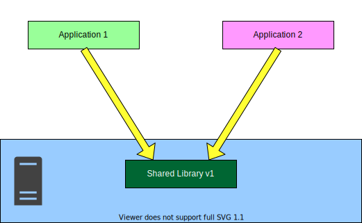

---

# Container

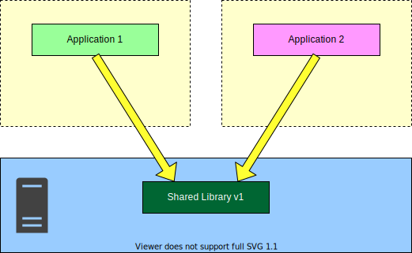

---

# Container

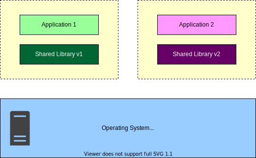

---

# Standardisierung

- Jeder Container hat immer einen präzisen Ausgangszustand
- Container haben definierte Schnittstellen
  - Ports für Netzwerk
  - Volumes für Dateien und Verzeichnisse
- Im Container läuft die Applikation mit allen benötigten Abhängigkeiten

---

# VMs versus Container

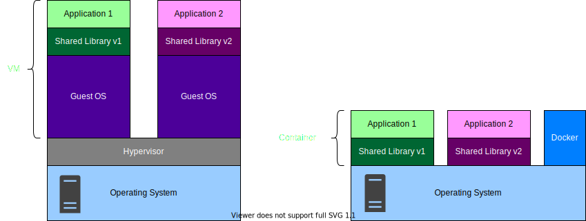

---

class: middle, center, tnw-intertitle

# Was ist Docker?

---

# Docker

- Docker wurde 2013 auf der PyCon US 2013 vorgestellt
  - &bdquo;Future of Linux Containers&rdquo;
- Die Firma dotCloud hat die Komplexität in ein einfaches Tool gepackt
- Mit Docker wurden Container sehr populär und Docker ist der Quasi-Standard
- dotCloud wurde zur Docker Inc., die das Tool Docker pflegt und weitere Produkte und Dienste anbietet

---

# Docker

- **Docker Desktop** – Docker für macOS und Windows
- **Docker Hub** – die bekannteste Container-Registry
- **Docker Engine** – Dienst zum Starten von Containern
- **Docker CLI** – Kommandozeilen-Client


---

class: middle, center, tnw-intertitle

# Wie funktionert Docker?

---

# Vier Grundbegriffe


---

# Typischer Ablauf

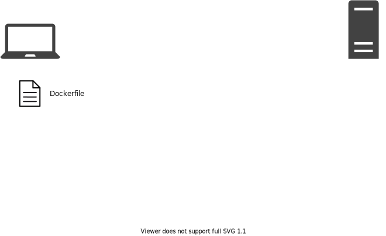

---

# Typischer Ablauf


---

# Typischer Ablauf


---

# Typischer Ablauf


---

# Typischer Ablauf


---

# Dockerfile

Ein `Dockerfile` ist eine Bauanleitung, ein Script für ein Image

```dockerfile
FROM debian

RUN apt-get update
RUN apt-get install -y apache2
RUN mkdir /var/run/apache2

EXPOSE 80

CMD [ "sh", "-c", \
      ". /etc/apache2/envvars && apache2 -D FOREGROUND" ]
```

---

# Image bauen

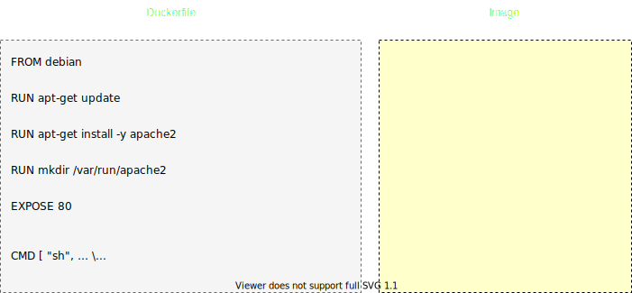

---

# Image bauen

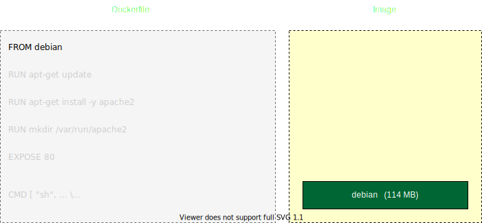

---

# Image bauen

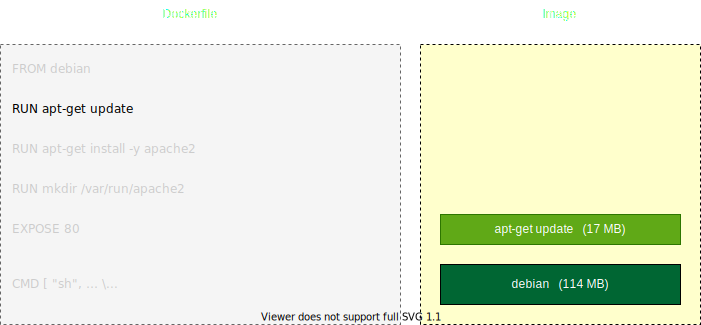

---

# Image bauen

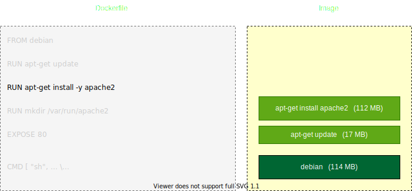

---

# Image bauen

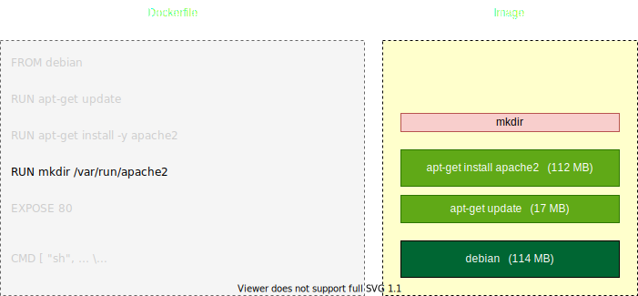

---

# Image bauen

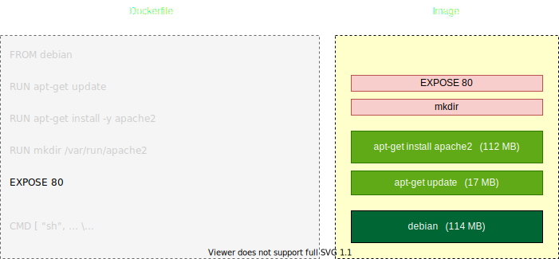

---

# Image bauen

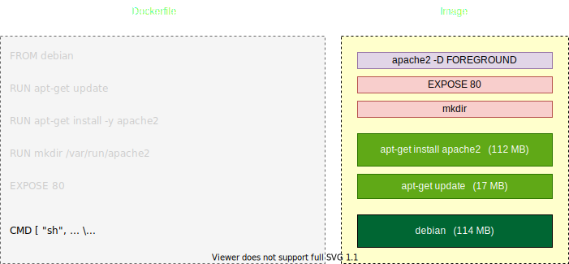

---

# Image versus Container

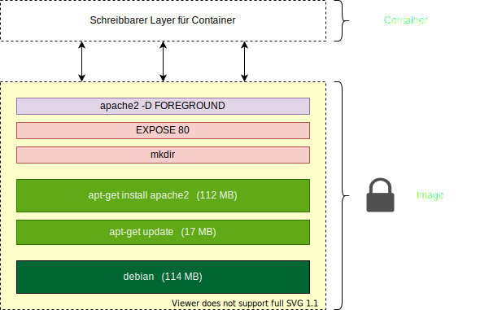

---

# Play with Docker

- Erste Schritte mit Docker ohne lokale Installation
- Docker Hub Account erstellen
  - https://hub.docker.com/


- Erstellen einer Linux-Instanz zum Ausprobieren
  - https://labs.play-with-docker.com/

---

# Beispiel: Dockerfile

Wir verwenden das vorhin gezeigte `Dockerfile`, das auf GitHub im Quellcode zur Verfügung steht

```shell
$ git clone https://github.com/thenativeweb/techlounge-docker
$ cd techlounge-docker/01-grundkonzepte
```


- Merke: Alle Übungsbeispiele sind auf GitHub zu finden
  - https://github.com/thenativeweb/techlounge-docker

---

# Beispiel: Image bauen

```shell
$ docker build -t apache2 .
```

- Die Option `-t` oder `--tag` vergibt einen Namen für das Image
- Der Punkt `.` am Ende bedeutet den Build-Kontext, üblicherweise dort, wo das `Dockerfile` liegt

---

# Beispiel: Container starten

```shell
$ docker run -d -p 8080:80 apache2
```

- Die Option `-d` oder `--detach` startet den Container im Hintergrund


- Die Option `-p` oder `--publish` verbindet ein Container-Port am Host

  Merke: **Host &rarr; Container**


- Beispiel: `-p 8080:80`
- Entspricht: Host-Port **8080** führt zu Container-Port **80**

---

# Zusammenfassung

- Grundlagen: Container, VMs, Docker, Dockerfile, Images


- Docker Hub
  - https://hub.docker.com/


- Play with Docker
  - https://labs.play-with-docker.com/


- Alle Übungsbeispiele sind auf GitHub zu finden
  - https://github.com/thenativeweb/techlounge-docker
