## Überblick

Cabriotour immer der Sonne nach vom 20.09.2025 bis 27.09.2025.

  
Zur kompletten Route auf Polarsteps: <a href="https://www.polarsteps.com/StefanScherer10/24486935-cabriotour-immer-der-sonne-nach?mode=track" target="_blank" rel="noopener">Cabriotour immer der Sonne nach auf Polarsteps</a>



Lago di Caldonazzo, Kaiserjägerstraße, Sarca Schlucht, La Spezia, Cinque Terre

## Etappen

### Tag 1 - 20.09.2025

#### Etappe: Röttenbach

Abfahrt, Cabriodach auf und los geht's!

#### Etappe: Tenna

"Wieder endlich übern Brenner" 🎶, dann aber vor dem Gardasee abgeboben. Ich wollte mir die Gegend um den Lago di Caldonazzo genauer anschauen. Eine kleine Runde schwimmen, dann eine Unterkunft in Tenna gesucht mit schönem Ausblick.

  <a href="tenna_220526163__photos__28f59a2d-e76c-49d7-8f06-9c3bc807125a_ee1624b1-007e-4d49-a90b-27bb4056fc2c.jpg" class="step-thumb-link" data-gallery="step-220526163" data-index="1">
    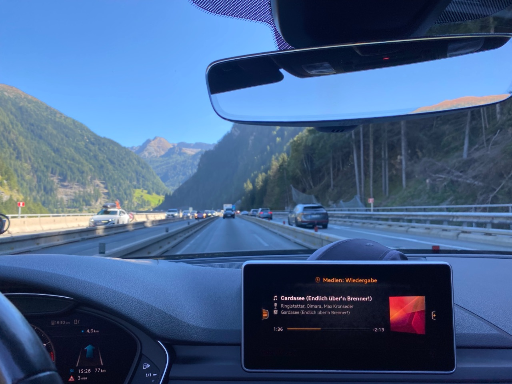
  </a>
  <a href="tenna_220526163__photos__f7ce8c01-0473-43a0-9bf4-56f4782de065_95d11aca-facc-491b-938a-4396a13f715b.jpg" class="step-thumb-link" data-gallery="step-220526163" data-index="2">
    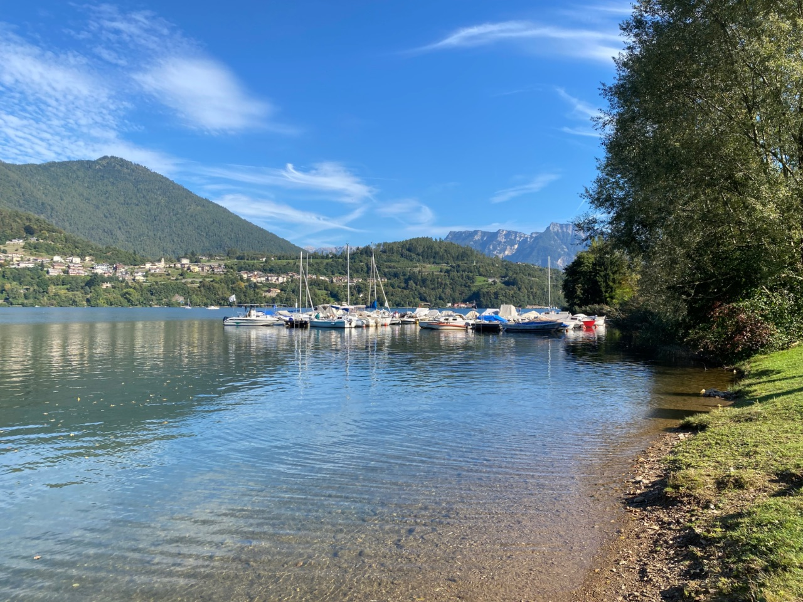
  </a>
  <a href="tenna_220526163__photos__14999e62-ffda-46d4-aed6-01262be40aa3_4e24b0dc-c668-4b7e-9e63-7acacadcd93d.jpg" class="step-thumb-link" data-gallery="step-220526163" data-index="3">
    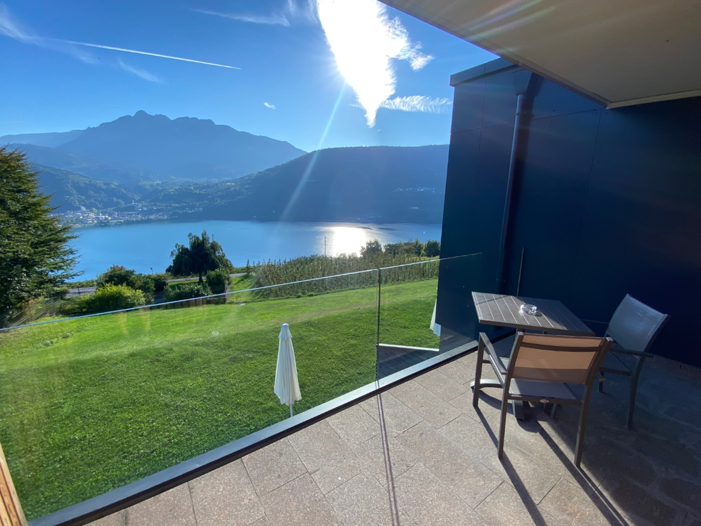
  </a>

#### Etappe: Kaiserjägerstraße

Abends noch eine kleine Runde die Kaiserjägerstraße hoch und wieder runter. Wow, eine sehr enge Straße mit kleinen Tunnels.

  <a href="kaiserjagerstrasse_220526872__photos__66b24297-8d92-497b-bdef-f681247adcb8_92f737df-5b97-4747-a582-81f9a4ee3848.jpg" class="step-thumb-link" data-gallery="step-220526872" data-index="1">
    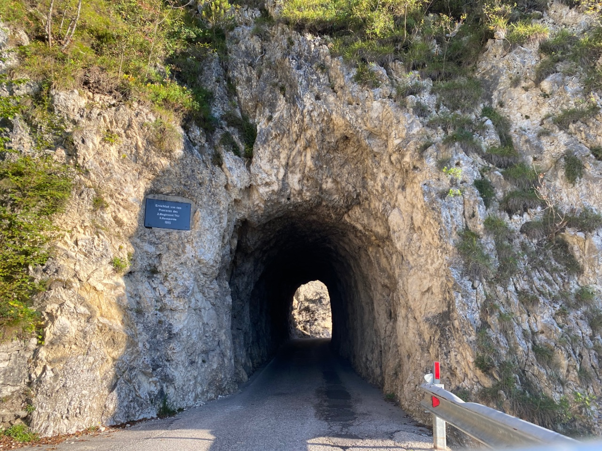
  </a>
  <a href="kaiserjagerstrasse_220526872__photos__0f01fe0d-880f-4179-b628-d1d68194fcfd_49758dff-67d0-4c3a-8c6b-33f827b6ae41.jpg" class="step-thumb-link" data-gallery="step-220526872" data-index="2">
    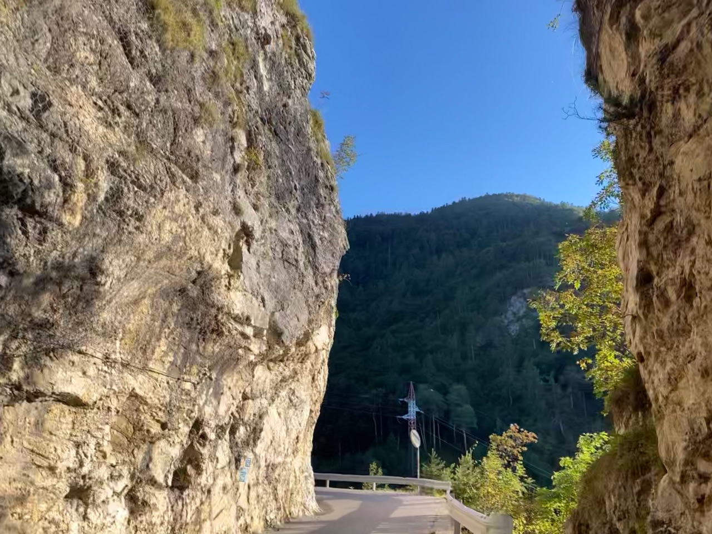
  </a>

### Tag 2 - 21.09.2025

#### Etappe: Sarca Schlucht

Am nächsten Morgen zuerst eine Cabriofahrt zu ein paar anderen Seen gemacht. Dann bei der Sarca Schlucht das Fahrrad genommen, um die alte Route entlang zu fahren. Für Autos gibt es einen breiten Tunnel, aber die Schlucht ist sehr imposant.

  <a href="sarca-schlucht_220527448__photos__b672444c-eac6-43fe-b657-cb28de8b5f07_e4d635e0-ae18-46e5-a992-0819d2197332.jpg" class="step-thumb-link" data-gallery="step-220527448" data-index="1">
    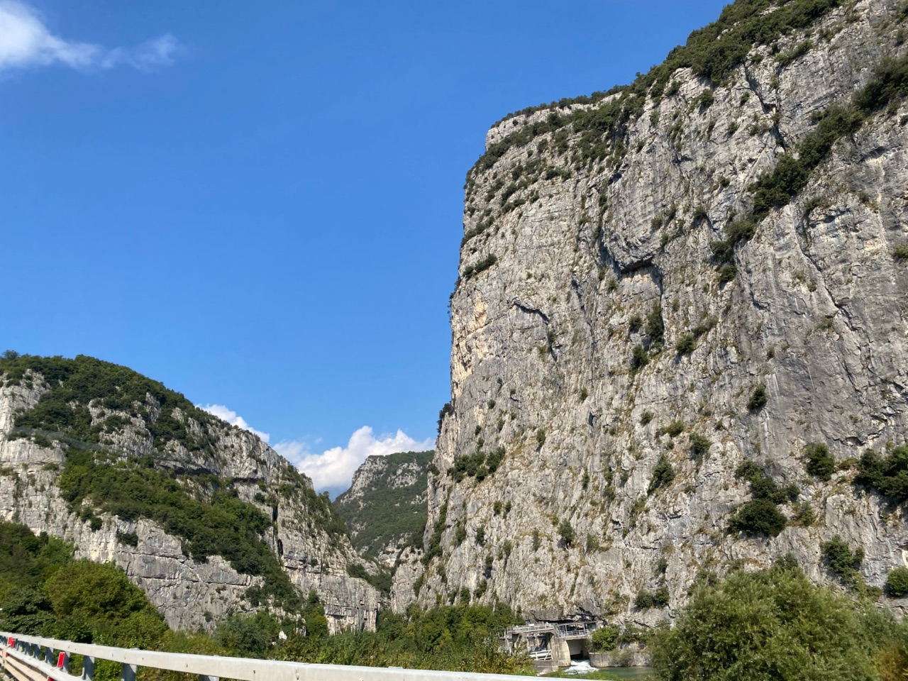
  </a>
  <a href="sarca-schlucht_220527448__photos__7fd64210-e4b1-4d29-8589-01fddff1f292_5e4f7cb5-1382-48b7-acb0-943479e40655.jpg" class="step-thumb-link" data-gallery="step-220527448" data-index="2">
    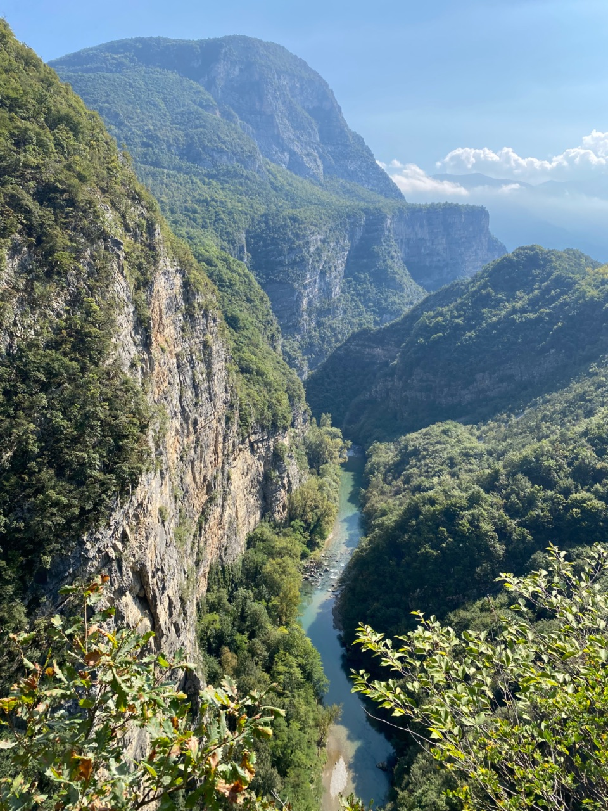
  </a>
  <a href="sarca-schlucht_220527448__photos__c88510b9-7943-4383-85ae-16fa53b4460c_334219d4-895d-48df-8a40-0711f89a2955.jpg" class="step-thumb-link" data-gallery="step-220527448" data-index="3">
    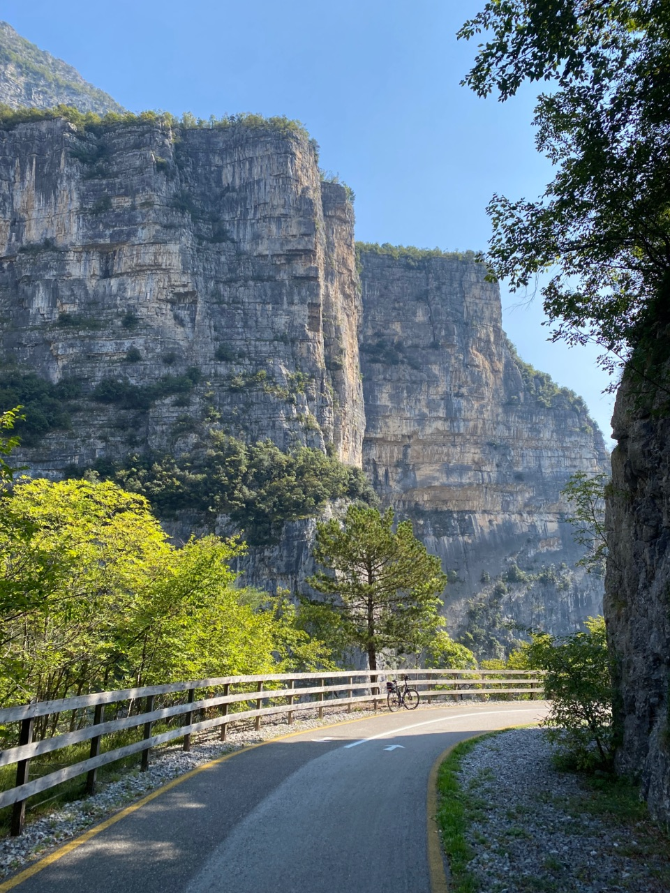
  </a>
  <a href="sarca-schlucht_220527448__photos__d7021490-1e4a-4aba-af26-04723268e19b_0f420339-6f86-4935-a564-805ecb99eb46.jpg" class="step-thumb-link" data-gallery="step-220527448" data-index="4">
    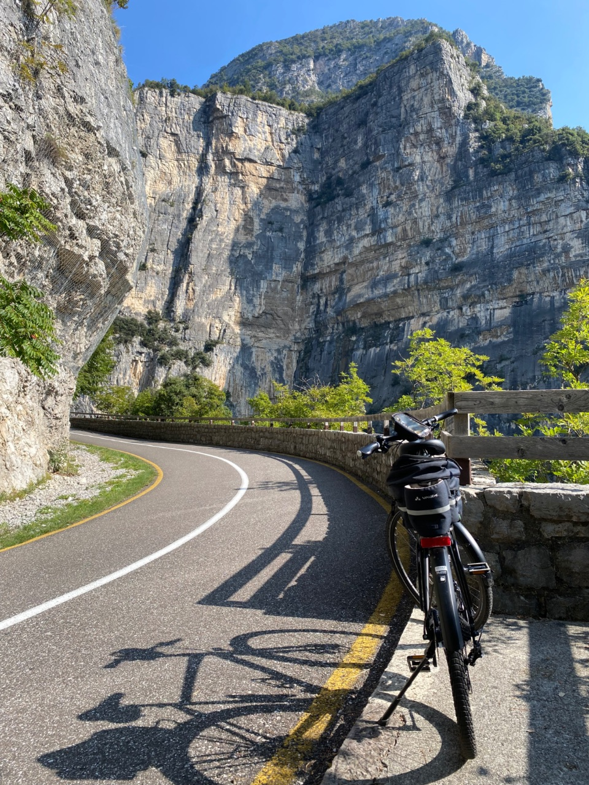
  </a>

### Tag 3 - 22.09.2025

#### Etappe: Passo della Cisa

Aufbruch, nachdem etwas Regen kam. Weiter in Richtung Süden ans Meer. Zunächst langweilige Autobahnen, um etwas Strecke zu machen. Aber dann ab Valmozzola runter auf die SS62 den Passo della Cisa gefahren.

  <a href="passo-della-cisa_220527927__photos__e9c866ce-2096-4ef5-b8ba-6447b1ed9c97_e92c43c0-ae95-41e6-b0d4-f69f6b660401.jpg" class="step-thumb-link" data-gallery="step-220527927" data-index="1">
    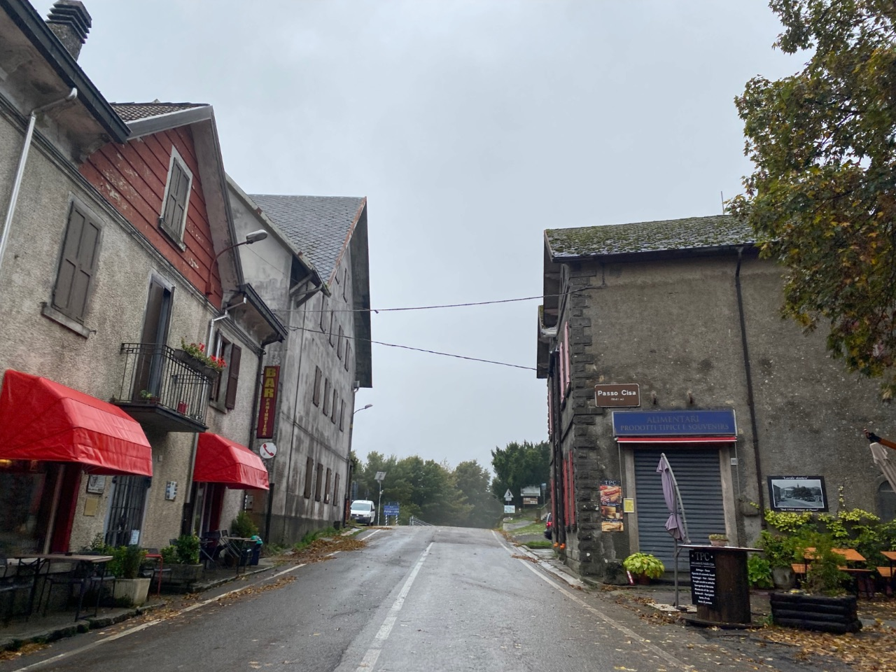
  </a>
  <a href="passo-della-cisa_220527927__photos__48c898bc-3354-47ac-905e-31a19620967a_93b9c898-5969-485b-b6d2-d9f52ac0cb05.jpg" class="step-thumb-link" data-gallery="step-220527927" data-index="2">
    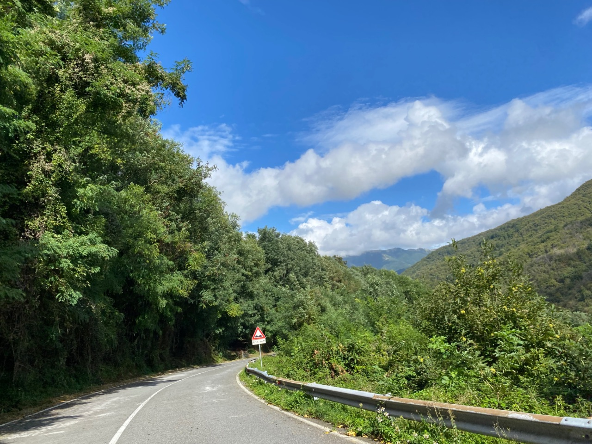
  </a>
  <a href="passo-della-cisa_220527927__photos__792f5ea5-0482-44dd-a1fb-5c89850dc222_8d27bacd-d7b4-4d59-a5ed-baeace4e5ede.jpg" class="step-thumb-link" data-gallery="step-220527927" data-index="3">
    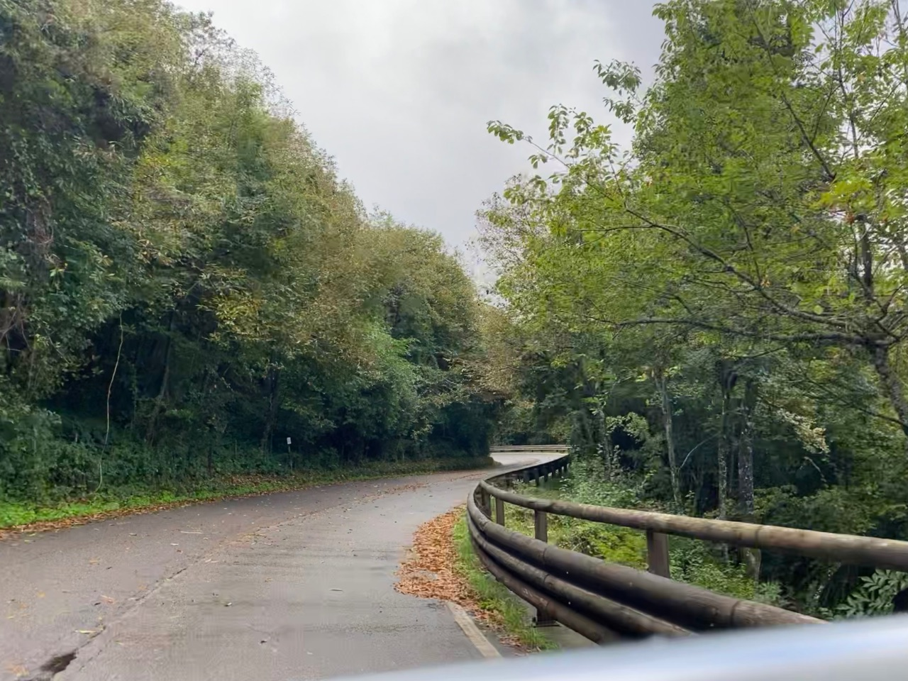
  </a>
  <a href="passo-della-cisa_220527927__photos__43b8b52c-51fa-4e7d-a794-a42702699cea_874b1439-3f9d-4011-8b23-2c975f2e4427.jpg" class="step-thumb-link" data-gallery="step-220527927" data-index="4">
    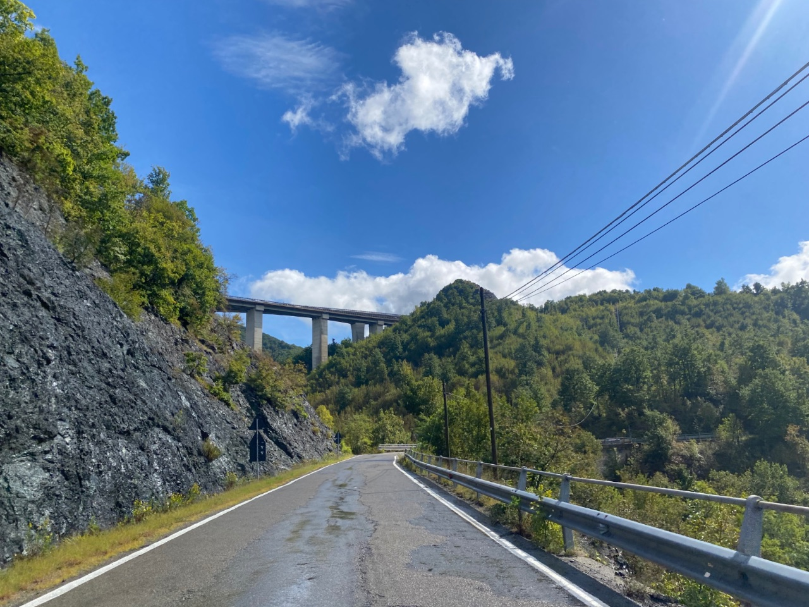
  </a>
  <a href="passo-della-cisa_220527927__photos__852fb149-e3a7-42db-91f0-1e1143ea15f7_4377d1d6-0517-4cf6-8c4a-04efe4fb20f9.jpg" class="step-thumb-link" data-gallery="step-220527927" data-index="5">
    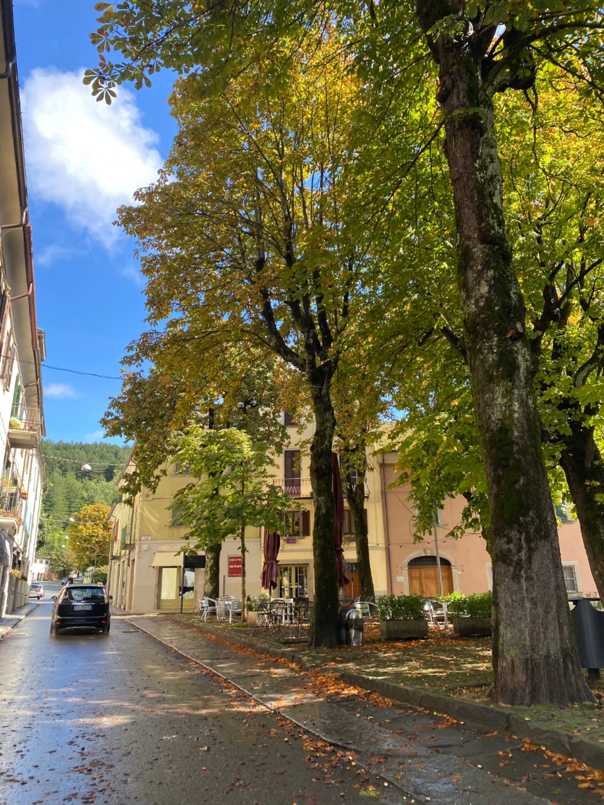
  </a>

#### Etappe: La Spezia

Hoch zur Unterkunft, in einen der Weinberge oberhalb von La Spezia. Wein direkt vom Erzeuger, und Pizza kann man sich liefern lassen, wenn man die Serpentinen nicht runter und hochfahren will :-)

  <a href="la-spezia_220528231__photos__326b2ef9-1ccd-4bab-a0ff-b479e3e43a53_91fef6a0-1e6c-463c-acf2-d5c32e0292a6.jpg" class="step-thumb-link" data-gallery="step-220528231" data-index="1">
    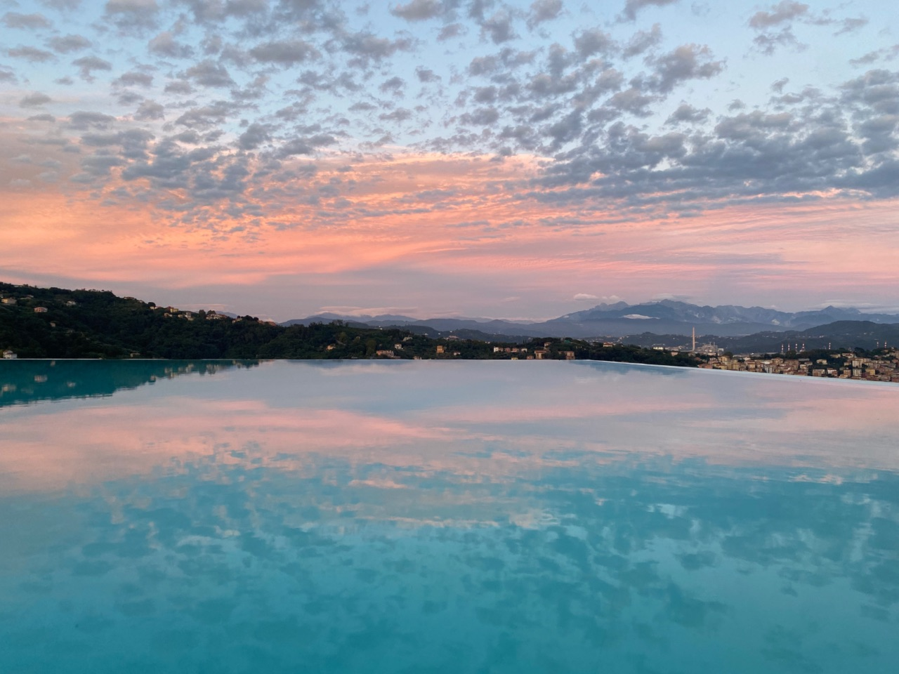
  </a>
  <a href="la-spezia_220528231__photos__c898e97a-41a3-414a-a7da-8b2052a8e14e_6ad336e7-12c4-41af-adf3-6d02e6ae25f2.jpg" class="step-thumb-link" data-gallery="step-220528231" data-index="2">
    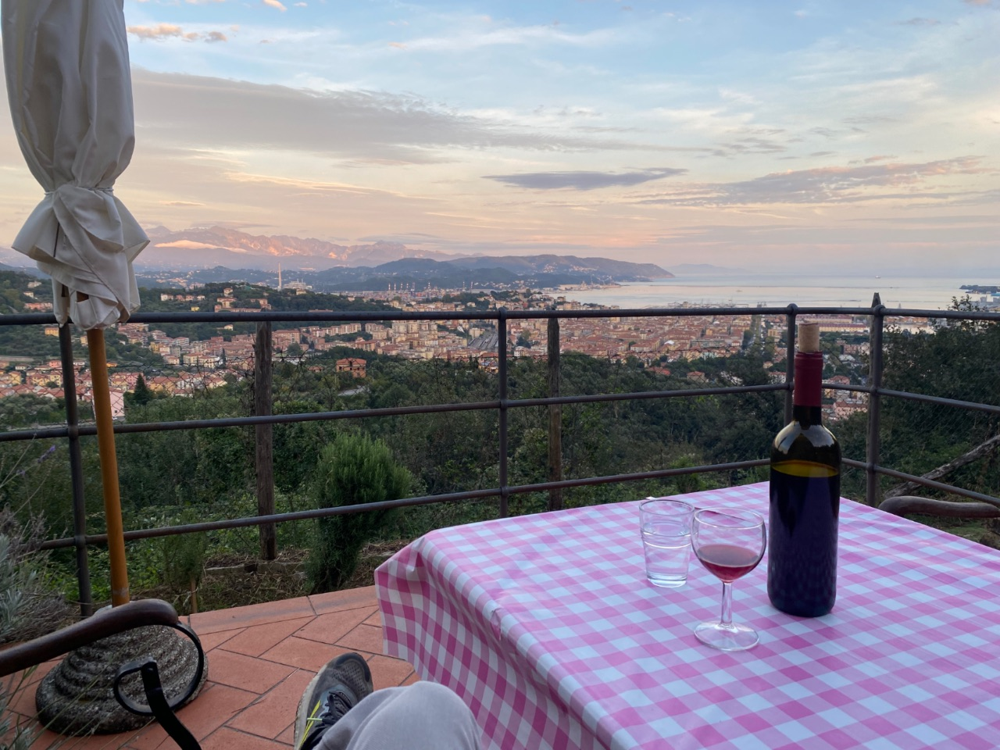
  </a>
  <a href="la-spezia_220528231__photos__25f621f9-2580-4c19-8ecd-ababc53bb091_42a75187-9a75-4572-828c-7e3d4254bb39.jpg" class="step-thumb-link" data-gallery="step-220528231" data-index="3">
    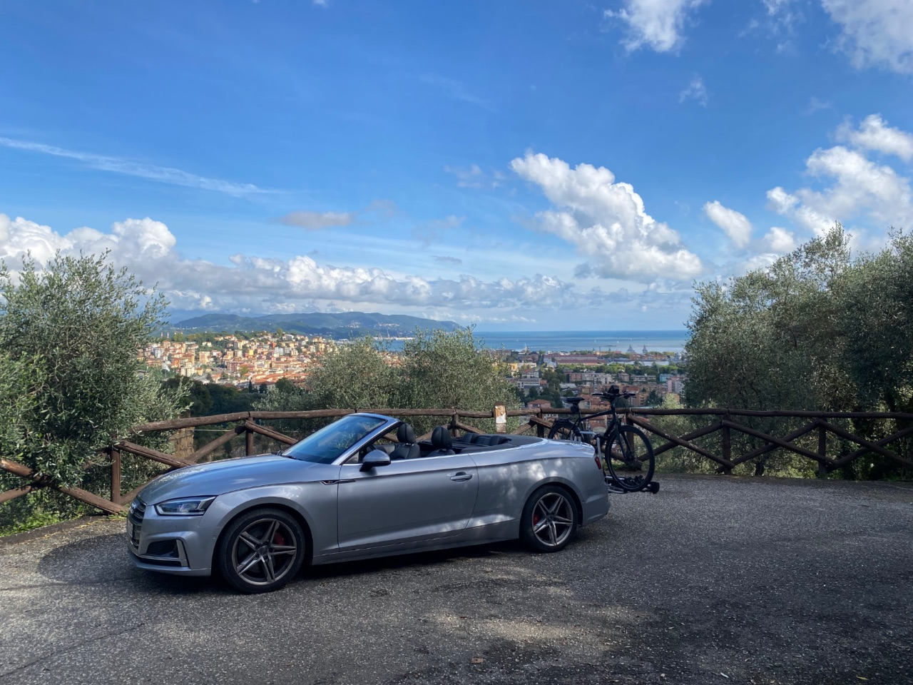
  </a>

### Tag 4 - 23.09.2025

#### Etappe: Levanto

Heute ging es mit dem Cabrio nach Levanto, um dort die alte Bahnstrecke besucht, die nun ein Radweg ist.
Und an einem sehr leeren Strand dann Mittagspause gemacht, etwas geschwommen und die Sonne genossen.

  <a href="levanto_220528614__photos__ba1e8d8f-21ee-4561-932a-e16f1a43e776_fd859816-6b31-4899-809c-b413f166ef25.jpg" class="step-thumb-link" data-gallery="step-220528614" data-index="1">
    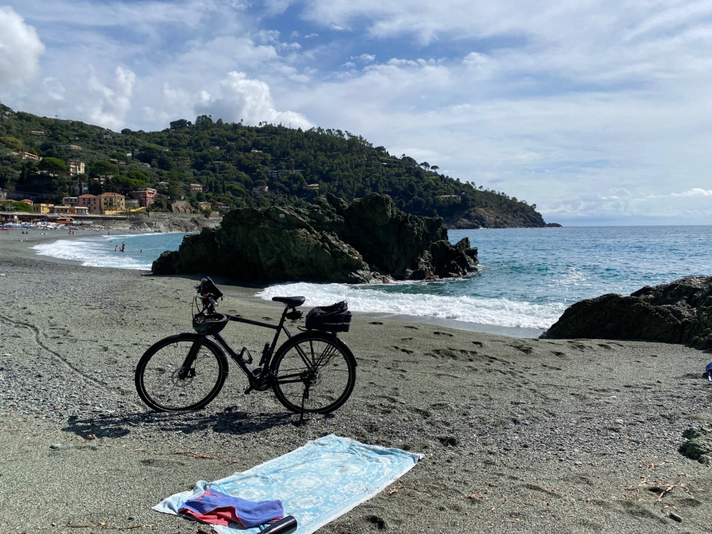
  </a>
  <a href="levanto_220528614__photos__e0d3e6f2-eae8-472d-ba1f-818720307e52_6de9e74b-26f0-4311-8575-f7bd81f4b5ca.jpg" class="step-thumb-link" data-gallery="step-220528614" data-index="2">
    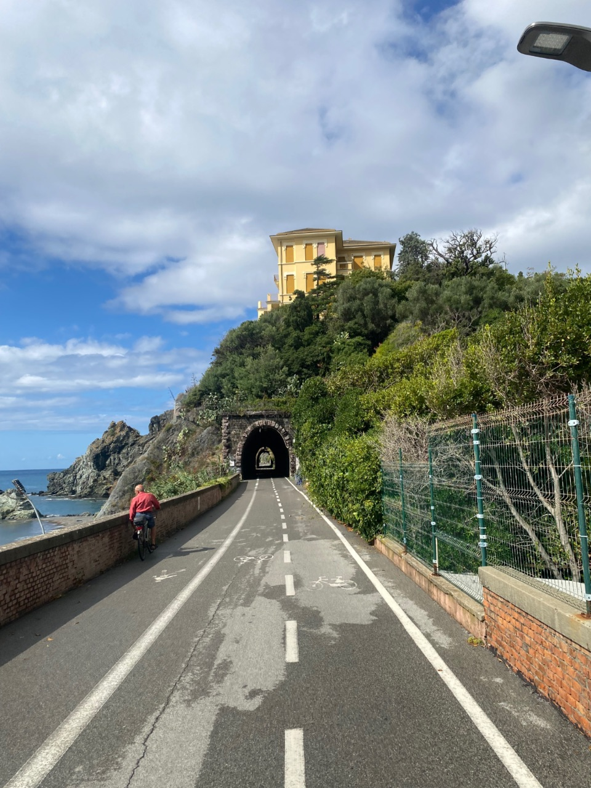
  </a>
  <a href="levanto_220528614__photos__f767f1d9-89a0-4c4d-bc12-9a3426a4211a_4e2a998d-2ae7-4626-b19e-304c92da3646.jpg" class="step-thumb-link" data-gallery="step-220528614" data-index="3">
    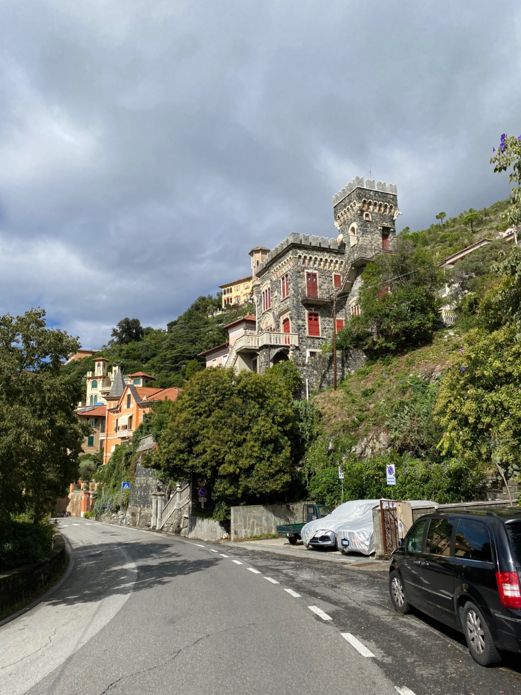
  </a>
  <a href="levanto_220528614__photos__3c264aa1-6e51-429d-aae4-c0e1a1be3b6e_396cbe45-e8f9-4a52-9073-3e404d6a56a7.jpg" class="step-thumb-link" data-gallery="step-220528614" data-index="4">
    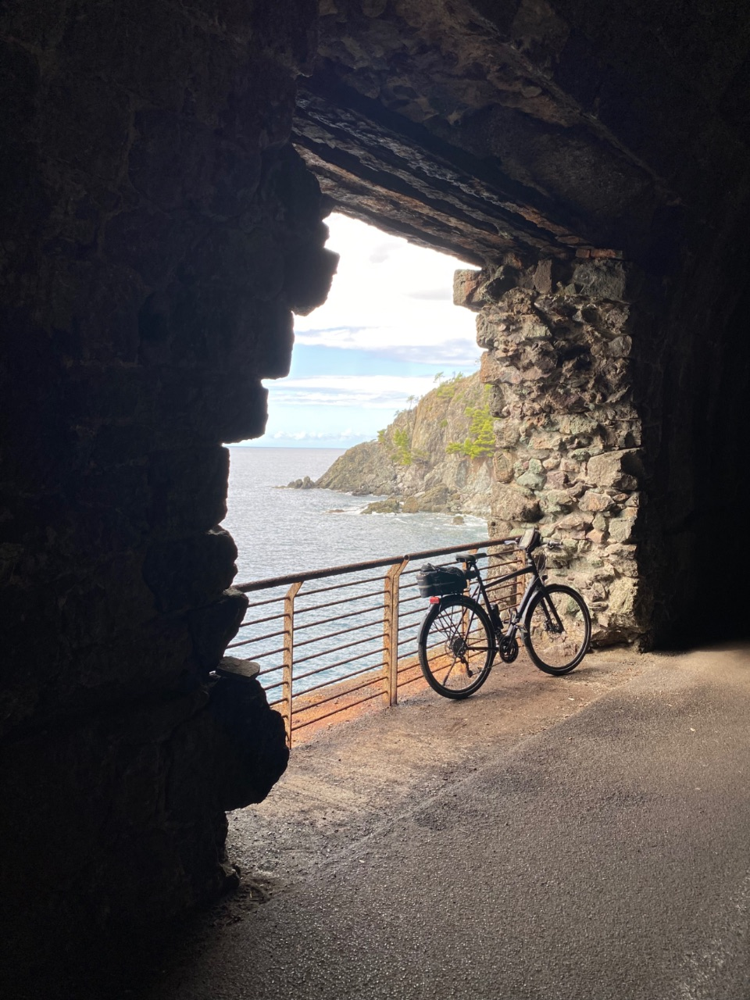
  </a>
  <a href="levanto_220528614__photos__d185fe67-1864-47b3-9bd3-44d42bf7b1d1_05e86414-0734-445c-8791-3dbf77557d0f.jpg" class="step-thumb-link" data-gallery="step-220528614" data-index="5">
    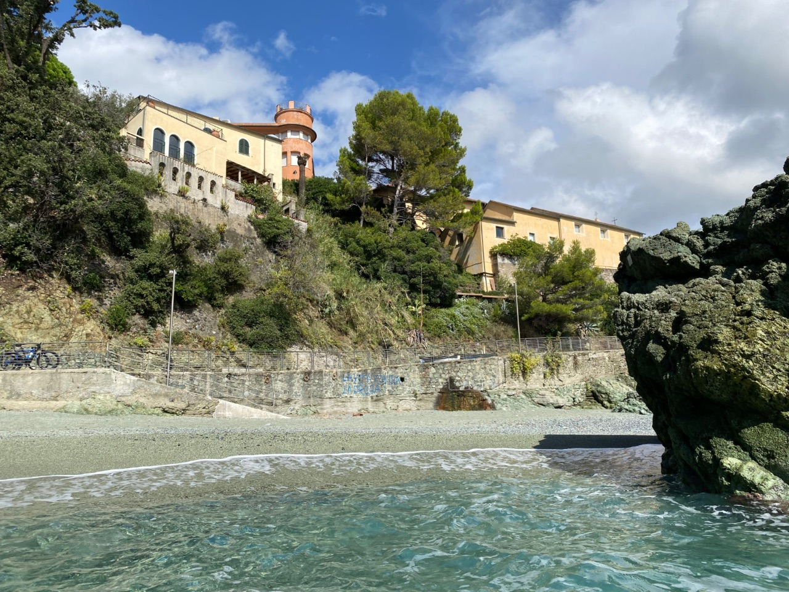
  </a>

### Tag 5 - 24.09.2025

#### Etappe: Cinque Terre

Heute ging es zu den Cinque Terre, mit Cabrio und Fahrrad. Zunächst eine kleine Radtour oberhalb zu einer Kirche mit Blick auf Riomaggiore. Dabei hab ich eine Wildschweinfamilie gesehen, die kurz vor meinem Rad den Waldweg gekreuzt haben. Danach dann die Cabriotour fortgesetzt durch das kurvige Hinterland zu den einelnen bunten Städtchen.

  <a href="cinque-terre_220529016__photos__abc24494-ada7-4519-abd7-0cba77c6d2d8_c9b9f664-f4a2-4dff-acce-4e1e5284685e.jpg" class="step-thumb-link" data-gallery="step-220529016" data-index="1">
    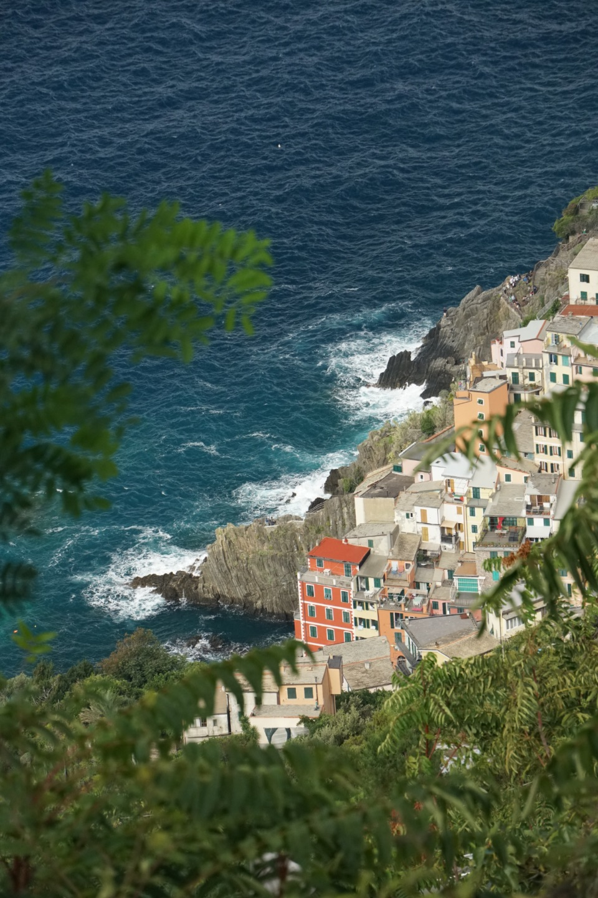
  </a>
  <a href="cinque-terre_220529016__photos__d612736d-7f31-42ea-8ff6-c896047063bb_a295e8ec-eb85-4eba-b45c-5bb2fe8378d4.jpg" class="step-thumb-link" data-gallery="step-220529016" data-index="2">
    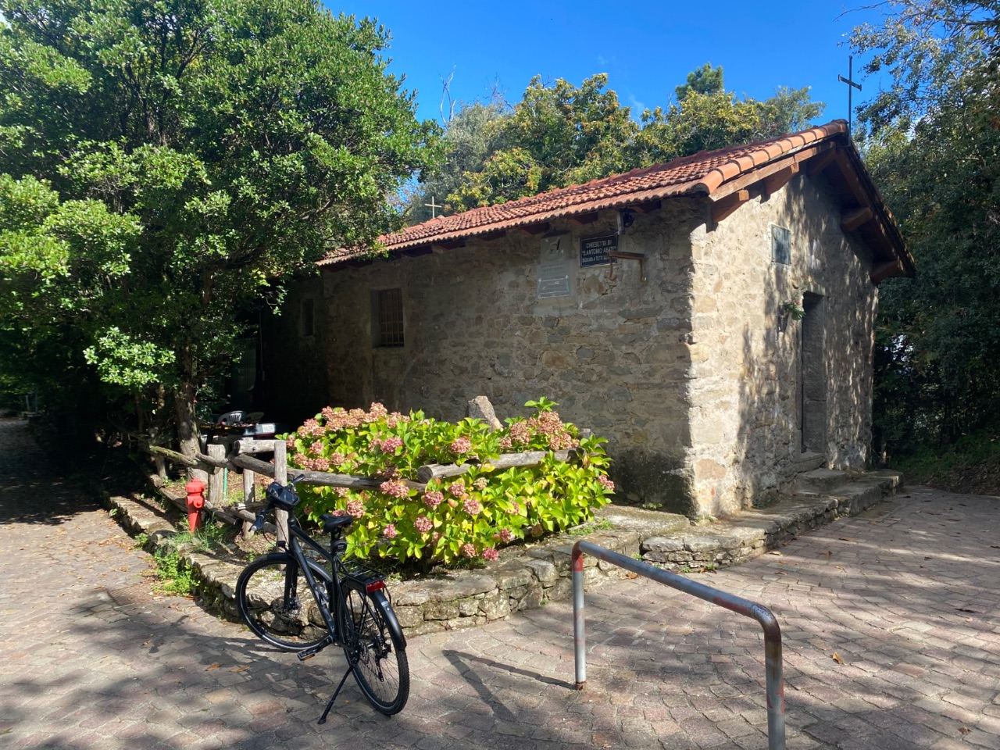
  </a>
  <a href="cinque-terre_220529016__photos__cfd607ef-80f7-472d-85ff-9eb838b7e8af_a24d5f00-b24f-42f1-b4b8-f5dcf403dd27.jpg" class="step-thumb-link" data-gallery="step-220529016" data-index="3">
    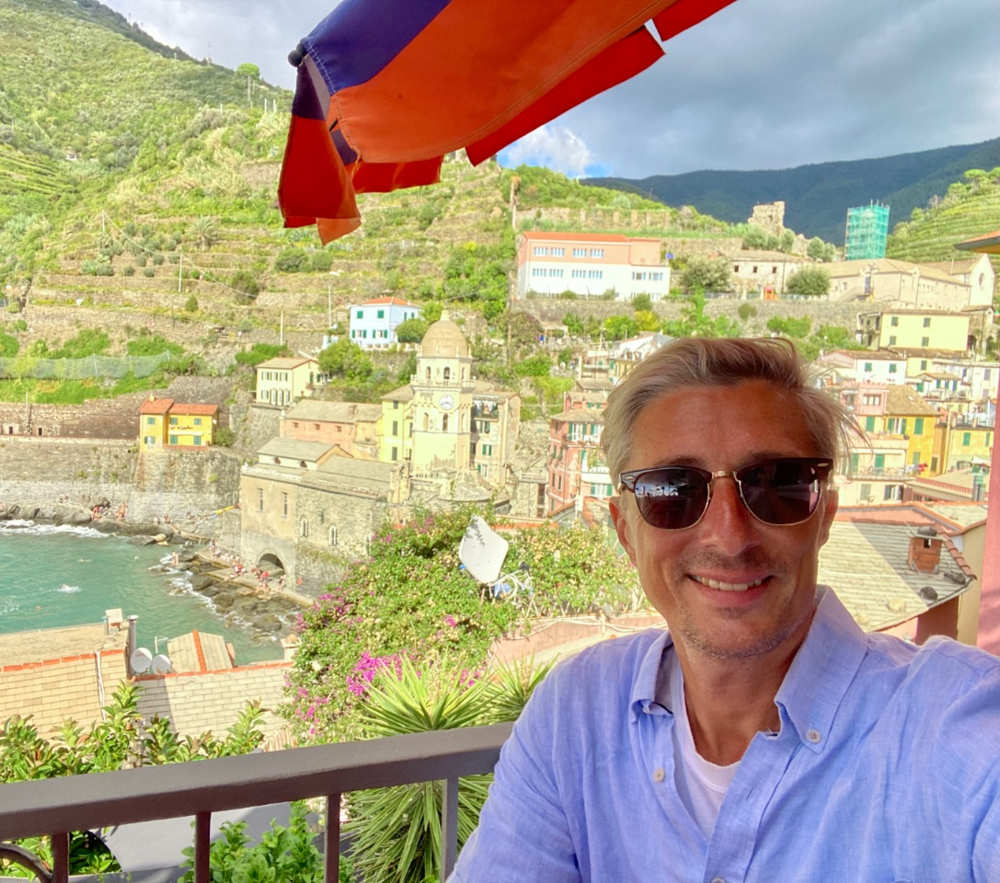
  </a>
  <a href="cinque-terre_220529016__photos__66f3a7e9-8fde-4407-9f7f-de069be1e598_8da4f2fb-dfc5-47bb-8484-b46ad07f8787.jpg" class="step-thumb-link" data-gallery="step-220529016" data-index="4">
    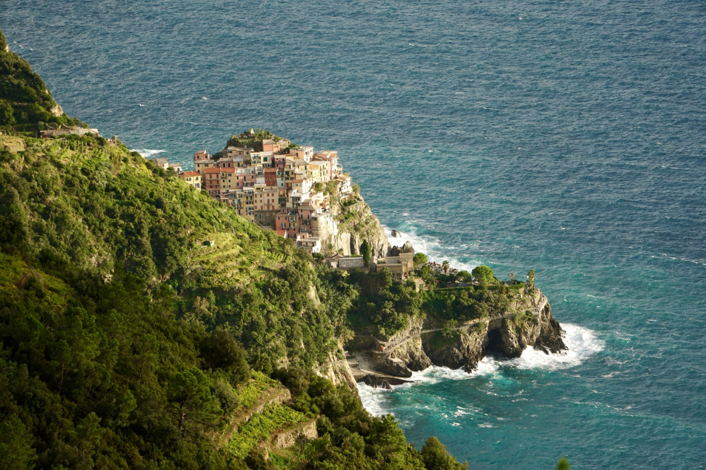
  </a>
  <a href="cinque-terre_220529016__photos__8ba25248-1969-4c0c-b125-727a4bc0f790_808600ea-8b90-4496-ac79-32151a4f1751.jpg" class="step-thumb-link" data-gallery="step-220529016" data-index="5">
    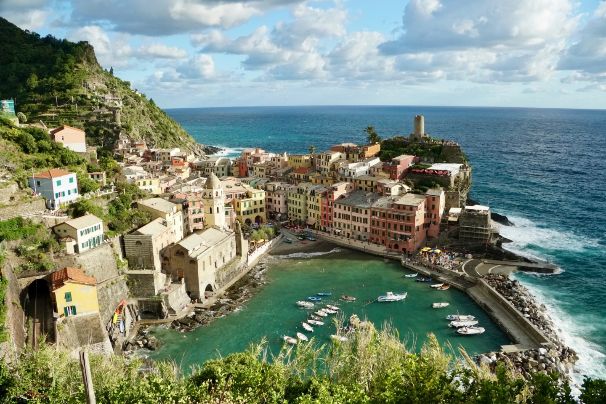
  </a>
  <a href="cinque-terre_220529016__photos__af6a0c4c-aaa4-46c4-bb68-f93117430842_7b4fc048-d35b-4f89-87c0-958c67ba9e14.jpg" class="step-thumb-link" data-gallery="step-220529016" data-index="6">
    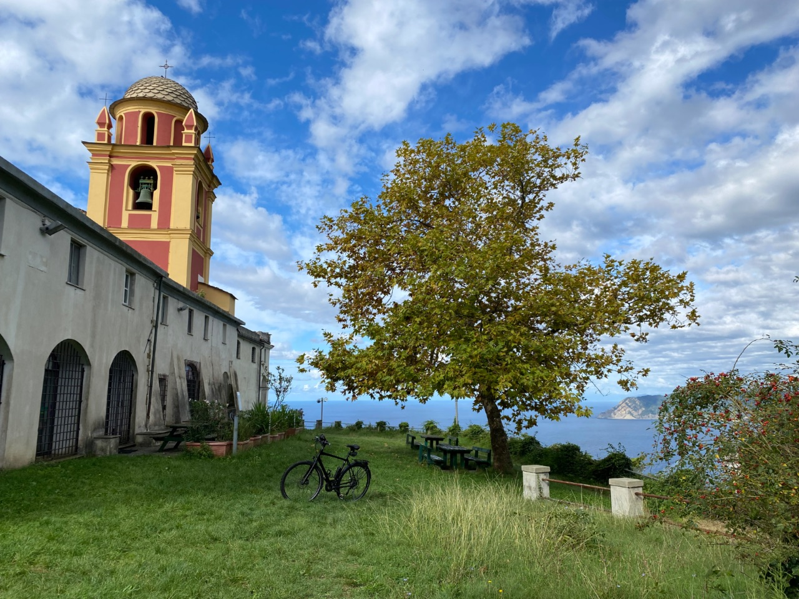
  </a>
  <a href="cinque-terre_220529016__photos__27351cbe-6e5f-4320-b244-9ad348ec0fb1_44ea2be5-3b3d-4abc-b500-6e26565529fc.jpg" class="step-thumb-link" data-gallery="step-220529016" data-index="7">
    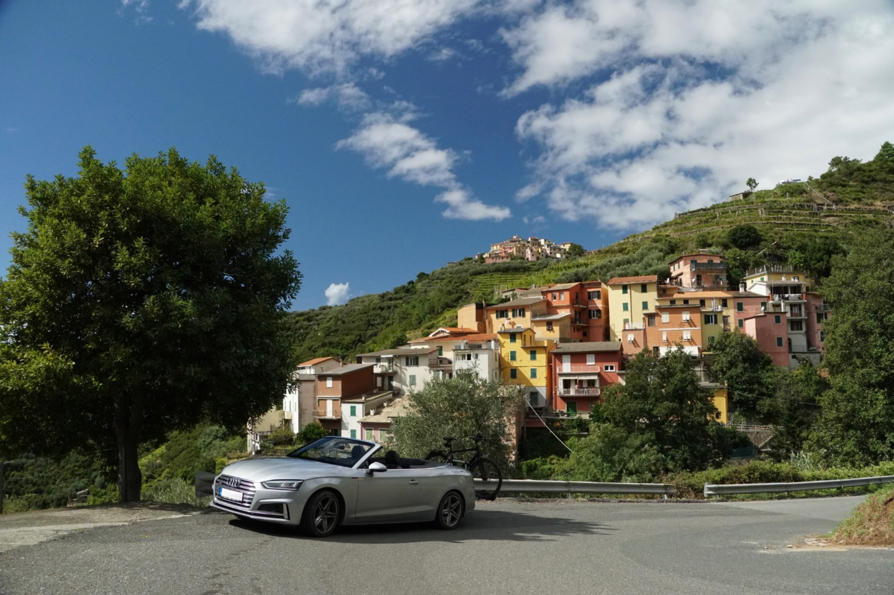
  </a>
  <a href="cinque-terre_220529016__photos__d1569bba-9e18-468f-9be5-8157feabdfdf_3d1cc48d-fbe1-4177-9e07-618313439928.jpg" class="step-thumb-link" data-gallery="step-220529016" data-index="8">
    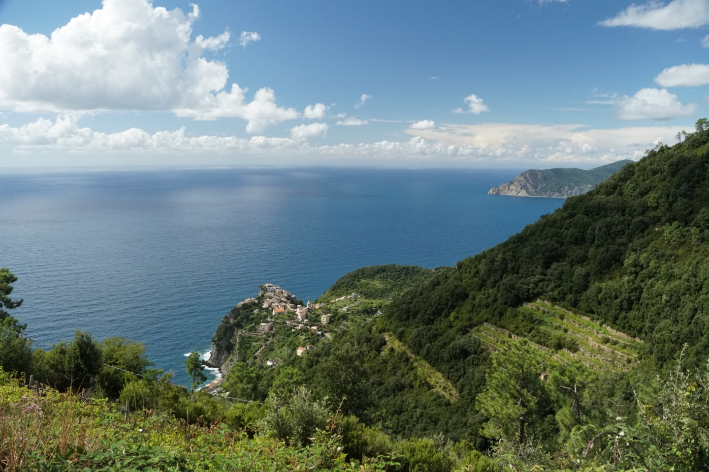
  </a>
  <a href="cinque-terre_220529016__photos__18ad430d-ca47-4122-b9f0-5ac53ce7f8f6_1db3bebe-bed2-4167-aad0-8bee2159e033.jpg" class="step-thumb-link" data-gallery="step-220529016" data-index="9">
    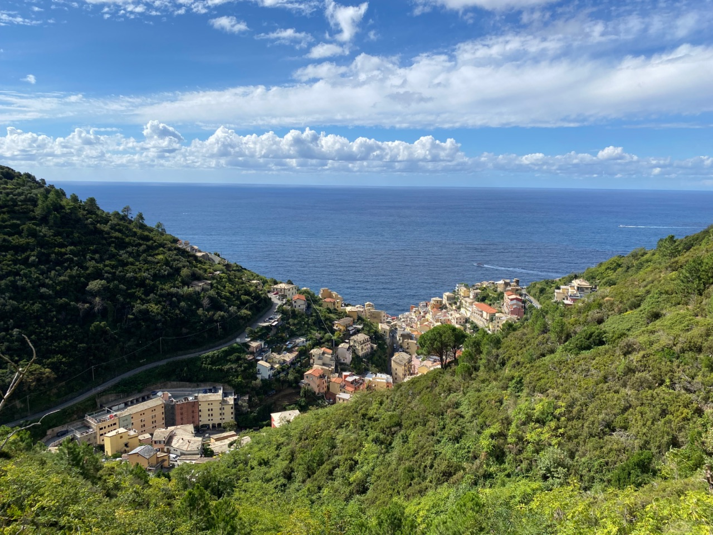
  </a>

### Tag 6 - 25.09.2025

#### Etappe: Rapallo

Blick auf Rapallo, aber der Regen war schneller

  <a href="rapallo_220604047__photos__b2d4eea1-9773-431b-865b-5072ad6893c3_9c31c913-7d4d-4129-ac37-5f7920414329.jpg" class="step-thumb-link" data-gallery="step-220604047" data-index="1">
    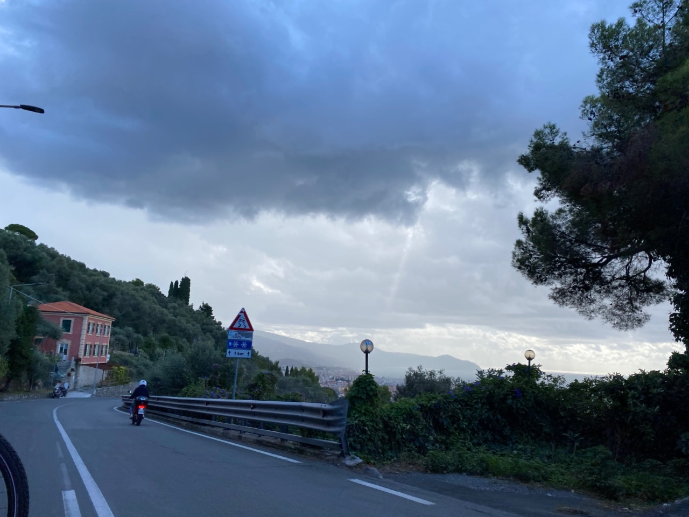
  </a>
  <a href="rapallo_220604047__photos__34f8c4a2-6410-452e-8e33-661179d6783a_1957a343-84b2-47af-93bd-d9dc1b4b150c.jpg" class="step-thumb-link" data-gallery="step-220604047" data-index="2">
    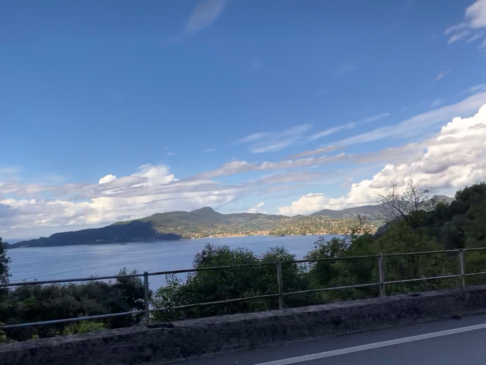
  </a>

#### Etappe: Pavia

Das Wetter wurde schlechter, ich versuchte noch Portofino bei Sonnenschein zu erreichen, aber die Regenwolken waren schneller :-)
Also auf den Regenradar geblickt: Richtung Norden ist es besser. Also weiter gefahren, bei Pavia hatte ich mal einen Stopp eingelegt, die haben eine schöne alte Brücke.

  <a href="pavia_220529251__photos__93ece553-11a4-479d-8a54-1d9f1b746c6a_974c044f-8927-44da-bd93-450c9b0ce794.jpg" class="step-thumb-link" data-gallery="step-220529251" data-index="1">
    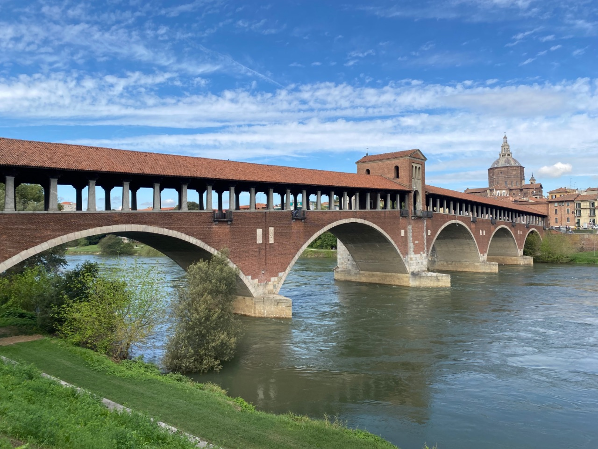
  </a>
  <a href="pavia_220529251__photos__c8b44cf4-2db7-40a4-8f1e-920bd2ed85c0_49e6d55e-64a3-47b3-ab3d-741148b17ef6.jpg" class="step-thumb-link" data-gallery="step-220529251" data-index="2">
    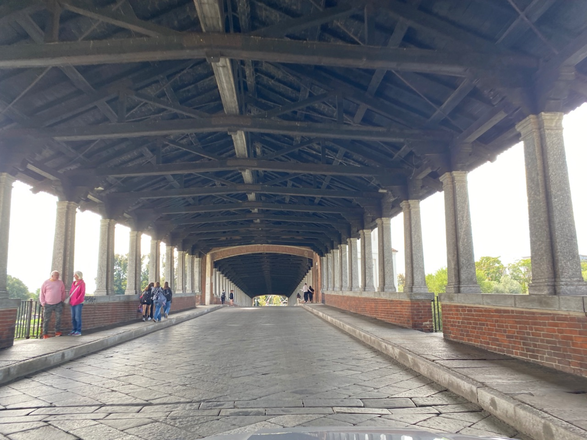
  </a>

#### Etappe: Milano

Weiter ging die Cabriofahrt. Ach nach Mailand könnte ich auch mal. Ich hab das Rad dabei, also einen Parkplatz bei einem Supermarkt genommen und von dort die Innenstadt und den Mailänder Dom angesteuert.

  <a href="milan_220529444__photos__7ce93ee4-4033-4fdf-be66-7ddf5909e8af_e345452a-5921-40ef-be4f-002205c082ea.jpg" class="step-thumb-link" data-gallery="step-220529444" data-index="1">
    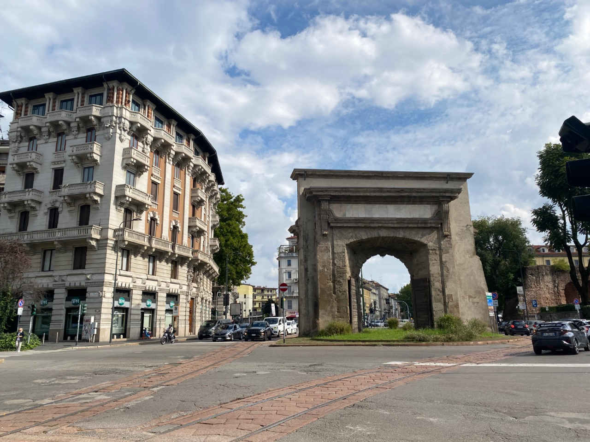
  </a>
  <a href="milan_220529444__photos__d59a52fa-baca-47ef-a1c9-627190f85f09_845b0332-615c-46cb-99bf-a19e906ab5cb.jpg" class="step-thumb-link" data-gallery="step-220529444" data-index="2">
    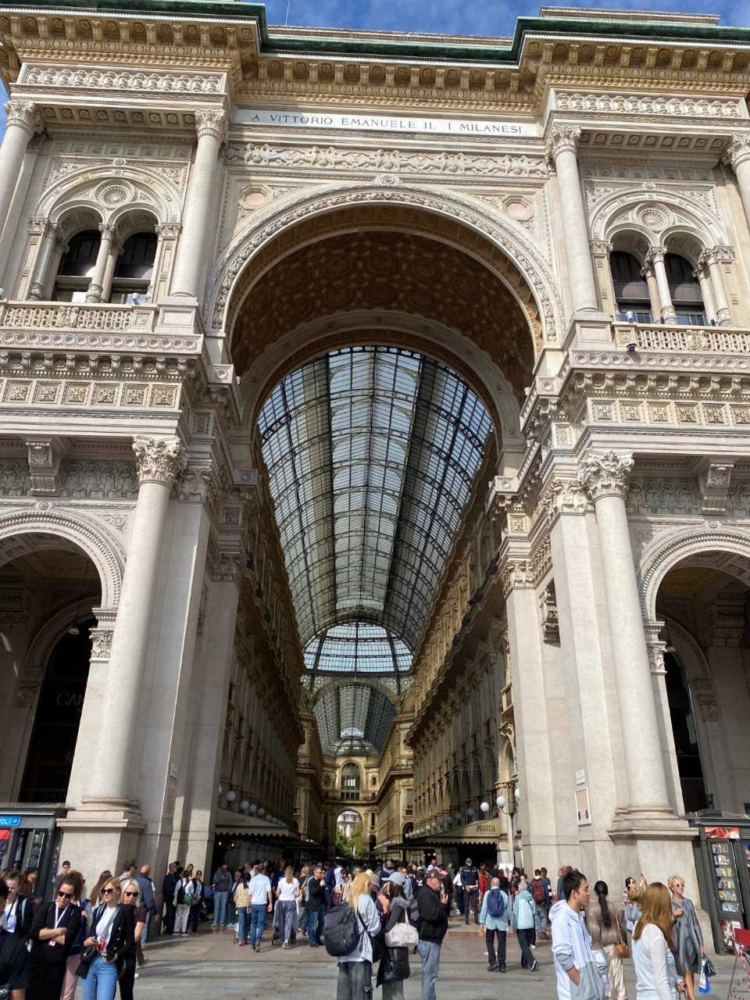
  </a>
  <a href="milan_220529444__photos__63627a48-743c-46ba-9541-2cf1c131942f_6200eaf8-5897-4c4e-a1f8-20190804fa49.jpg" class="step-thumb-link" data-gallery="step-220529444" data-index="3">
    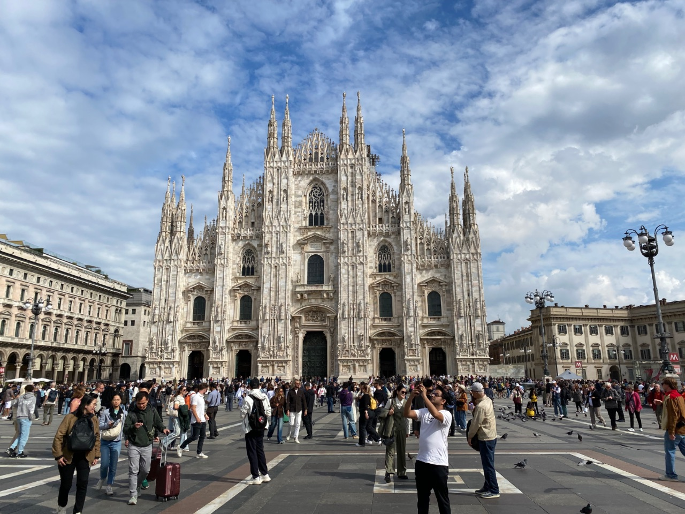
  </a>
  <a href="milan_220529444__photos__5fcd80f1-4865-42cf-a5f9-c9f610313b8a_4e25544f-b743-4fa4-9166-2f4123ceac24.jpg" class="step-thumb-link" data-gallery="step-220529444" data-index="4">
    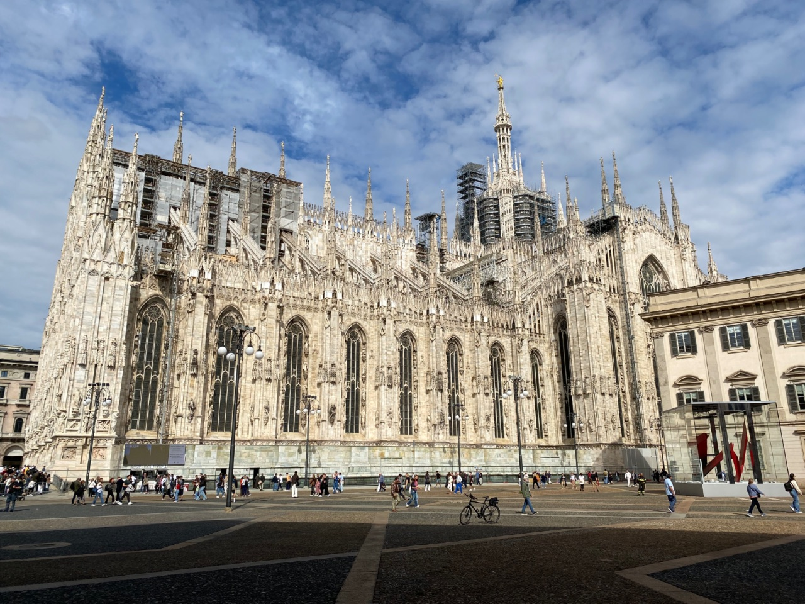
  </a>

#### Etappe: Manerba del Garda

Für die nächste Übernachtung habe ich Manerba del Garda angesteuert. Da gibt es ja einen Berg mit schönem Blick auf den Gardasee. Wow, der Sonnenuntergang war den Aufstieg mit dem Fahrrad wert. Der Regen hat sich am anderen Ufer ausgetobt.

  <a href="manerba-del-garda_220529787__photos__78683a59-6ae6-4d4c-88a4-948836e78bd1_96fe7ccd-5338-4dfe-a476-0a68e5c13c7e.jpg" class="step-thumb-link" data-gallery="step-220529787" data-index="1">
    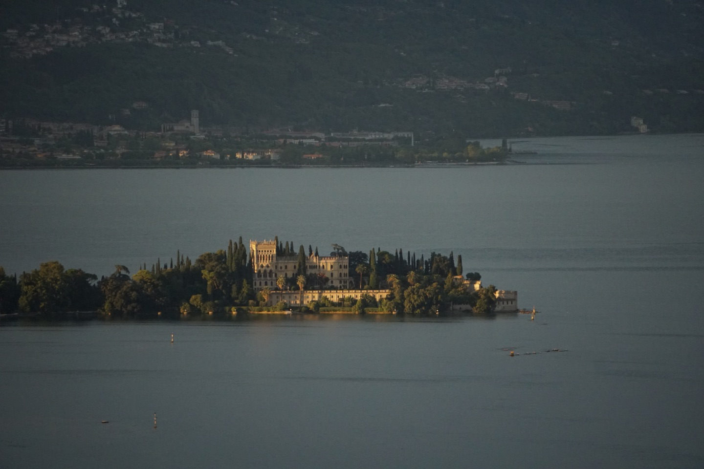
  </a>
  <a href="manerba-del-garda_220529787__photos__1e579c7b-92ad-461a-b792-e76f64c8c5d3_8b6947b9-2c51-438c-8dbe-352d86fd5e02.jpg" class="step-thumb-link" data-gallery="step-220529787" data-index="2">
    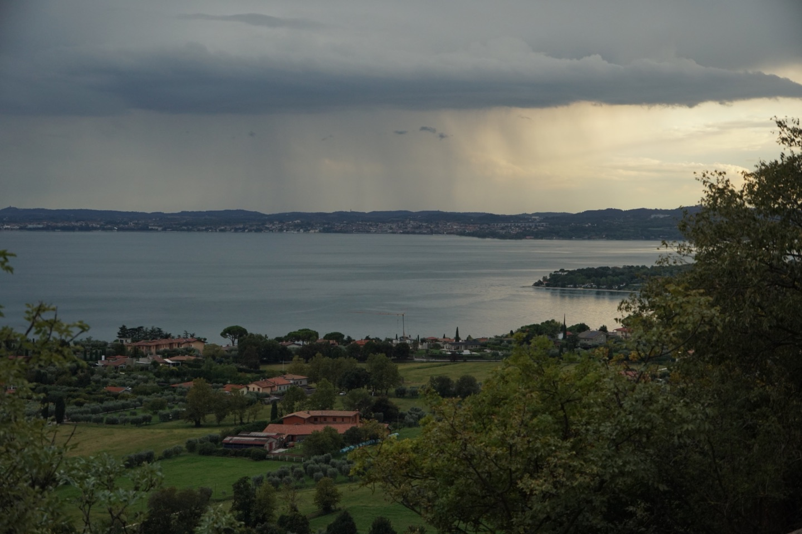
  </a>
  <a href="manerba-del-garda_220529787__photos__7d6ea102-a0ec-4c7f-a8a7-67fa4fd7f9d4_6d32cf85-66e1-4283-a525-c290caebc746.jpg" class="step-thumb-link" data-gallery="step-220529787" data-index="3">
    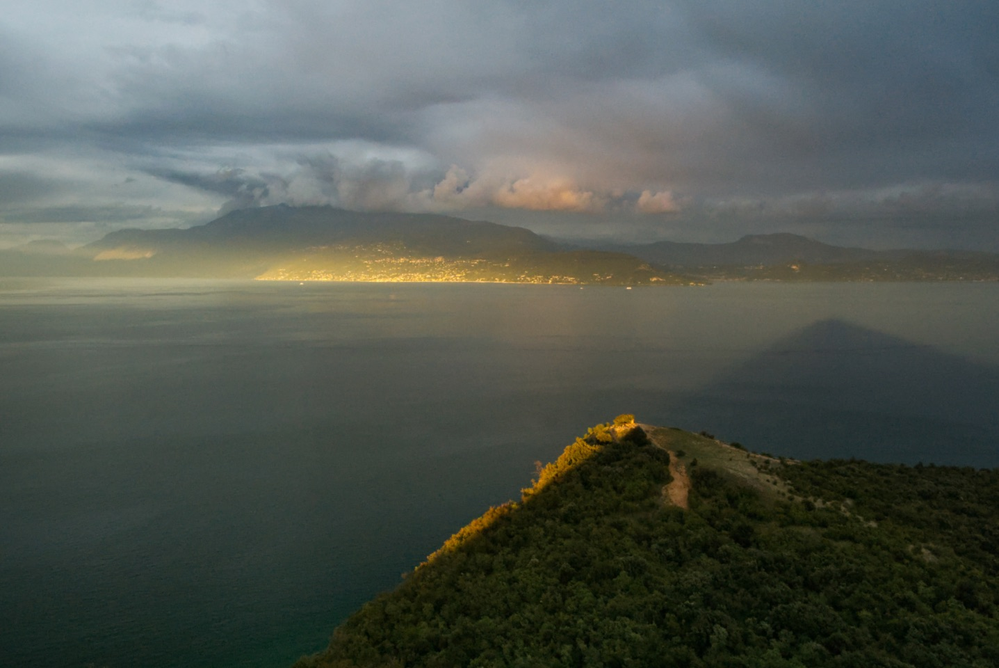
  </a>
  <a href="manerba-del-garda_220529787__photos__13514ebb-fd03-4761-ac24-243cdaaaf688_6779fe51-a2c0-4818-ac49-4c652f69fd2a.jpg" class="step-thumb-link" data-gallery="step-220529787" data-index="4">
    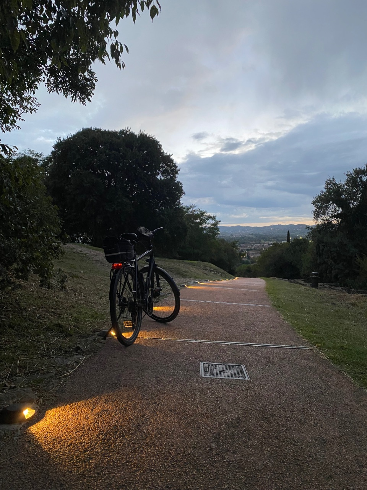
  </a>
  <a href="manerba-del-garda_220529787__photos__d4020519-954d-4836-8ea8-441ad5a04948_5bbb63e2-8c86-4c83-85a1-3bf3ef817f39.jpg" class="step-thumb-link" data-gallery="step-220529787" data-index="5">
    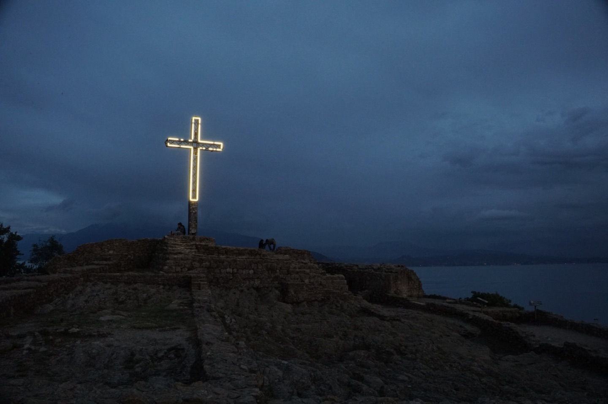
  </a>
  <a href="manerba-del-garda_220529787__photos__86cc5253-cce8-44c0-9644-feb16ea1770c_58d9165f-5d45-40bb-a903-28e2b9dc91dd.jpg" class="step-thumb-link" data-gallery="step-220529787" data-index="6">
    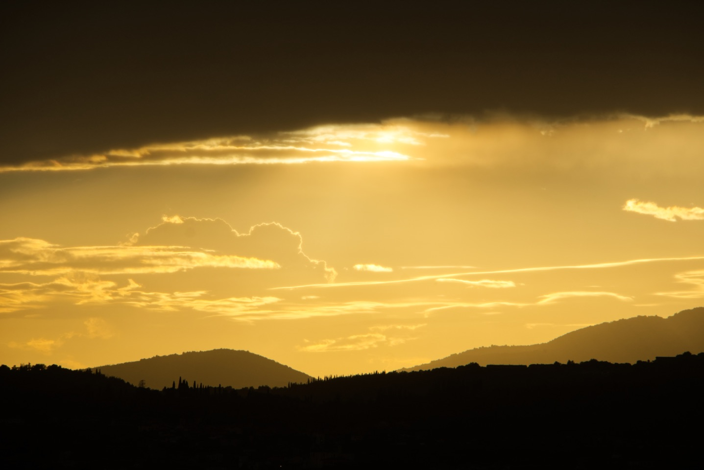
  </a>
  <a href="manerba-del-garda_220529787__photos__4153c45d-d94b-4c5c-97d9-2740d1bb3608_1bb7af03-18e1-417a-b904-4848d82fb018.jpg" class="step-thumb-link" data-gallery="step-220529787" data-index="7">
    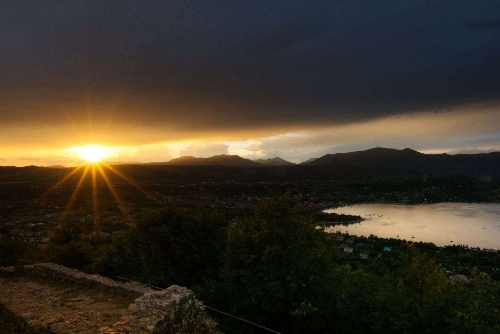
  </a>
  <a href="manerba-del-garda_220529787__photos__f90b1899-0741-4d4b-ad68-ea021f3ef086_16576382-1b59-4f7a-addc-c7036740d265.jpg" class="step-thumb-link" data-gallery="step-220529787" data-index="8">
    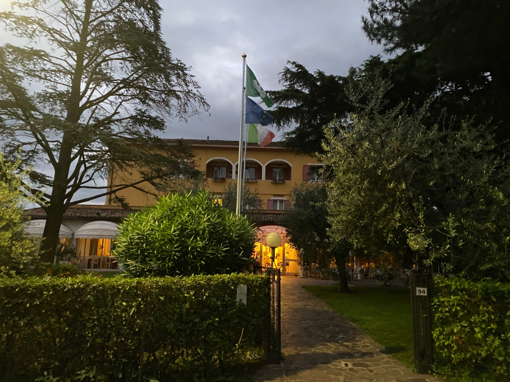
  </a>

### Tag 7 - 26.09.2025

#### Etappe: Tremosine sul Garda

Bei trübem Wetter bin ich zweimal die Tremosine hochgefahren. Dort bei der Brücke gibt es eine leckere Pizzeria.

  <a href="tremosine-sul-garda_220530038__photos__d9e54ac0-e305-4f61-a832-c7041e8ee4fb_eb033a1b-643d-4295-a564-bdaec660ec42.jpg" class="step-thumb-link" data-gallery="step-220530038" data-index="1">
    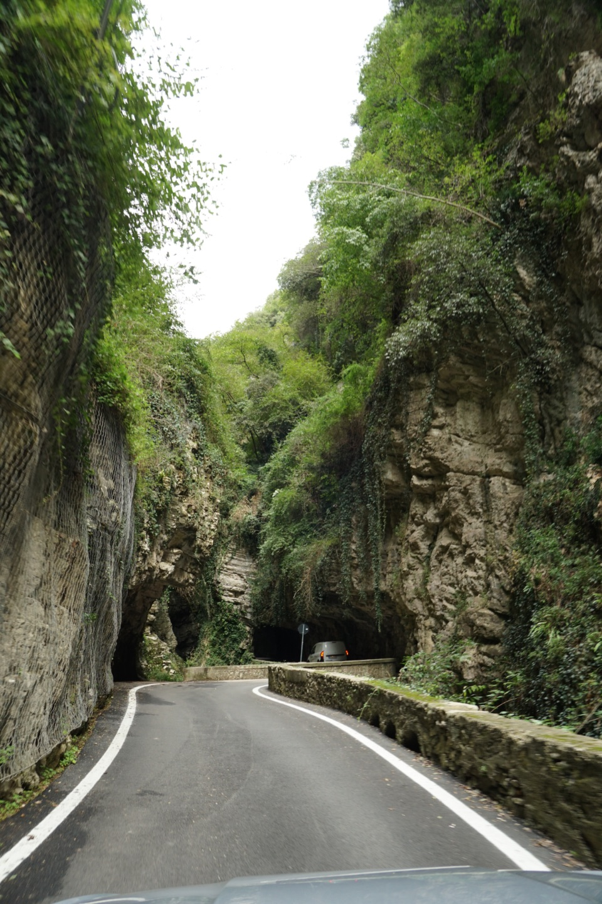
  </a>
  <a href="tremosine-sul-garda_220530038__photos__616eabed-09ba-4ce6-ae7f-d0ce0d9534a0_6d40d869-3b93-43f3-a7f2-45405128ac48.jpg" class="step-thumb-link" data-gallery="step-220530038" data-index="2">
    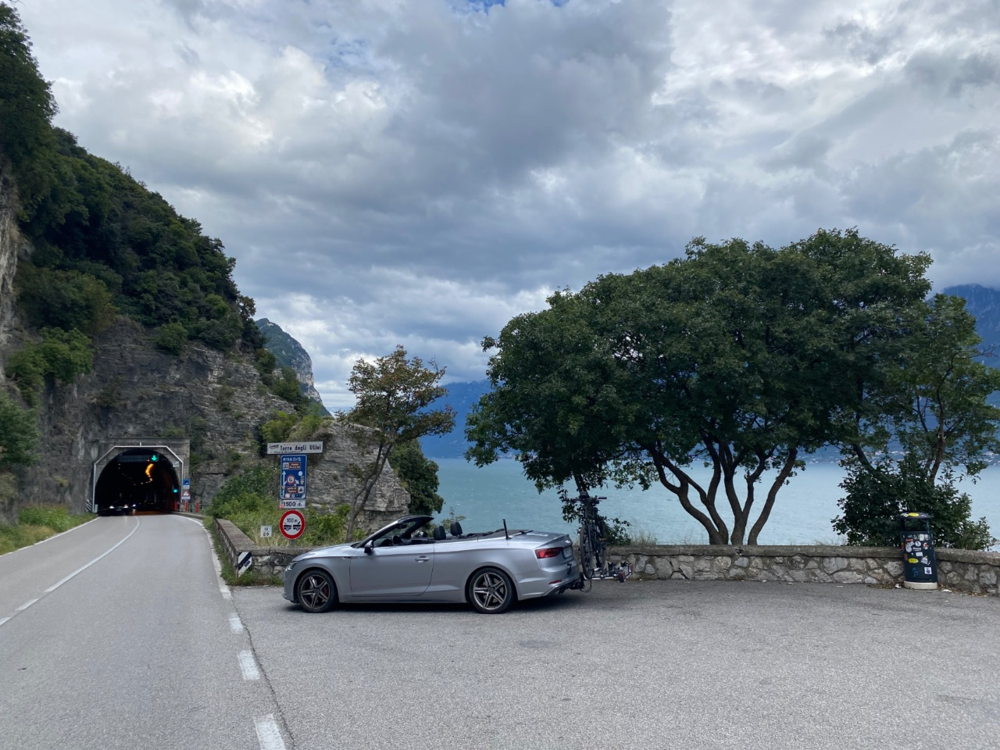
  </a>
  <a href="tremosine-sul-garda_220530038__photos__a7a85791-93be-4486-8ea0-0cd82f191fac_6c88852a-ffeb-4734-97bc-d7068af54e29.jpg" class="step-thumb-link" data-gallery="step-220530038" data-index="3">
    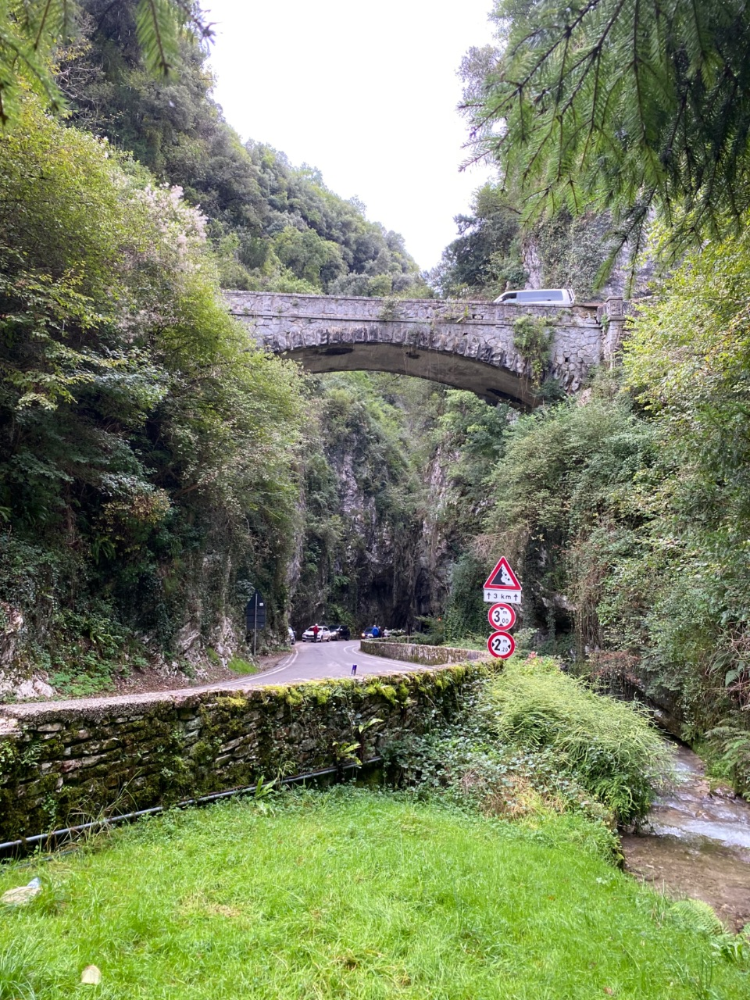
  </a>
  <a href="tremosine-sul-garda_220530038__photos__f86ad667-10f3-4849-8943-d8a116970934_61803635-effb-4fc2-8178-ad20511503cd.jpg" class="step-thumb-link" data-gallery="step-220530038" data-index="4">
    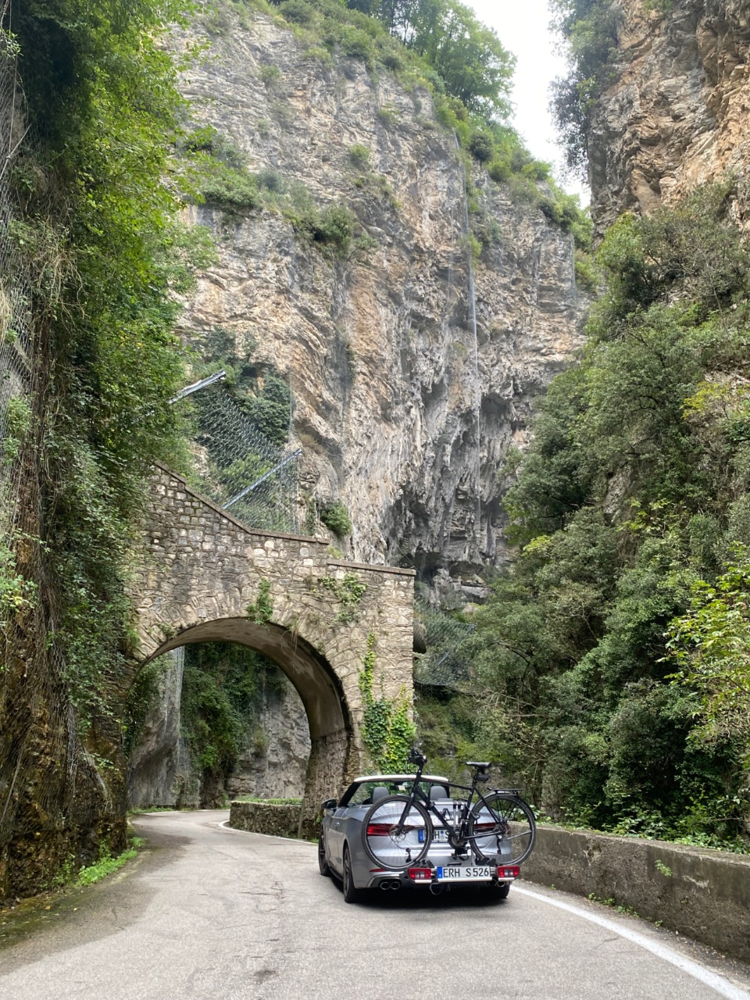
  </a>

#### Etappe: Sarntal - Penser Joch

Nach etwas Autobahn hatte ich die Faxen dicke. Runter und lieber eine schöne Landstraße suchen, da ist weniger Verkehr. Oha, zwischen Meran und Brixen (zum Brenner) gibt es ja noch ein Tal. Das fährste mal. Aha, da geht's durch das Sarntal zum Penser Joch hoch. 
Ui ui ui, da kam schon Schnee und ich bin noch mit Sommerreifen unterwegs. Aber alles gut, die Straßen waren nur nass. Oben am Pass war Null Sicht, aber 100% Fun!

  <a href="sarntal-penser-joch_220530602__photos__aa75b547-c562-4544-8b36-8cfae48d32b1_e11b919d-aff2-4e99-ae22-6881ea9b5d9d.jpg" class="step-thumb-link" data-gallery="step-220530602" data-index="1">
    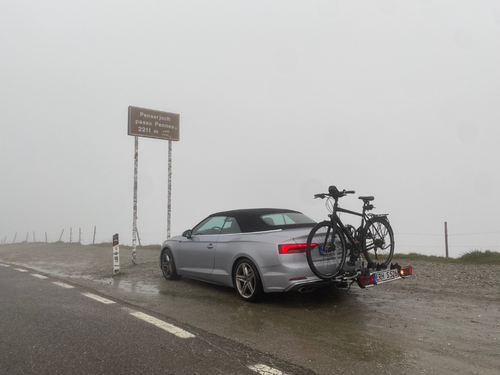
  </a>
  <a href="sarntal-penser-joch_220530602__photos__5f6d650c-47eb-444f-8011-cbbb8ab977e1_cf2c25bf-137a-404a-9fe6-f9d62fb2a184.jpg" class="step-thumb-link" data-gallery="step-220530602" data-index="2">
    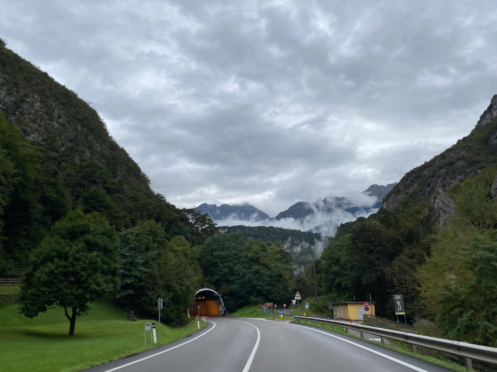
  </a>
  <a href="sarntal-penser-joch_220530602__photos__4cf3abbc-264c-4c73-a821-187a16d35935_b2bcdf30-9883-4b09-bda1-ed4cb454231a.jpg" class="step-thumb-link" data-gallery="step-220530602" data-index="3">
    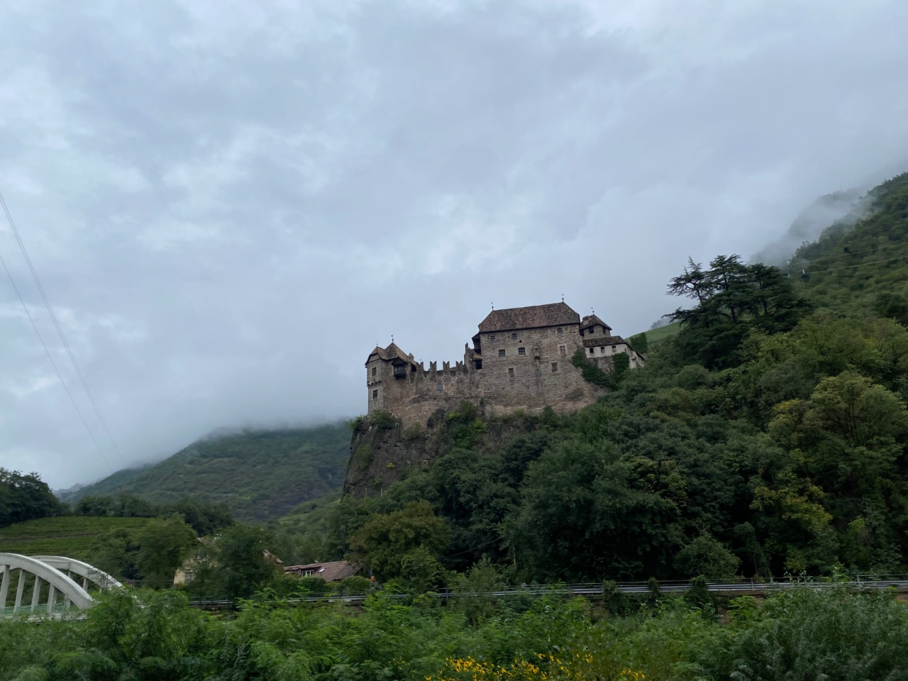
  </a>
  <a href="sarntal-penser-joch_220530602__photos__5d6545bb-7b55-4f02-b13d-cc916036b55e_9c71074f-73c3-46d9-bf76-e07d5ee612be.jpg" class="step-thumb-link" data-gallery="step-220530602" data-index="4">
    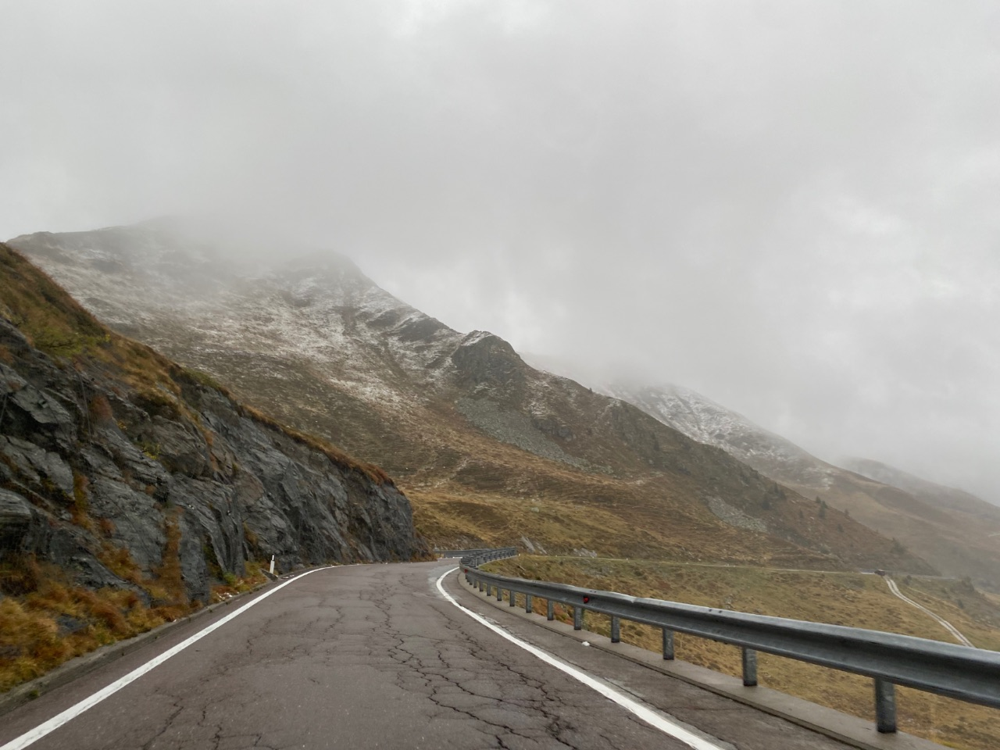
  </a>
  <a href="sarntal-penser-joch_220530602__photos__8f611438-d676-4fda-9730-3424e0526b08_9a44e0b2-c186-4ac1-b805-81b216237d22.jpg" class="step-thumb-link" data-gallery="step-220530602" data-index="5">
    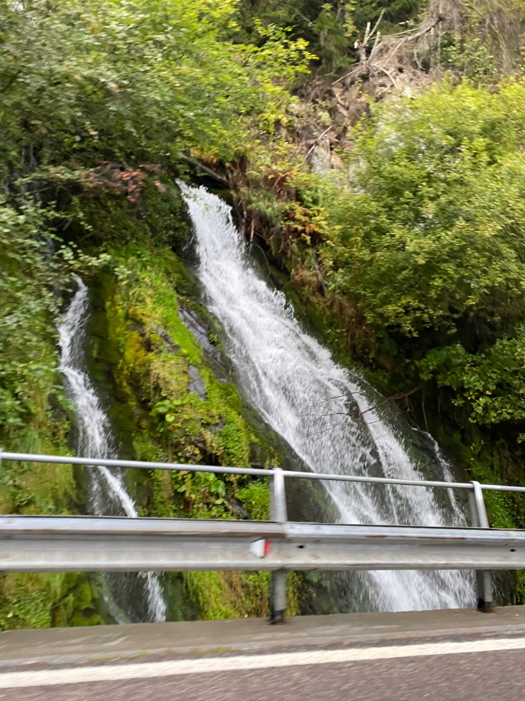
  </a>
  <a href="sarntal-penser-joch_220530602__photos__aacd3ce9-5c83-44f6-882a-6d320bc07ffa_7ee44ab2-ce43-4549-b4cd-4018d50e7e49.jpg" class="step-thumb-link" data-gallery="step-220530602" data-index="6">
    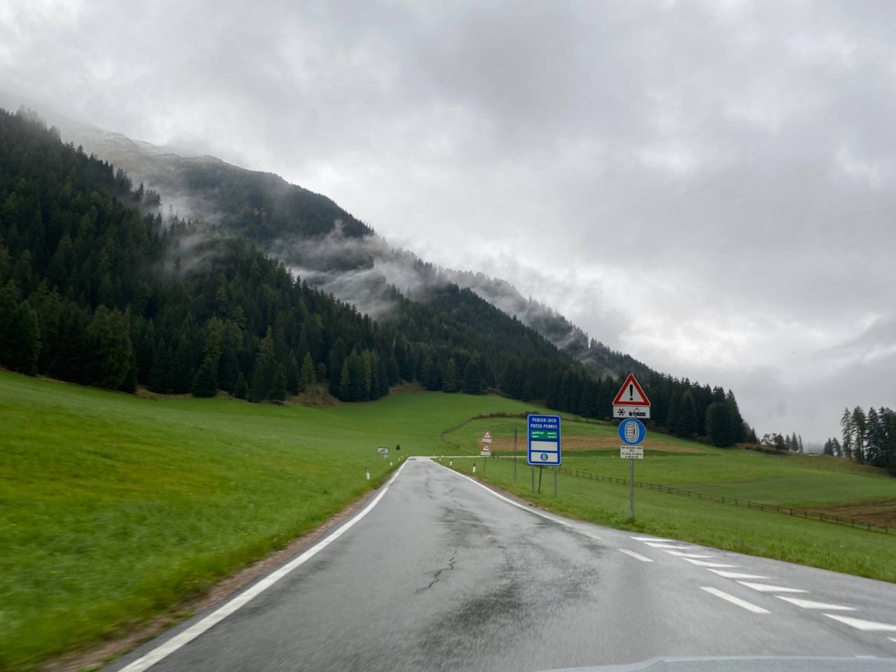
  </a>
  <a href="sarntal-penser-joch_220530602__photos__7c9a17b0-38fd-4243-83d2-0bd7f72c406f_5f5c0a31-a894-4df7-926a-5f84197b86c0.jpg" class="step-thumb-link" data-gallery="step-220530602" data-index="7">
    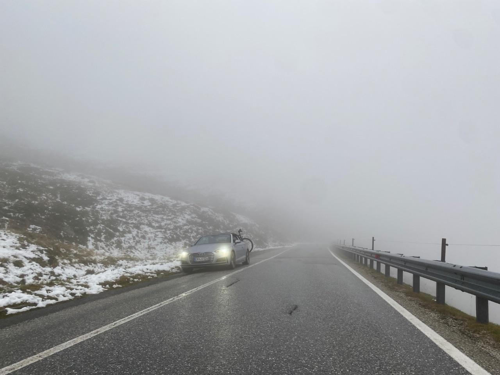
  </a>

#### Etappe: Seefeld in Tirol

Rund um Seefeld war wieder blauer Himmel und das soll auch morgen früh so bleiben. Dann hier eine Unterkunft gesucht und spontan ins gute alte Olympiabad in Seefeld. Good old memories! Aber der Wildwasserkanal mit den Granitfelsen gibt es leider nicht mehr.

  <a href="seefeld-in-tirol_220530893__photos__27119c1c-6226-4b36-a6ef-b1e1a7548a1d_af13820e-78dd-4f35-9da0-ec8b02ac2075.jpg" class="step-thumb-link" data-gallery="step-220530893" data-index="1">
    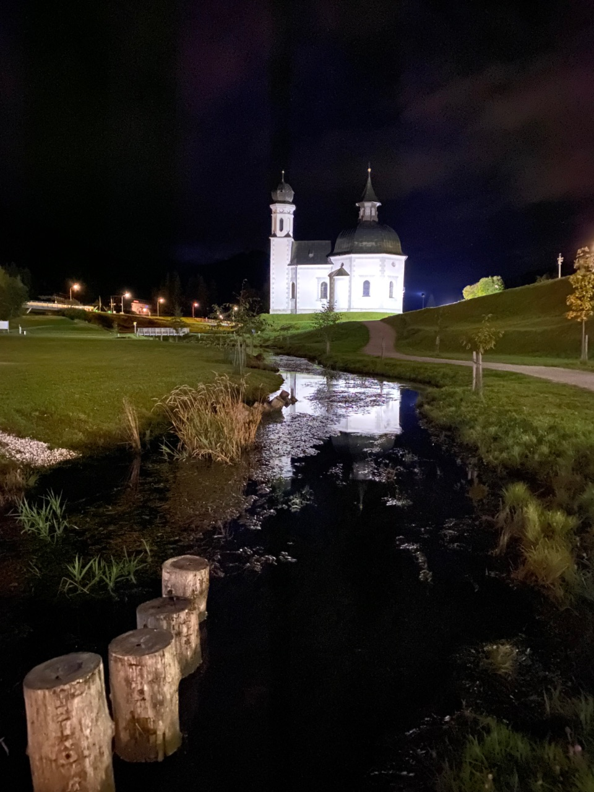
  </a>
  <a href="seefeld-in-tirol_220530893__photos__566d8f3c-5459-4f7a-a51a-dc0bd5a354f8_4831e4b4-df93-4119-9cbb-14cccfc32e82.jpg" class="step-thumb-link" data-gallery="step-220530893" data-index="2">
    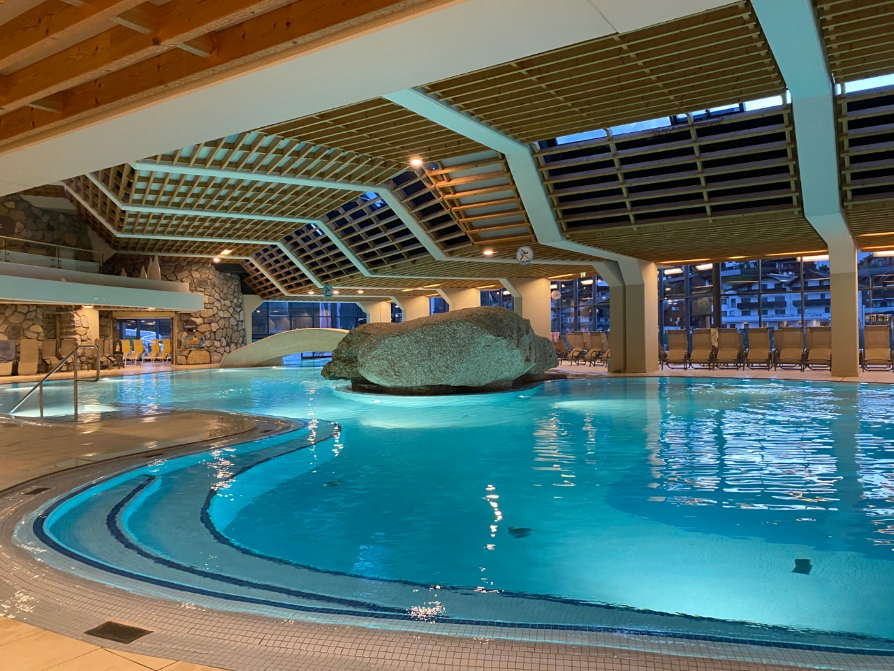
  </a>
  <a href="seefeld-in-tirol_220530893__photos__8003f971-6127-4a64-8b0f-06bd0cc37d46_20d89be2-6389-43cd-86da-36fd99eeaa19.jpg" class="step-thumb-link" data-gallery="step-220530893" data-index="3">
    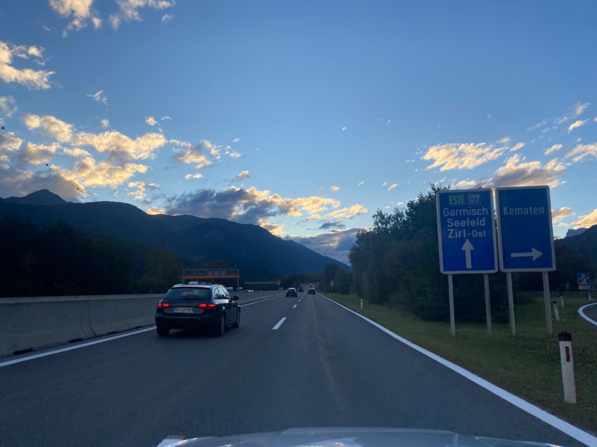
  </a>

### Tag 8 - 27.09.2025

#### Etappe: Seefeld in Tirol

Am nächsten Morgen eine kleine Radtour vor Sonnenaufgang gemacht.
Dann, wie so oft, wenn man keine Tiefgarage hat, das Cabriodach getrocknet und in der Sonne noch nachtrocknen lassen.
Weiter ging es noch Richtung Leutasch hier und da mal entlang gecruised.

  <a href="seefeld-in-tirol_220531163__photos__57494833-1962-419a-9192-cc0b0866be11_f8437e39-2738-4d67-88f4-9df029e53c1a.jpg" class="step-thumb-link" data-gallery="step-220531163" data-index="1">
    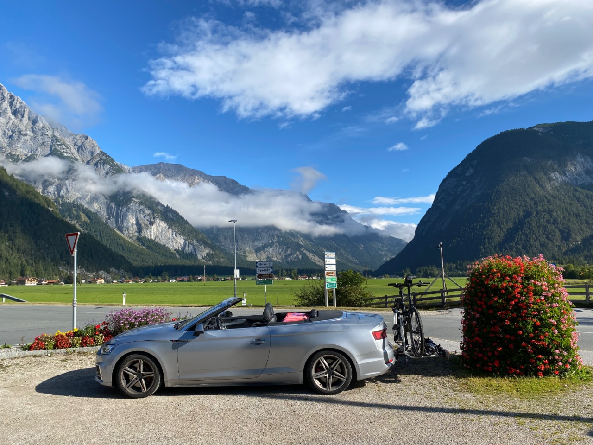
  </a>
  <a href="seefeld-in-tirol_220531163__photos__bda50100-4a7a-4fde-8af9-3426bea5fd4e_d241ae73-c661-49b6-b6ee-7b3530b65235.jpg" class="step-thumb-link" data-gallery="step-220531163" data-index="2">
    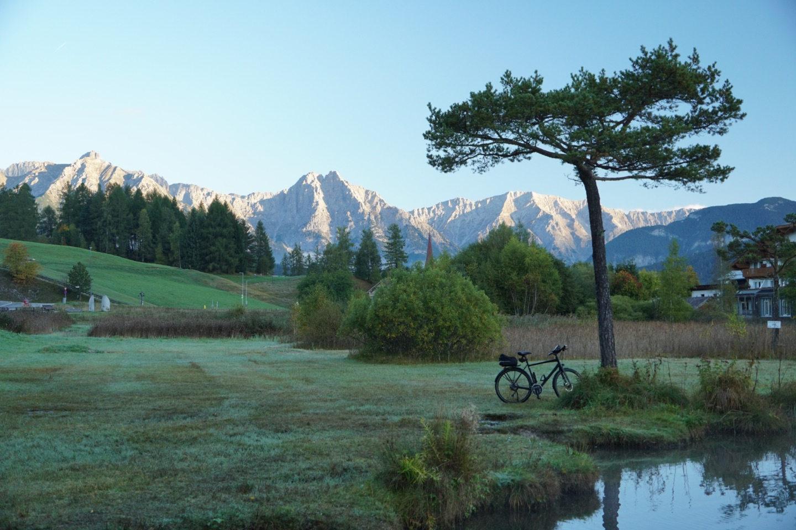
  </a>
  <a href="seefeld-in-tirol_220531163__photos__bdc3234d-2348-4d0d-b1df-055070bf914a_843bba07-031f-4d87-b8b6-dc812882efea.jpg" class="step-thumb-link" data-gallery="step-220531163" data-index="3">
    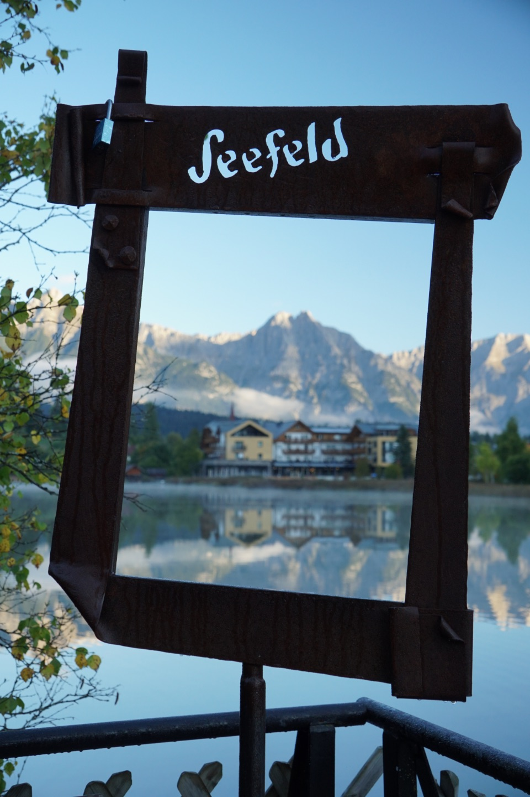
  </a>
  <a href="seefeld-in-tirol_220531163__photos__a15f6026-331a-4552-8da7-565bb746b507_60f3fe1b-09a1-4470-bb3a-ab563001b2e4.jpg" class="step-thumb-link" data-gallery="step-220531163" data-index="4">
    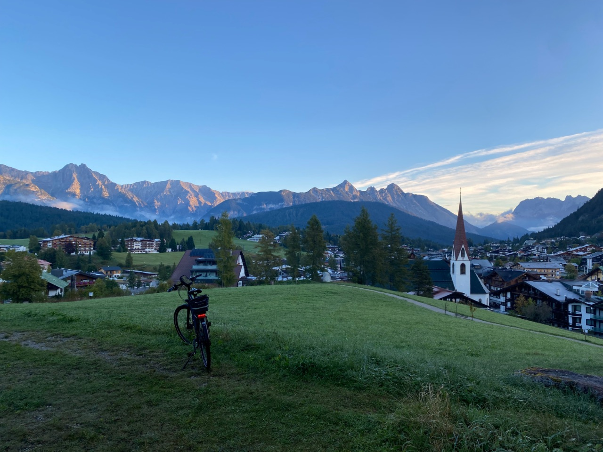
  </a>
  <a href="seefeld-in-tirol_220531163__photos__7326aa59-9cc7-423c-b491-166a5a22df9a_0d1444a1-8a4b-402b-9385-23dd388387c3.jpg" class="step-thumb-link" data-gallery="step-220531163" data-index="5">
    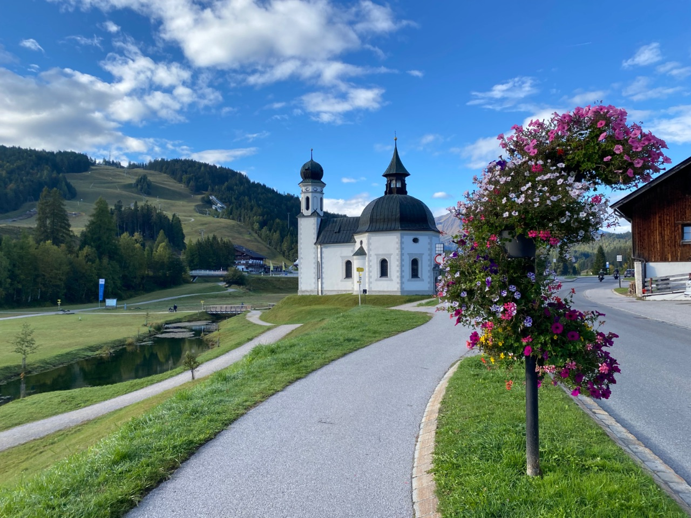
  </a>
  <a href="seefeld-in-tirol_220531163__photos__1ab30016-e378-4c7b-b401-14e3c7cadc97_0ca83ae8-9b59-4287-ab3c-6de2d4e6dcc0.jpg" class="step-thumb-link" data-gallery="step-220531163" data-index="6">
    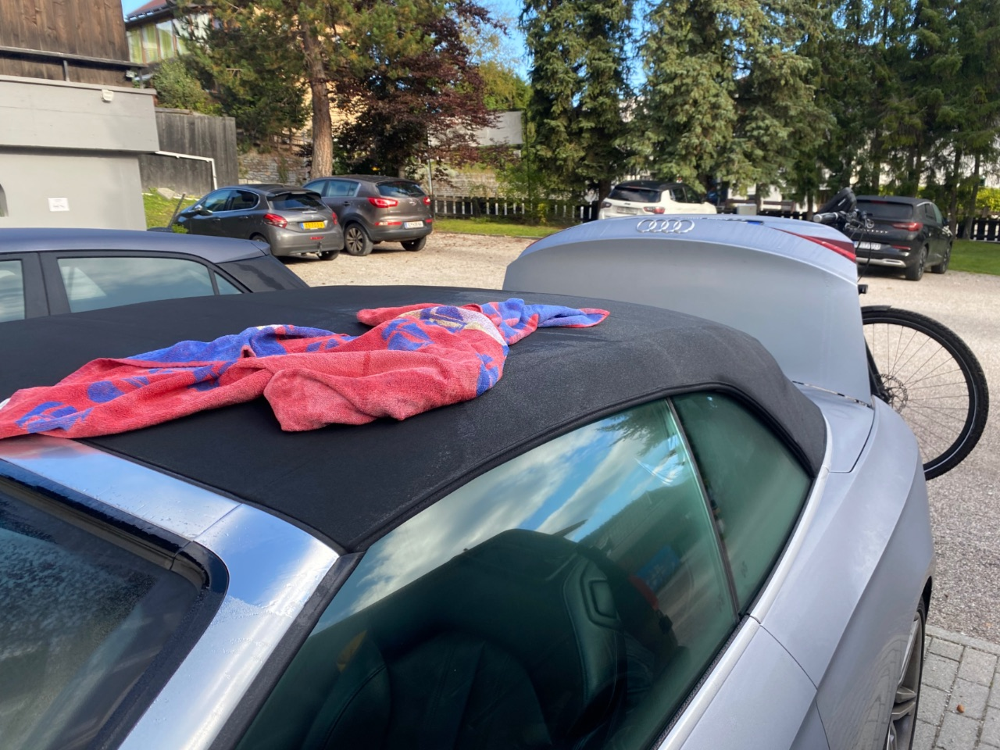
  </a>
  <a href="seefeld-in-tirol_220531163__photos__d6379381-1813-4557-899e-e52067ad3219_065507f6-38d1-4825-9d8f-81061dc3cfd0.jpg" class="step-thumb-link" data-gallery="step-220531163" data-index="7">
    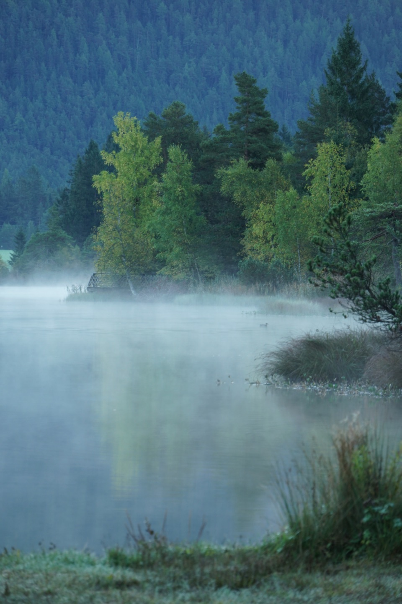
  </a>

