## Überblick

Dreiländereck und Karlsbad vom 08.03.2026 bis 08.03.2026.

  
Zur kompletten Route auf Polarsteps: <a href="https://www.polarsteps.com/StefanScherer10/24524915-dreilandereck-und-karlsbad?mode=track" target="_blank" rel="noopener">Dreiländereck und Karlsbad auf Polarsteps</a>



## Etappen

### Tag 1 - 08.03.2026

#### Etappe: Röttenbach

Heutige Planung, Cabriotour und Radtour und ein weiteres Land entdecken :-) Bohemian Rhapsody - auf nach Tschechien.

  <a href="rottenbach_220909402__photos__5df3b1c6-b323-4fea-b305-d84d130a3a73_3e89b662-ac85-44a3-8a2f-7116a22e4b11.jpg.jpg" class="step-thumb-link" data-gallery="step-220909402" data-index="1">
    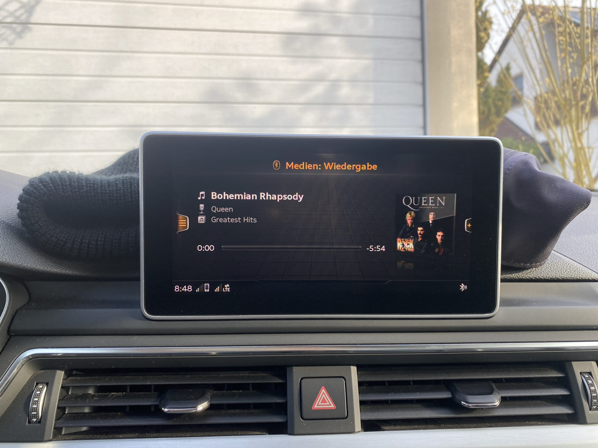
  </a>

#### Etappe: Dreiländereck

Ein kurzer Stopp am Dreiländereck Bayern - Sachsen - Böhmen 😅

  <a href="regnitzlosau_220925252__photos__d090738f-f8f6-4c06-a345-d2e503768fff_8f825832-0da3-4ebb-b66e-2ae901a2ca2c.jpg.jpg" class="step-thumb-link" data-gallery="step-220925252" data-index="1">
    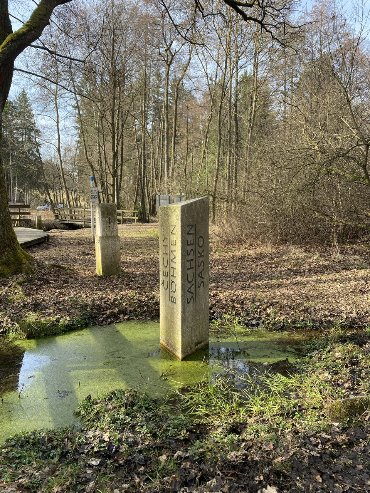
  </a>
  <a href="regnitzlosau_220925252__photos__a845ee41-2ef9-4314-b25a-feaf136659d8_6a6aab09-74f9-4ed7-9cac-b3ecb4cca792.jpg.jpg" class="step-thumb-link" data-gallery="step-220925252" data-index="2">
    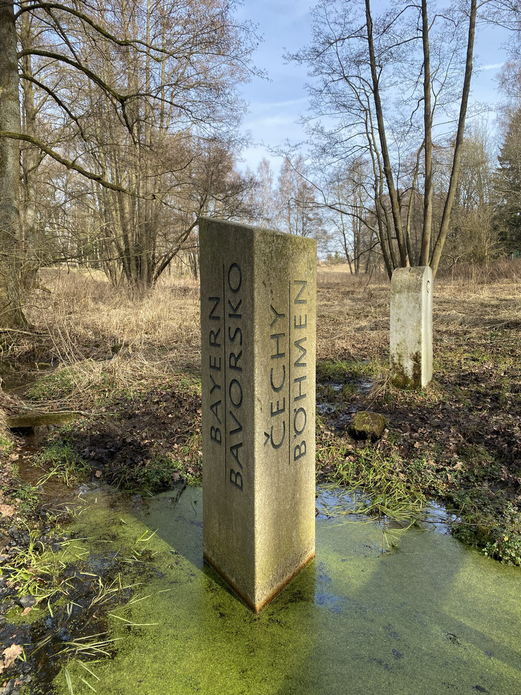
  </a>
  <a href="regnitzlosau_220925252__photos__faa335e4-a9ce-4816-8382-f59adef43cfb_61c17aa6-764b-4ba4-86f0-7019bd7733af.jpg.jpg" class="step-thumb-link" data-gallery="step-220925252" data-index="3">
    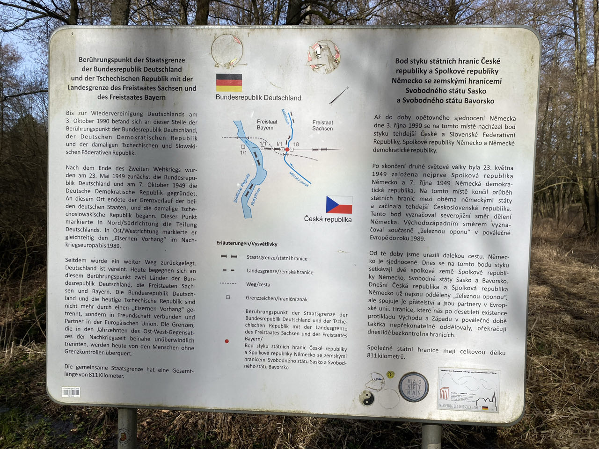
  </a>
  <a href="regnitzlosau_220925252__photos__2acde9ba-2061-41e4-a779-6f429ab0cfba_2429cbb9-7d0a-427d-b6d5-fd4aeb28840c.jpg.jpg" class="step-thumb-link" data-gallery="step-220925252" data-index="4">
    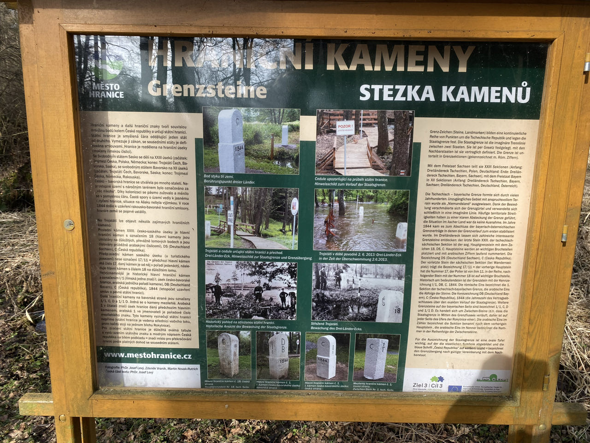
  </a>

#### Etappe: Loket

Bei Loket beginnt meine Radtour entlang der Eger bis Karlsbad.

  <a href="loket_220944987__photos__d9054a89-af6a-4cd4-b7ff-e413034b5de9_e1e6d065-15bc-4cd9-a4dd-a9857e99b72f.jpg.jpg" class="step-thumb-link" data-gallery="step-220944987" data-index="1">
    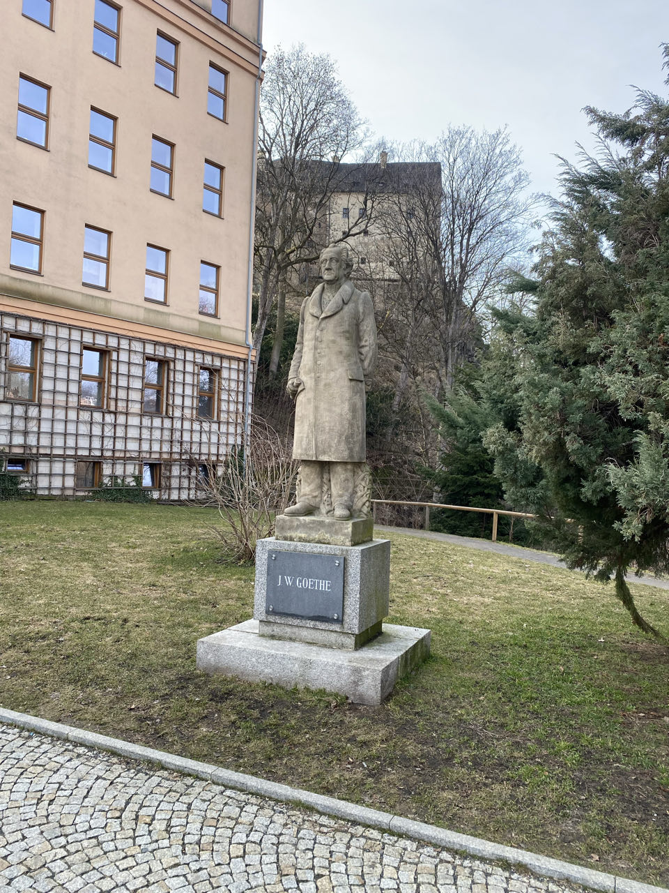
  </a>
  <a href="loket_220944987__photos__d32c0eaf-8eab-4f46-9f9c-00d42c516aae_dcc82cf2-67fa-46a5-8cce-540043e0de91.jpg.jpg" class="step-thumb-link" data-gallery="step-220944987" data-index="2">
    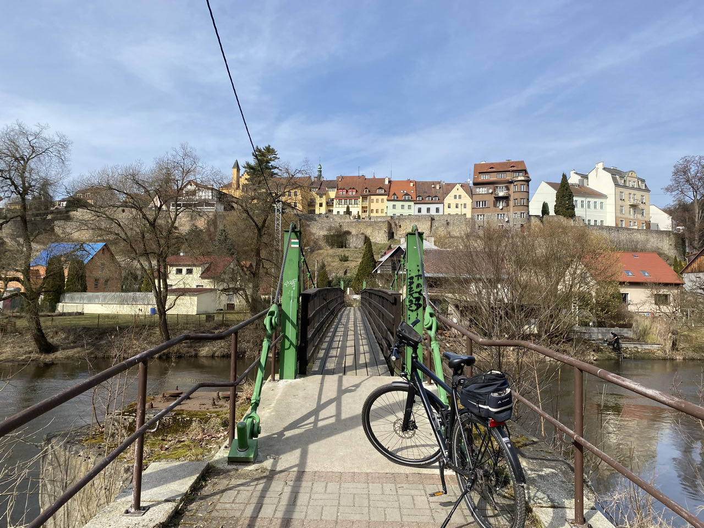
  </a>
  <a href="loket_220944987__photos__14cbaa54-3f2b-44cd-98a7-19548fb461aa_bc75b2d9-f80f-40d9-832e-93db411ce1f7.jpg" class="step-thumb-link" data-gallery="step-220944987" data-index="3">
    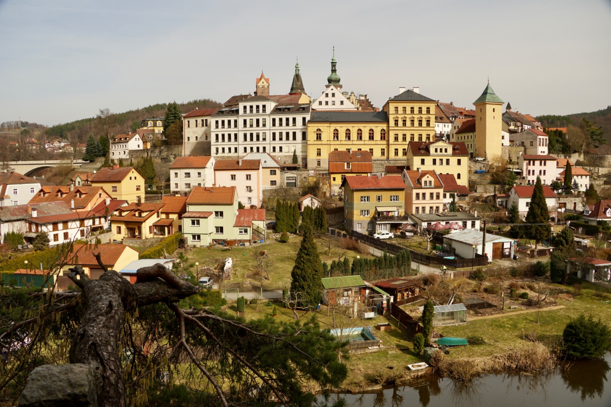
  </a>
  <a href="loket_220944987__photos__0f1d6ced-64fb-4637-899b-cb01841043e9_b52b3fa0-5799-41cb-a13e-bc7473cc5fad.jpg.jpg" class="step-thumb-link" data-gallery="step-220944987" data-index="4">
    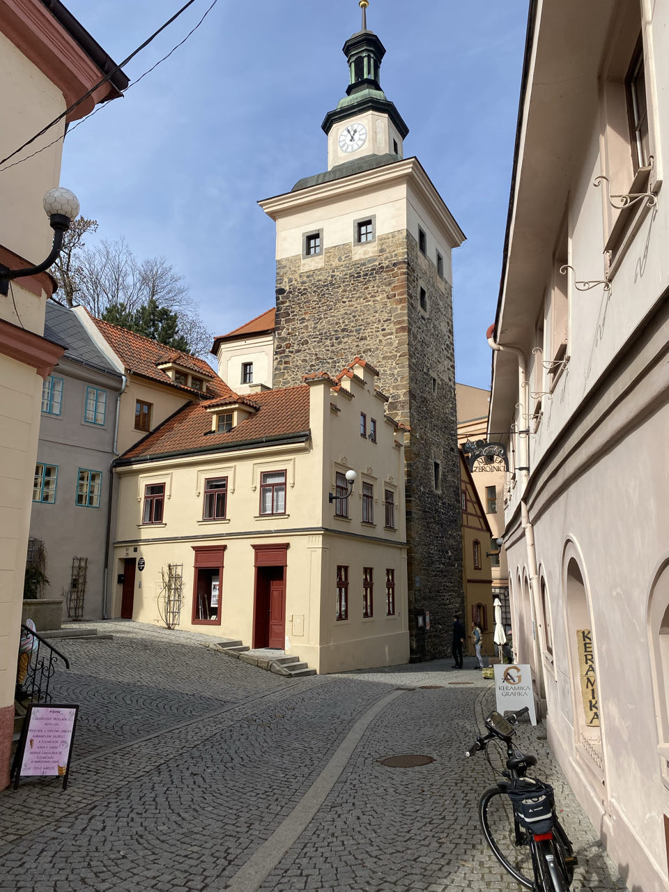
  </a>
  <a href="loket_220944987__photos__d8d9954c-bf65-4f51-9ccf-30f7017a6b32_22502022-ac39-4c55-8676-5debbf3d5b86.jpg" class="step-thumb-link" data-gallery="step-220944987" data-index="5">
    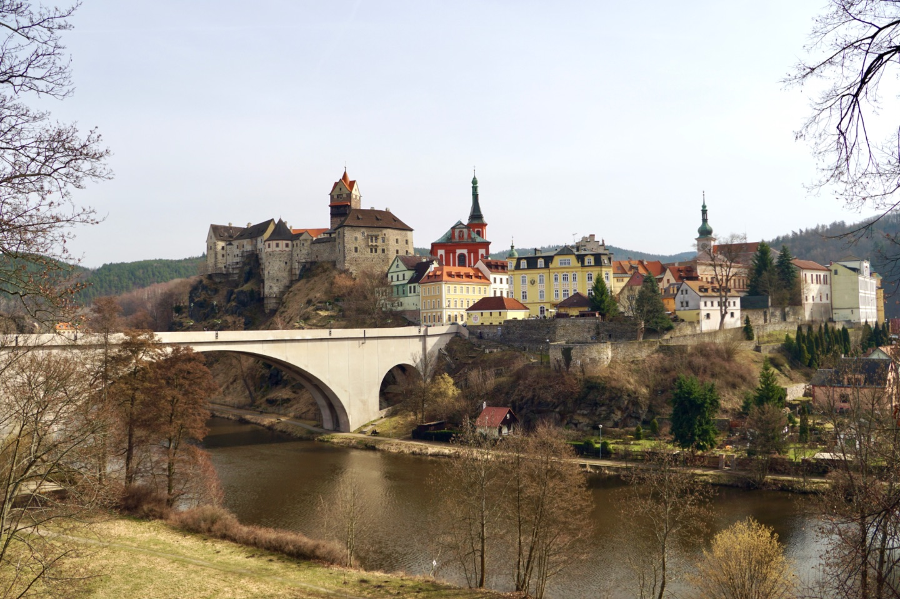
  </a>

#### Etappe: Hans-Heiling-Felsen

Beeindruckende Felsen in dem verschlungenen Tal

  <a href="hans-heiling-felsen_220959487__photos__6699c93a-eeef-482f-83c3-a233586888f6_cd462786-4c6c-43c2-aada-1ec87adc9291.jpg" class="step-thumb-link" data-gallery="step-220959487" data-index="1">
    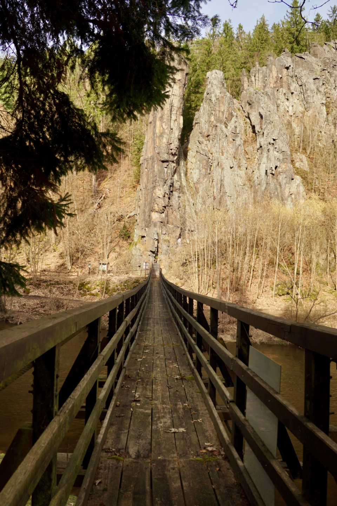
  </a>
  <a href="hans-heiling-felsen_220959487__photos__f68cf423-2df6-48f0-b770-bd10e4317404_7bd91e55-523d-4f06-8dca-fa44cc174d4f.jpg" class="step-thumb-link" data-gallery="step-220959487" data-index="2">
    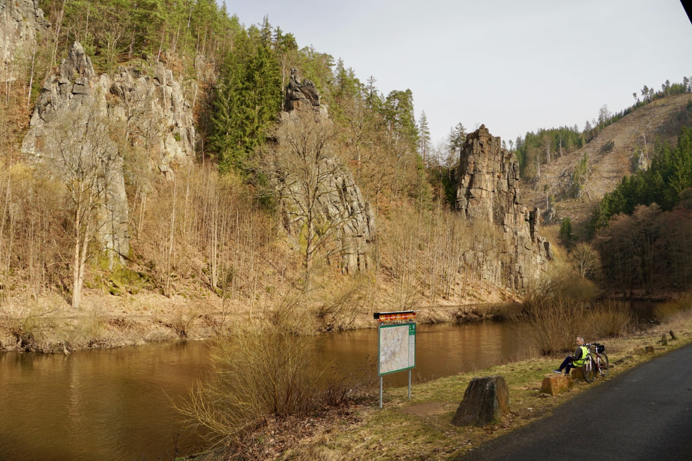
  </a>
  <a href="hans-heiling-felsen_220959487__photos__170423a7-3004-40f5-b845-c8f0cc60a5c3_563303ce-9942-46ee-9e30-de35b2d8df9d.jpg" class="step-thumb-link" data-gallery="step-220959487" data-index="3">
    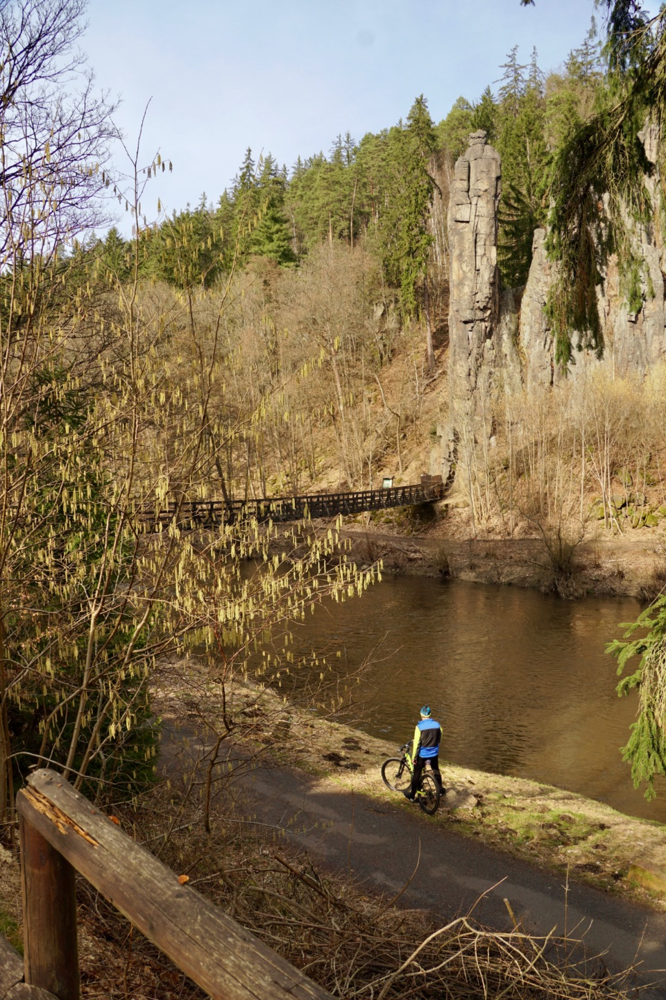
  </a>
  <a href="hans-heiling-felsen_220959487__photos__985e44a1-547a-4f49-967c-b35bff756b10_3f5a6117-3e3c-4283-9a18-3420afeb16ee.jpg.jpg" class="step-thumb-link" data-gallery="step-220959487" data-index="4">
    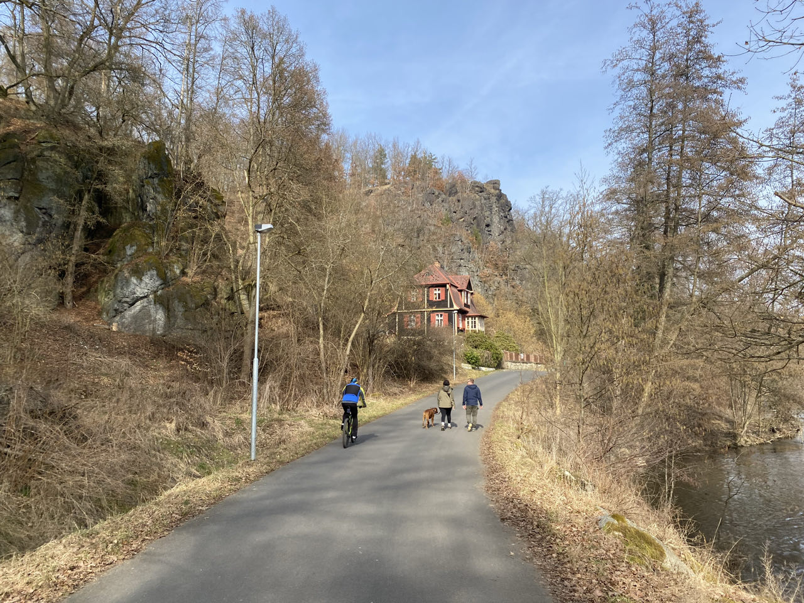
  </a>
  <a href="hans-heiling-felsen_220959487__photos__34f316c2-cae2-43c0-8f97-d891690024d1_2ddc06f9-4955-4fd8-82d0-ec84494da98c.jpg.jpg" class="step-thumb-link" data-gallery="step-220959487" data-index="5">
    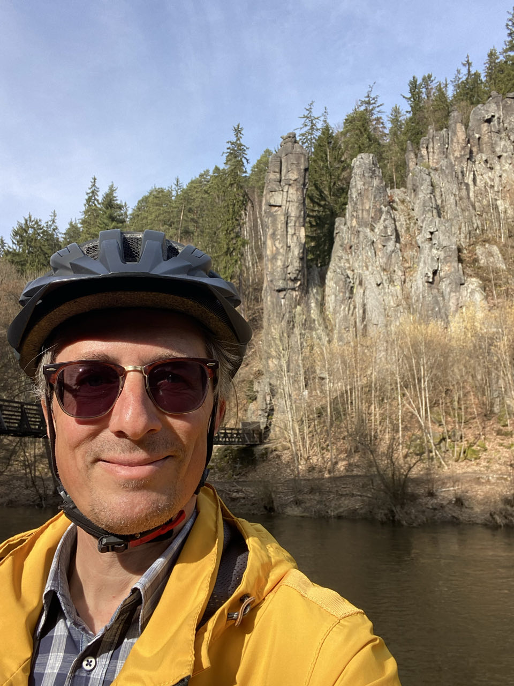
  </a>

#### Etappe: Karlsbad

Ziel der Radtour war die russisch Orthodoxe Kirche und dann eine kleine Stadtrundfahrt. Eine Kaffeepause bei angenehmen Frühlingstemperaturen musste auch sein. Danach zurückradeln nach Loket.

  <a href="karlsbad_220959794__photos__34e7c3a1-e105-4293-8864-a1bfa292b235_f06d1999-6442-4b1f-8f36-ae0ce16e6a15.jpg.jpg" class="step-thumb-link" data-gallery="step-220959794" data-index="1">
    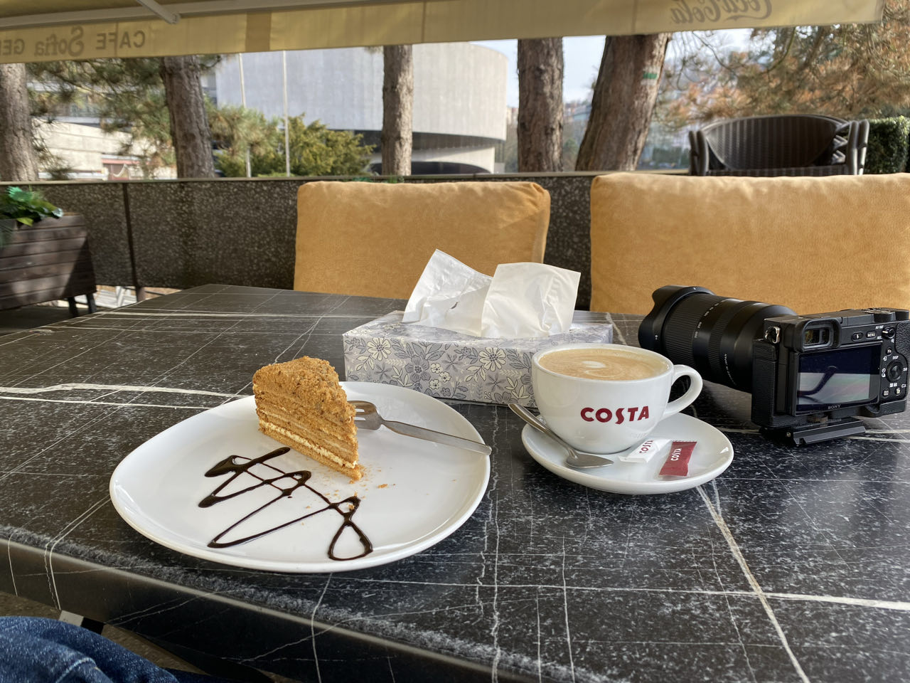
  </a>
  <a href="karlsbad_220959794__photos__196f4608-f481-4bc8-828b-ae91dec7b7a6_ca82fe11-b639-4bdb-bf77-974c3ef8a86d.jpg.jpg" class="step-thumb-link" data-gallery="step-220959794" data-index="2">
    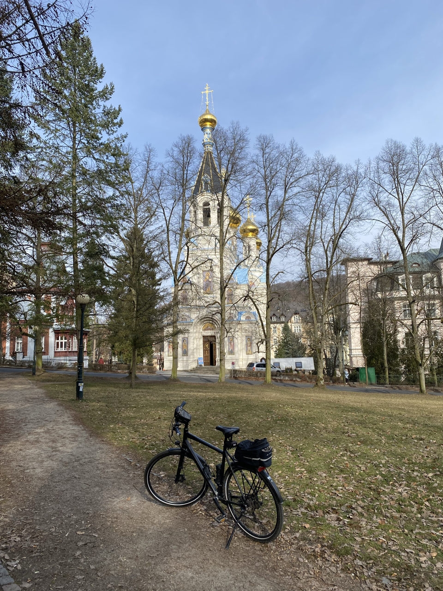
  </a>
  <a href="karlsbad_220959794__photos__bebc5b98-a885-4033-a7ec-08ff31cb96a6_82224e95-d198-45b5-aeaa-96f2f33f0c77.jpg" class="step-thumb-link" data-gallery="step-220959794" data-index="3">
    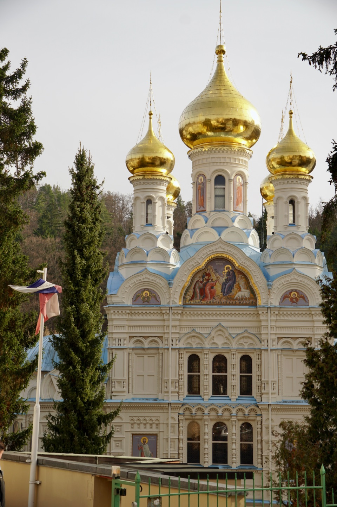
  </a>
  <a href="karlsbad_220959794__photos__46b303f7-fb50-4fdb-a831-42ffe2010fd0_66628519-e8f4-459a-b66d-8d76940f7bcb.jpg.jpg" class="step-thumb-link" data-gallery="step-220959794" data-index="4">
    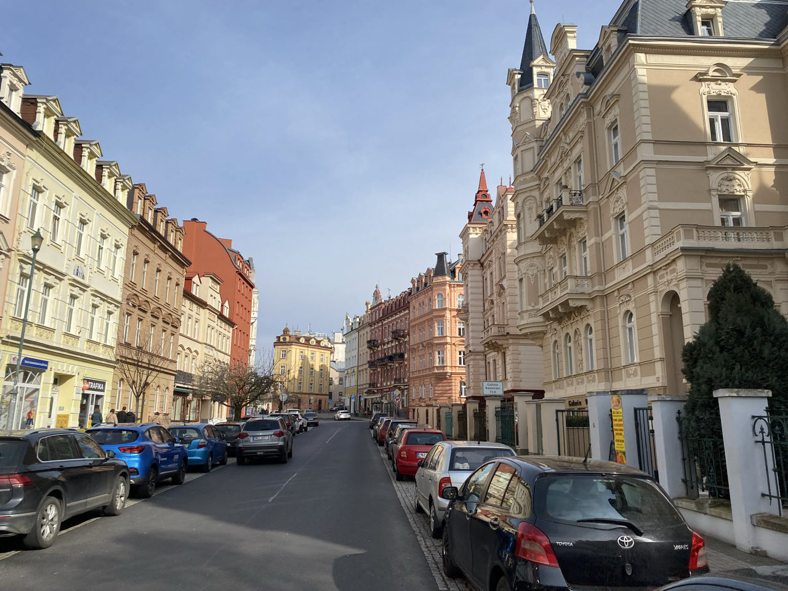
  </a>
  <a href="karlsbad_220959794__photos__055d3c80-ce3d-4415-877b-1a2b519776e6_60aa960d-661f-45f9-9fe8-944c2f6ebb0e.jpg.jpg" class="step-thumb-link" data-gallery="step-220959794" data-index="5">
    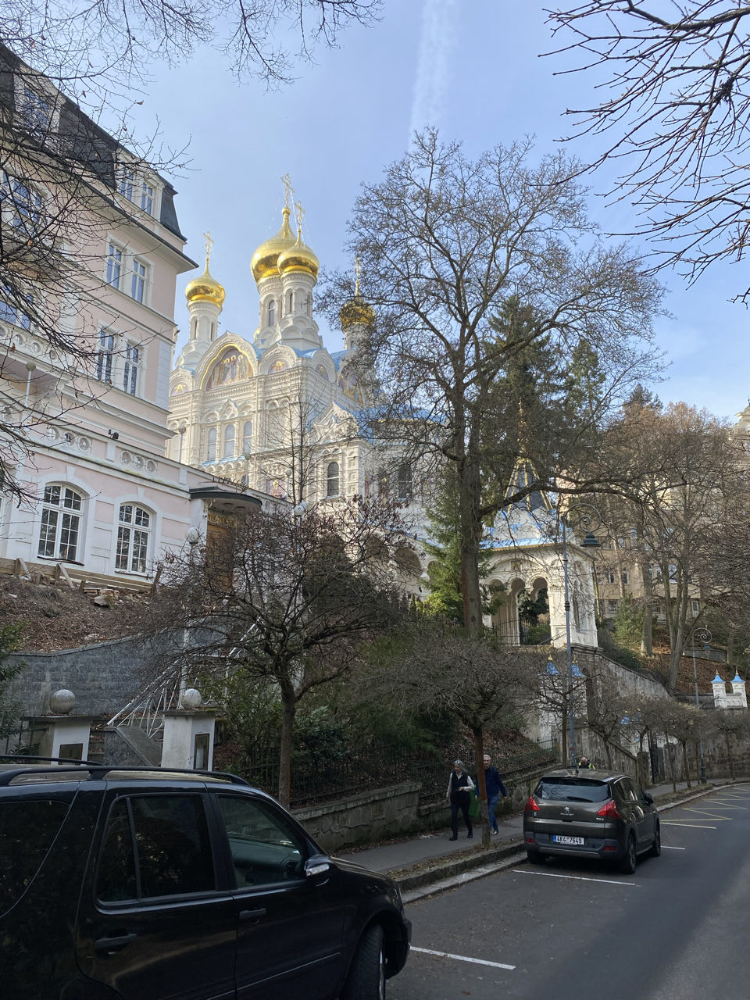
  </a>
  <a href="karlsbad_220959794__photos__6bd54990-1181-4207-92d3-d537dcc61628_1c03dbef-f3b5-4023-b636-8b5219c5c53d.jpg.jpg" class="step-thumb-link" data-gallery="step-220959794" data-index="6">
    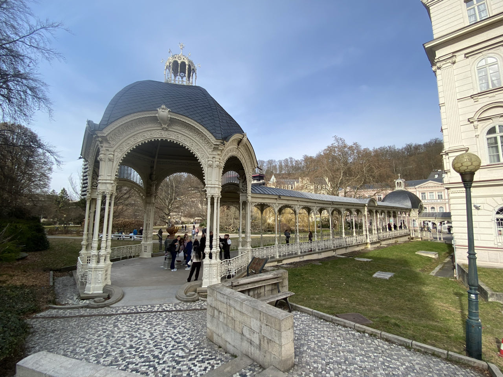
  </a>

#### Etappe: Loket

Am Ende der Radtour ging es nochmal hoch zur Burg.

  <a href="loket_221065259__photos__2a96f290-927c-4ebc-a6ee-73f680eaf807_dcd44042-411e-4c84-a167-ca9d488c72d5.jpg.jpg" class="step-thumb-link" data-gallery="step-221065259" data-index="1">
    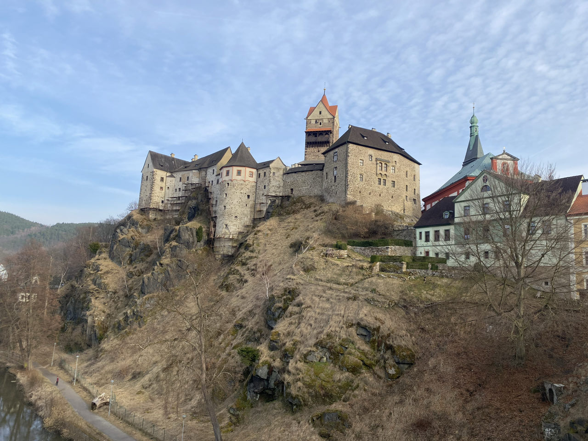
  </a>
  <a href="loket_221065259__photos__67ac40d2-b3c5-4190-a6db-54102a7f7bd9_b2c42742-7ed1-47af-b270-510b9346157b.jpg.jpg" class="step-thumb-link" data-gallery="step-221065259" data-index="2">
    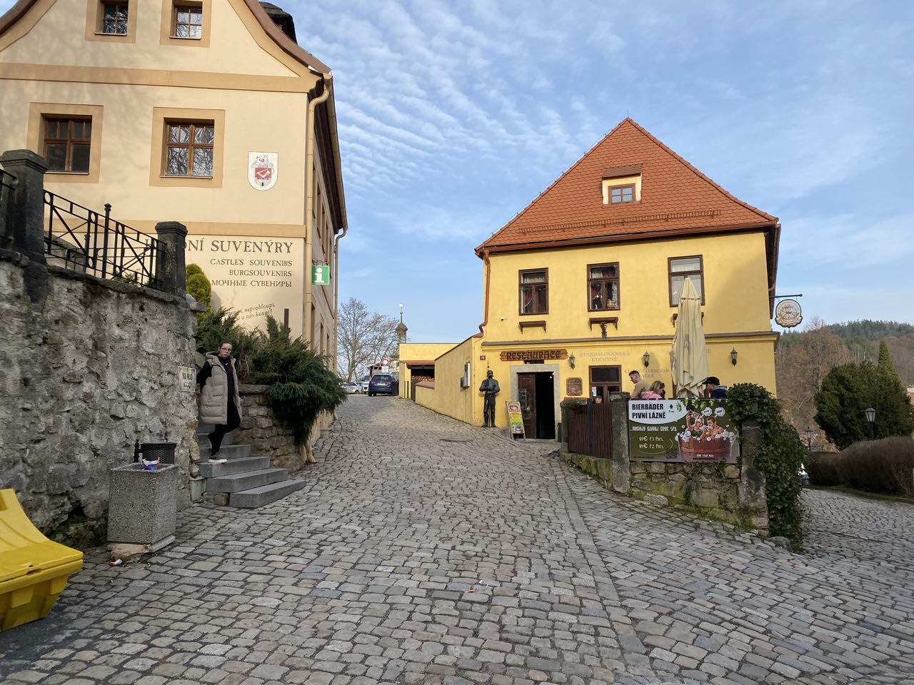
  </a>
  <a href="loket_221065259__photos__1e26cba0-4d6a-4792-b984-c84ee02975b0_9403dac2-7d5f-4c61-94d5-ab8d1ccdc55a.jpg.jpg" class="step-thumb-link" data-gallery="step-221065259" data-index="3">
    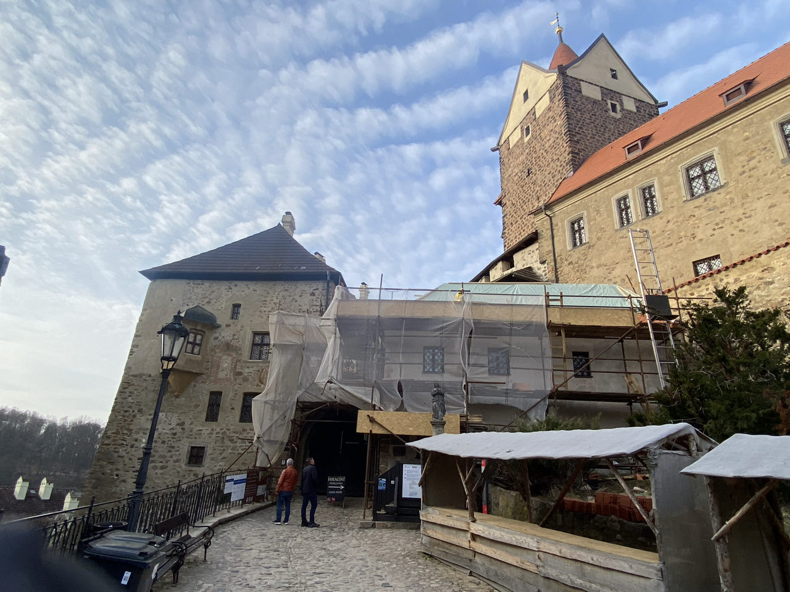
  </a>

#### Etappe: Gaststätte Waldstein

Cabriofahrt von Loket bis zum Abendessen. Leider war die Gaststätte am Waldstein schon zu. Sie sind schon ausverkauft nach dem schönen Wochenendwetter. Macht nix, dann halt weiter nach Bischofsgrün.

  <a href="zell_221000006__photos__68c5ae8a-bb5f-4dbf-98b6-ae6ea3ece75f_abbd2948-e395-47d2-83b7-f93b0ba30e5d.jpg.jpg" class="step-thumb-link" data-gallery="step-221000006" data-index="1">
    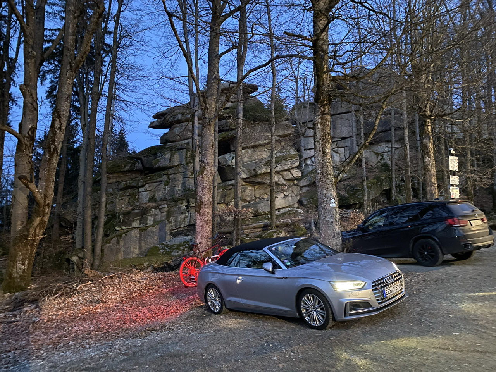
  </a>
  <a href="zell_221000006__photos__7ec8ff47-9421-4775-aec4-3a1bdd451a76_73fd5c23-fd87-4433-92c3-7b46028cb794.jpg.jpg" class="step-thumb-link" data-gallery="step-221000006" data-index="2">
    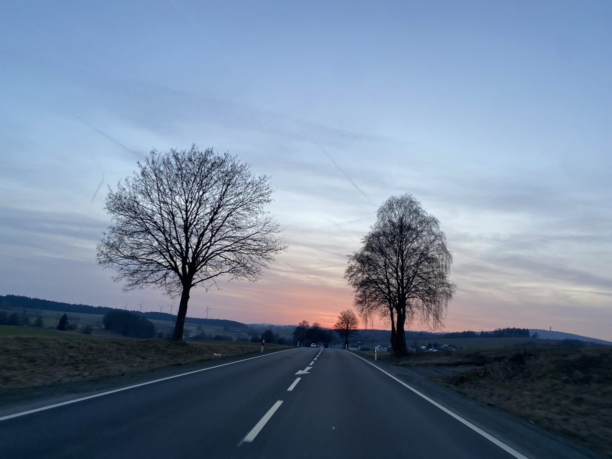
  </a>

#### Etappe: Bischofsgrün

Jawoll, die Pizzeria Tricolore in Bischofsgrün hat geöffnet. Ein leckeres Abendessen. Vor der Kirche schmilzt der riesige Schneemann ⛄️ 
Und als Getränk ein Ochsenhopf vom Ochsenkopf. 😅🍻

  <a href="bischofsgrun_221006836__photos__bf534c4c-1535-46ef-8a1e-d390f5d728fb_cb5c505e-ef22-4d22-abbe-75349460c681.jpg.jpg" class="step-thumb-link" data-gallery="step-221006836" data-index="1">
    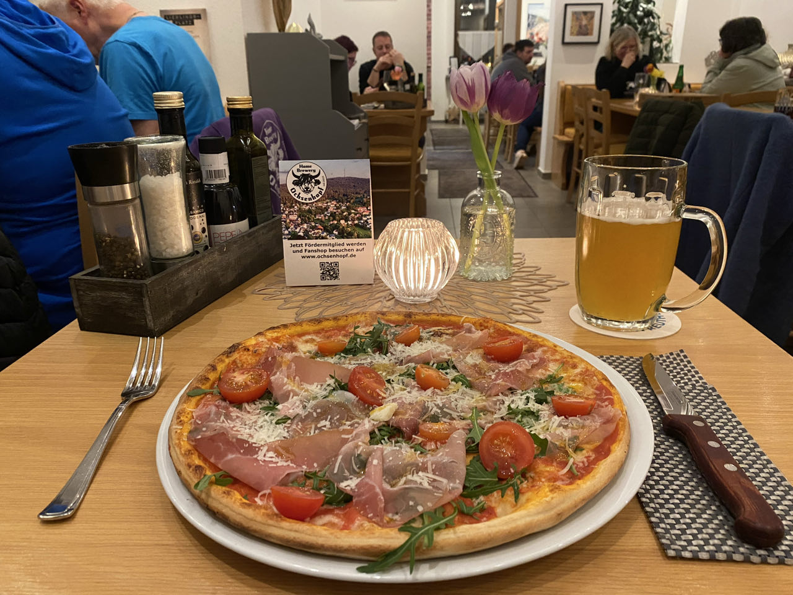
  </a>
  <a href="bischofsgrun_221006836__photos__8f707f9d-1638-4bbc-aaf3-7eb2520b0d09_43092c63-feb5-408d-b2f7-becff8868ffe.jpg.jpg" class="step-thumb-link" data-gallery="step-221006836" data-index="2">
    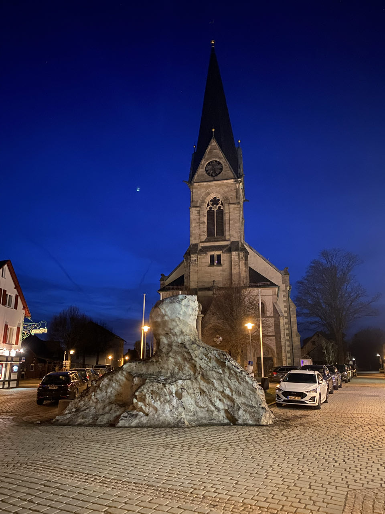
  </a>

