## Überblick

Grand Tour for a week vom 23.05.2026 bis 31.05.2026.

## Etappen

### Tag 1 - 23.05.2026

#### Etappe: Bad Waldsee

Abfahrt um 9 Uhr für eine Cabriotour für eine gute Woche mit remote work 🧑‍💻 
Autobahn bis kurz nach Ulm, dann wurde es mit dem Pfingstreiseverkehr dichter - also runter von der Autobahn und kleinere Straßen gesucht, und gefunden. Kreuz und quer Richtung Pfänder ⛰️ bei Bregenz.

  <a href="haslach-im-kinzigtal_235768564__photos__db10724d-35eb-4f3f-bcff-592d3447b31e_d1a3a114-ff1a-4064-9d51-664b4b34963b.jpg.jpg" class="step-thumb-link" data-gallery="step-235768564" data-index="1">
    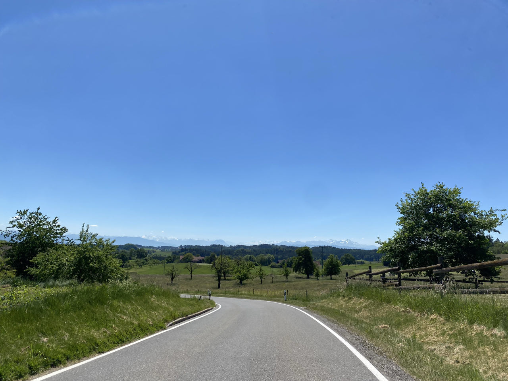
  </a>
  <a href="haslach-im-kinzigtal_235768564__photos__b2e1ec22-b92d-4465-8147-22a7fe038ec7_6d1f8d65-122a-492d-9a5a-d46377c71694.jpg.jpg" class="step-thumb-link" data-gallery="step-235768564" data-index="2">
    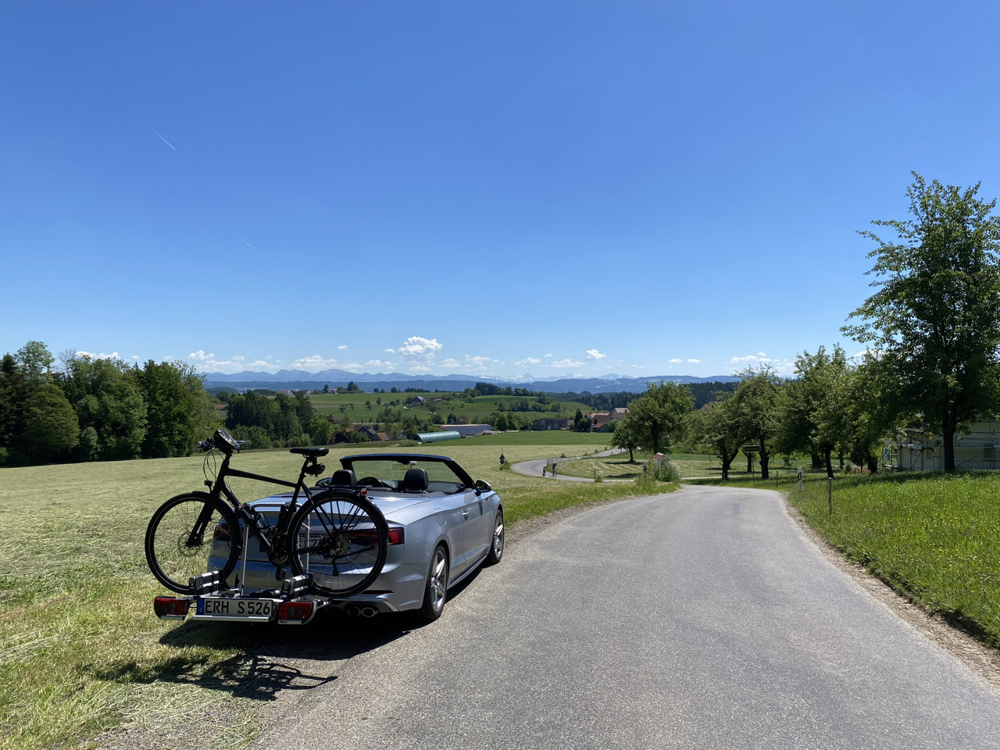
  </a>

#### Etappe: Bregenz

Kaffeepause in Bregenz, ich habe den Pfänder, aber auch den langen Pfändertunnel ausgelassen. Schönes schattiges Café Wunderkind ☕️🍰👩‍🍳
Dann noch mal nachtanken, Österreich ist ja etwas günstiger.

  <a href="bregenz_235769275__photos__2e6333e5-6468-4ac9-a1a2-b79fae2cf020_fde973f1-b92c-4845-9cb1-85f8c12d753c.jpg.jpg" class="step-thumb-link" data-gallery="step-235769275" data-index="1">
    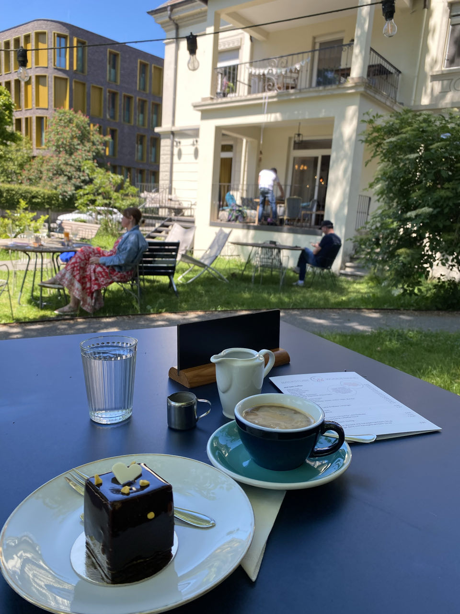
  </a>
  <a href="bregenz_235769275__photos__317af54e-955f-4bcc-85c8-c9b6da79af51_a521dc42-d221-4de7-8114-840ca0f63483.jpg.jpg" class="step-thumb-link" data-gallery="step-235769275" data-index="2">
    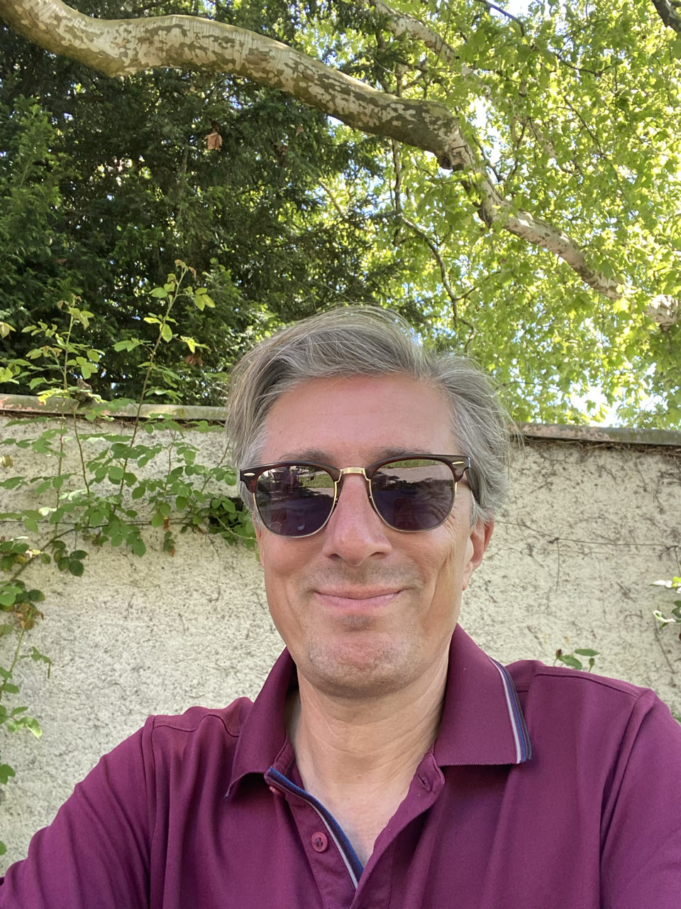
  </a>

#### Etappe: Davos

Die Zeit fliegt dahin, aber heute hab ich’s nicht eilig, noch nichts gebucht. Nach etwas Autobahn in der Schweiz ging es links ab nach Davos. Der Davosersee sah interessant aus, also schnell auf den Parkplatz. 
Der Stausee ist sehr leer, was man an dem frei in die Luft ragenden Steg sehen kann 😅

  <a href="davos_235771513__photos__a7d3f033-de03-443b-b44a-551ec31d7d25_e533e23e-9eab-4d23-b9f8-221455e0aff6.jpg.jpg" class="step-thumb-link" data-gallery="step-235771513" data-index="1">
    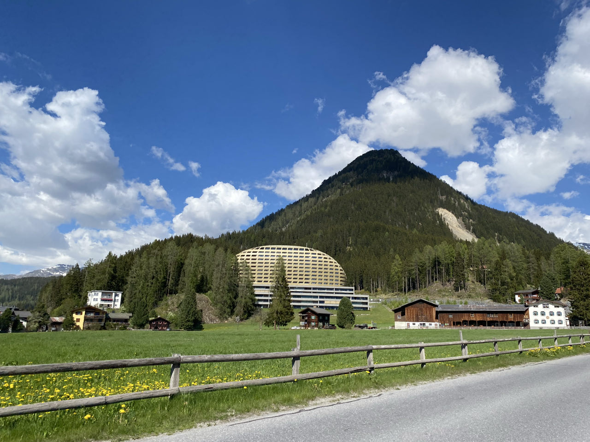
  </a>
  <a href="davos_235771513__photos__0ab17d3b-d64a-4ec0-9543-33aff862fd87_e172ddb2-aabf-44a2-a701-ca97b2de07c8.jpg.jpg" class="step-thumb-link" data-gallery="step-235771513" data-index="2">
    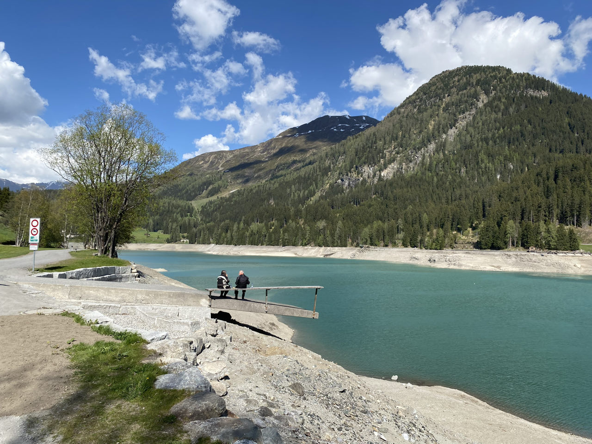
  </a>
  <a href="davos_235771513__photos__772acc31-35dd-4f72-b842-e4bab73e5dc1_c952d238-d684-42f6-852b-a7f8403e2a52.jpg" class="step-thumb-link" data-gallery="step-235771513" data-index="3">
    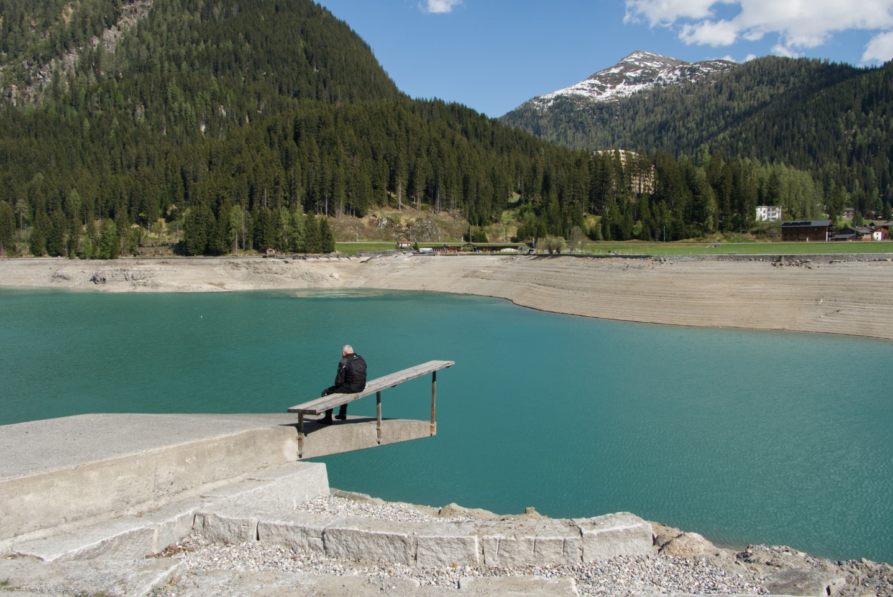
  </a>
  <a href="davos_235771513__photos__38577f55-ca47-4c9c-a9d7-20db4cb4e192_620758ec-566e-4b5a-8721-57553c663ae5.jpg.jpg" class="step-thumb-link" data-gallery="step-235771513" data-index="4">
    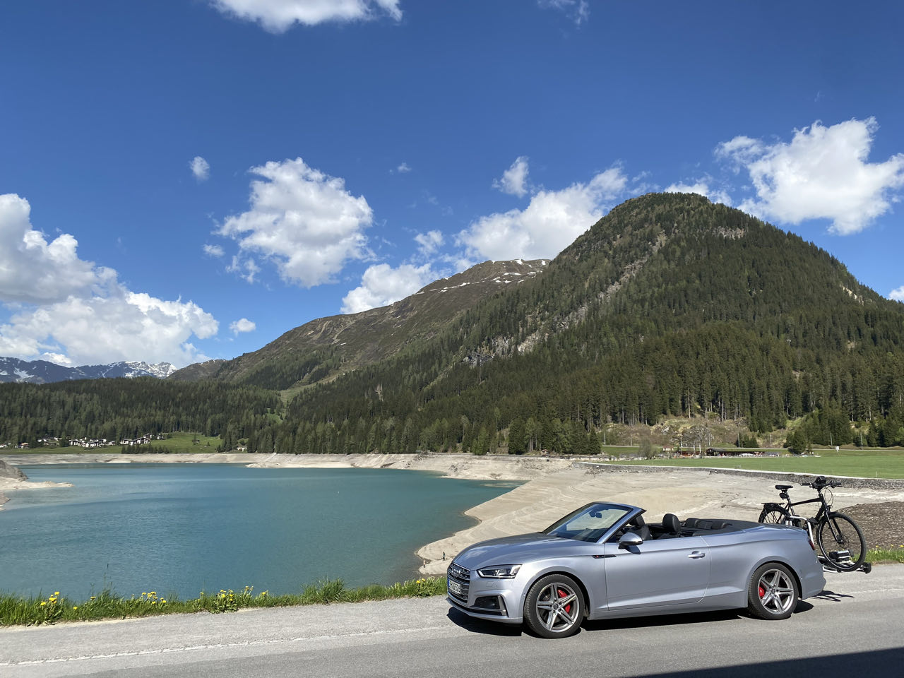
  </a>
  <a href="davos_235771513__photos__0235ab44-60aa-46ca-a9b8-3384b9c24f66_32f4b9b1-6969-4f3b-8c78-7cd6c6a0389c.jpg.jpg" class="step-thumb-link" data-gallery="step-235771513" data-index="5">
    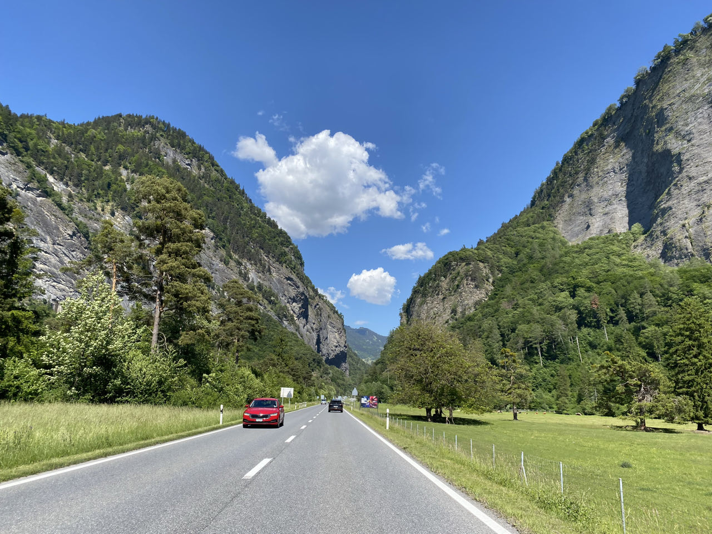
  </a>
  <a href="davos_235771513__photos__422eb3eb-f3ab-4b1f-b956-58f39e5afbda_0bc11fae-c763-4185-8c66-68614503e9fc.jpg.jpg" class="step-thumb-link" data-gallery="step-235771513" data-index="6">
    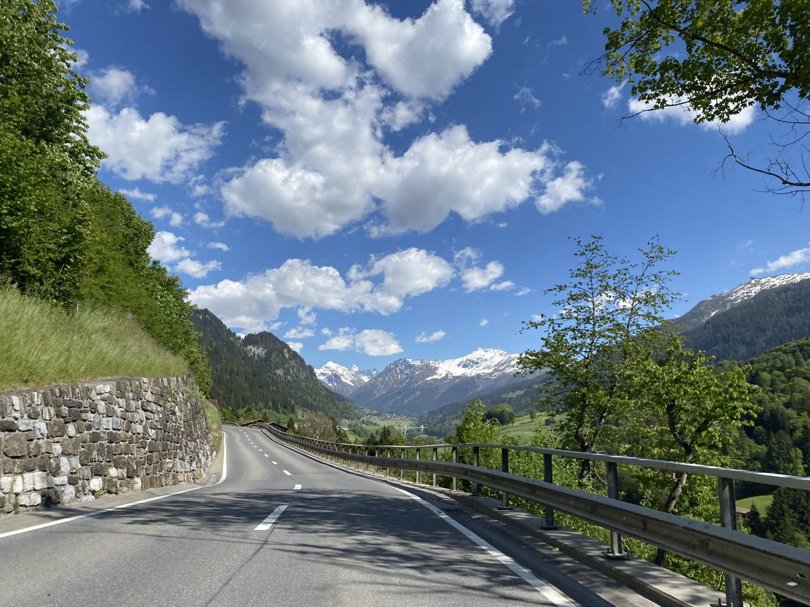
  </a>

#### Etappe: Flüelapass

Weiter hoch zum Flüelapass auf über 2300hm. Traumhaftes Wetter, die erste Wölkchen kamen auch. Der Schnee vom Winter ist immer noch beeindruckend, aber die Straßen lassen sich ohne Probleme mit Sommerreifen fahren.

  <a href="zernez_235772891__photos__42f16658-71fd-4d94-9c18-0db130346e2d_f6ebc177-fc24-4f89-9978-3ecb79f9ab12.jpg.jpg" class="step-thumb-link" data-gallery="step-235772891" data-index="1">
    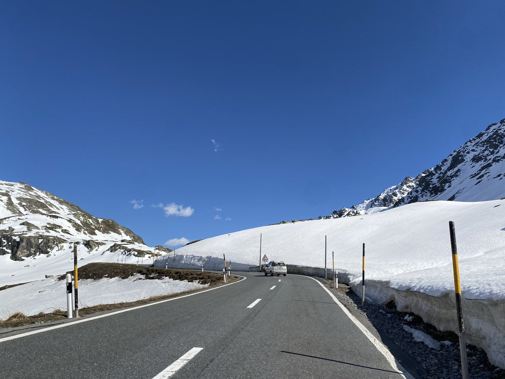
  </a>
  <a href="zernez_235772891__photos__ad6a9135-62e0-4ce4-9c4d-e11787aab0c8_cbe4ed71-8054-48b9-b4f8-d79ff61d8896.jpg.jpg" class="step-thumb-link" data-gallery="step-235772891" data-index="2">
    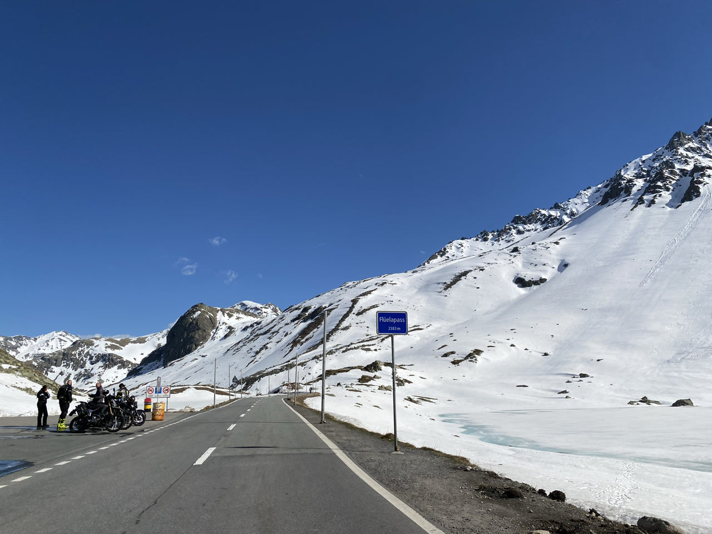
  </a>
  <a href="zernez_235772891__photos__0357122c-3e7d-4cb2-a5ae-4752375c93a0_5de3abe0-b464-490f-a128-55d50a04937e.jpg.jpg" class="step-thumb-link" data-gallery="step-235772891" data-index="3">
    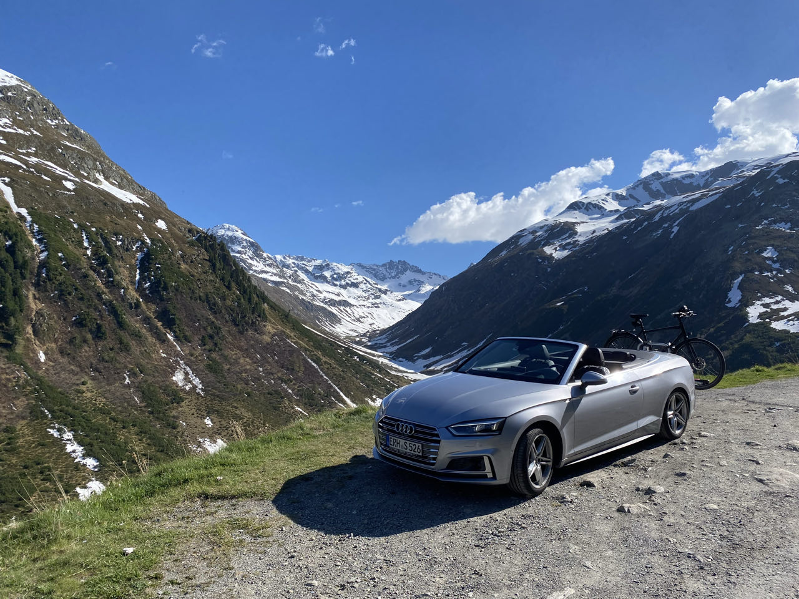
  </a>
  <a href="zernez_235772891__photos__e6e49fa3-bbf4-4e75-96f3-60bc023f7432_5cc0b26b-e118-48b8-b472-42dde1bb7bf2.jpg.jpg" class="step-thumb-link" data-gallery="step-235772891" data-index="4">
    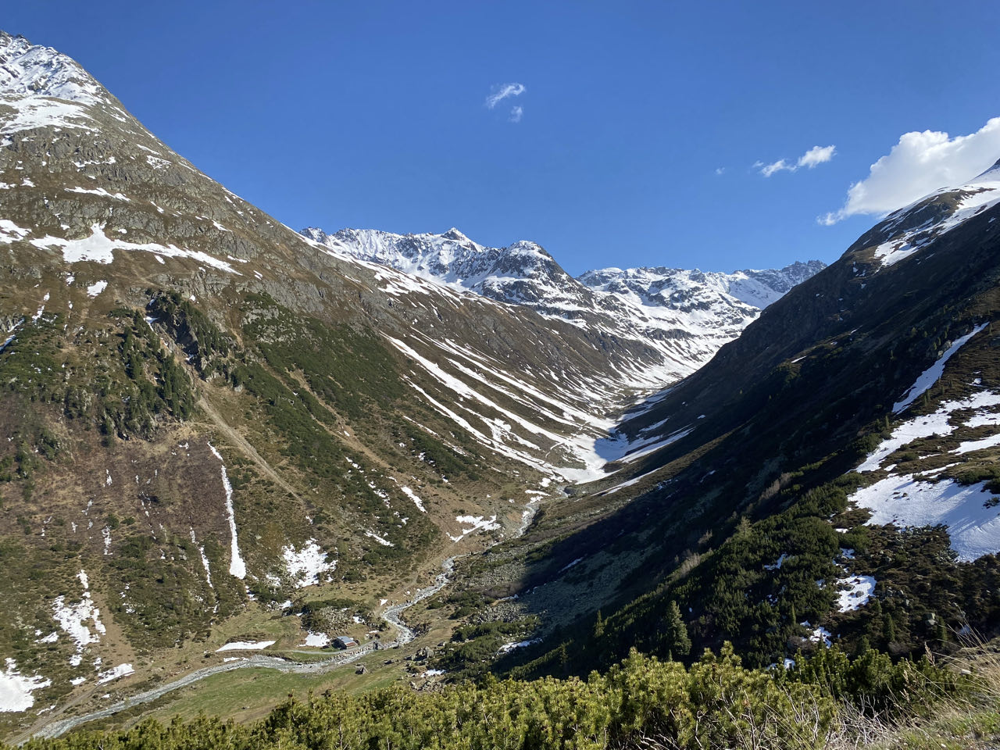
  </a>
  <a href="zernez_235772891__photos__8f70edaf-b7d0-4644-8c8f-6630e80aa178_212fb9d1-d888-448c-825c-10bcbe873ab1.jpg.jpg" class="step-thumb-link" data-gallery="step-235772891" data-index="5">
    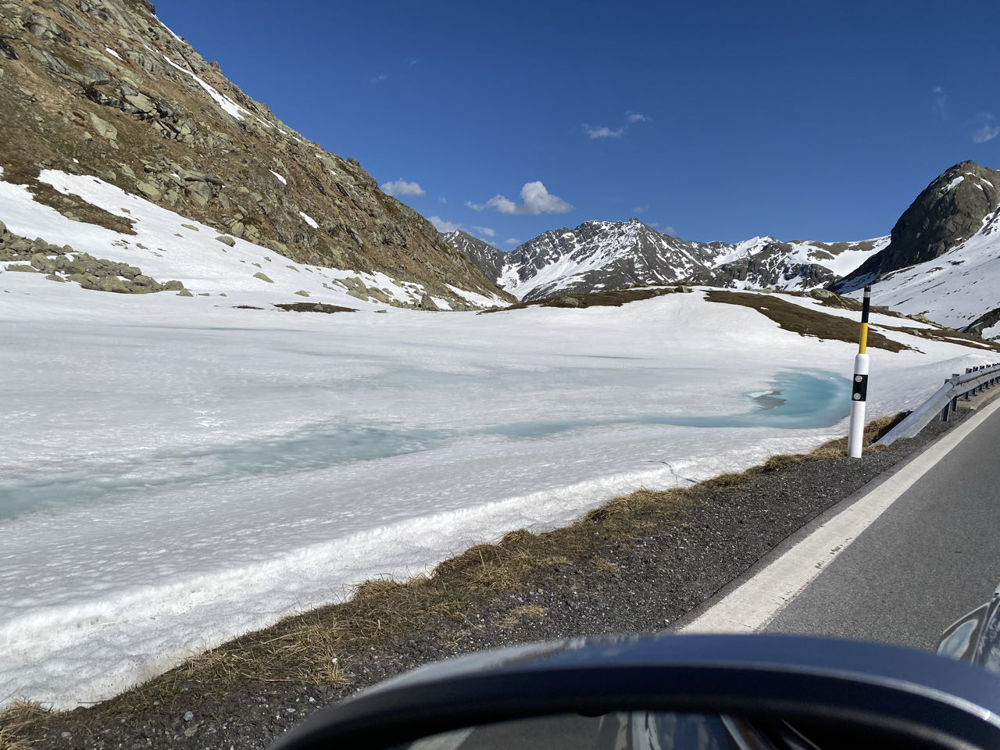
  </a>

#### Etappe: Berninapass

Und gleich geht’s weiter zum nächsten Highlight, den Berninapass. Auch hier weiterhin das Verdeck offen, die Scheiben hoch und am Pass doch mal kurz die Jacke angezogen, weil etwas Wind ging. 
Irgendwann muss ich hier auch mal die Räthische Bahn mit dem Berninaexpress fahren mit den zig Viadukten.

  <a href="passo-del-bernina_235774358__photos__87487801-284a-42e5-be63-577fc098907b_ff3aa75b-5794-4046-8557-190d9fe405f4.jpg.jpg" class="step-thumb-link" data-gallery="step-235774358" data-index="1">
    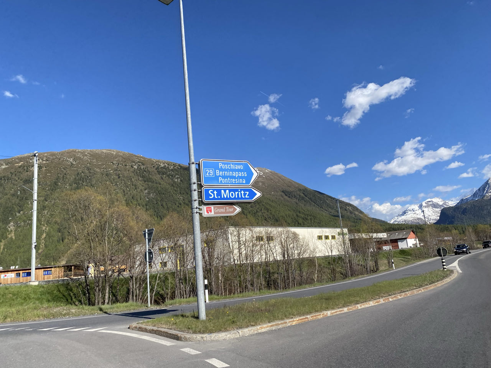
  </a>
  <a href="passo-del-bernina_235774358__photos__a38f9874-f286-4897-be08-99a0177d3a86_9dba1066-3216-499e-b292-7decb4bb89ce.jpg.jpg" class="step-thumb-link" data-gallery="step-235774358" data-index="2">
    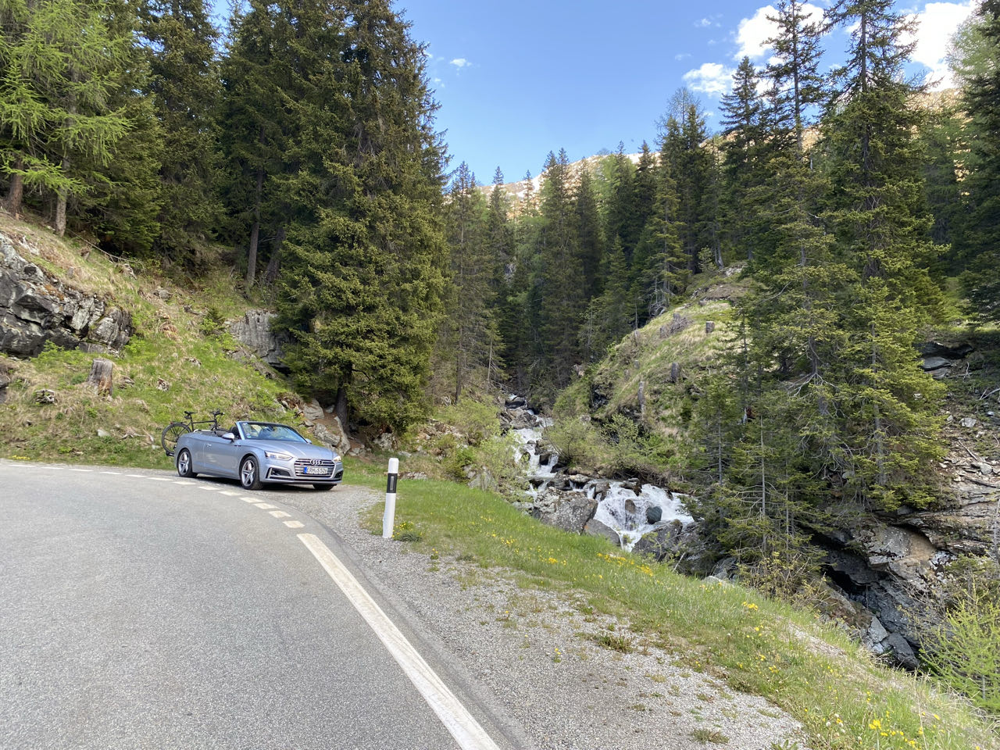
  </a>
  <a href="passo-del-bernina_235774358__photos__6e32bac5-2c0e-4e95-be96-4a342a72a294_9a2d945c-00c9-4fc2-a280-02e131db8500.jpg.jpg" class="step-thumb-link" data-gallery="step-235774358" data-index="3">
    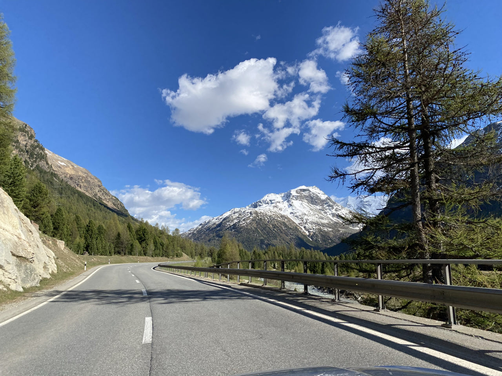
  </a>
  <a href="passo-del-bernina_235774358__photos__b3828314-beb6-4d3f-b81b-ff71a35c56ce_73aa805f-c6b7-4287-9502-4919556f48f6.jpg.jpg" class="step-thumb-link" data-gallery="step-235774358" data-index="4">
    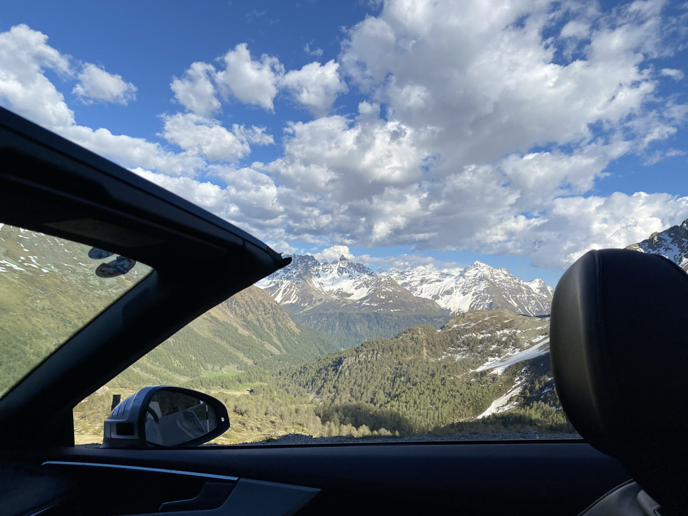
  </a>
  <a href="passo-del-bernina_235774358__photos__c5dcb71c-61e6-4865-b55a-82da0a4871b5_2a13246b-5abc-4e86-ae5a-760cea886aec.jpg.jpg" class="step-thumb-link" data-gallery="step-235774358" data-index="5">
    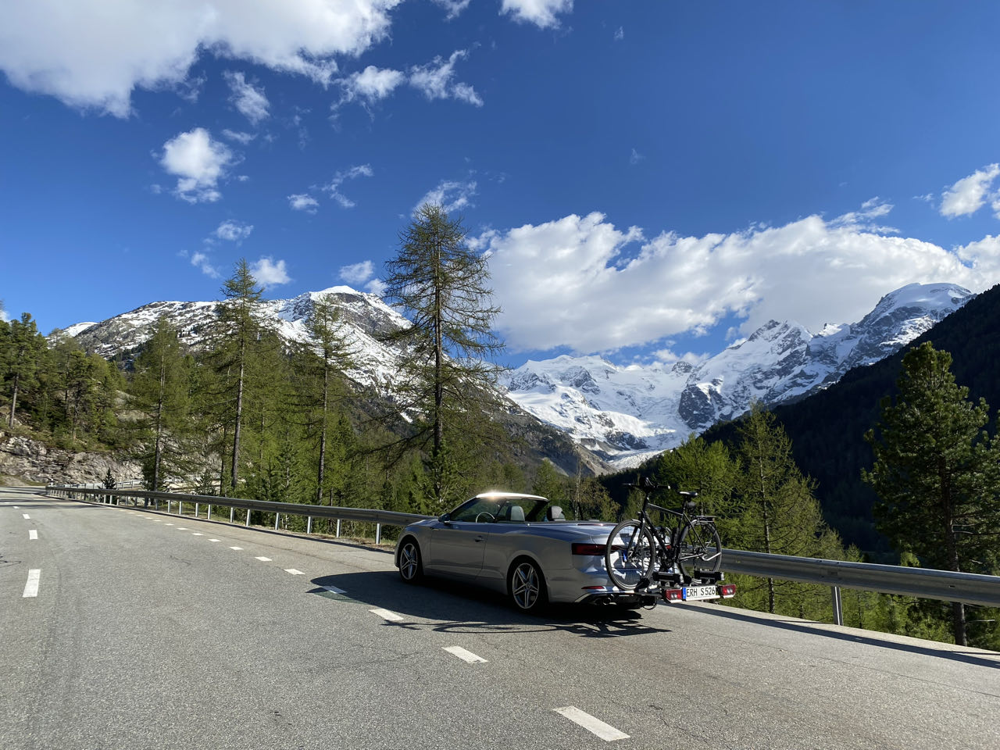
  </a>
  <a href="passo-del-bernina_235774358__photos__5fdf81dc-91be-4a61-8783-c103ec596091_2375d47b-9d86-4c23-82dd-d086d43fa8bb.jpg.jpg" class="step-thumb-link" data-gallery="step-235774358" data-index="6">
    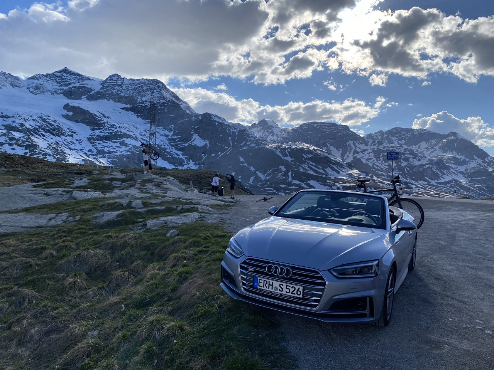
  </a>

#### Etappe: Tirano

Abends nach dem Berninapass wollte ich es noch bis Italien schaffen. Schon mal nach Hotels gesucht und bis wann man einchecken kann. Kurz hinter Tirano wurde ich fündig. Im Tal kam nochmal kurz die Abendsonne durch. Hotel mit Restaurant und mit etwas Missverständnissen hab ich wohl eine ganz Flasche Wein und wohl auch einen Gang zu viel bestellt. Alles super lecker und ich muss ja nur noch ins Bett plumsen. 
Eine grandiose Tour, die sich so im
Laufe des Tages so ergeben hat. Bis zum
Iseosee hab ich’s nicht geschafft, das war mir aber schon in Bregenz klar geworden. Egal, es war super. 👍 
Dann geht es eben morgen weiter.

  <a href="tirano_235775714__photos__24f450d3-b9d8-4dd4-9a18-7b68ff49dcc6_bd6014c3-538e-4147-b756-4a0e45e5c5af.jpg.jpg" class="step-thumb-link" data-gallery="step-235775714" data-index="1">
    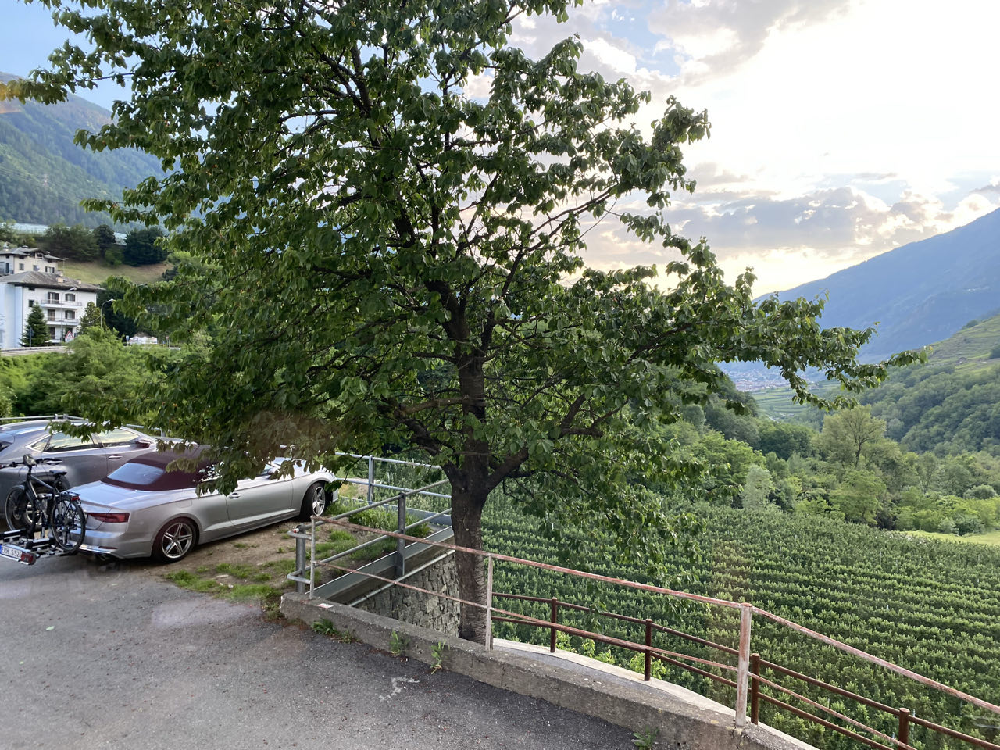
  </a>
  <a href="tirano_235775714__photos__5d496f6d-61df-4daa-9a26-4bb03c0238bf_7ab59385-7c3d-4fa9-889f-1b2b0b728f7c.jpg.jpg" class="step-thumb-link" data-gallery="step-235775714" data-index="2">
    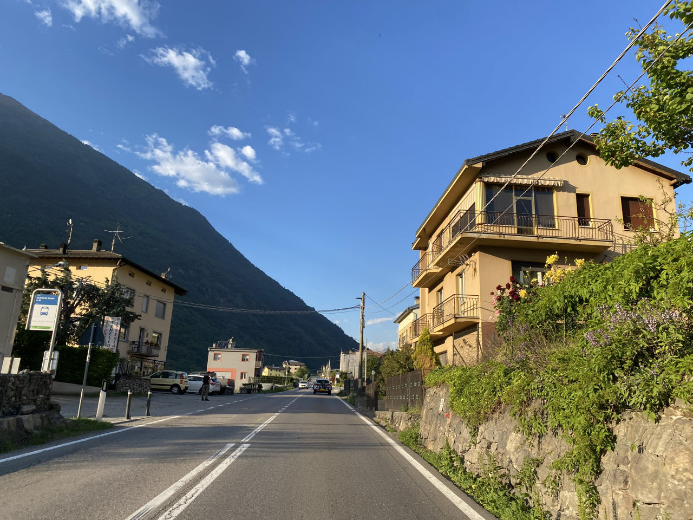
  </a>
  <a href="tirano_235775714__photos__c2c272aa-e932-48a0-af58-accbbe088bdf_626473dc-8e6e-4b32-88d8-4a7fd5352c70.jpg.jpg" class="step-thumb-link" data-gallery="step-235775714" data-index="3">
    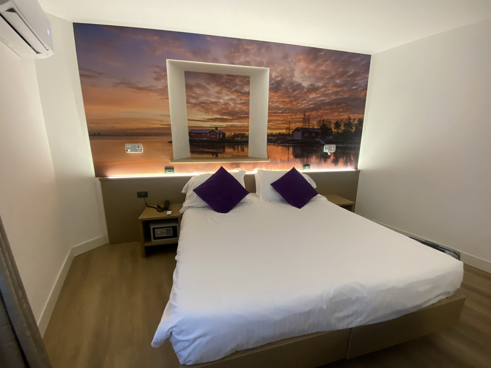
  </a>
  <a href="tirano_235775714__photos__3b263513-ebb5-4587-81de-253dd6831198_3c1deae0-999e-4c16-9406-6a50e8982530.jpg.jpg" class="step-thumb-link" data-gallery="step-235775714" data-index="4">
    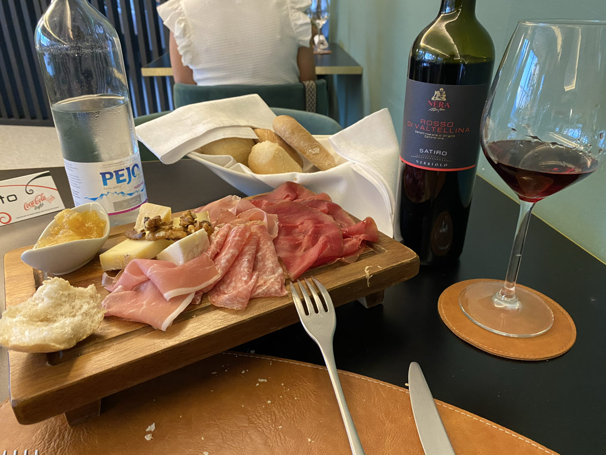
  </a>
  <a href="tirano_235775714__photos__3e4c517f-7906-47a5-8923-0d03bbbc9808_37a72367-8988-41e2-a996-e7ccbb39cce8.jpg.jpg" class="step-thumb-link" data-gallery="step-235775714" data-index="5">
    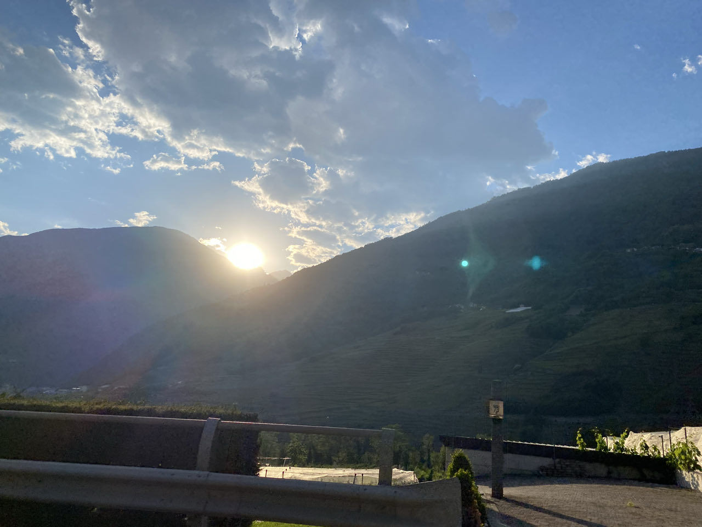
  </a>
  <a href="tirano_235775714__photos__24ed1ec7-a224-4ed2-b43a-4044e1cea715_2ab4a64f-e853-444b-beb4-cf46a37aff8e.jpg.jpg" class="step-thumb-link" data-gallery="step-235775714" data-index="6">
    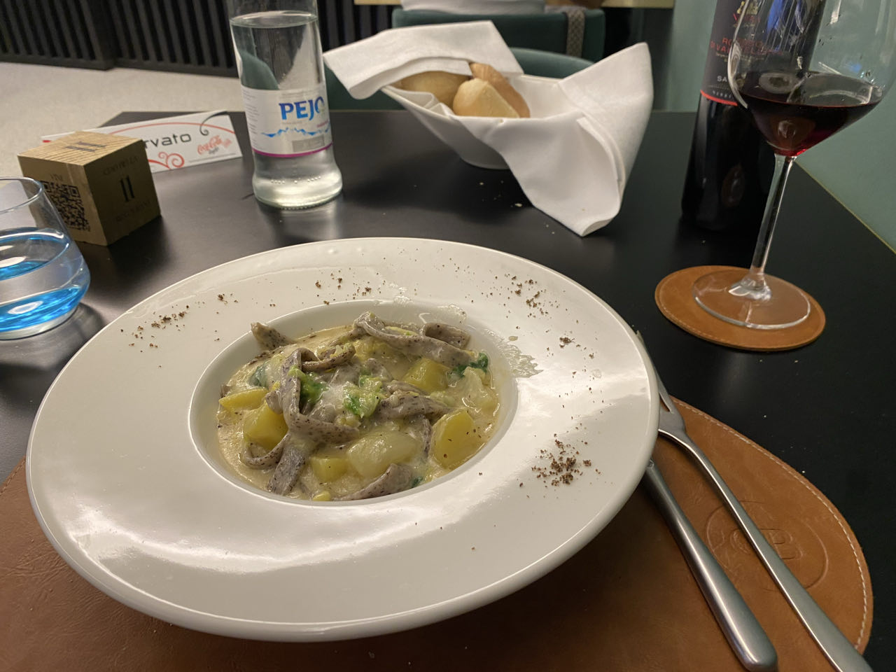
  </a>

### Tag 2 - 24.05.2026

#### Etappe: Passo del Mortirolo

Nach einem guten Frühstück ging es bei sonnigwarmem Wetter los. Ich wollte gleich den Mortirolopass fahren, eine tolle Strecke, eher einspurig ohne Begrenzungen. Früh sind nur weniger Radfahrer unterwegs, die Vögel zwitschern überall und es war eine gemütliche Auffahrt.
Auf der anderen Seite runter kamen dann die vielen Motorräder und Cabrios hochgefahren :-)

  <a href="passo-del-mortirolo_236009492__photos__6106d81b-4305-4394-96ab-f3511f3744be_f8de8c9b-7bf4-4d3b-ab6e-2e0c715227d8.jpg" class="step-thumb-link" data-gallery="step-236009492" data-index="1">
    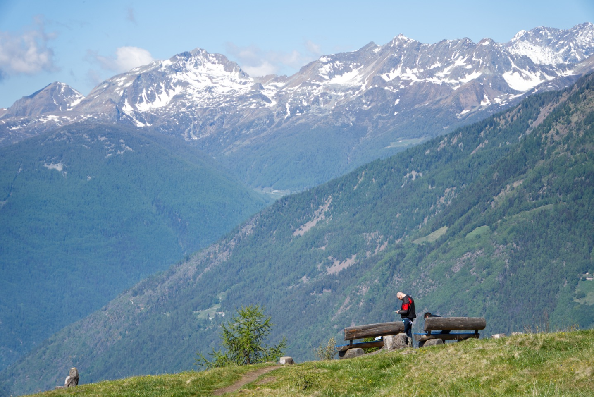
  </a>
  <a href="passo-del-mortirolo_236009492__photos__dffc9f10-67d7-48a2-a2a7-91caca6a6a13_eea8c7cb-4e38-4ad0-9184-cc8dcdafb177.jpg" class="step-thumb-link" data-gallery="step-236009492" data-index="2">
    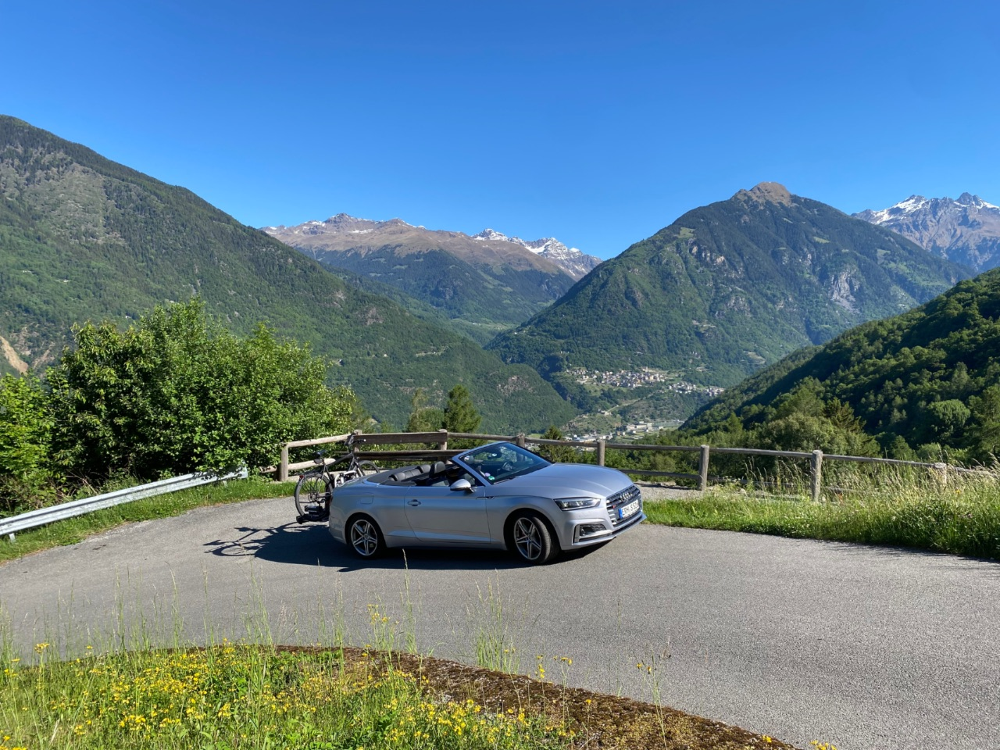
  </a>
  <a href="passo-del-mortirolo_236009492__photos__25388a34-3202-4da0-b90c-da635ae254a9_79efe3ad-3153-499d-bd93-a5ce16bcf590.jpg" class="step-thumb-link" data-gallery="step-236009492" data-index="3">
    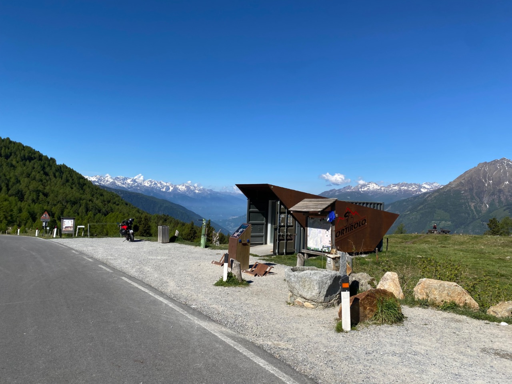
  </a>
  <a href="passo-del-mortirolo_236009492__photos__2c93f28d-9c9f-44cd-8e24-6abf39bc1fa5_60203a10-0932-40c5-ae20-c307534cf865.jpg" class="step-thumb-link" data-gallery="step-236009492" data-index="4">
    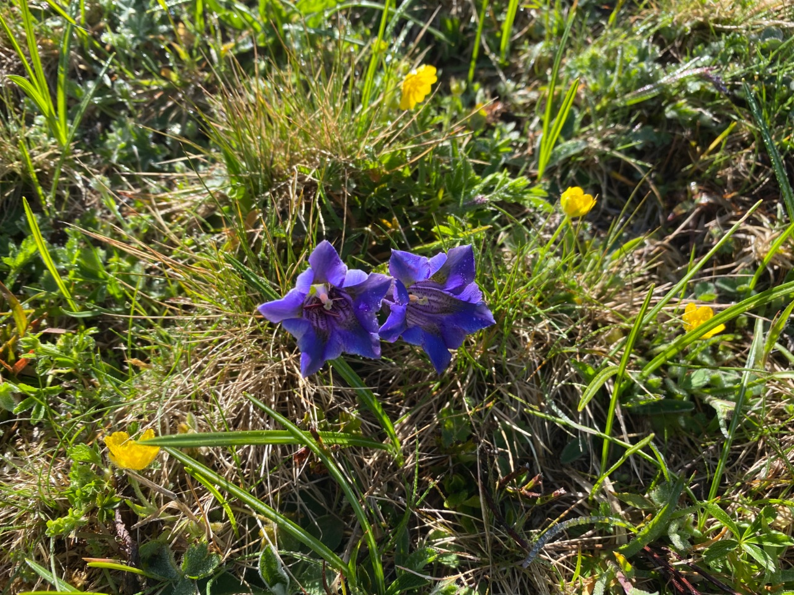
  </a>
  <a href="passo-del-mortirolo_236009492__photos__de59f0dc-b6e3-4c08-b05e-729b2a08fa6e_2bb8958e-5433-49af-9eab-0674c112395f.jpg" class="step-thumb-link" data-gallery="step-236009492" data-index="5">
    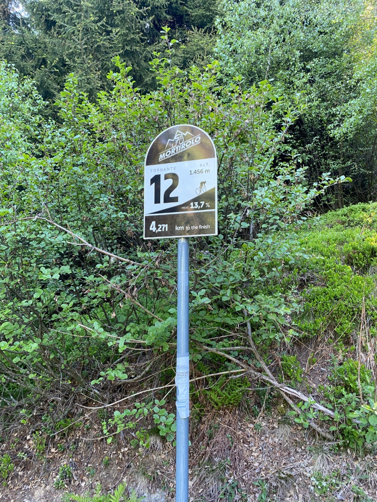
  </a>
  <a href="passo-del-mortirolo_236009492__photos__7d62fe45-1406-470c-b312-afa06e0da7ea_1c7cdf82-f064-4a32-84c2-20794c498098.jpg" class="step-thumb-link" data-gallery="step-236009492" data-index="6">
    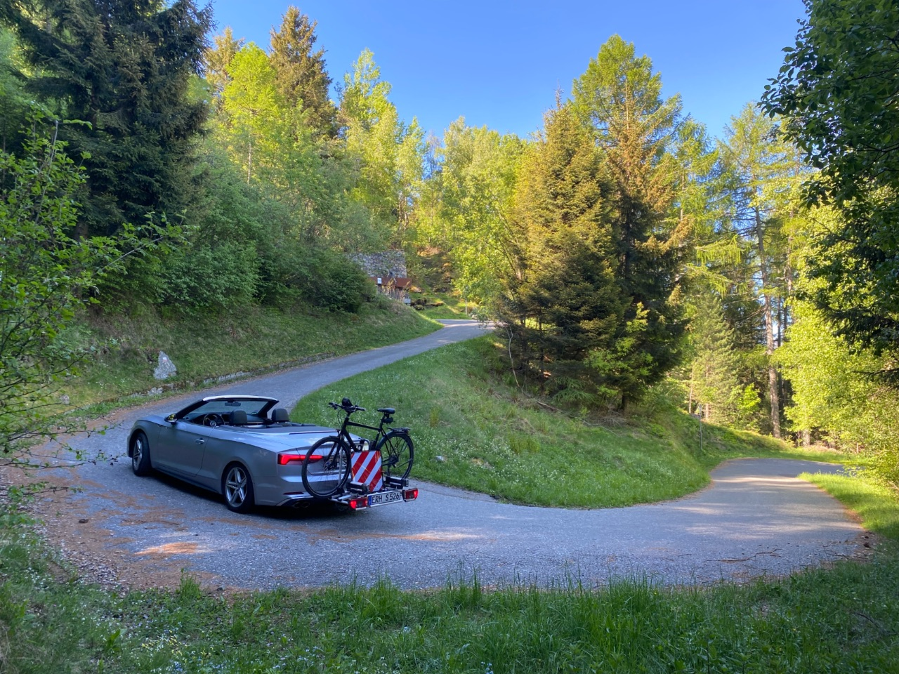
  </a>
  <a href="passo-del-mortirolo_236009492__photos__df6636d2-35b2-44e3-b722-60375543f128_05478619-0a61-4af4-88d2-e39fcfd82d4a.jpg" class="step-thumb-link" data-gallery="step-236009492" data-index="7">
    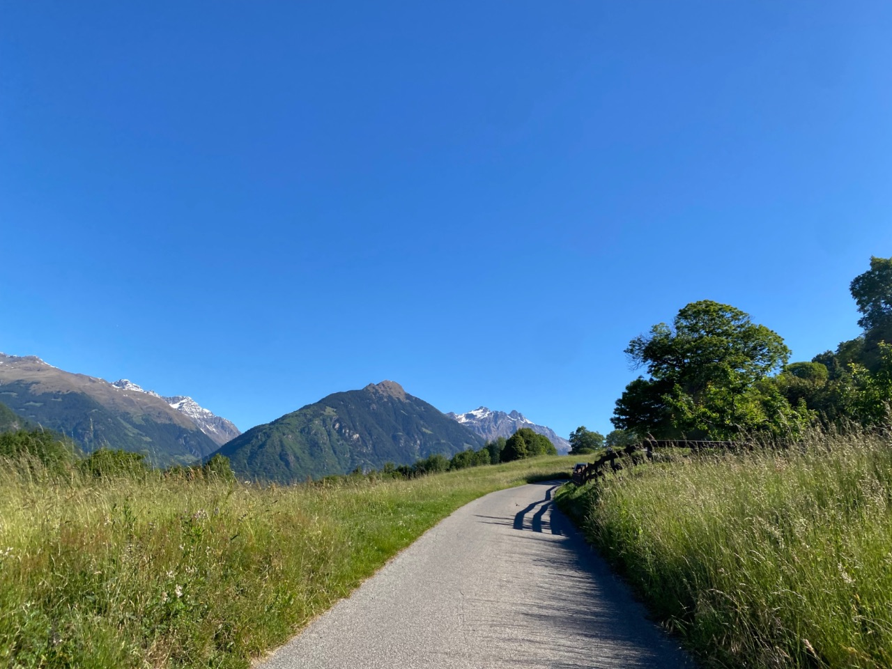
  </a>

#### Etappe: Iseosee

Weiter geht die Fahrt Richtung Iseosee. Dort hab ich eine kurzen Mittagsstopp gemacht und bin dort auch wieder auf Pässejagd gegangen mit ein paar schönen Ausblicken runter auf den See.

  <a href="iseosee_236010208__photos__26dbea16-ce71-4785-a3ef-611044ae6dc9_e228514f-bd54-4937-9b3b-c89f52dfd9a2.jpg" class="step-thumb-link" data-gallery="step-236010208" data-index="1">
    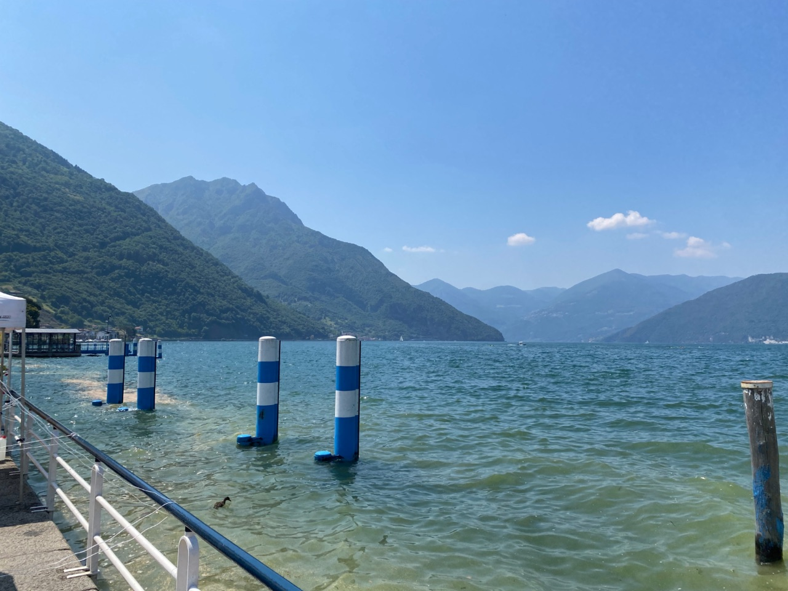
  </a>
  <a href="iseosee_236010208__photos__aa2f0d75-e806-4f18-aff6-e2017c7c3a4a_e13e29c2-4315-4e0e-88ae-e3c4691b8099.jpg" class="step-thumb-link" data-gallery="step-236010208" data-index="2">
    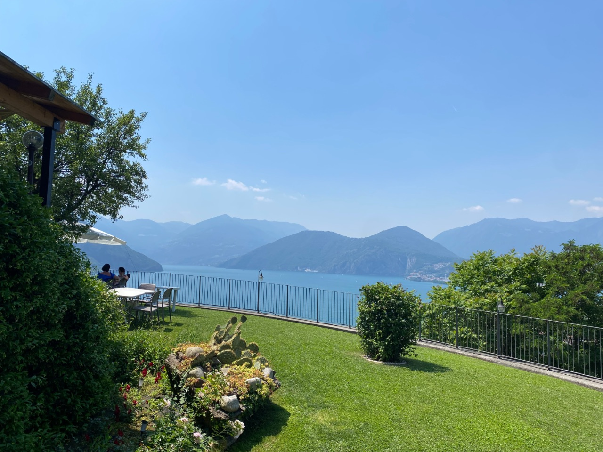
  </a>
  <a href="iseosee_236010208__photos__edf40494-c32b-456f-a81c-5a07db7d7b9e_a8926d5a-14b8-4d09-bb1e-c09a3943478b.jpg" class="step-thumb-link" data-gallery="step-236010208" data-index="3">
    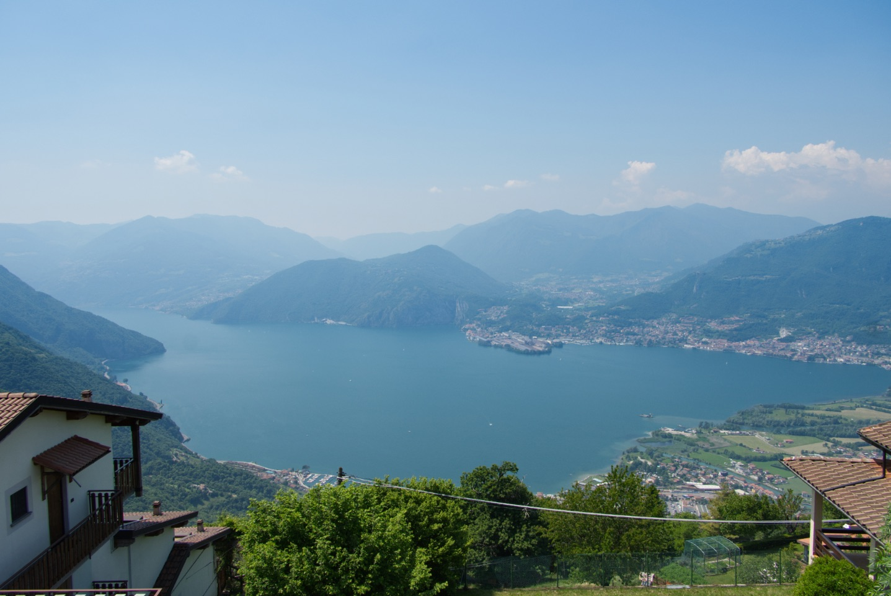
  </a>
  <a href="iseosee_236010208__photos__0a4e463d-772e-4b53-8aef-68a1300db62a_96e416ee-3cf1-4594-b476-a466235767e2.jpg" class="step-thumb-link" data-gallery="step-236010208" data-index="4">
    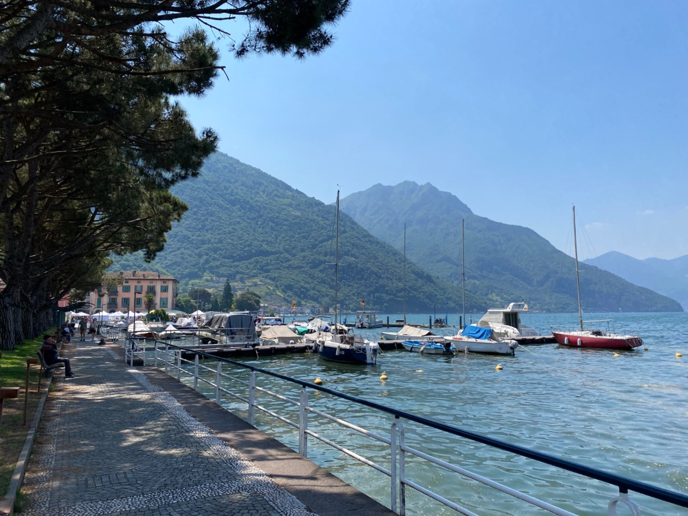
  </a>
  <a href="iseosee_236010208__photos__23c5e4b3-36ea-465d-887d-d4f20e4394a8_79cc9356-36ff-4408-8b62-fe66e780a90e.jpg" class="step-thumb-link" data-gallery="step-236010208" data-index="5">
    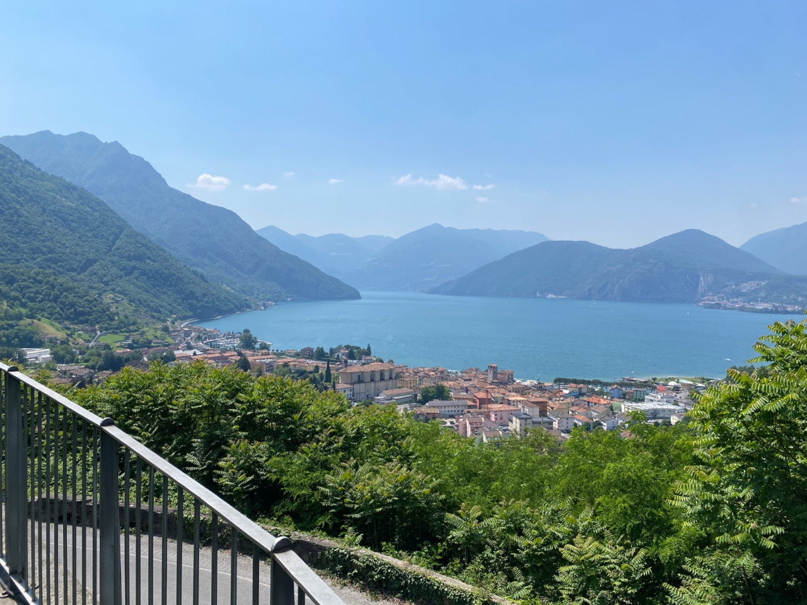
  </a>
  <a href="iseosee_236010208__photos__618754c7-9733-4337-8a6d-115c44552447_251129b9-855e-497a-8ff0-0e49450563f6.jpg" class="step-thumb-link" data-gallery="step-236010208" data-index="6">
    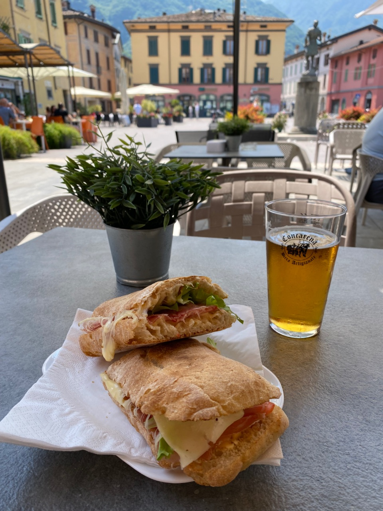
  </a>
  <a href="iseosee_236010208__photos__63e7c6d5-c182-4151-b86a-b4c2f98e0eb2_1570cc35-b614-4f8c-a584-3ab7d75bbbc5.jpg" class="step-thumb-link" data-gallery="step-236010208" data-index="7">
    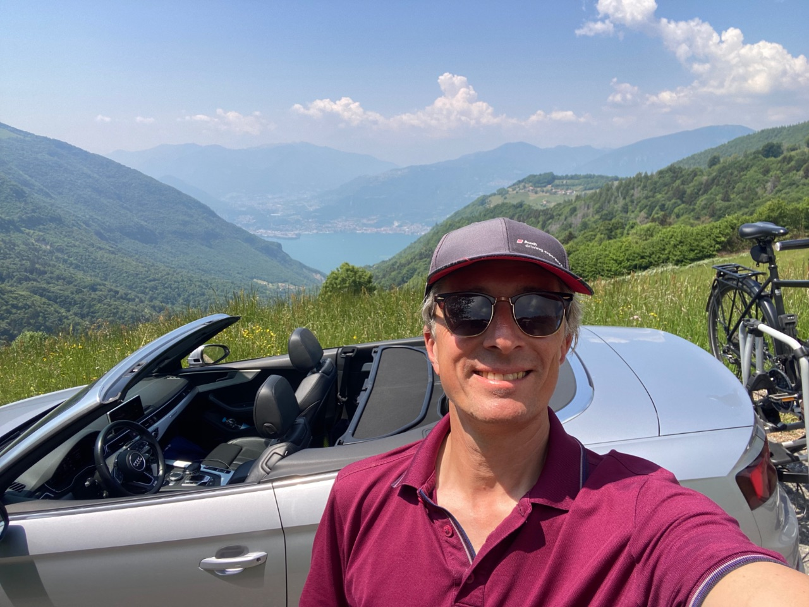
  </a>

#### Etappe: Idrosee und Cascada d'Ampola

Vom Iseosee ging die Fahrt über ewige kurvige kleine Sträßchen bergauf und bergab, bis man dann am Idrosee herauskommt. Oh wie "schön" ist diese Gegend für Motorradfahrer, das spricht sich wohl rum. Im Halbsekundentakt brettern die Motorräder an einem vorbei, so viel Verkehr, da suche ich mir keine Unterkunft hier.

Einen kurzen Abstecher aber noch zu einem schönen Wasserfall auf dem Weg Richtung Gardasee. Der Wasserfall ist gleich neben der Straße schnell zu erreichen. Aber auch hier war die Straße gefüllt mit Motorrädern. 

Da waren mir die drei Stunden auf abgelegenen Bergstraßen lieber als das hier, das ist ja wie am Rummelplatz. :-)

  <a href="iseosee-und-cascada-d-ampola_236011665__photos__0871c3f1-8899-41cf-ad2e-0510f4b00dd3_ffb8db80-303e-4ad8-965e-ccd3a1a47eb3.jpg" class="step-thumb-link" data-gallery="step-236011665" data-index="1">
    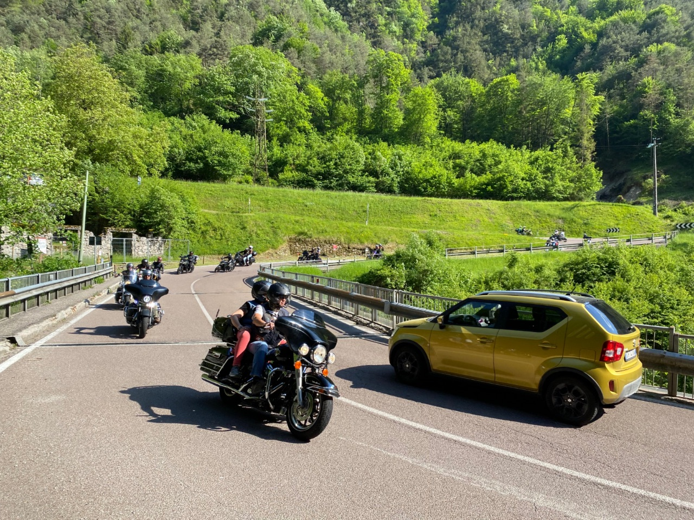
  </a>
  <a href="iseosee-und-cascada-d-ampola_236011665__photos__78978ca5-c7e2-4758-afbb-180c66e4ba7f_e3ce86e8-58e5-492a-8467-d7e11fa8400f.jpg" class="step-thumb-link" data-gallery="step-236011665" data-index="2">
    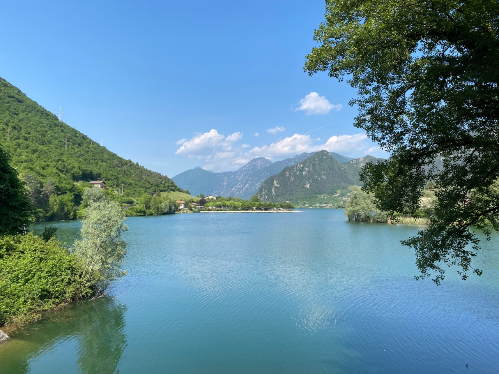
  </a>
  <a href="iseosee-und-cascada-d-ampola_236011665__photos__16363a69-2963-4907-b3ef-f934d7212a71_bcddec58-a90d-40c5-89ac-1ba93da10c9e.jpg" class="step-thumb-link" data-gallery="step-236011665" data-index="3">
    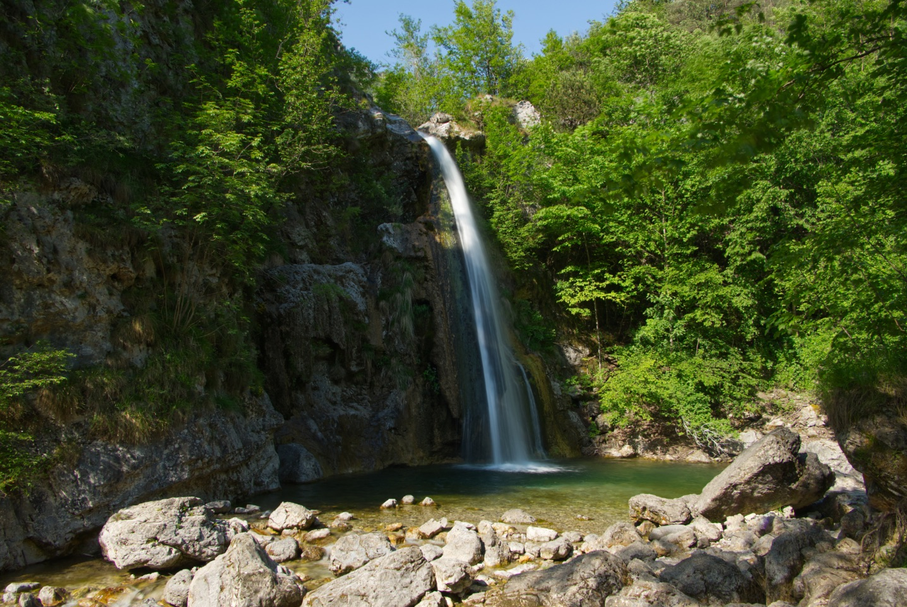
  </a>
  <a href="iseosee-und-cascada-d-ampola_236011665__photos__4b5b51c3-3411-4d9f-bdae-cef8255ed39f_856bb75b-9548-4a65-a6b4-442e88e34f3c.jpg" class="step-thumb-link" data-gallery="step-236011665" data-index="4">
    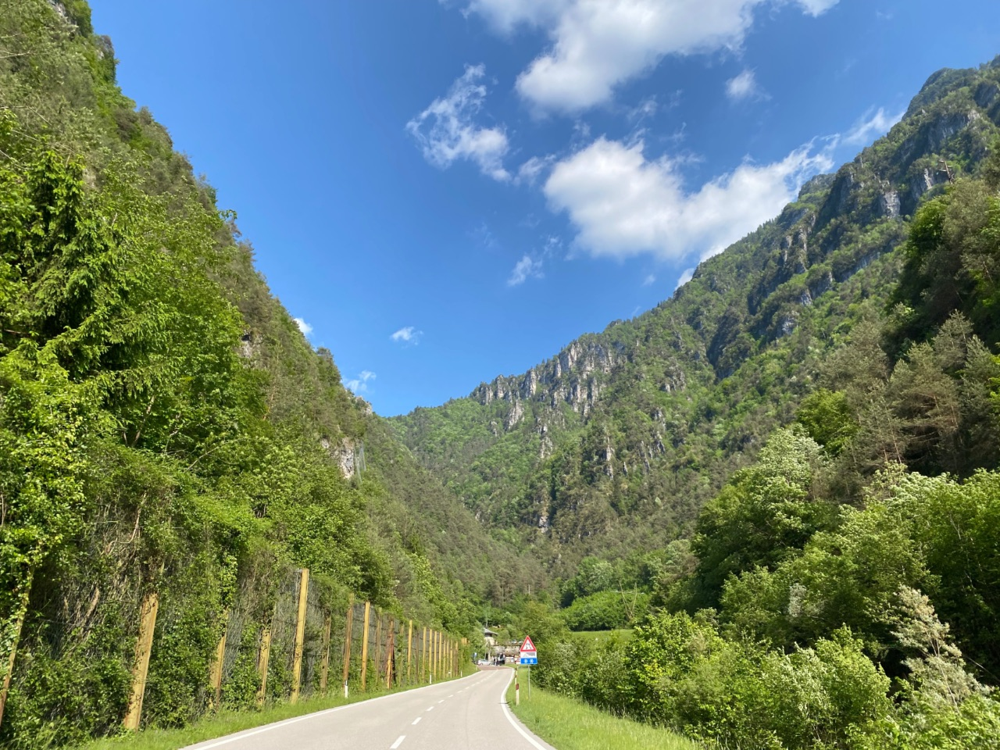
  </a>
  <a href="iseosee-und-cascada-d-ampola_236011665__photos__88ec9bfa-e12d-488f-8cde-ab368f1892b5_6497bc8d-eea5-499a-b61e-7295f7a5b66d.jpg" class="step-thumb-link" data-gallery="step-236011665" data-index="5">
    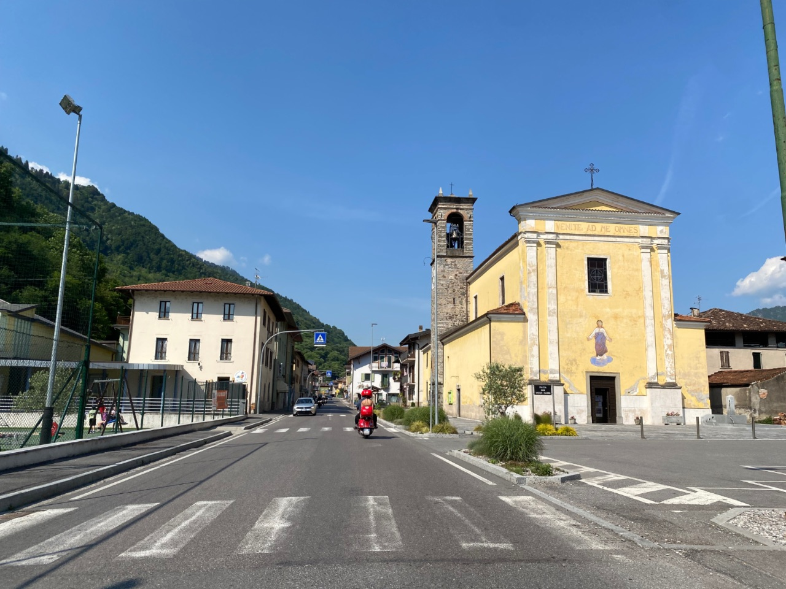
  </a>
  <a href="iseosee-und-cascada-d-ampola_236011665__photos__077715e5-c7f2-4c2e-8eff-fab9e4f1b28d_61732006-3cbf-4702-bc02-10251035ed61.jpg" class="step-thumb-link" data-gallery="step-236011665" data-index="6">
    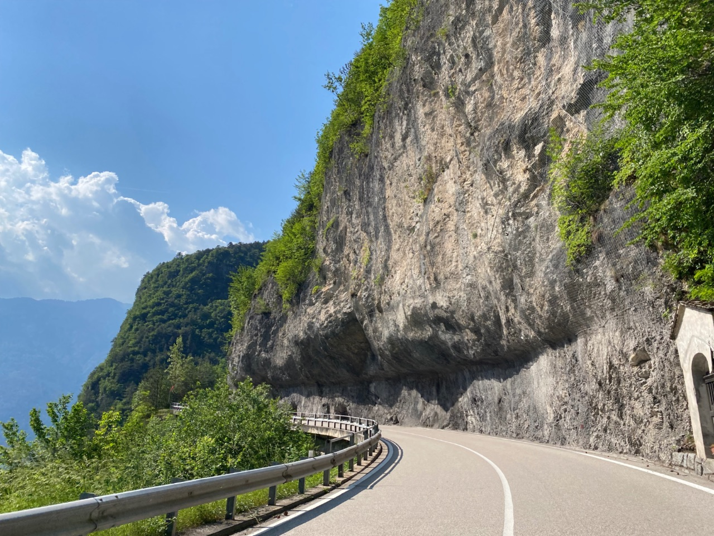
  </a>

#### Etappe: Boniprati

Nach dem Wasserfall hab ich mir eine Unterkunft gesucht. Nur raus hier aus dem dröhnenden Tal dachte ich mir. Etwas ruhiges bitte. Da fand ich ein Haus oben bei Boniprati mit Restaurant. Klingt gut, dann schon mal hochgefahren. Auf der Fahrt kamen dann zwei Anrufe, ich dachte nur, ich bin ja in wenigen Minuten eh da, da brauche ich jetzt nicht rangehen. Oben angekommen, Parkplatz leer, das Haus war zu. Also hab ich dann doch mal zurückgerufen, er hat sich mehrmals entschuldigt, sie haben heute zu und hat mir andere Unterkünfte empfohlen. Kein Problem sagte ich, die Hochfahrt war ja eh schon wieder schön. Und ein Buggy ist auch voll beladen herumgefahren, die hatten auch ihren Spaß.

Letztendlich hab ich mir dann ein Hotel wieder unten im Tal, weiter nördlich gesucht, also hab ich noch eine gemütliche Abfahrt. Diesmal wirklich nur noch einspurig, aber auch hier nur die Einheimischen, die zu ihren Häusern wollten, alles super entspannt. Eine schöne kleine Bergtour, war schon wieder für etwas gut.

  <a href="boniprati_236013047__photos__a5597aeb-b98f-406c-9d7b-57fe3e46fb44_b881b022-5546-4853-b158-2063b7797d6e.jpg" class="step-thumb-link" data-gallery="step-236013047" data-index="1">
    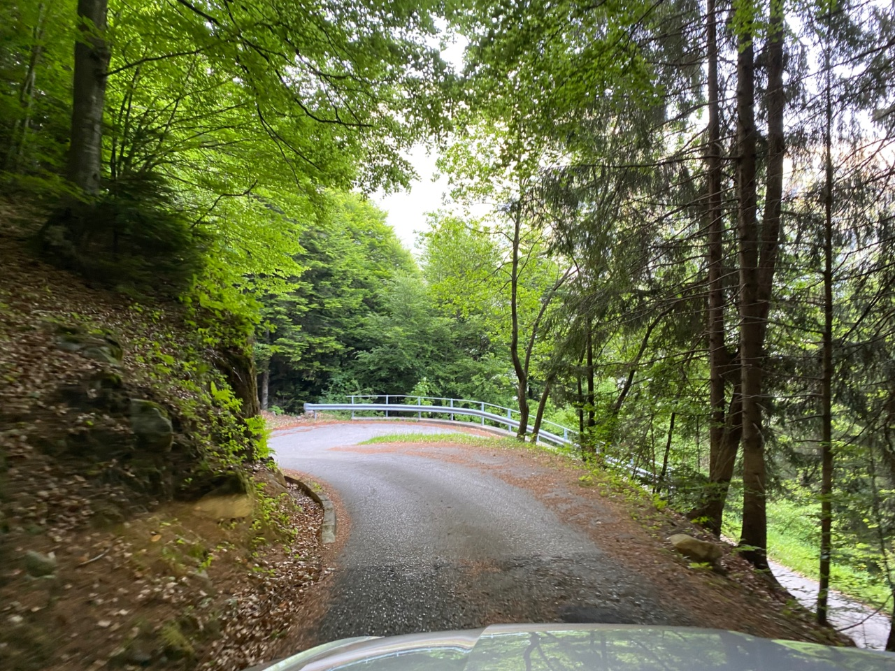
  </a>
  <a href="boniprati_236013047__photos__3d574001-2719-4681-88b4-9fe58b27d2ef_b4441d7c-b26a-45f4-a679-e72a663a2fba.jpg" class="step-thumb-link" data-gallery="step-236013047" data-index="2">
    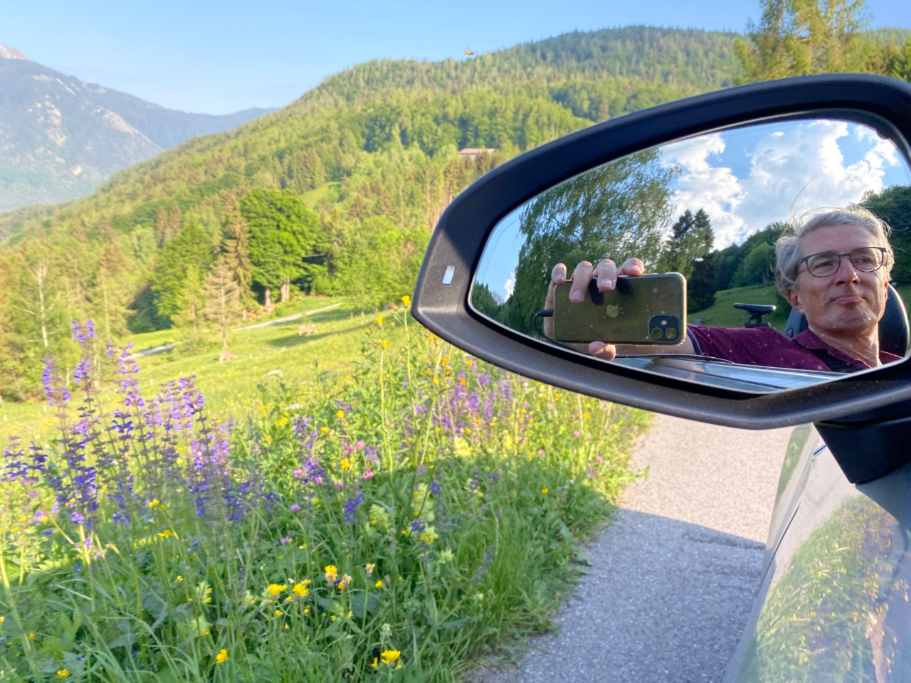
  </a>
  <a href="boniprati_236013047__photos__74fde5d0-66de-4ffc-9cae-dce96b51cef3_77822382-a83f-4d6c-a5ae-ac6824e488dc.jpg" class="step-thumb-link" data-gallery="step-236013047" data-index="3">
    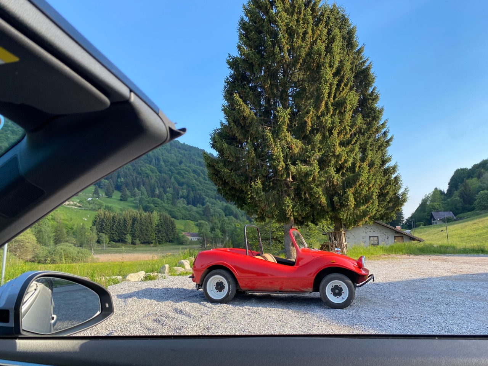
  </a>
  <a href="boniprati_236013047__photos__3f292efe-f39b-4370-83bd-0b87b6be9566_37b73303-e2f0-4604-b727-076361848984.jpg" class="step-thumb-link" data-gallery="step-236013047" data-index="4">
    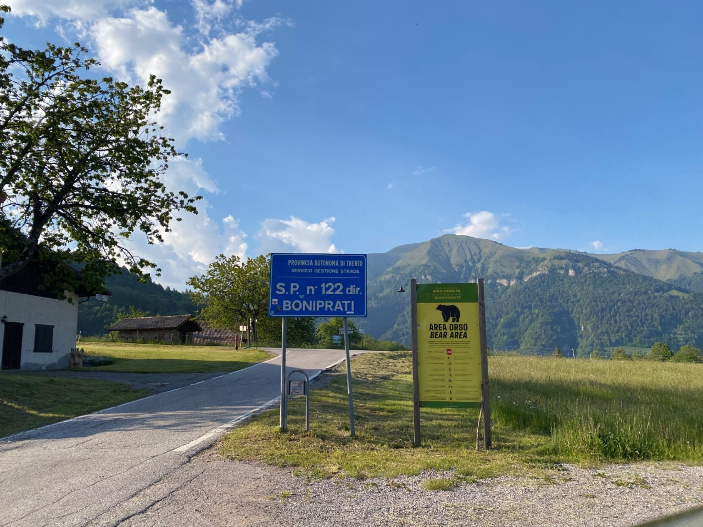
  </a>
  <a href="boniprati_236013047__photos__a4a75120-0729-4c35-82f0-9e20f7507ecc_2e3e91bc-c32e-4721-bdad-d74a3632e78e.jpg" class="step-thumb-link" data-gallery="step-236013047" data-index="5">
    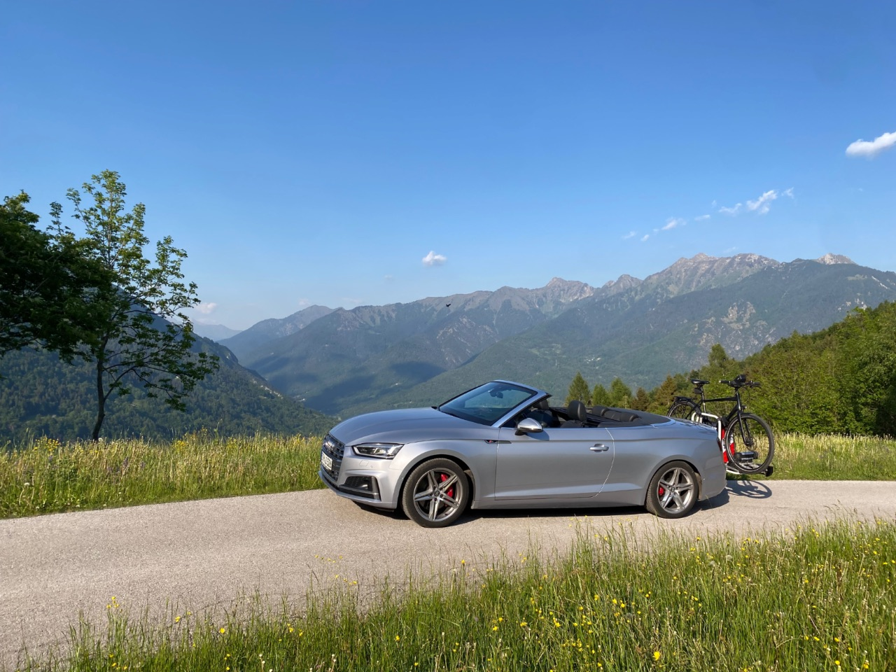
  </a>
  <a href="boniprati_236013047__photos__ac873d28-56c1-4893-9822-7ab1515d6022_29381176-fd21-40ab-bf3e-e430ac489d37.jpg" class="step-thumb-link" data-gallery="step-236013047" data-index="6">
    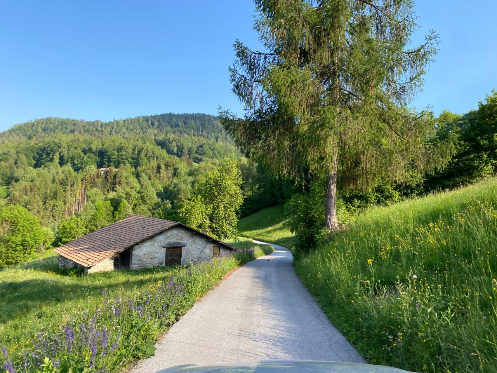
  </a>

### Tag 3 - 25.05.2026

#### Etappe: Stenico

Start war wieder so gegen 9 Uhr, zuerst noch tanken und dann anstatt der Hauptstraße noch eine kleinere SP34 entdeckt. 
Und die hat sich schon mal morgens gelohnt. Viele Felsen, kleine Tunnels. Absolut gemütlich und wenig Verkehr, die Straße wird auch von vielen Radfahrern genutzt. Und hoppla ein Wasserfall. So ein Foto hatte ich in der Unterkunft gesehen - aha hier ist das also :-)

  <a href="stenico_236291934__photos__e5ff3e93-fd38-45ee-90da-3565716e9b5a_de1c7c0f-6ac4-4868-8e14-2fe7c8d6a317.jpg" class="step-thumb-link" data-gallery="step-236291934" data-index="1">
    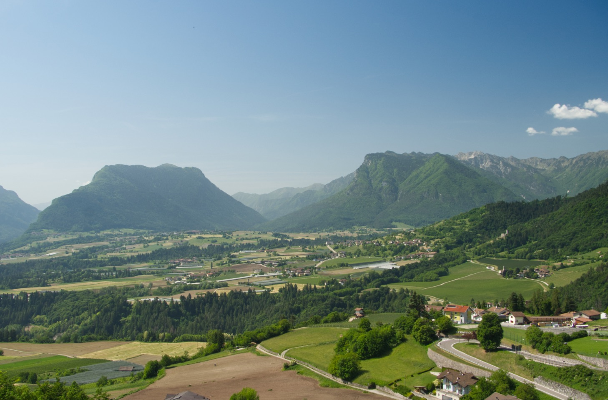
  </a>
  <a href="stenico_236291934__photos__3271c7c0-59e5-4cbf-bd6d-40586e344139_be22d9d2-b4e8-49a1-9216-719535ccf5ad.jpg" class="step-thumb-link" data-gallery="step-236291934" data-index="2">
    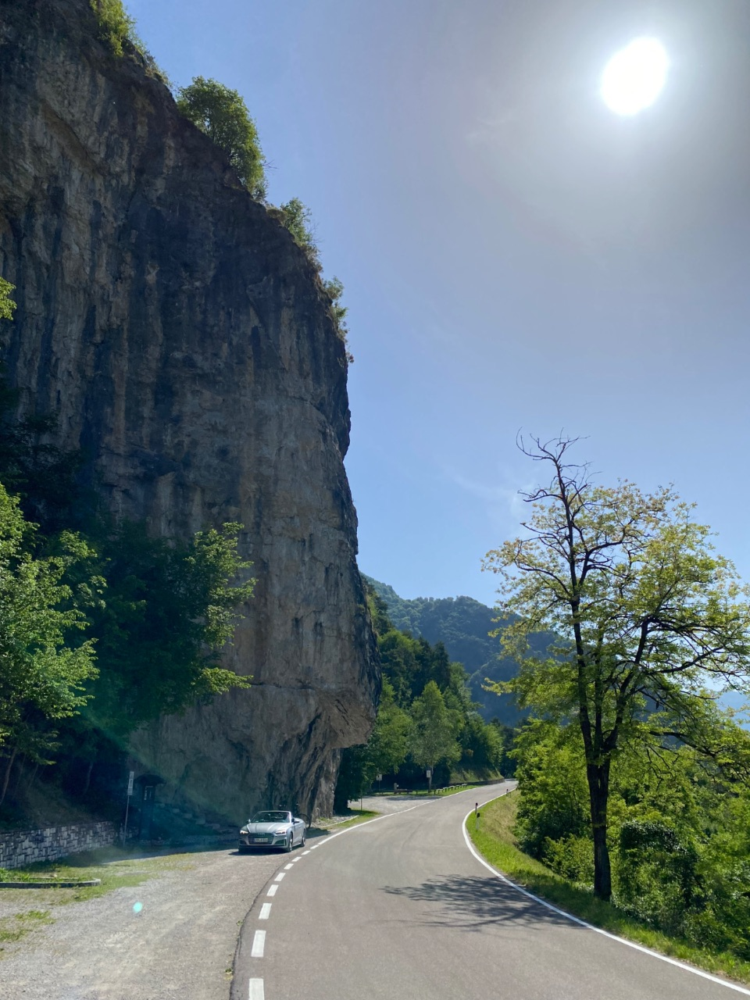
  </a>
  <a href="stenico_236291934__photos__d37b1129-cd8d-4106-8bd3-e6f0eb199d8d_897c903a-e186-408a-b24b-081ca35f3d91.jpg" class="step-thumb-link" data-gallery="step-236291934" data-index="3">
    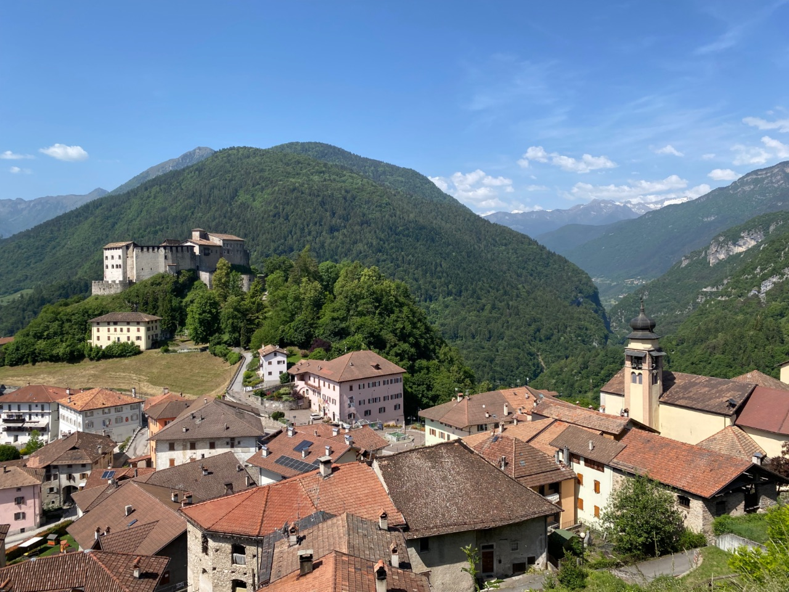
  </a>
  <a href="stenico_236291934__photos__a7c87460-a456-477c-80fc-80e432119e10_5638c9a3-f400-4bf8-854c-1b9043d13200.jpg" class="step-thumb-link" data-gallery="step-236291934" data-index="4">
    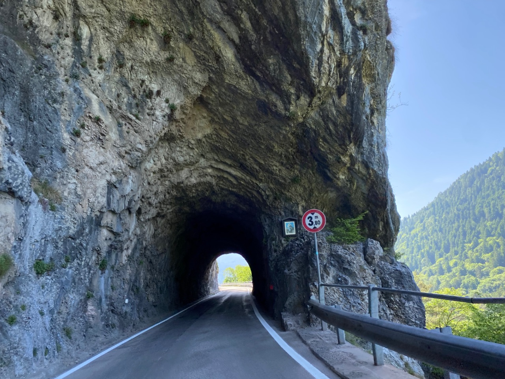
  </a>
  <a href="stenico_236291934__photos__18e69f76-334b-40e0-8b0a-4ff0ec544937_40ff067c-1280-461e-a5d4-1fde862d1a34.jpg" class="step-thumb-link" data-gallery="step-236291934" data-index="5">
    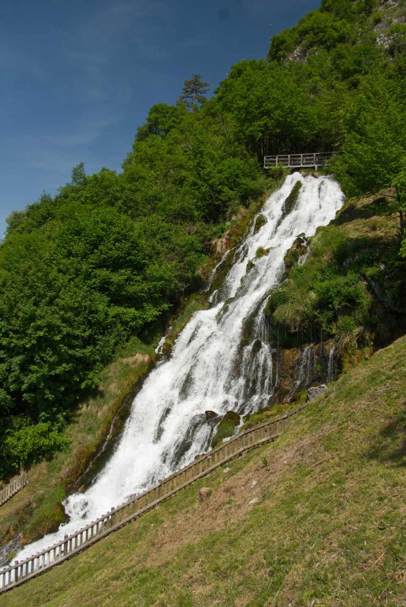
  </a>
  <a href="stenico_236291934__photos__955d5e1c-00ff-45c6-8ca4-9d821bd32615_025bdff0-be38-4bc7-ae38-dd52e970621b.jpg" class="step-thumb-link" data-gallery="step-236291934" data-index="6">
    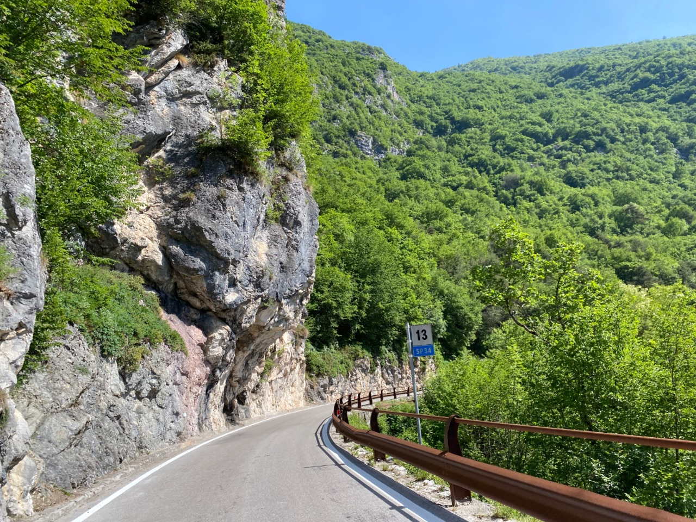
  </a>

#### Etappe: Molveno

Beim Lago di Molveno habe ich dann eine Radtour gemacht. Start und Ziel war am kleineren, dafür aber absolut beeindruckenden, grünen, glasklaren Lago di Nembia. Der ist einen Stopp wert. Fliegenfischer waren auch dort, weil es da wohl viele Fische drin gibt, die man gut im Wasser sehen kann.
Die Radtour war größtenteils im Schatten, was tagsüber sehr angenehm war. Dennoch bot sich immer wieder ein Blick auf den Molvenasee. Der Plan war eigentlich noch ein weiter nördlich gelegenen See anzusteuern, ich hab aber die Höhenmeter gesehen und dachte, ach ne, die zwei Seen waren auch schon schön genug. 

Ich bin dann aber noch links abgebogen, um die Dolomiten zu fotografieren und habe dabei auf Komoot einen Ort "Wasserfall, der in einen Bach führt" gesehen, da fahr ich noch hin. Der letzte Teil des Wegs war an einem Abzweig des Flusses - Levada, Levada! :-) Wasserfälle gingen von den Felsen runter, man konnte mit dem Fahrrad sich schon drunter stellen.

Weiter ging die Fahrt zurück nach Molveno an der Uferpromenade entlang und dann an der Ostseite langsam wieder zurück. Wow von dieser Seite ist der Molvenosee ja noch beeindruckender, mit der Ortschaft und den Dolomiten dahinter. Ich bekam Hunger und so kam das Restaurant am Ufer gerade recht. Mittagspause mit Blick auf den See und die Berge. 

Gut gestärkt ging es weiter. Es kamen noch ein paar einsame Badebuchten am Molvenasee, da musste ich auch noch kurz ins Wasser springen. Nun ging es noch gar zurück zum Nembiasee zum grün schimmernden Wasser. Eine wunderbare Runde!

  <a href="molveno_236296521__photos__2f27aa73-2786-4f05-af89-8f0be0cbe2ec_d1724102-56c9-4b19-8d4c-bd85ab944cf0.jpg" class="step-thumb-link" data-gallery="step-236296521" data-index="1">
    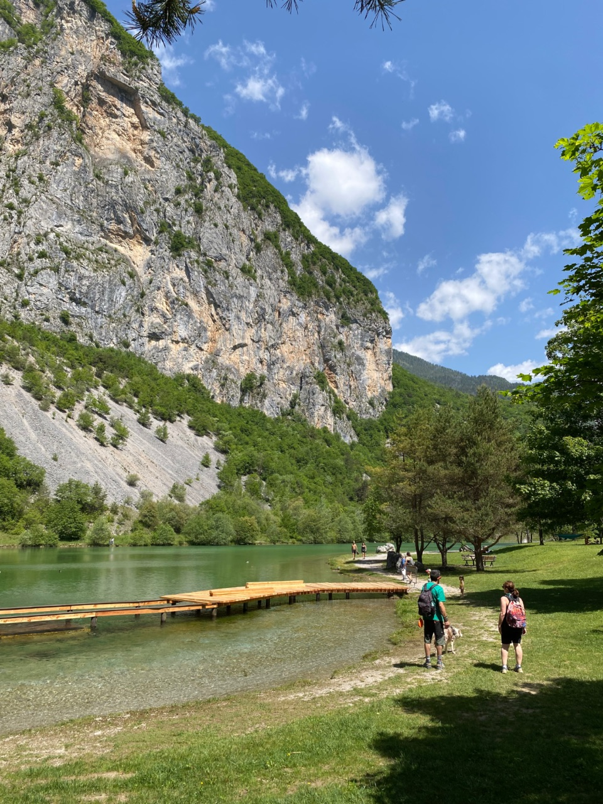
  </a>
  <a href="molveno_236296521__photos__0c49140e-a54d-4dc2-b12d-e098902b3470_cc0709ac-0d73-4b72-a76b-88fa0566c48e.jpg" class="step-thumb-link" data-gallery="step-236296521" data-index="2">
    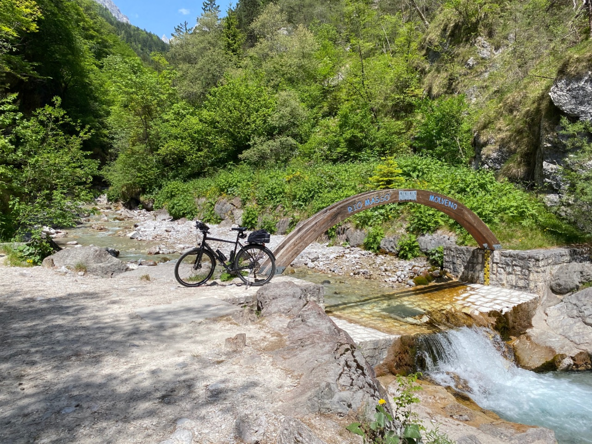
  </a>
  <a href="molveno_236296521__photos__df66a39e-2713-4785-9392-59ea4243739f_c6bce439-950c-4590-b598-c0e1002bda67.jpg" class="step-thumb-link" data-gallery="step-236296521" data-index="3">
    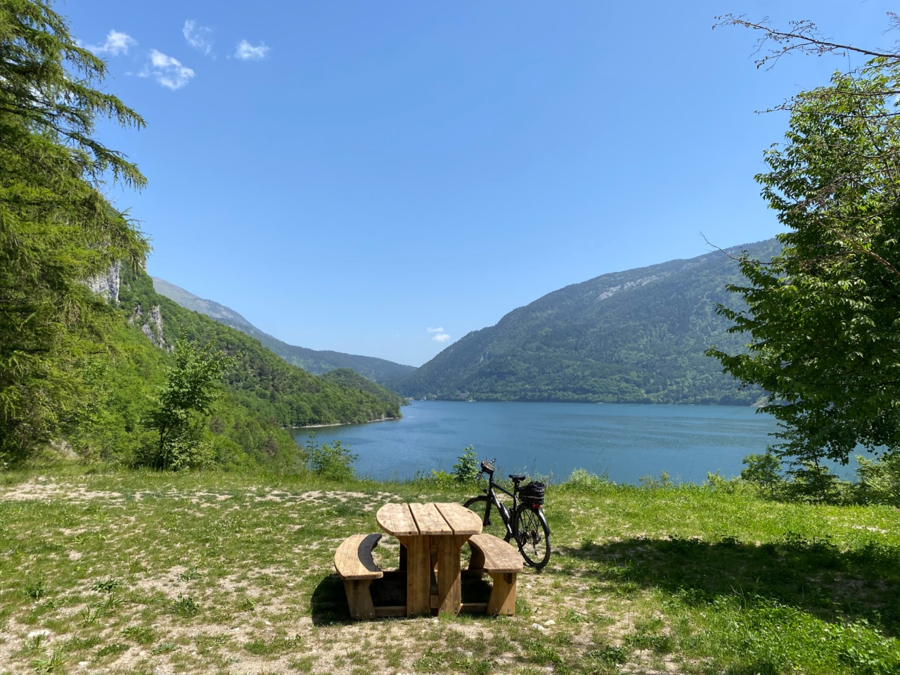
  </a>
  <a href="molveno_236296521__photos__4770eef8-42bb-4aab-8d9b-694da5030de6_9b547687-cacf-4166-97b5-9ef1c5bf94c6.jpg" class="step-thumb-link" data-gallery="step-236296521" data-index="4">
    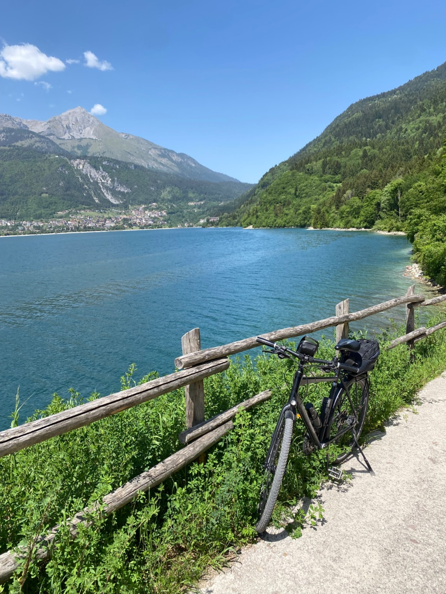
  </a>
  <a href="molveno_236296521__photos__04684b38-f7cd-4995-bebb-ec4235cbbd80_985c2fb3-3ca5-43b8-8f7a-b98dc132b8ba.jpg" class="step-thumb-link" data-gallery="step-236296521" data-index="5">
    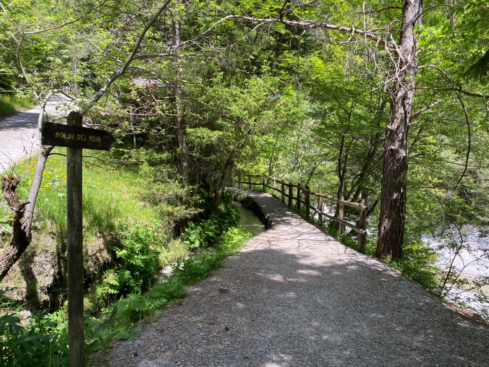
  </a>
  <a href="molveno_236296521__photos__280c4ded-be6b-4f74-9d87-a363456bed8f_7cac42fa-d049-47cb-8dd1-a02966732b02.jpg" class="step-thumb-link" data-gallery="step-236296521" data-index="6">
    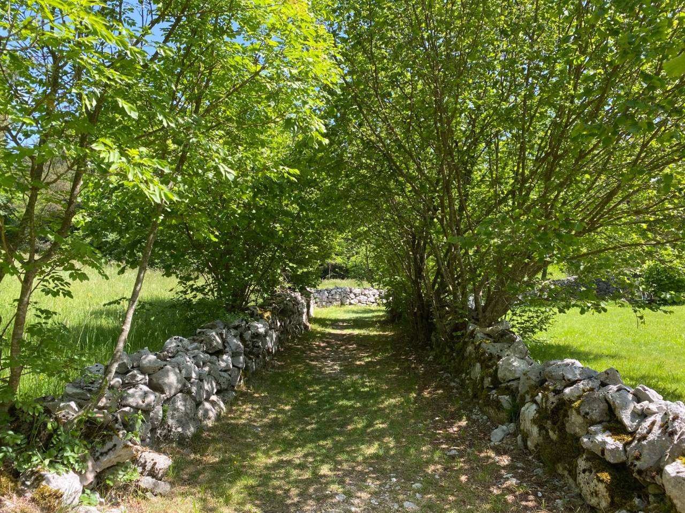
  </a>
  <a href="molveno_236296521__photos__6b41a15c-08e2-407b-a750-bba4f87c8fee_780a749a-7525-4910-b6ad-8782418683c6.jpg" class="step-thumb-link" data-gallery="step-236296521" data-index="7">
    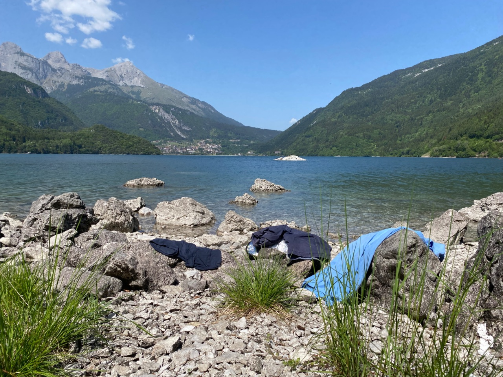
  </a>
  <a href="molveno_236296521__photos__caa3ccc0-57f3-4fd0-81c4-3fd18cf8de52_71c78d67-5a6e-4f5b-853a-42f900c73c52.jpg" class="step-thumb-link" data-gallery="step-236296521" data-index="8">
    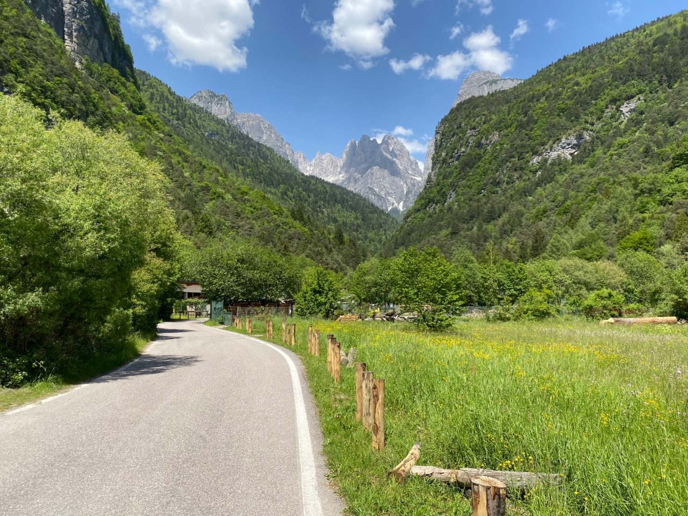
  </a>
  <a href="molveno_236296521__photos__4e389972-e20c-4b2a-a9a6-1c1274fd2233_660f7a41-0c27-4578-9642-cdd4f01dea6f.jpg" class="step-thumb-link" data-gallery="step-236296521" data-index="9">
    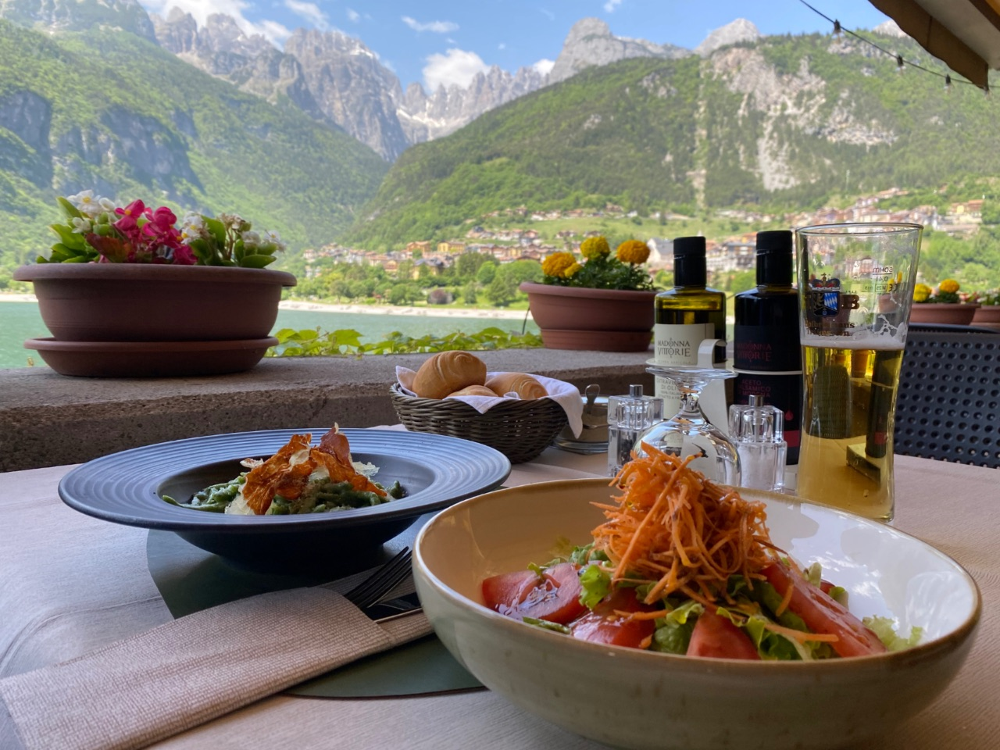
  </a>
  <a href="molveno_236296521__photos__c7a943e2-8723-4173-bc98-cdbe36b10826_1cbd5ce4-d6f8-4228-ab5c-d6526e9b9223.jpg" class="step-thumb-link" data-gallery="step-236296521" data-index="10">
    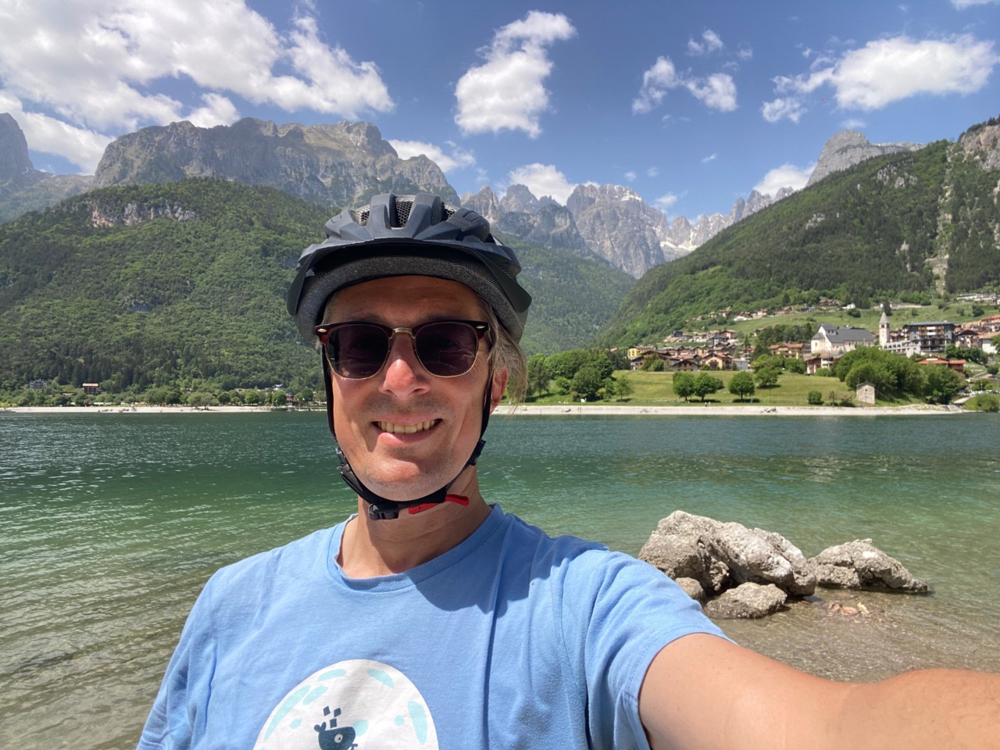
  </a>
  <a href="molveno_236296521__photos__040460c2-f7bf-4ecc-854b-f56ef7e53b5b_1785edb5-c9e5-4f1c-a9bd-01b481cd7ca4.jpg" class="step-thumb-link" data-gallery="step-236296521" data-index="11">
    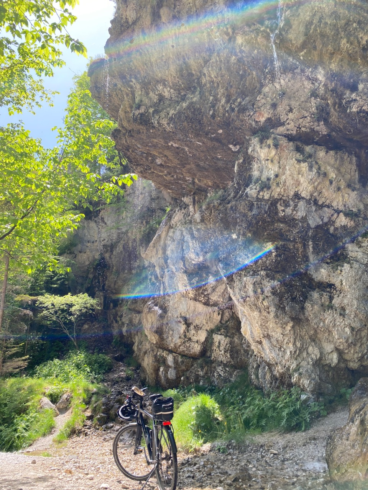
  </a>
  <a href="molveno_236296521__photos__db32cd06-2196-4acb-a034-2e7f3bd0d3de_159e8d4c-db07-4540-a584-a6ba882e655f.jpg" class="step-thumb-link" data-gallery="step-236296521" data-index="12">
    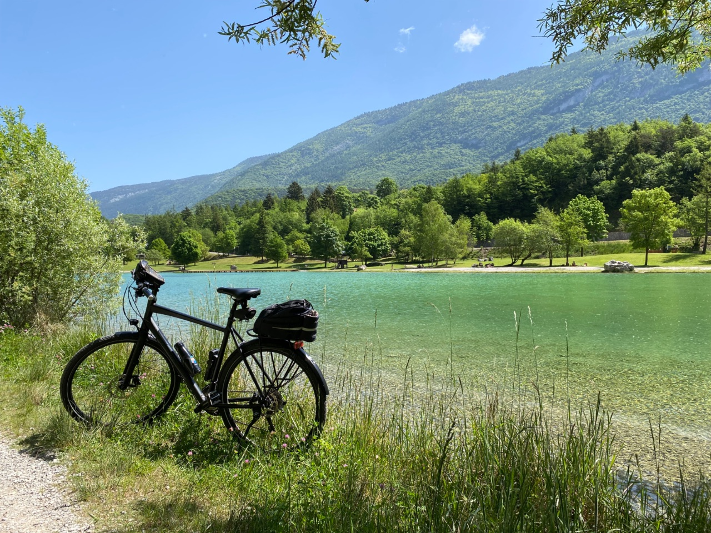
  </a>
  <a href="molveno_236296521__photos__4bfc3242-0c1f-4f97-9da2-7308d1a13519_0d5f6f33-40c7-4030-a067-c2744a483634.jpg" class="step-thumb-link" data-gallery="step-236296521" data-index="13">
    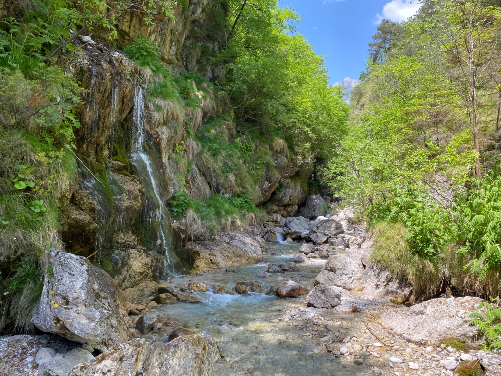
  </a>
  <a href="molveno_236296521__photos__cfd6446d-3617-4fc8-9195-89261878dc02_075e8fa4-60c3-4a79-804b-98e616897ec0.jpg" class="step-thumb-link" data-gallery="step-236296521" data-index="14">
    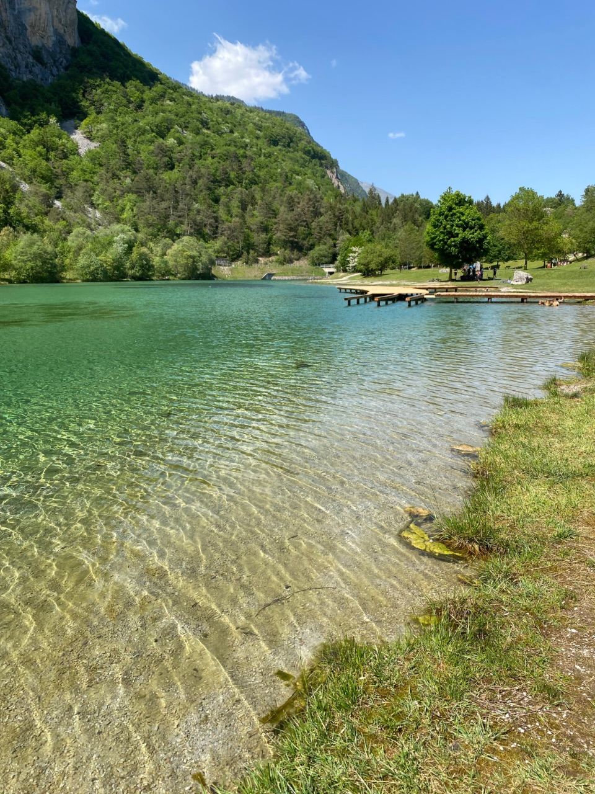
  </a>

#### Etappe: Tenna

Weiter ging die Fahrt von Molvenosee/Nembiasee nach Tenna, wo ich bis Samstag eine Unterkunft habe.
Auf dem Weg das Sarcatal hinunter war ein großer Laster vor mir. Bei den großen Serpentinen, wo ich letztes Jahr auch schon mal gestoppt hatte, wusste ich, dass da ein Parkplatz kommt. Ich wollte nur Abstand zu dem Laster bekommen und bin links raus. Da winkten zwei Wanderinnen, die glücklich nach ihrer 8 Stunden Klettersteigtour ein Auto zum Trampen gefunden haben 😅. Ich nehm ja immer wieder Leute mit, die auf dem beschwerlichen Rückweg sind. Sei es Wanderer, oder auch einmal ein Gleitschirmflieger 🪂. Die haben sich echt gefreut, denn an der Straße runter ist das sehr gefährlich.

Auf dem Weg lag dann noch der Lago di Toblino mit dem markanten Castel, das auch ein Restaurant dort bietet. Da mache ich diese Woche nochmal einen Abstecher hin.

Tenna liegt oberhalb des Lago di Caldonazzo. Hinter dem Bergrücken liegt noch der Lago di Levico. Da gab es ab etwa 20 Uhr ein seltsamen "Bumm - bumm - bumm" - nanu, wird da abends noch gebaut? Und es hört gar nicht auf. Irgendwann hab ich dann am See wohl ein längeres Ruderboot gesehen. Ah, eine Mannschaft übt da wohl für ein Wettrennen. Das Kommando gab eine Frau, die hat denen echt ganz schön eingeheizt: "Uno - due - tre - quattro ..." und von wieder vorne 🚣🏼‍♂️📣🥁

Dann wieder hoch nach Tenna in die Unterkunft, alle Fotos auf den Rechner gespielt, Komoot, Whatsapp und Polarsteps befüllt. Ein lauer Sommerabend auf der Terrasse, es ist scheinbar immer noch Nebensaison, ich bin wohl der einzige Gast hier.
Mein langes Pfingstwochenende geht zuende, ab morgen dann remote work, aber auch von hier in Tenna.

  <a href="tenna_236301842__photos__9e534527-7a18-4113-91dc-8932b30b88c8_ffffe3d3-008e-4998-9dc1-2b18ec5c44b2.jpg" class="step-thumb-link" data-gallery="step-236301842" data-index="1">
    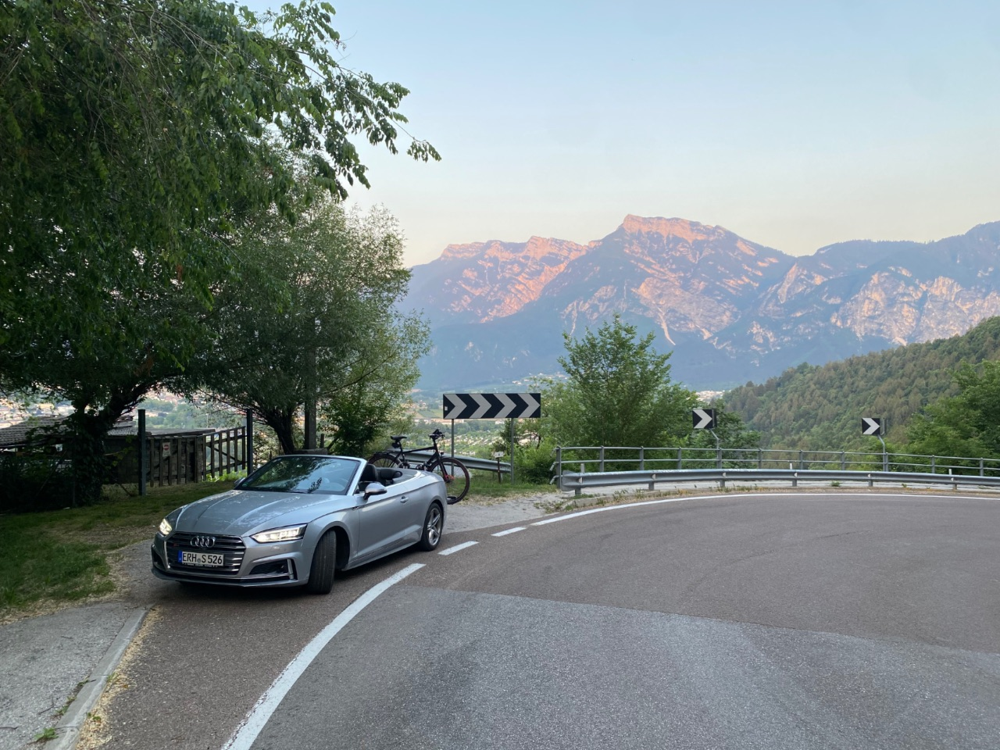
  </a>
  <a href="tenna_236301842__photos__c6145292-104a-428a-8044-520deca63ed6_f206263e-10a9-4adf-80c7-60aed091d5ff.jpg" class="step-thumb-link" data-gallery="step-236301842" data-index="2">
    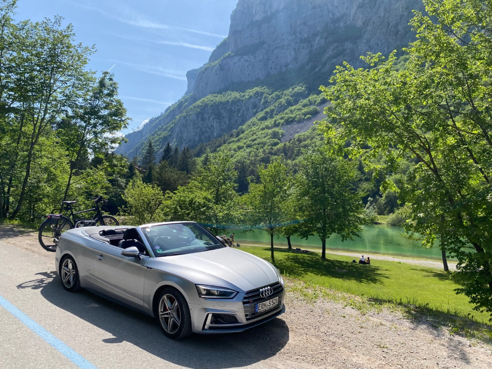
  </a>
  <a href="tenna_236301842__photos__0bb65c55-41e4-428a-9ad7-5c8f869b3160_af54b0fc-2dc8-4df2-96f9-df12f28ef13c.jpg" class="step-thumb-link" data-gallery="step-236301842" data-index="3">
    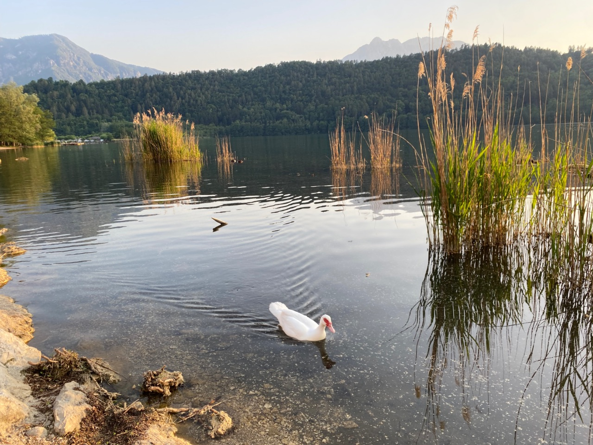
  </a>
  <a href="tenna_236301842__photos__d0963260-f49d-4d17-9bed-1ed1d3b494cb_a103f978-e708-4b63-8443-9db86660154e.jpg" class="step-thumb-link" data-gallery="step-236301842" data-index="4">
    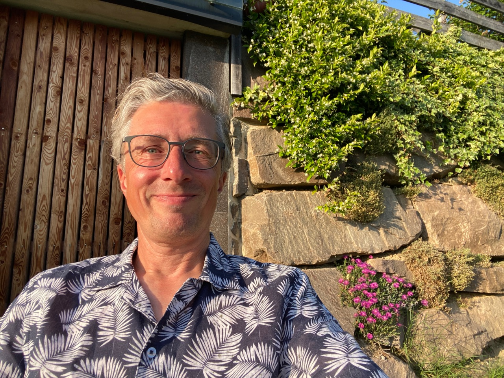
  </a>
  <a href="tenna_236301842__photos__fb890141-9969-44a9-8baf-5b0f84c87ffa_8699eda7-94e2-45c5-9912-2b2b2ec36c97.jpg" class="step-thumb-link" data-gallery="step-236301842" data-index="5">
    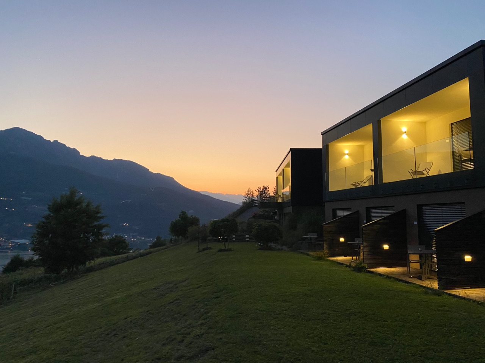
  </a>
  <a href="tenna_236301842__photos__9a417b71-c8f0-4cb1-85ad-6e5ef9774f31_7769ebb8-bfc4-4137-80f2-f12e6fb5a834.jpg" class="step-thumb-link" data-gallery="step-236301842" data-index="6">
    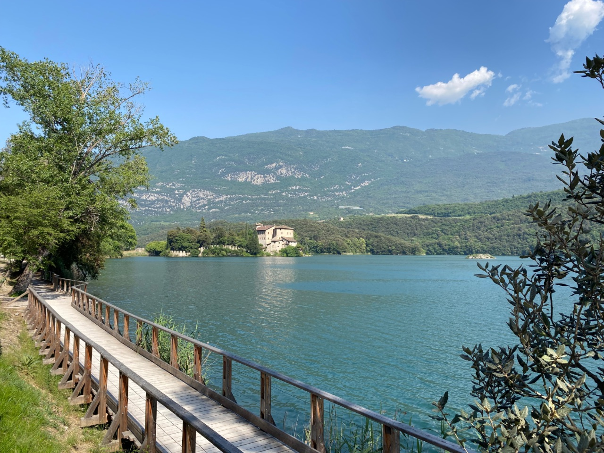
  </a>
  <a href="tenna_236301842__photos__5d7e9fe0-dfce-454f-88e3-736afb04712a_6488624a-c9a0-43d6-9fbd-6d9bc6952417.jpg" class="step-thumb-link" data-gallery="step-236301842" data-index="7">
    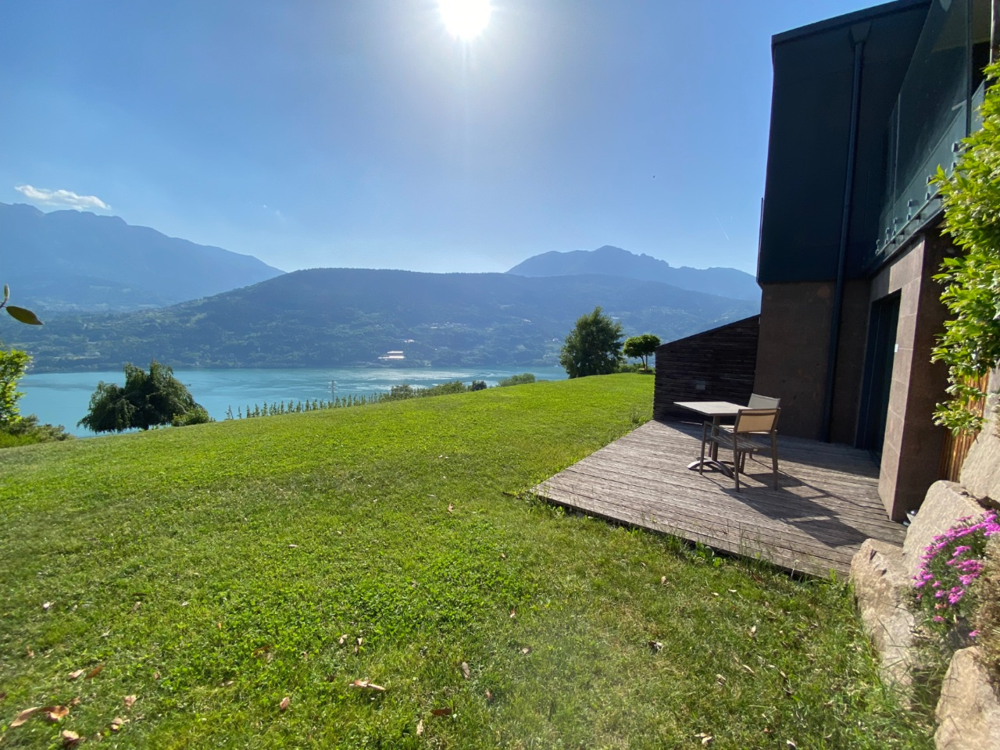
  </a>
  <a href="tenna_236301842__photos__f483862d-a4d7-48db-943b-db811e4168ce_4c8389d1-19f0-4188-b5ed-2159678d746a.jpg" class="step-thumb-link" data-gallery="step-236301842" data-index="8">
    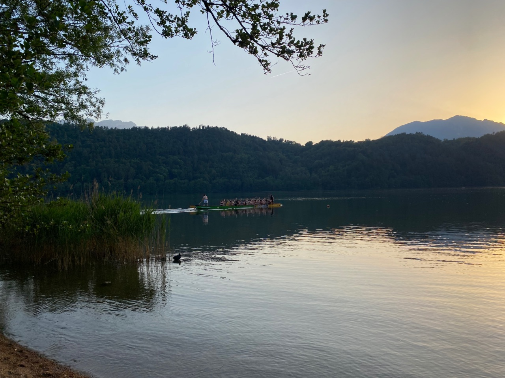
  </a>
  <a href="tenna_236301842__photos__2977ca8b-b455-4584-b35f-1ae7ba45f9bc_4187e26f-ee50-47fe-ba17-6ae4a7cd8512.jpg" class="step-thumb-link" data-gallery="step-236301842" data-index="9">
    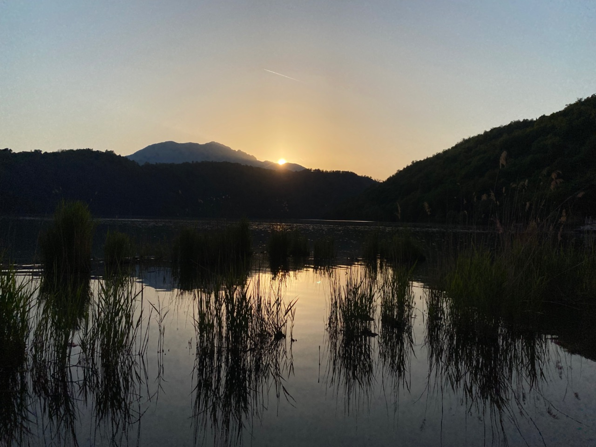
  </a>
  <a href="tenna_236301842__photos__b7ed4e8d-5fc6-4673-aaea-1a62c98c99b1_189f943b-f33f-4d2b-b2c7-570426c6e3ca.jpg" class="step-thumb-link" data-gallery="step-236301842" data-index="10">
    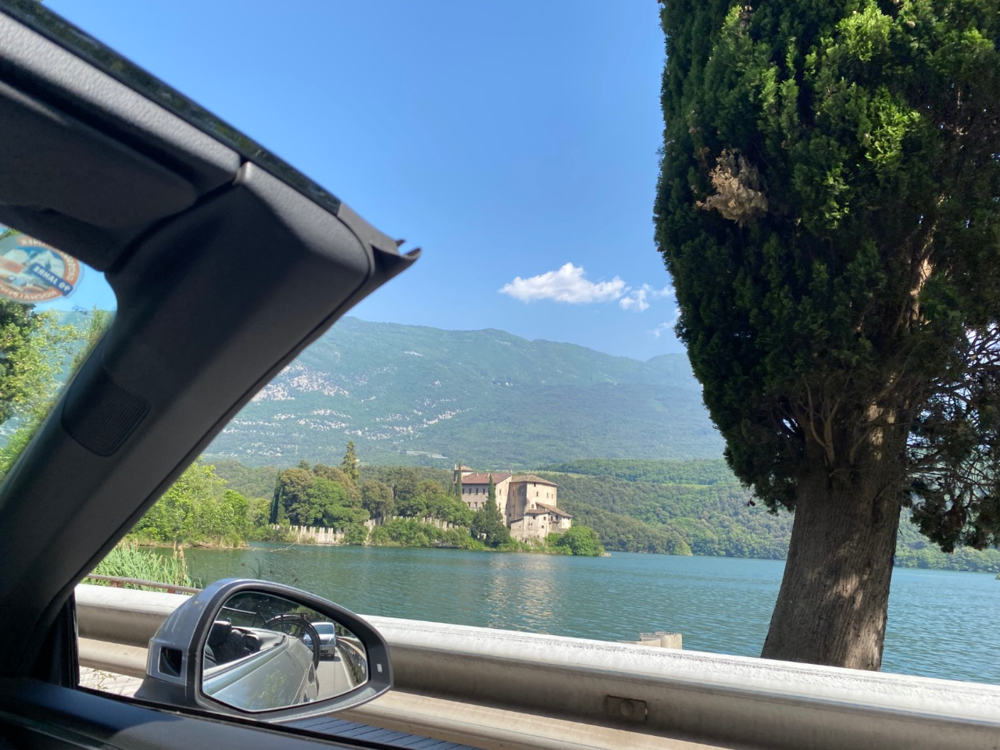
  </a>

### Tag 4 - 26.05.2026

#### Etappe: Radtour um den Caldonazzo-See

Das lange Wochenende ist vorbei. Heute geht die (remote) Arbeitswoche los. Aber erstmal gemütlich frühstücken und eine Radtour um den Caldonazzo-See, das ist eine gute Stunde, das passt. 
Von Tenna runter zum See ist es ja noch einfach, der Anstieg kommt zuletzt. Mit dem Rad kommt man an viele schöne Badestellen und Aussichtspunkte, die immer mal für eine kurze Pause einladen. 
Der Aufstieg nach Tenna zurück ging auch wieder auf kleineren Fußwegen entlang durch Obstplantagen, und die Dusche wartet ja schon am Ziel. 
Kurz erfrischt, dann ging es „auf Arbeit“ 😅. Tagsüber aber dann im klimatisierten und schattigen Zimmer.

  <a href="caldonazzo_236506458__photos__3c1fcf66-2bf3-4fa4-80c6-0056df76b8cd_f9379e5e-6e1e-47e5-bbdd-d7351ba1b573.jpg.jpg" class="step-thumb-link" data-gallery="step-236506458" data-index="1">
    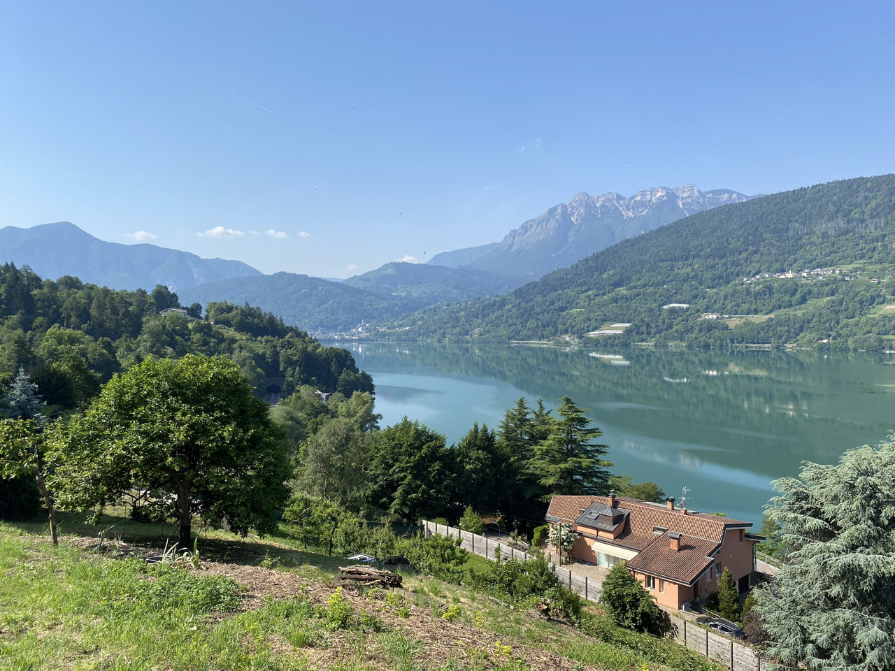
  </a>
  <a href="caldonazzo_236506458__photos__a0afe054-4ccb-4163-bb62-420fb5327f0e_f655153b-4f22-4e09-8406-0912b19b07f8.jpg.jpg" class="step-thumb-link" data-gallery="step-236506458" data-index="2">
    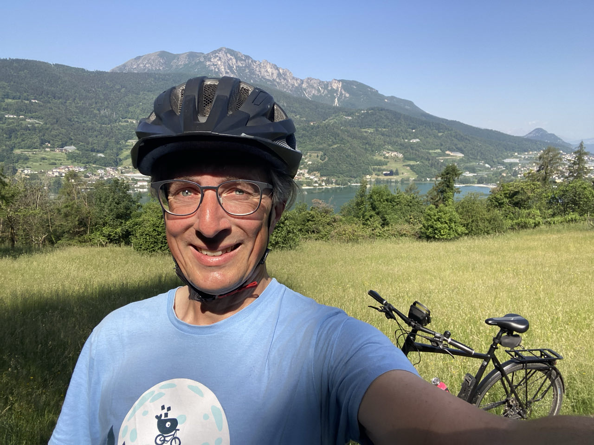
  </a>
  <a href="caldonazzo_236506458__photos__372d8326-d13d-49d5-a25f-84882b6722dd_cd79f9e6-7835-47c6-b9c3-677dfa103317.jpg.jpg" class="step-thumb-link" data-gallery="step-236506458" data-index="3">
    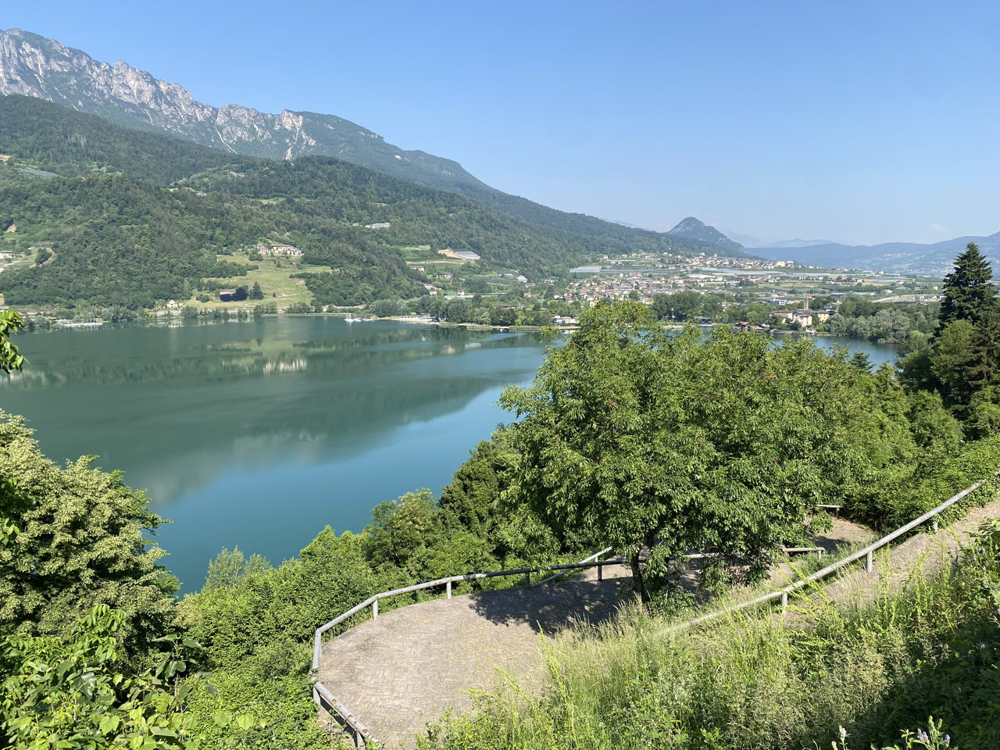
  </a>
  <a href="caldonazzo_236506458__photos__5d5a7ddb-f4af-4cd9-ae3c-1b5028595205_b4c79a05-fcbc-4c6c-bb2a-cc13dd35bbfb.jpg.jpg" class="step-thumb-link" data-gallery="step-236506458" data-index="4">
    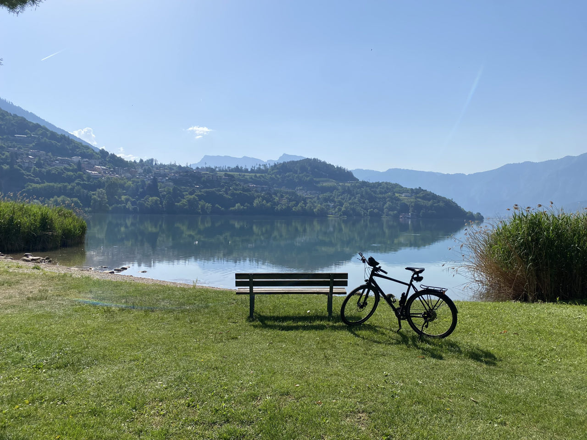
  </a>
  <a href="caldonazzo_236506458__photos__ff8c41f1-8786-43ee-9bdd-1fd3015f313d_9bd47ecf-d327-41b3-9321-fbe2caf41290.jpg.jpg" class="step-thumb-link" data-gallery="step-236506458" data-index="5">
    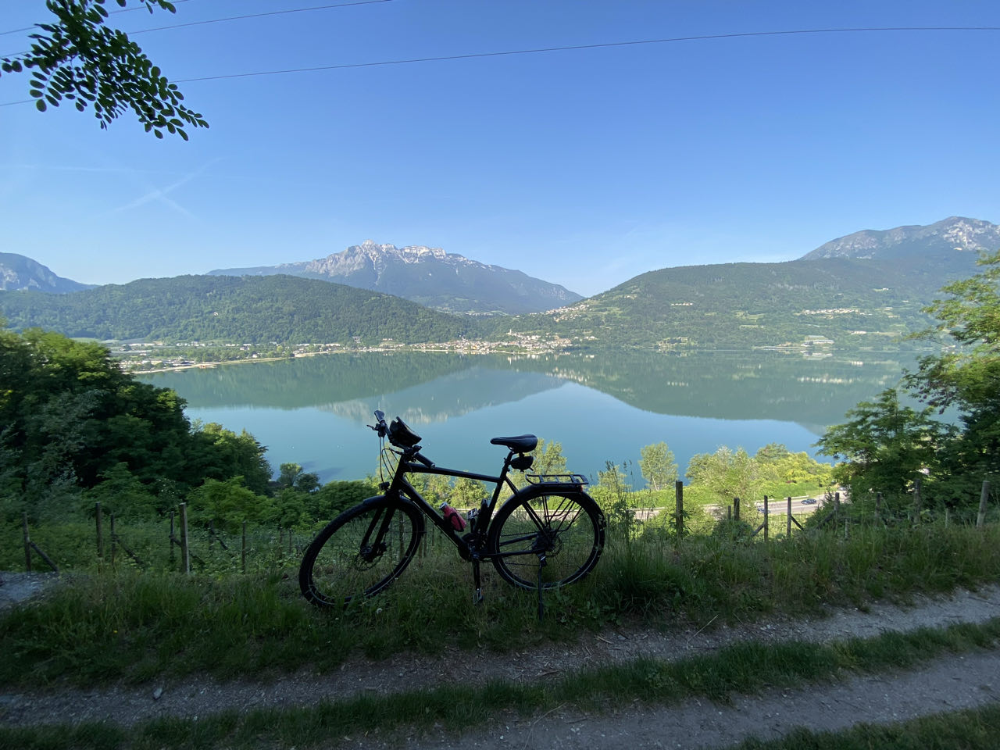
  </a>
  <a href="caldonazzo_236506458__photos__6a5fad72-79a3-4f1c-898b-f93cefa85c7b_8d25caf7-8621-48e8-a32c-ca815e1578fb.jpg.jpg" class="step-thumb-link" data-gallery="step-236506458" data-index="6">
    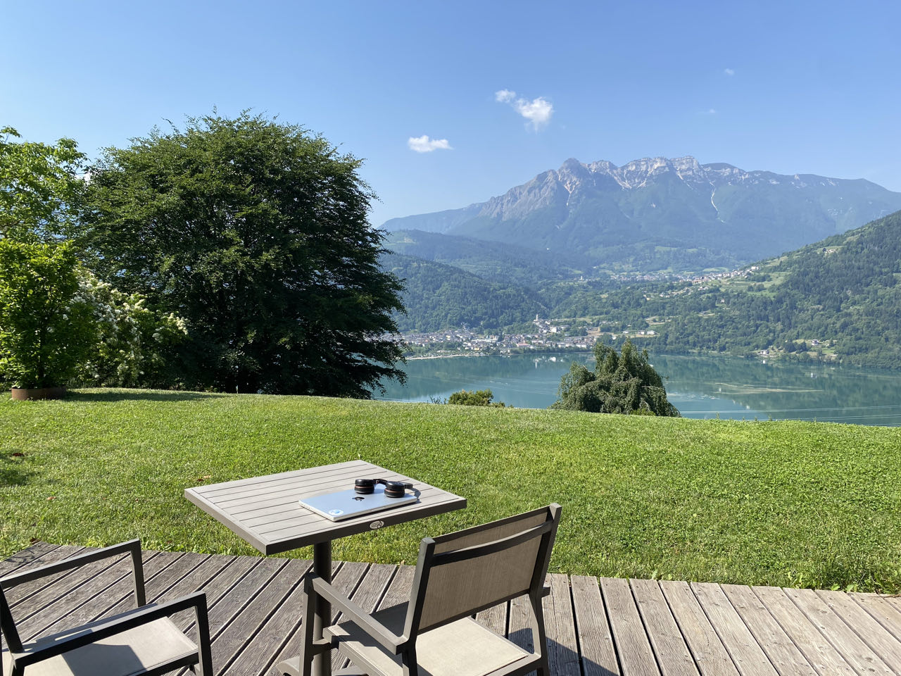
  </a>
  <a href="caldonazzo_236506458__photos__ccee1fdd-05e3-4fa7-80ef-f9356f70b371_70876b24-f2d9-4243-b1a2-a761bfda43fc.jpg.jpg" class="step-thumb-link" data-gallery="step-236506458" data-index="7">
    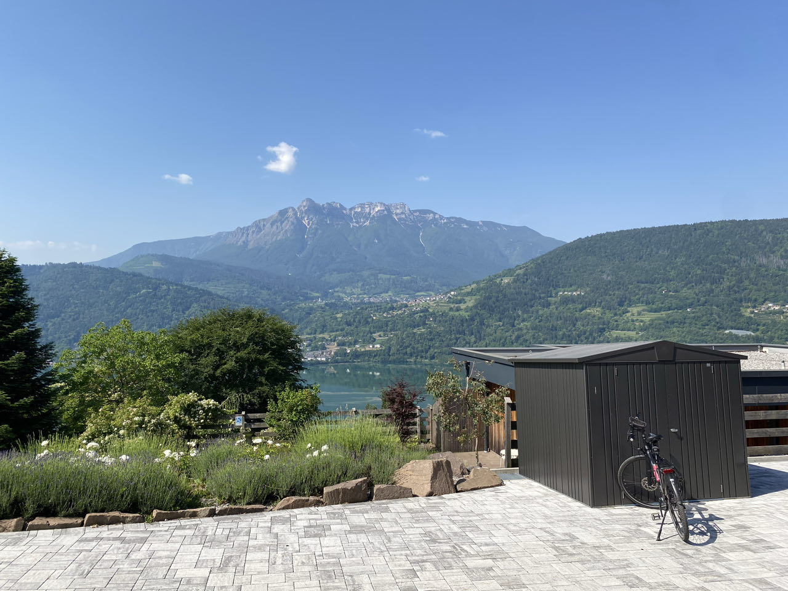
  </a>
  <a href="caldonazzo_236506458__photos__91ab3e85-f5e2-4a5d-80b7-9fe4b65b3f3d_6be21efb-049c-4897-8b7c-ee22ae355fc7.jpg.jpg" class="step-thumb-link" data-gallery="step-236506458" data-index="8">
    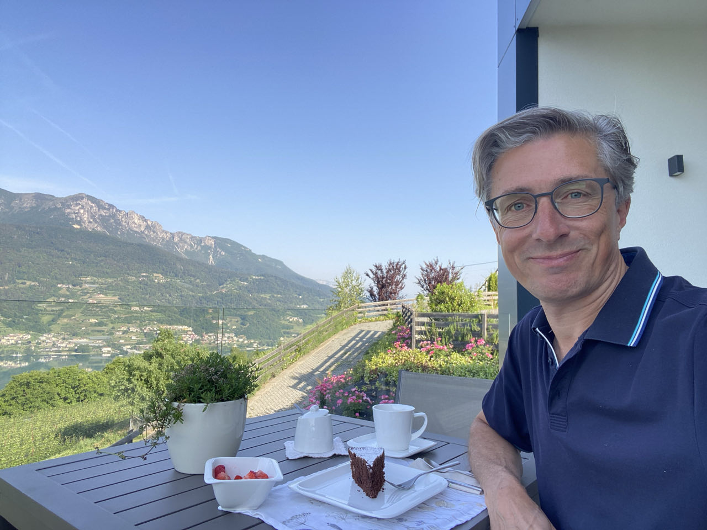
  </a>
  <a href="caldonazzo_236506458__photos__d250e95d-8554-46b5-9c7b-2e7316a15e0a_3cf3e1d8-a917-45ea-8274-5501b55cbec4.jpg.jpg" class="step-thumb-link" data-gallery="step-236506458" data-index="9">
    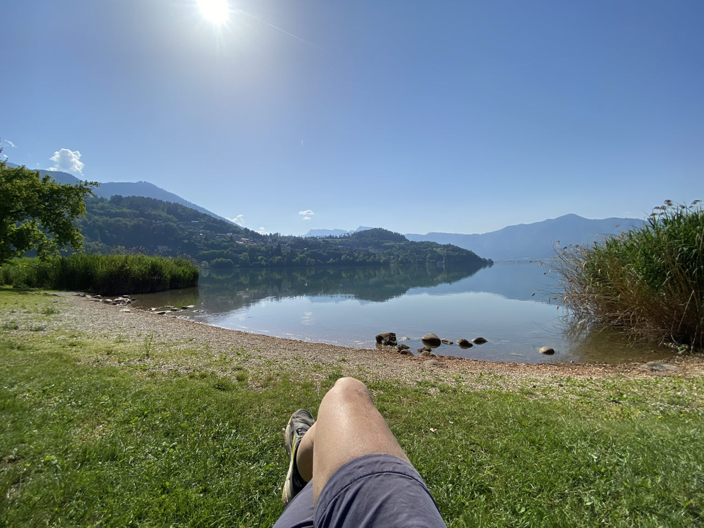
  </a>

### Tag 5 - 27.05.2026

#### Etappe: Arte Sella

Heute wollte ich mir Arte Sella ansehen, das ist eine Kunstausstellung im Freien am Ende des Sella Tales. 
Auf dem parkähnlich angelegten Wegen sind viele Kunstwerke aus Holz oder Stein gebaut. 
Unterwegs waren auch Schulklassen mit einem Fragebogen, damit alle beschäftigt bleiben :-) Ein paar Schüler fragten mich, wie die Skulptur mit den vielen runden Löchern in den Granitplatten heißt. Ich hatte mir ja den Programmplan gekauft und konnte ihnen Tipps geben 😅.
Für die Runde braucht man gute zwei Stunden, ich hab viel fotografiert und man betrachtet die Objekte aus verschiedenen Blickwinkeln.
Eine Camera Obscura in einem Granit-"Iglu" hätte es auch gegeben, sie ist aber aus Sicherheitsgründen vorübergehend geschlossen.
Nach dem Rundgang eine Stärkung zum Mittagessen - leckere Gnocci. Da fällt mir ein, ich hab noch keine einzige Pizza oder Eis gegessen 🍕🍧.

Etwas weiter unten an der Villa Strobele war im Garten ein weiterer Bereich mit Objekten ausgestellt. 
Ein sehr schönes Ziel hier in der Nähe.

  <a href="arte-sella_236695946__photos__894acfa3-07eb-49a5-b1dd-86d74cf693e2_f2da8b17-1ec1-46b6-91b8-e2bca49678a5.jpg" class="step-thumb-link" data-gallery="step-236695946" data-index="1">
    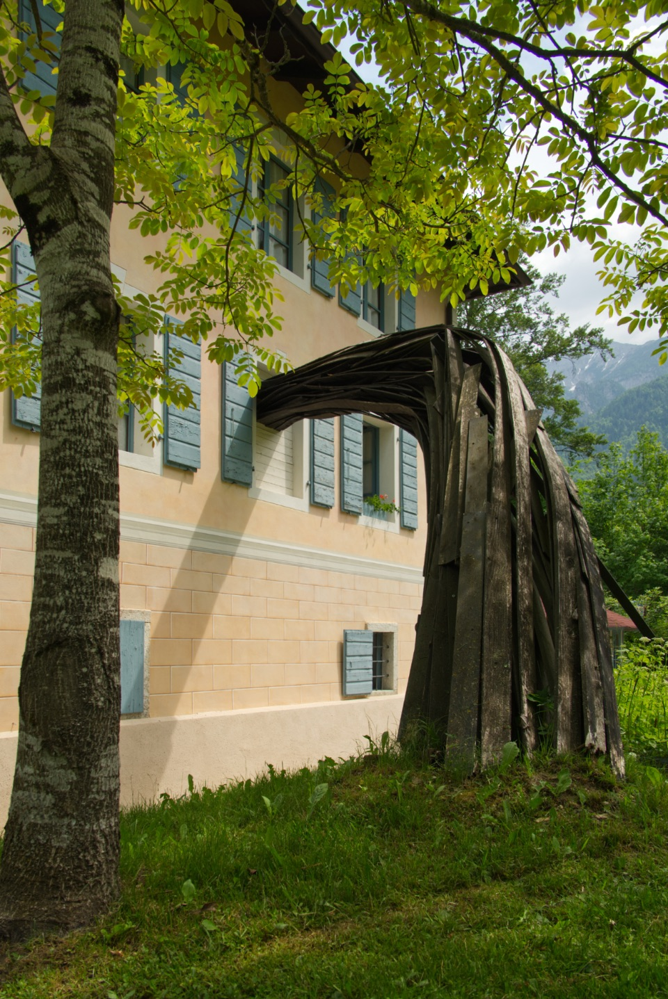
  </a>
  <a href="arte-sella_236695946__photos__324b4c0f-9a34-4ec8-866d-16a70777ad3e_f25471ff-c2b6-4eb2-a533-0bf4703f66d0.jpg" class="step-thumb-link" data-gallery="step-236695946" data-index="2">
    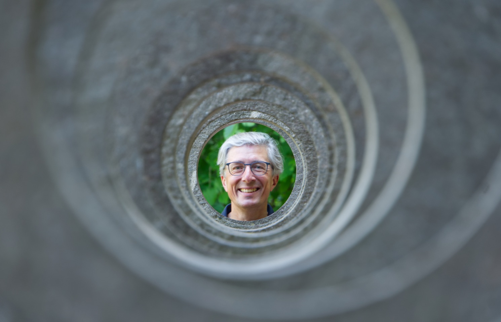
  </a>
  <a href="arte-sella_236695946__photos__c5e37c7b-8e1a-4c2b-b2a3-ccbbb5a7acd3_d0bc1042-6123-4da9-b76e-ce2198289566.jpg" class="step-thumb-link" data-gallery="step-236695946" data-index="3">
    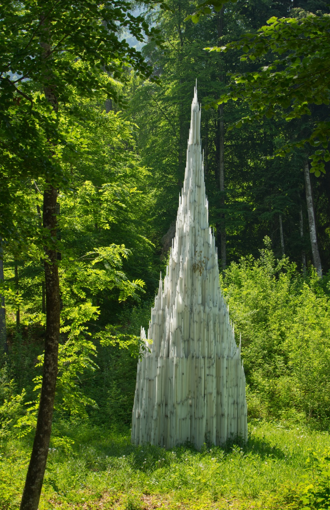
  </a>
  <a href="arte-sella_236695946__photos__85de64eb-e383-428f-9355-8bdb016b2a2a_b88ec40f-0917-4b0a-b188-7a69f0b6eeb9.jpg" class="step-thumb-link" data-gallery="step-236695946" data-index="4">
    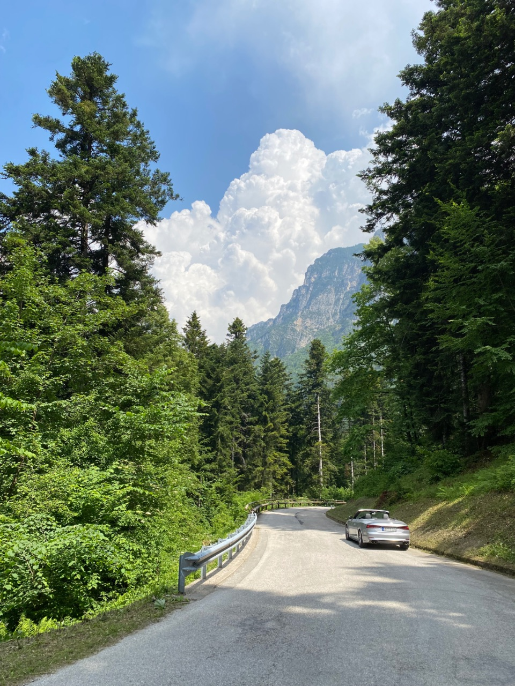
  </a>
  <a href="arte-sella_236695946__photos__a96611aa-0805-46f6-914a-54c2d171825c_b6f7deab-0aae-490b-b9cf-77eb186a2ddf.jpg" class="step-thumb-link" data-gallery="step-236695946" data-index="5">
    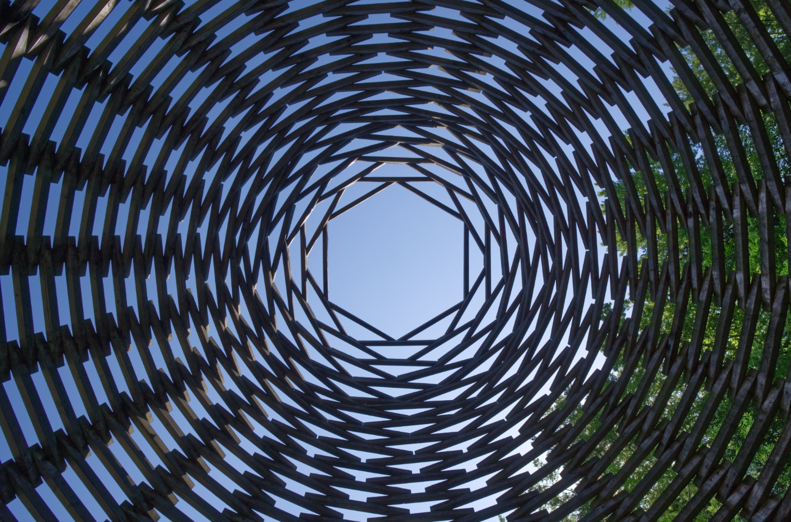
  </a>
  <a href="arte-sella_236695946__photos__e17afdef-a784-4830-8b92-4a223d88fa3b_a0b6ece2-9f70-4288-9ce7-98c07036158c.jpg" class="step-thumb-link" data-gallery="step-236695946" data-index="6">
    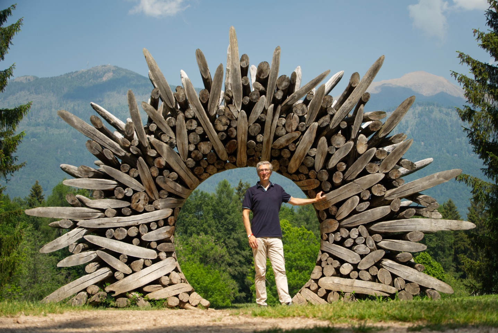
  </a>
  <a href="arte-sella_236695946__photos__3f75bcab-a680-456a-90bd-1e5246ae9a15_9495c742-5d81-46f1-9d96-0c3dbf31746e.jpg" class="step-thumb-link" data-gallery="step-236695946" data-index="7">
    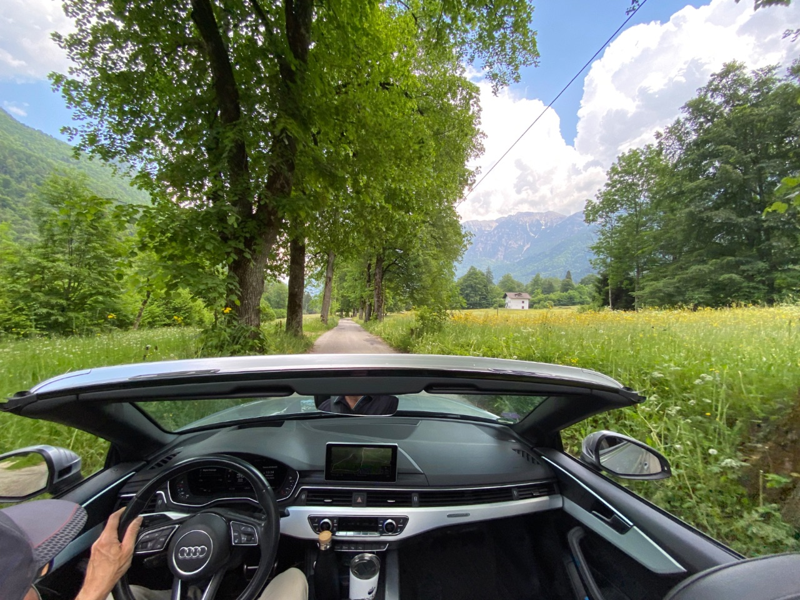
  </a>
  <a href="arte-sella_236695946__photos__70f4c173-21a6-4fa2-b247-39900095189b_8102c936-490b-4b15-bf1d-da8c2a4e7de6.jpg" class="step-thumb-link" data-gallery="step-236695946" data-index="8">
    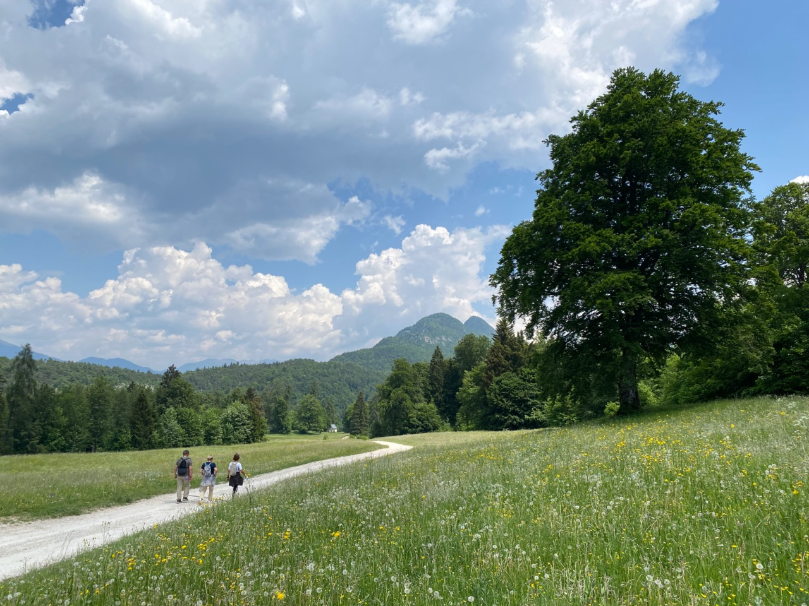
  </a>
  <a href="arte-sella_236695946__photos__000ce854-ed4e-4799-8ba0-d4cabf00518d_7c3ca00e-eadc-4d39-99e5-d8ec751ec373.jpg" class="step-thumb-link" data-gallery="step-236695946" data-index="9">
    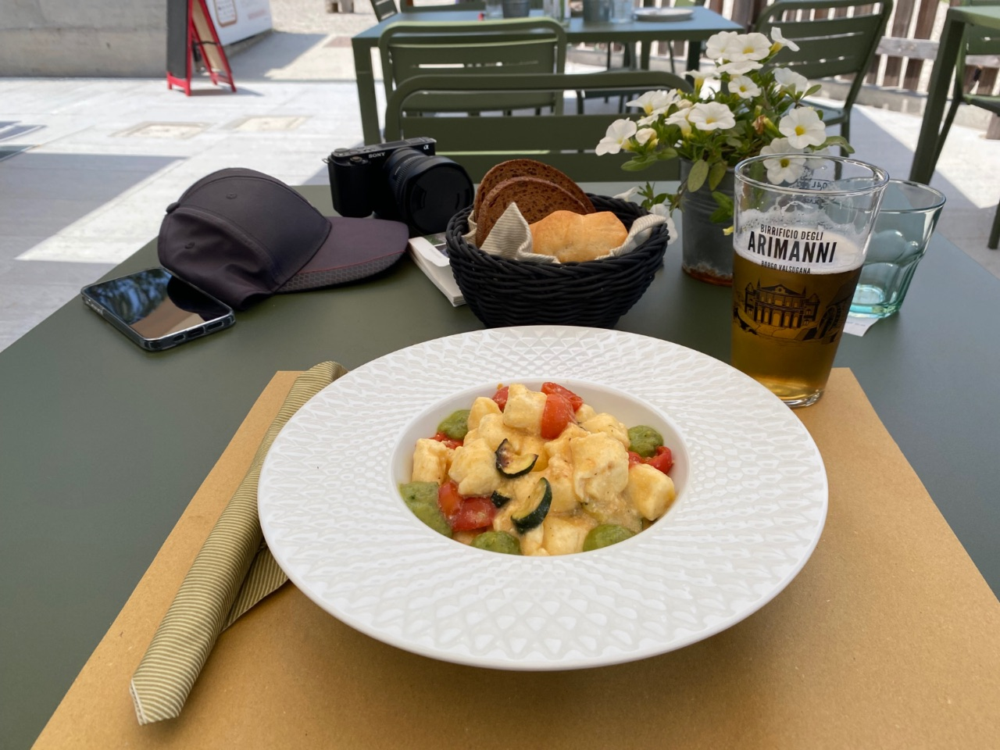
  </a>
  <a href="arte-sella_236695946__photos__87b4c8e2-1909-4597-8b97-70a2ac782e9a_33f6fce7-8a23-46bd-ace9-66a03330fdc9.jpg" class="step-thumb-link" data-gallery="step-236695946" data-index="10">
    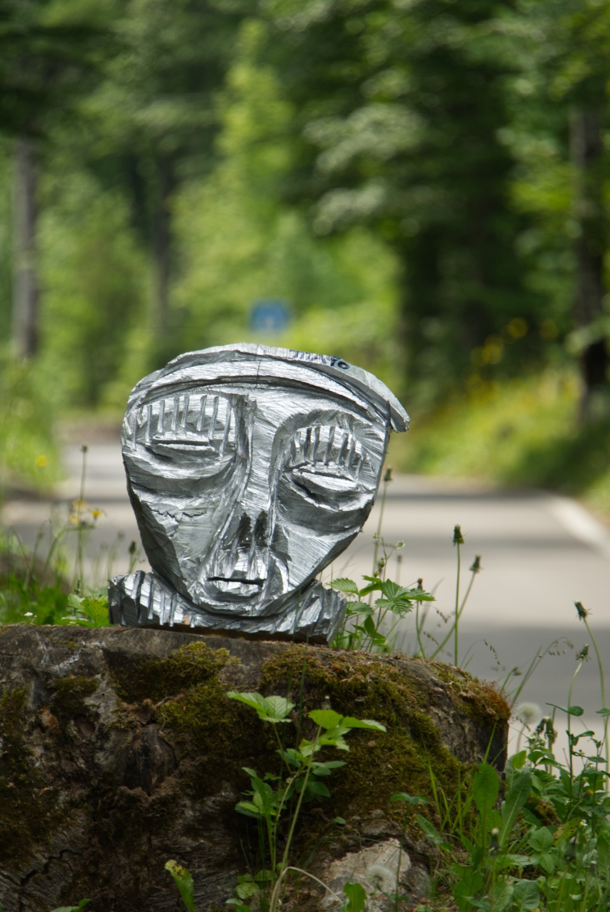
  </a>
  <a href="arte-sella_236695946__photos__1f4fb777-1157-443d-a811-15320c22c8e6_2fb94ac8-0a7b-4c35-9e39-2acc4003c27c.jpg" class="step-thumb-link" data-gallery="step-236695946" data-index="11">
    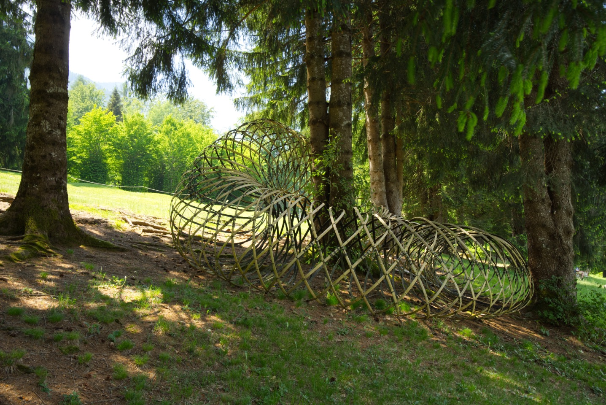
  </a>
  <a href="arte-sella_236695946__photos__2a4ad136-a177-4b70-af05-560ca812c7dd_04e250ee-a59a-4854-bae2-8dc72d7d5dae.jpg" class="step-thumb-link" data-gallery="step-236695946" data-index="12">
    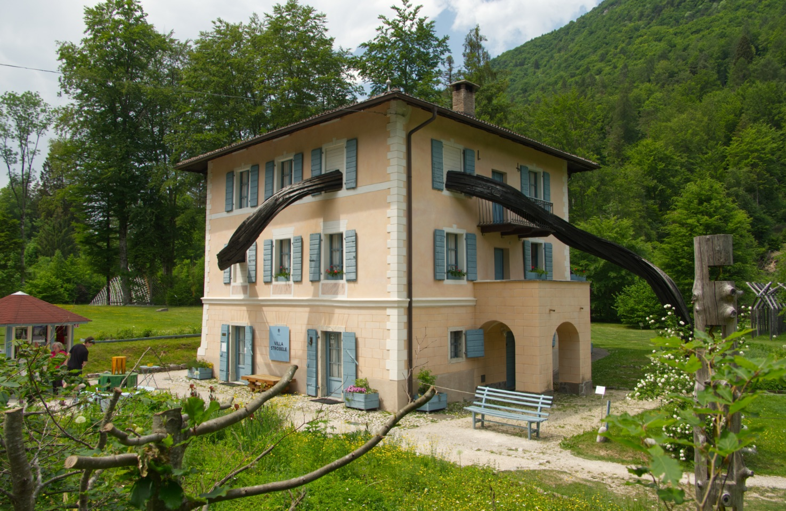
  </a>

#### Etappe: Kaiserjägerstraße

Zum Abendessen bin ich noch die Kaiserjägerstraße hochgefahren. Eine sehr schmale Straße mit in den Felsen gehauenen Tunnels. Beim Gegenverkehr muss man immer gut aufpassen 😅. 
Dann noch bis zur Chiesa di Santa Zita ⛪️ und anschließend zum Essen. 😋
Danach noch die schöne Abendstimmung genossen. Runter ging es dann eine ganz andrre Strecke, denn die Kaiserjägerstraße ist zwischen 20:00-06:00 Uhr gesperrt.

  <a href="magnifica-comunita-degli-altipiani-cimbri_236749766__photos__b8fae703-050b-4750-9d2f-519c7b4a6cd8_fe1cfb31-2918-4cab-8251-3468c3e66dfd.jpg.jpg" class="step-thumb-link" data-gallery="step-236749766" data-index="1">
    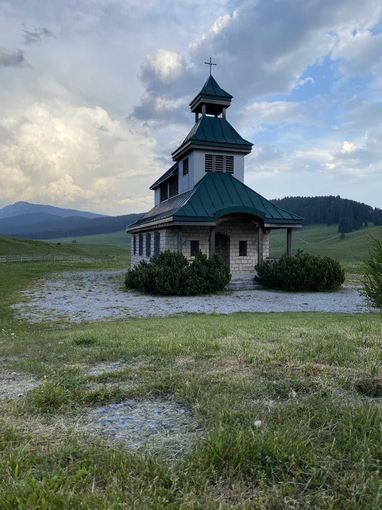
  </a>
  <a href="magnifica-comunita-degli-altipiani-cimbri_236749766__photos__dd52fc2e-5abb-4b1a-a37c-4c3a9c1ea822_d5ca8d88-ec33-41be-8975-e3fadb6ba74f.jpg.jpg" class="step-thumb-link" data-gallery="step-236749766" data-index="2">
    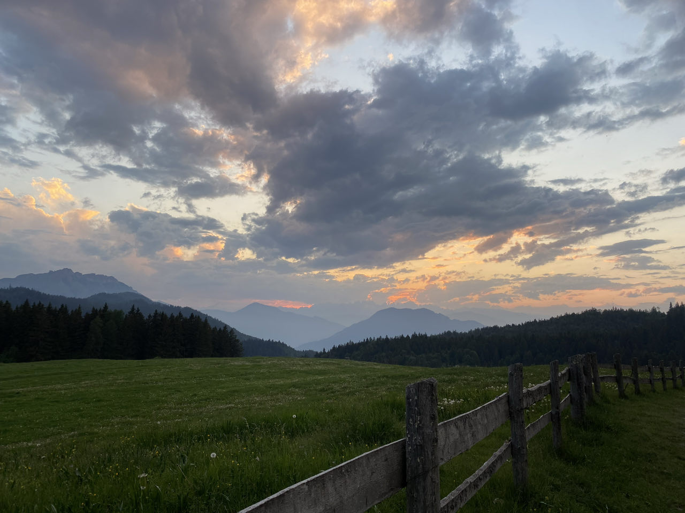
  </a>
  <a href="magnifica-comunita-degli-altipiani-cimbri_236749766__photos__bee9c0c6-4eb3-4504-86d0-2e4a22849457_c79ec153-c28d-43da-8d7f-7dfff42dd8d5.jpg.jpg" class="step-thumb-link" data-gallery="step-236749766" data-index="3">
    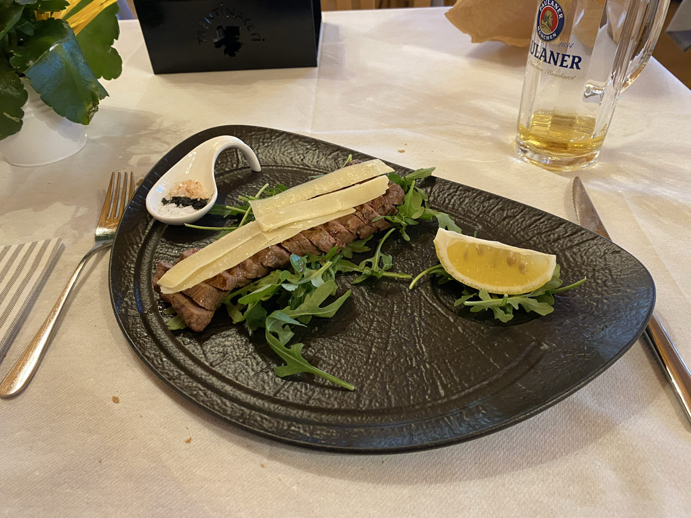
  </a>
  <a href="magnifica-comunita-degli-altipiani-cimbri_236749766__photos__3195ca5c-3842-4f40-9331-5d5687034efa_8eb22dda-aec3-43c4-bb1d-5cade3e7a16b.jpg.jpg" class="step-thumb-link" data-gallery="step-236749766" data-index="4">
    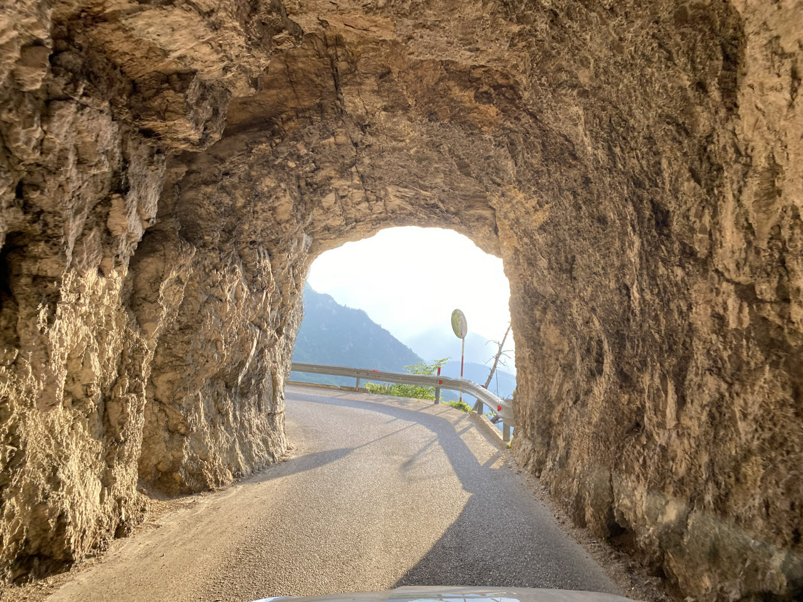
  </a>

### Tag 6 - 28.05.2026

#### Etappe: Radtour um den Lago di Levico

Heute morgen bin ich gleich vor dem Frühstück aufs Fahrrad gestiegen und habe eine Runde um den Lago die Levico gemacht.
Ui, die Abfahrt auf schmalen und steilen Wanderwegen war doch sehr anspruchsvoll. An einer Stelle war der Weg eigentlich wegen Steinschlags gesperrt - naja schnell durch 😅.
Das schmale Nordende des Sees ist ja sehr malerisch und ruhig, das hat sich schon mal gelohnt vorbeizuschauen.
Die Wege wurden breiter bis Levico Terme, dort war ich ja neulich abends schon mal.
Die Auffahrt zurück nach Tenna hoch habe ich dann doch entlang der Straße gemacht, nochmal dieses Abenteuer auf den steilen Wegen über Stock und Stein wollte ich nicht machen 🤣. Gut ist, dass neben der Straße auch ein Fußweg hochgeht, da ist man weg von den schnellen Autos.
Geduscht, gefrühstückt, dann an die Arbeit.

  <a href="radtour-um-den-lago-di-levico_236840594__photos__7054a545-612b-44cb-8dc7-775798ca9dbc_f86776cc-8307-49fb-a75a-e66b301612d1.jpg" class="step-thumb-link" data-gallery="step-236840594" data-index="1">
    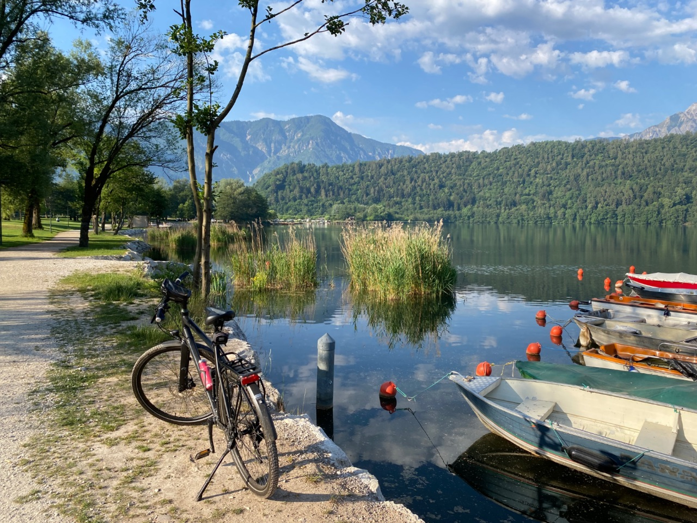
  </a>
  <a href="radtour-um-den-lago-di-levico_236840594__photos__344304f1-4ed0-4a77-876d-c5890c81e761_e69d30f6-8967-4ec6-aa86-07e5f90846df.jpg" class="step-thumb-link" data-gallery="step-236840594" data-index="2">
    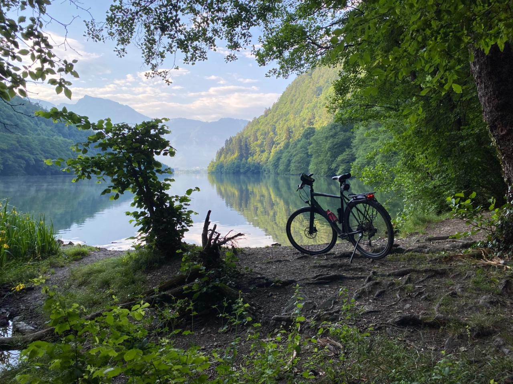
  </a>
  <a href="radtour-um-den-lago-di-levico_236840594__photos__a9c323e8-8d77-49d8-86e8-1dd796ea8ed8_e41babf8-15ab-4bdd-8c86-82da04648e66.jpg" class="step-thumb-link" data-gallery="step-236840594" data-index="3">
    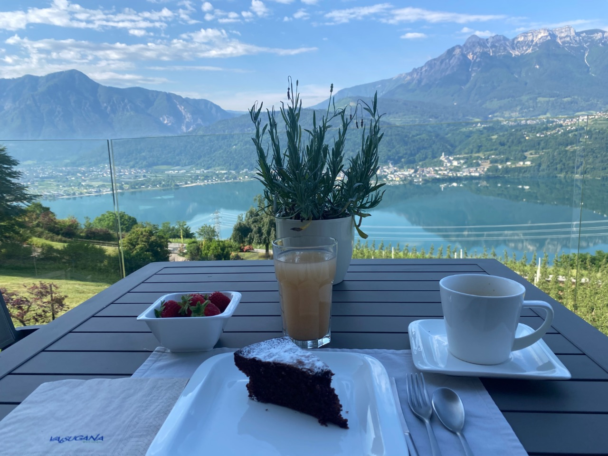
  </a>
  <a href="radtour-um-den-lago-di-levico_236840594__photos__9448d9e1-42a0-408f-b447-ca5c789cf680_a042fe57-bd3e-44f4-a232-0f1af79e24bb.jpg" class="step-thumb-link" data-gallery="step-236840594" data-index="4">
    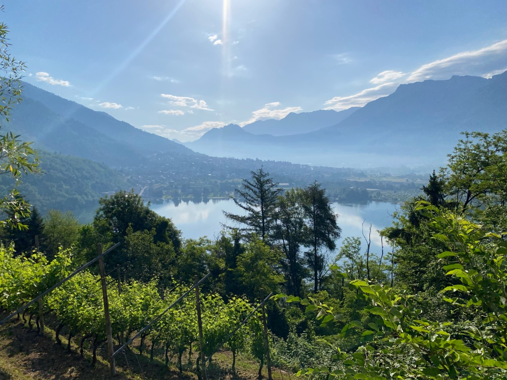
  </a>
  <a href="radtour-um-den-lago-di-levico_236840594__photos__9f739e9f-8a5f-4b16-99be-1a0fe21ab824_8ec64c4f-8054-4a5c-b409-9ea3e7361f1a.jpg" class="step-thumb-link" data-gallery="step-236840594" data-index="5">
    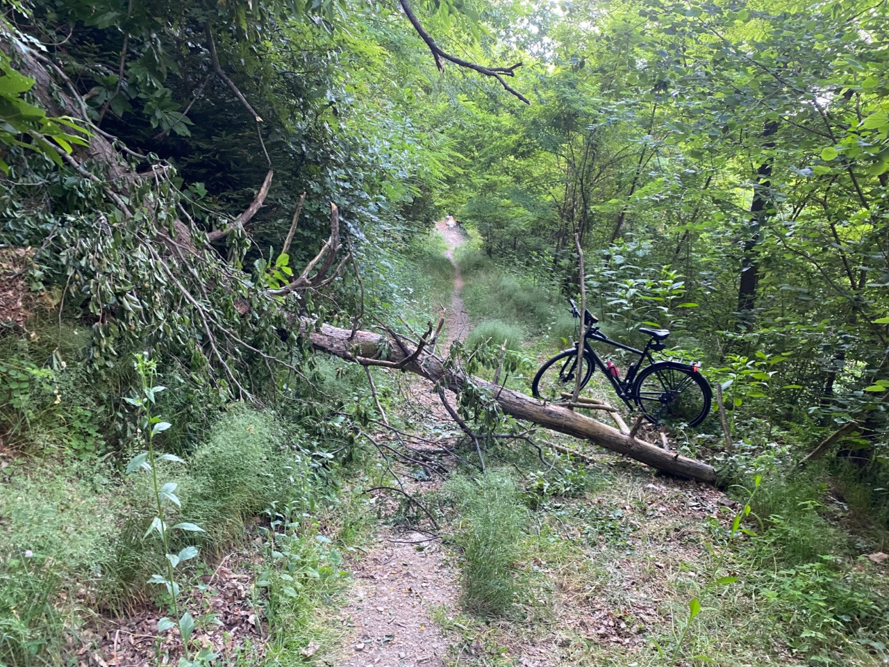
  </a>
  <a href="radtour-um-den-lago-di-levico_236840594__photos__8ea9ee37-0f24-4dff-9f0b-8bc411a138aa_84c1d372-046f-40a3-ad5b-878be58afbe9.jpg" class="step-thumb-link" data-gallery="step-236840594" data-index="6">
    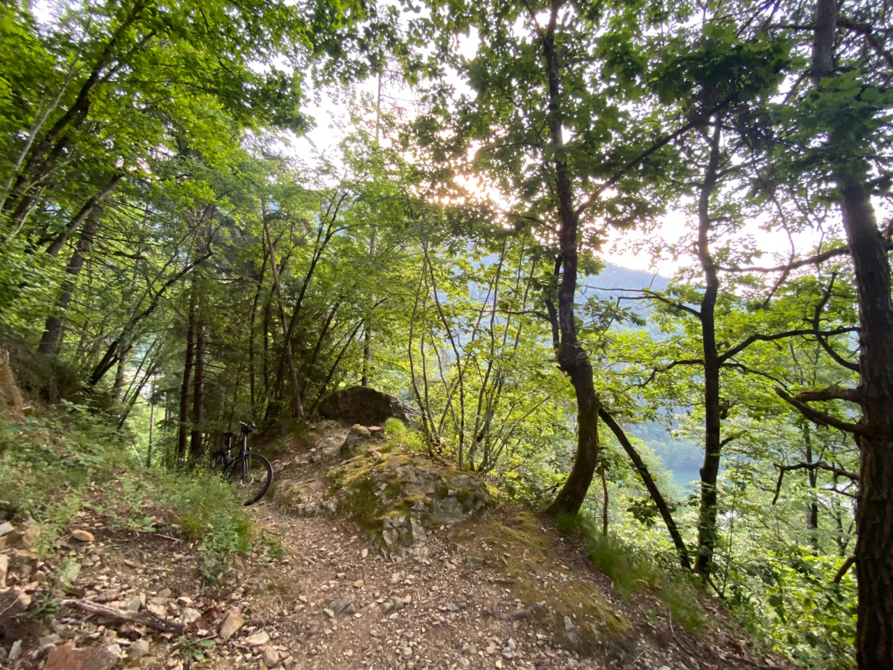
  </a>
  <a href="radtour-um-den-lago-di-levico_236840594__photos__2527a95c-5820-4e14-93ab-e9230e5c530d_6599c3d0-7e4e-4f96-8e47-bd6e01cfb4fa.jpg" class="step-thumb-link" data-gallery="step-236840594" data-index="7">
    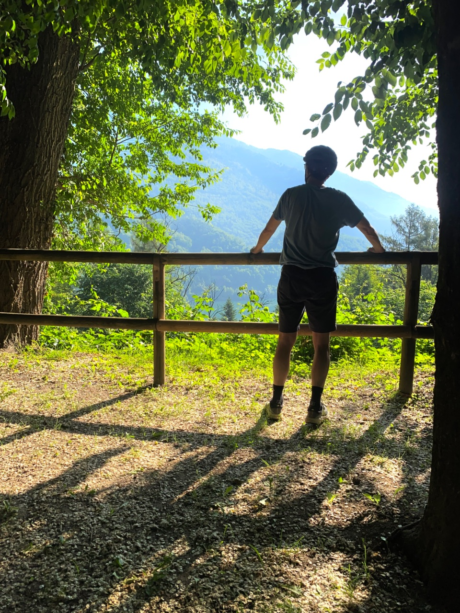
  </a>
  <a href="radtour-um-den-lago-di-levico_236840594__photos__6a358665-4aaa-4b59-915d-121a6fb05ee2_45ad92e7-4c03-4444-a462-f3d1f3781cd7.jpg" class="step-thumb-link" data-gallery="step-236840594" data-index="8">
    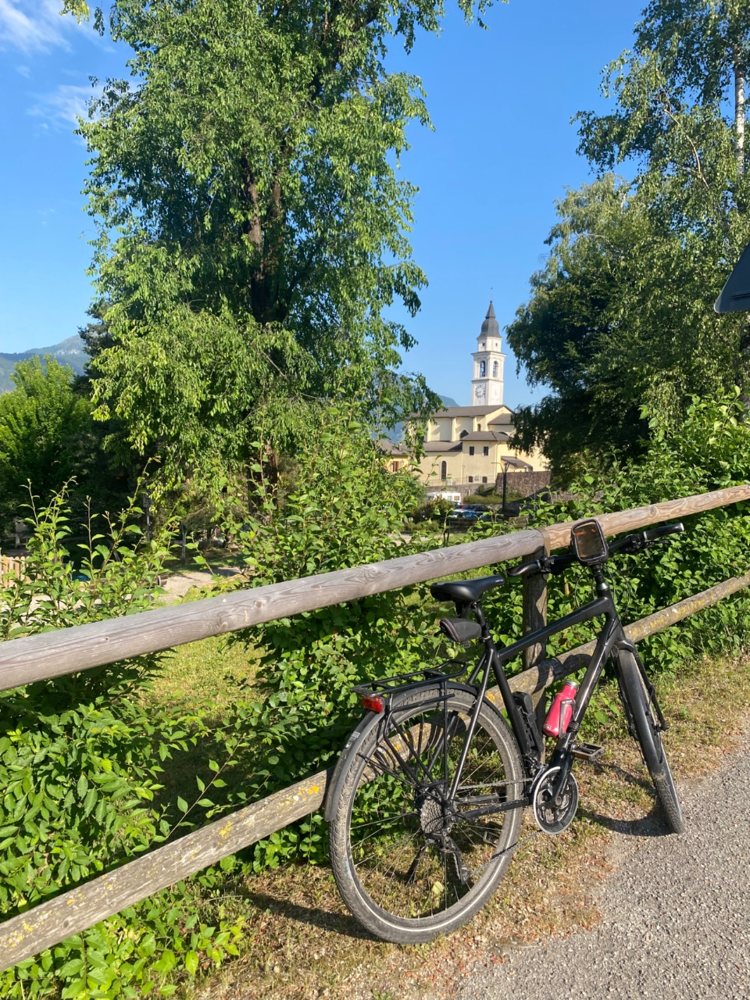
  </a>
  <a href="radtour-um-den-lago-di-levico_236840594__photos__744ea656-4bc3-416e-9d9d-9ab077f78b72_217e8efc-02e7-4829-a7fb-cedfa46dbb45.jpg" class="step-thumb-link" data-gallery="step-236840594" data-index="9">
    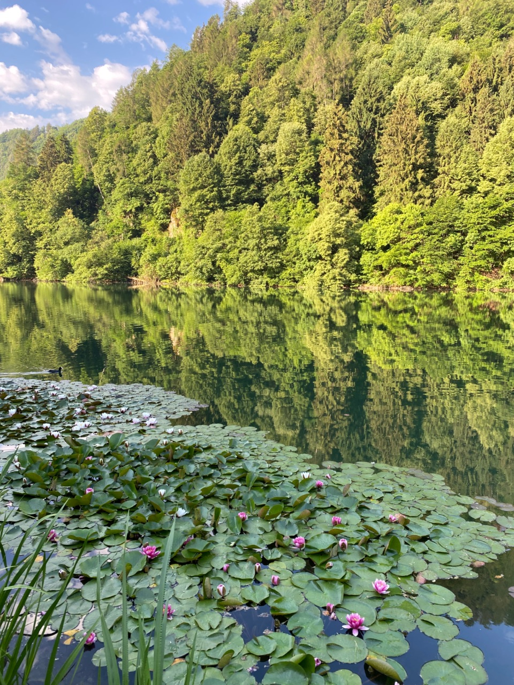
  </a>
  <a href="radtour-um-den-lago-di-levico_236840594__photos__f4234323-b673-4e7b-bad4-2614897abf2c_149ed8d4-dbeb-4f77-bac8-706f81bc5b82.jpg" class="step-thumb-link" data-gallery="step-236840594" data-index="10">
    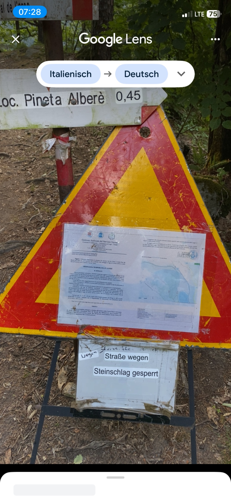
  </a>

### Tag 7 - 29.05.2026

#### Etappe: Orrido di Ponte Alto

Heute früh habe ich ein Ticket für die Schlucht und Wasserfälle "Orrido di Ponte Alto" nahe Trient gebucht. Zuerst eine gemütliche Fahrt dorthin, ohne den langen Tunnel. Vorbei kommt man am Forte di Civezzano, das hat aber erst am Nachmittag geöffnet.

Die Schlucht ist gar nicht so groß, sie ist nur möglich, mit einer Führung zu besichtigen. Die Gesteinsschichten wurden erklärt und wie das Sediment aus den Bergen das rötliche weichere Gestein hier abschleift. Am Ende der Führung geht man noch eine Wendeltreppe hinunter und steht dann quasi im Wasserfall. 

Auf der Heimfahrt gab's dann noch Mittagessen mit Blick auf den Caldonazzo-See und ein anschließender Sprung ins Wasser.

  <a href="orrido-di-ponte-alto_237118338__photos__54748578-5cbf-4efb-bb3e-34a7b0aefbb8_d581dedc-ec98-4983-9d8d-064c4f3f14fd.jpg" class="step-thumb-link" data-gallery="step-237118338" data-index="1">
    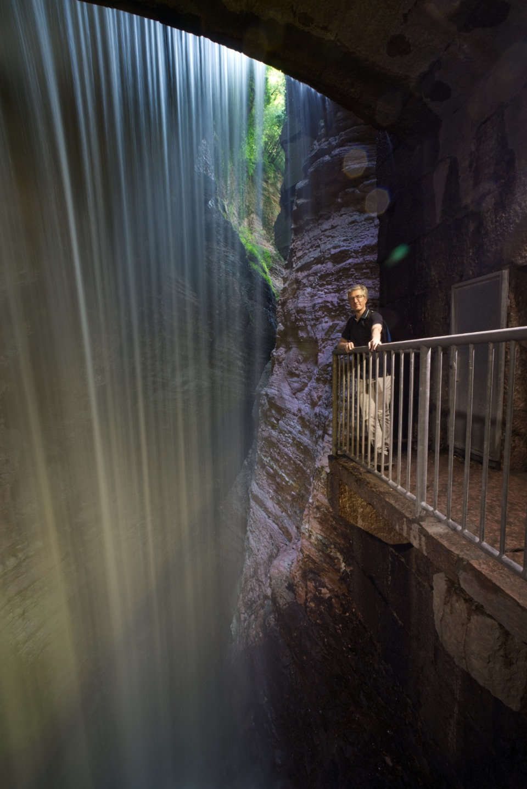
  </a>
  <a href="orrido-di-ponte-alto_237118338__photos__745531fc-c718-42dc-b38f-7eb7222db3a3_d42e1984-19ef-497e-801a-c96cede854f0.jpg" class="step-thumb-link" data-gallery="step-237118338" data-index="2">
    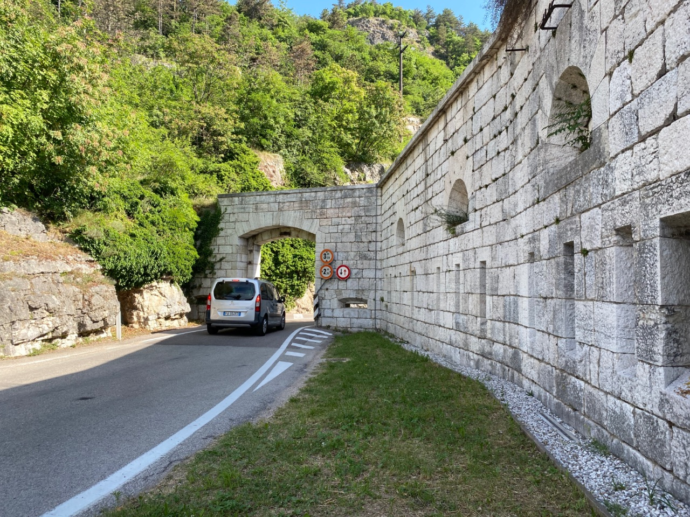
  </a>
  <a href="orrido-di-ponte-alto_237118338__photos__42320b44-325c-44b0-a60b-7835422a3e11_c394a5a4-995a-4fae-a8eb-fcdaa88fdeee.jpg" class="step-thumb-link" data-gallery="step-237118338" data-index="3">
    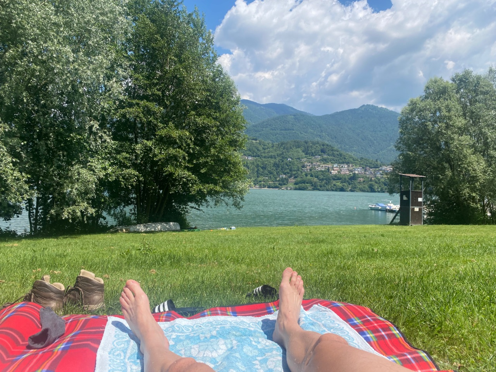
  </a>
  <a href="orrido-di-ponte-alto_237118338__photos__1284e0dc-1516-4c7d-b1be-83002405b374_b85623ed-4c7a-4523-b5c2-cd694c380979.jpg" class="step-thumb-link" data-gallery="step-237118338" data-index="4">
    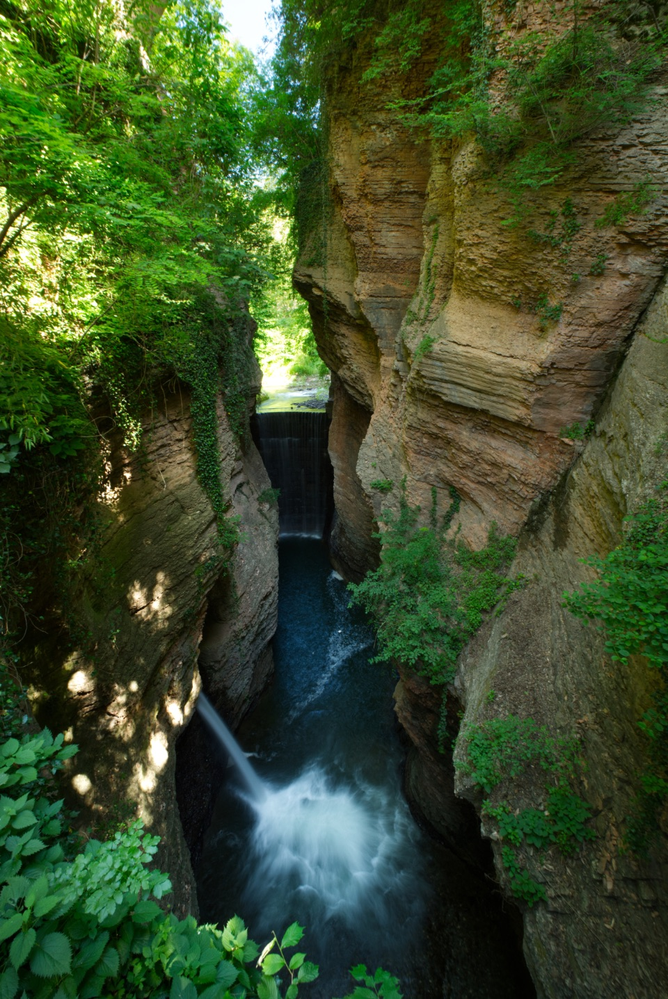
  </a>
  <a href="orrido-di-ponte-alto_237118338__photos__facff0f8-a6b9-4819-9fe7-1e6d1ee180c7_932d400b-54bc-4e53-8f08-0071da9e34a6.jpg" class="step-thumb-link" data-gallery="step-237118338" data-index="5">
    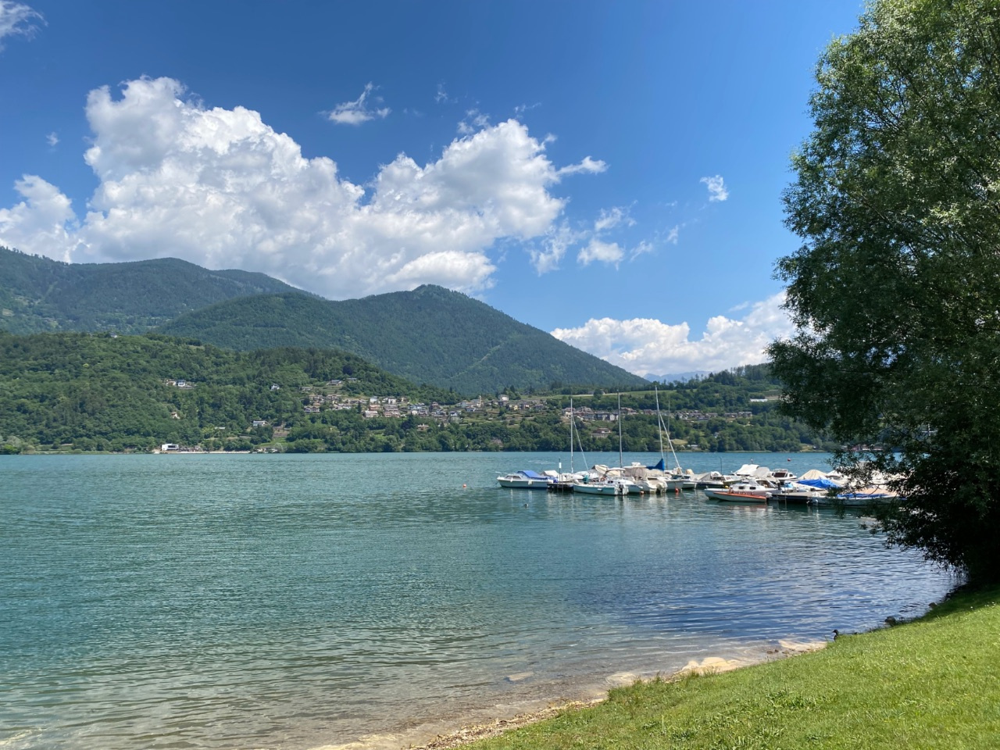
  </a>
  <a href="orrido-di-ponte-alto_237118338__photos__ae79ebe3-bd49-4bfe-9390-21f079419716_8ab6829c-84fc-4512-9114-712a8cbb2bfd.jpg" class="step-thumb-link" data-gallery="step-237118338" data-index="6">
    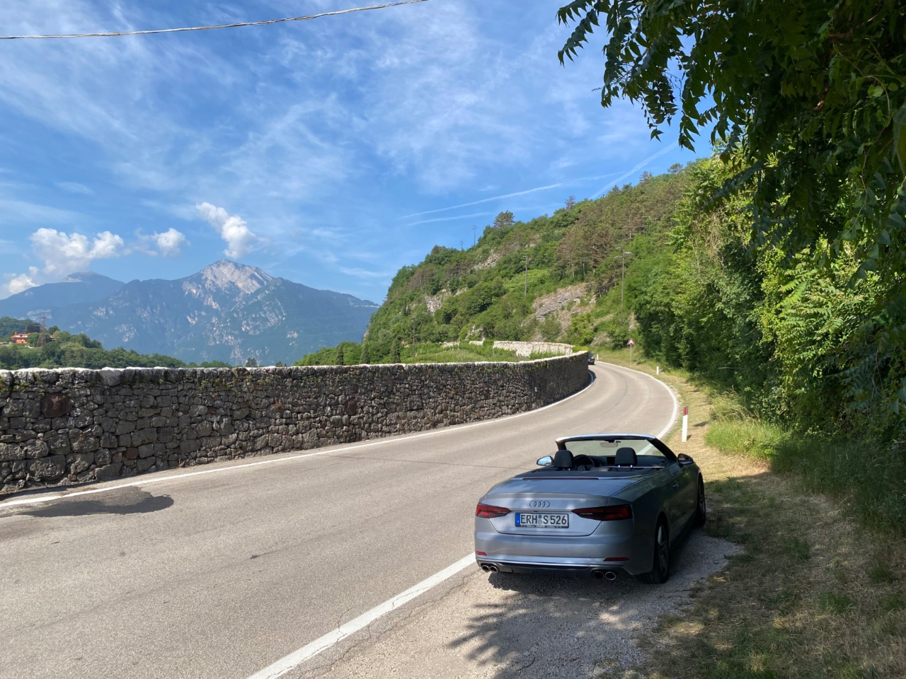
  </a>
  <a href="orrido-di-ponte-alto_237118338__photos__5a499005-5ef3-4244-ac21-a0bfac9294c4_68b9ca63-edd5-477b-9048-e993bcf4833f.jpg" class="step-thumb-link" data-gallery="step-237118338" data-index="7">
    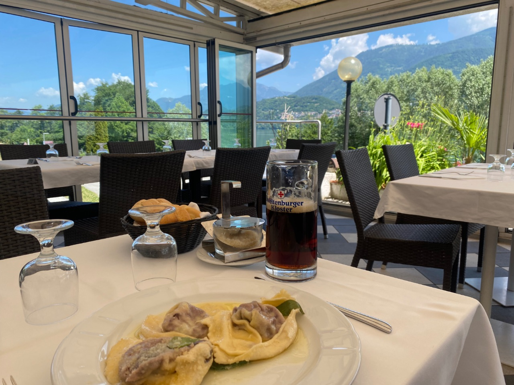
  </a>
  <a href="orrido-di-ponte-alto_237118338__photos__10a855f3-eca8-49f0-aa10-88d637e2c8fd_6786e035-bd39-406a-9356-462fbb22336b.jpg" class="step-thumb-link" data-gallery="step-237118338" data-index="8">
    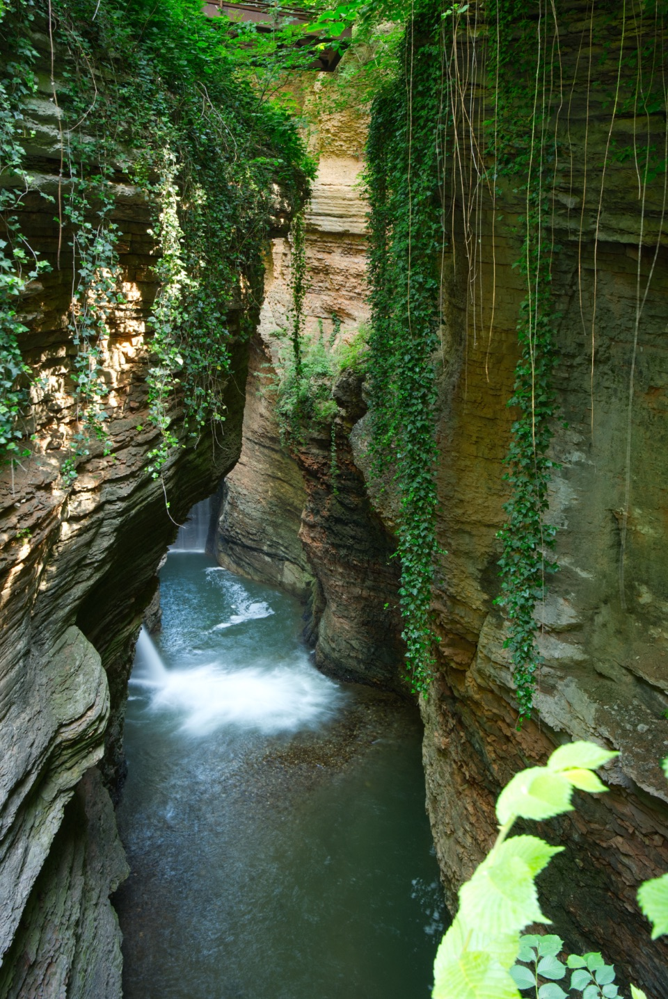
  </a>
  <a href="orrido-di-ponte-alto_237118338__photos__d3a1227c-ebb8-4c26-97d8-6f2edbf695f1_3e409785-98c9-4d94-8ac7-85b67126bb95.jpg" class="step-thumb-link" data-gallery="step-237118338" data-index="9">
    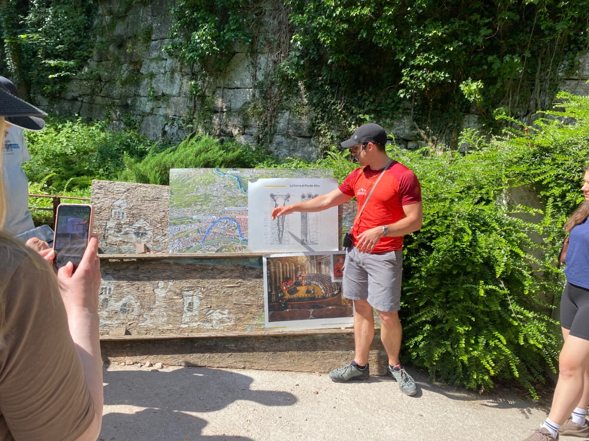
  </a>
  <a href="orrido-di-ponte-alto_237118338__photos__c9ae7b64-991d-4c1f-9af2-c41467af4067_127b63c6-11a3-43c6-8fa7-ef432d5510f6.jpg" class="step-thumb-link" data-gallery="step-237118338" data-index="10">
    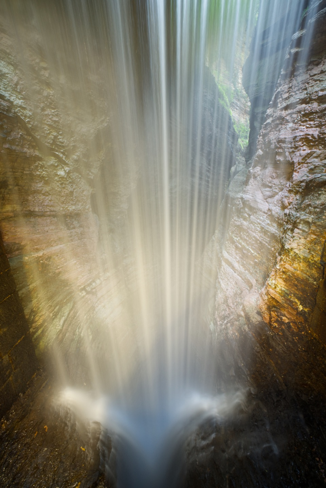
  </a>

### Tag 8 - 30.05.2026

#### Etappe: Cles

Heute geht es langsam auf die Heimreise. Von Tenna gut gestärkt und mit trockenem und offenem Verdeck ging es los. Ich hab vorher noch einmal das Auto umgedreht, damit beide Seiten des Stoffverdecks trocken werden. 
Oberhalb von Trient vorbeigemogelt, dann runter ins Tal Richtung Cles an dem großen Stausee vorbei. Dort geht es zum Passo Tonale hoch in Richtung Gavia-Pass, den ich heute fahren will.

  <a href="cles_237454267__photos__e2a28ca5-8942-4c8b-8766-e2ef1ba93fcd_f242c9de-e2fd-46cb-bd72-c208899d2b32.jpg" class="step-thumb-link" data-gallery="step-237454267" data-index="1">
    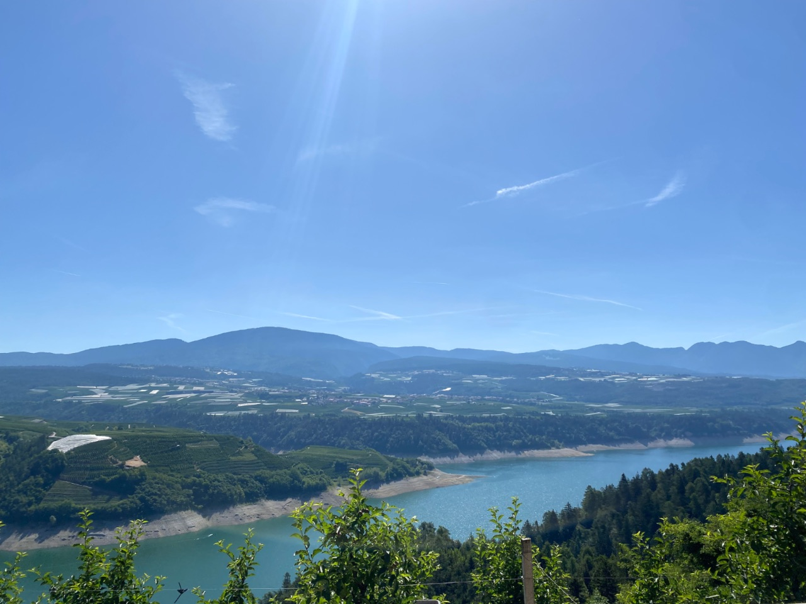
  </a>
  <a href="cles_237454267__photos__062da0c2-7cf9-4fb6-ac1f-597d7674284f_ad7bb08a-5385-4c0d-a633-cbfd8f3ffd39.jpg" class="step-thumb-link" data-gallery="step-237454267" data-index="2">
    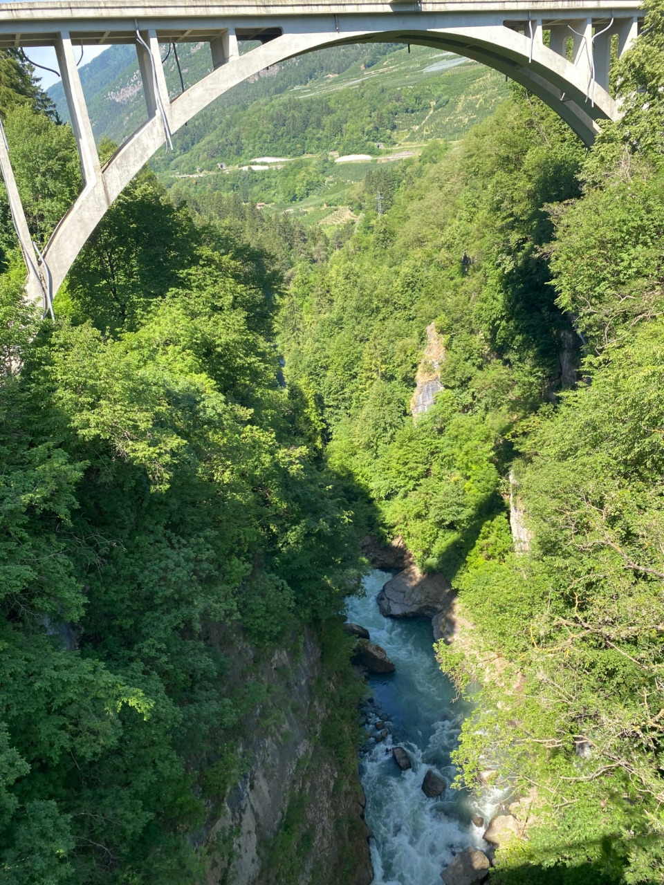
  </a>
  <a href="cles_237454267__photos__ffa89e8c-7659-49f0-a37d-8750cdb2739a_8a067cce-c93c-40d6-bd5d-990e1f6d0f37.jpg" class="step-thumb-link" data-gallery="step-237454267" data-index="3">
    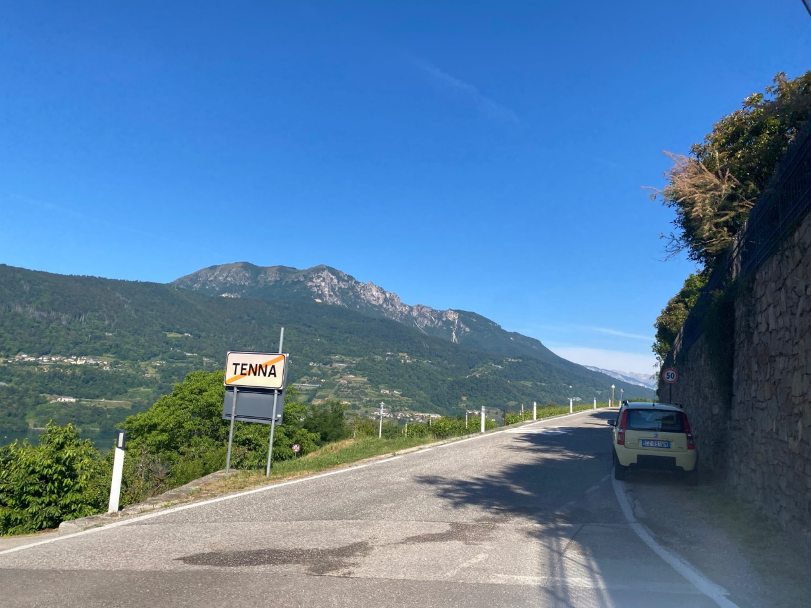
  </a>
  <a href="cles_237454267__photos__ca1fff56-40a0-4108-a885-33362dff865f_7ec58e4b-89ab-4dae-9b3b-eb6021b21232.jpg" class="step-thumb-link" data-gallery="step-237454267" data-index="4">
    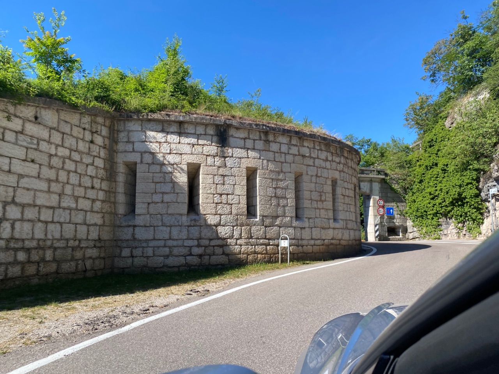
  </a>
  <a href="cles_237454267__photos__155e930e-9b1e-4a7f-ab57-ad128aef4dd2_4b4d258a-6226-4b02-8f62-b633e39e30c6.jpg" class="step-thumb-link" data-gallery="step-237454267" data-index="5">
    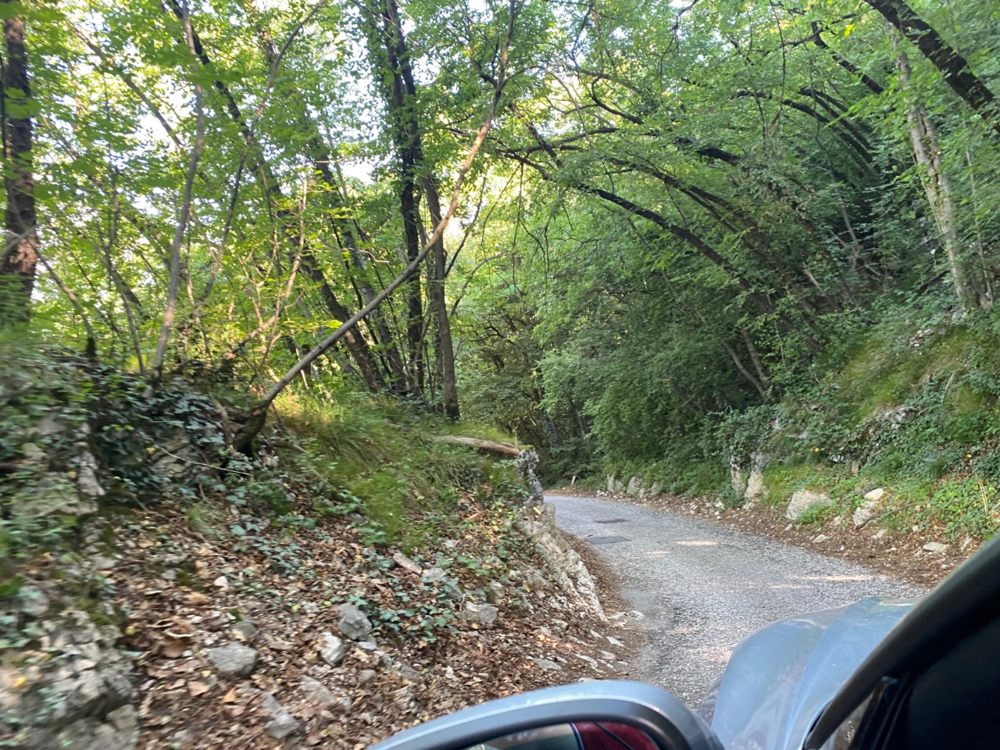
  </a>
  <a href="cles_237454267__photos__3eefa42d-1b88-43c1-82a2-036ed528a5fa_3812c328-6f8b-44db-8251-c2a6c8eb4c2c.jpg" class="step-thumb-link" data-gallery="step-237454267" data-index="6">
    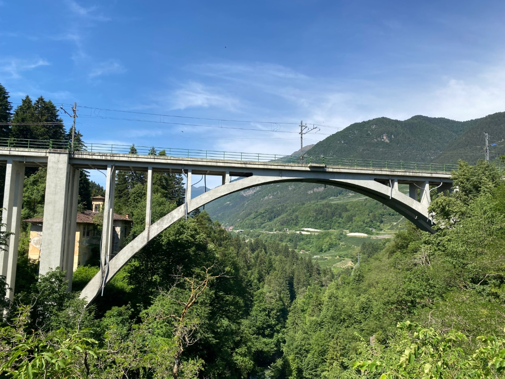
  </a>
  <a href="cles_237454267__photos__136a9020-8127-4e7d-82b2-b36eff066593_2d1473b6-1927-4f4c-b8f1-16af57573bbd.jpg" class="step-thumb-link" data-gallery="step-237454267" data-index="7">
    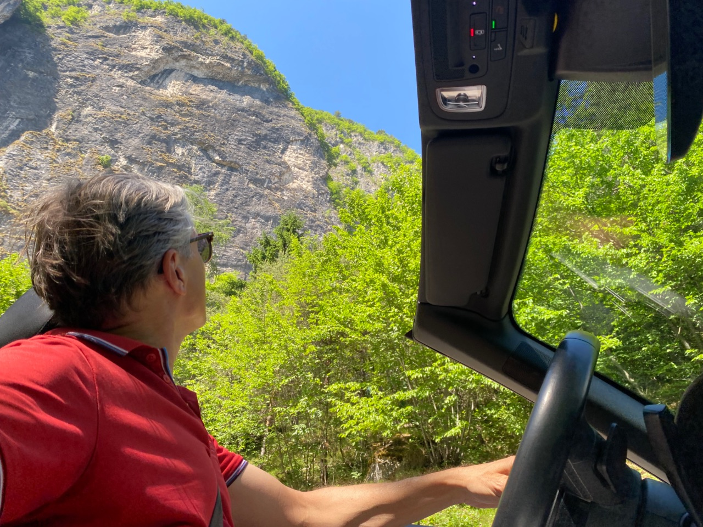
  </a>
  <a href="cles_237454267__photos__94ea468e-2568-4494-a8c7-d65469df48e2_2a43d0cd-43d6-4e78-8240-43c0e4f61e57.jpg" class="step-thumb-link" data-gallery="step-237454267" data-index="8">
    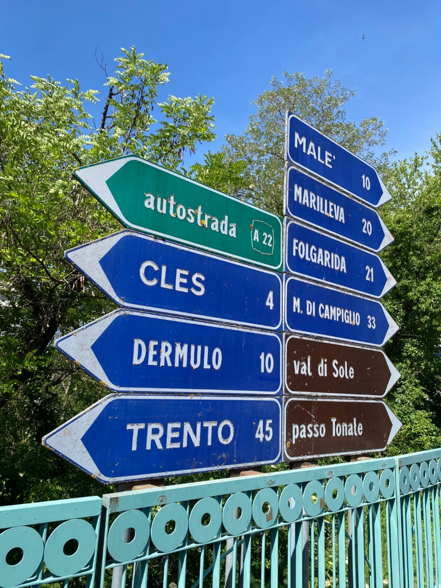
  </a>

#### Etappe: Passo di Gavia

Der Passo Tonale war nicht spektakulär, aber der Gavia Pass wartete ja bereits. Und der ist auch nicht ohne grund schwarz markiert im Pässeatlas. Sehr enge Straßen, Rennradfahrer, die sich den Berg hochzwingen und runterrauschen. Motorräder, die überholen wollen. Langsamere Autos, die hoffentlich mal einen Aussichtspunkt ansteuren. Immer Geduld, damit alle sicher und froh rauf und wieder runterkommen.
Aber: Die Rennradfahrer im Tunnel OHNE Frontstrahler oder Scheinwerfer bergab. Absolut Kamikaze, Autos fahren bergauf im unbeleuchteten Tunnel und überholen Radler, die nur hinten ihr Blinklicht haben (immerhin). Aber im Gegenverkehr dann eben die absoluten Stealthbomber 🚴‍♂️ - die wollen wohl mal wie die Mücken am Kühlergrill landen. 😬
Naja, alles gut geschafft und viele Ausblicke und das freundliche Wetter genossen bis hoch auf 2650m. Oben dann einen Espresso getrunken und mir einen Sticker geholt - nur einen megagroßen, alle anderen waren nur für Motorradfahrer 🫠

  <a href="passo-di-gavia_237455203__photos__0c5bf9c6-4d35-492a-88f5-aeea46f06df8_f554969b-3861-423a-8560-6eaf8b6d3282.jpg" class="step-thumb-link" data-gallery="step-237455203" data-index="1">
    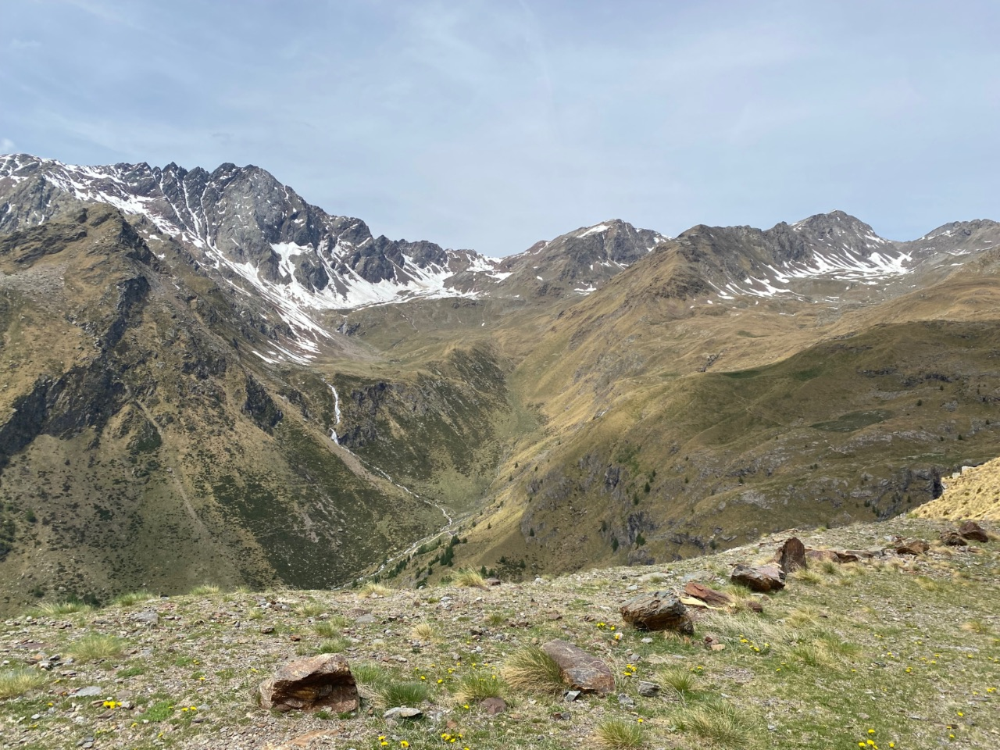
  </a>
  <a href="passo-di-gavia_237455203__photos__4df8051b-a605-41aa-aa33-9e0f54acfbae_c5812b21-4991-4ecb-bf76-80b20f24ae70.jpg" class="step-thumb-link" data-gallery="step-237455203" data-index="2">
    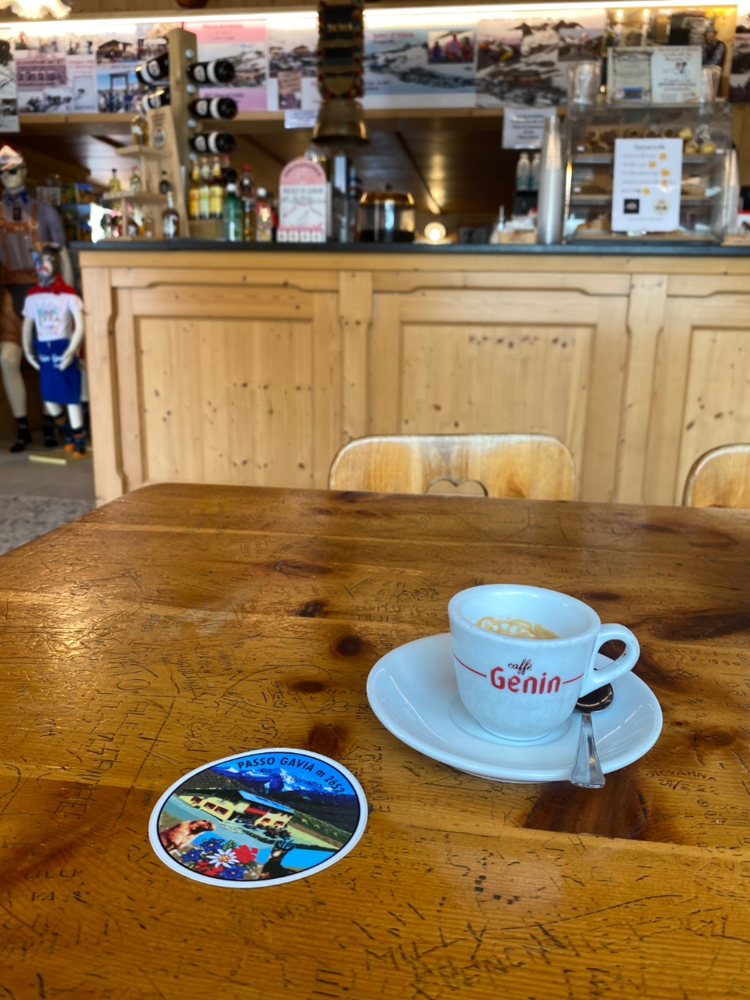
  </a>
  <a href="passo-di-gavia_237455203__photos__a70e2cc8-6336-4742-84ef-500504183c2a_84e32c13-8710-421c-a8b3-fdedc86fdc69.jpg" class="step-thumb-link" data-gallery="step-237455203" data-index="3">
    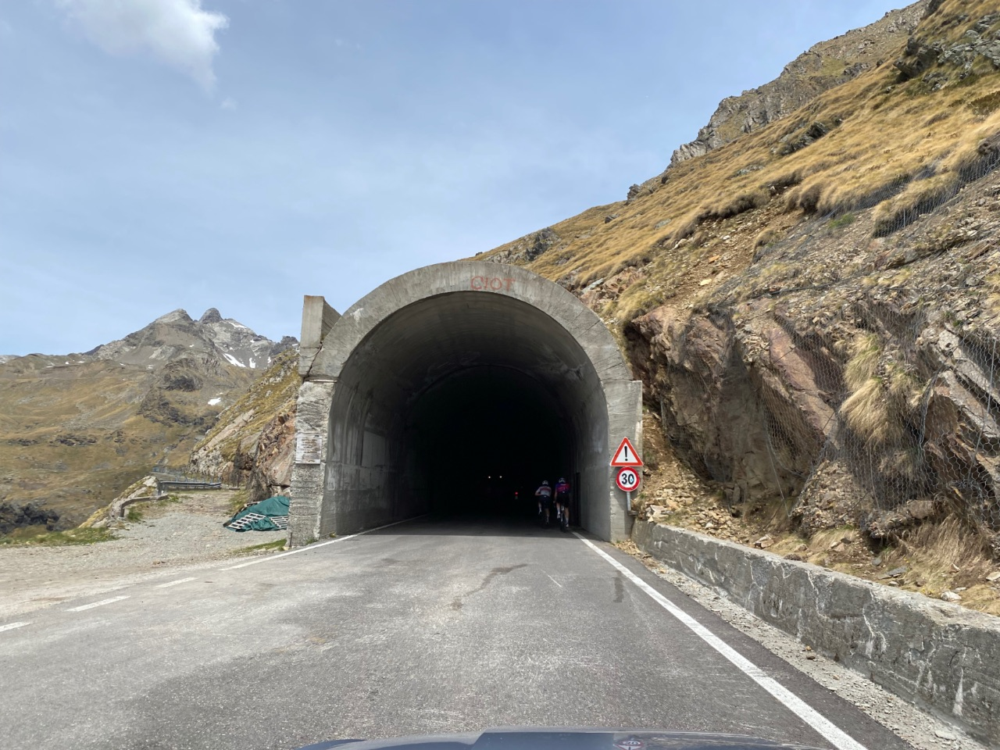
  </a>
  <a href="passo-di-gavia_237455203__photos__f5fcf68a-abae-4209-b908-ac552d7ce566_6b0499d9-54bb-45c0-b5ff-d00f7d122c9a.jpg" class="step-thumb-link" data-gallery="step-237455203" data-index="4">
    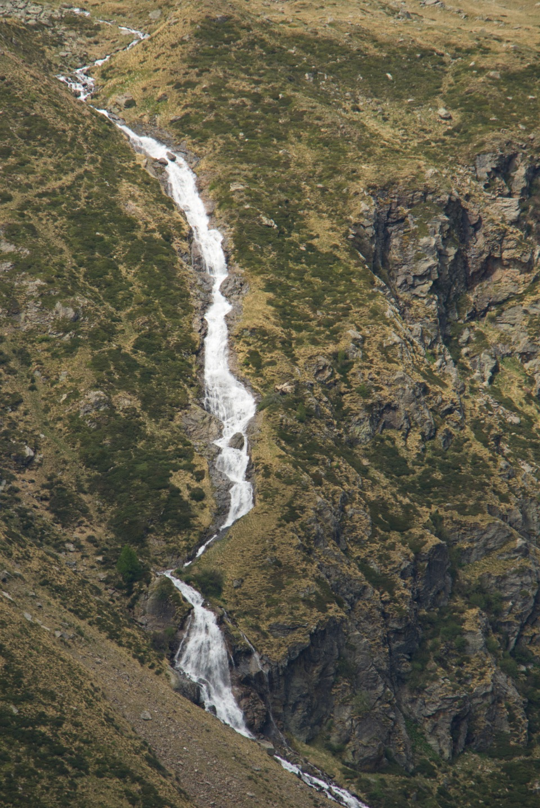
  </a>
  <a href="passo-di-gavia_237455203__photos__3fc27b80-856e-433f-a97a-f3cddc7dcaf9_6a6717ba-f1b6-4b93-979d-712303d7f9eb.jpg" class="step-thumb-link" data-gallery="step-237455203" data-index="5">
    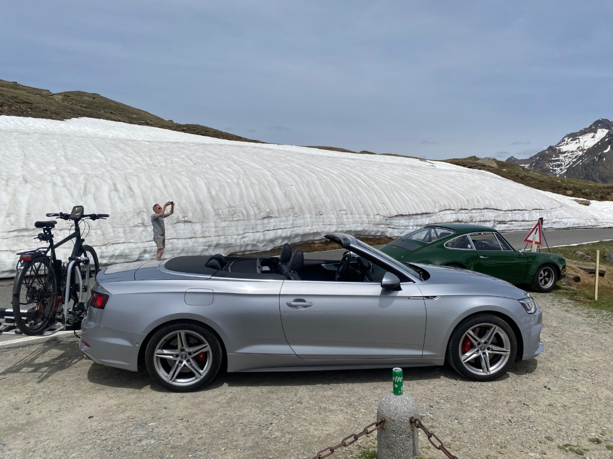
  </a>
  <a href="passo-di-gavia_237455203__photos__55b2ca4f-b7b8-4a00-bf83-3c202c141955_617328da-b311-48de-bd48-c30bba42f314.jpg" class="step-thumb-link" data-gallery="step-237455203" data-index="6">
    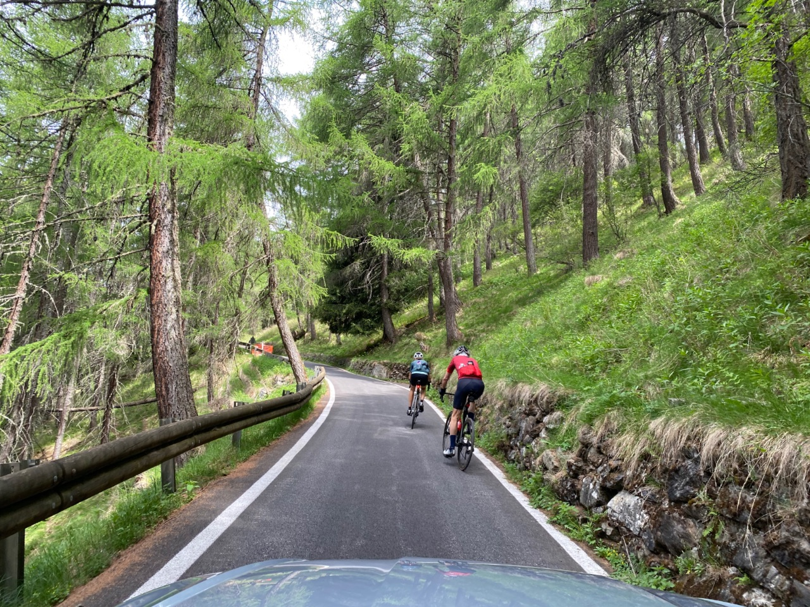
  </a>
  <a href="passo-di-gavia_237455203__photos__b1edf2d5-8560-4038-93b2-6c2d58fd064b_414c07a5-31dd-455e-9a0f-6519e7c35028.jpg" class="step-thumb-link" data-gallery="step-237455203" data-index="7">
    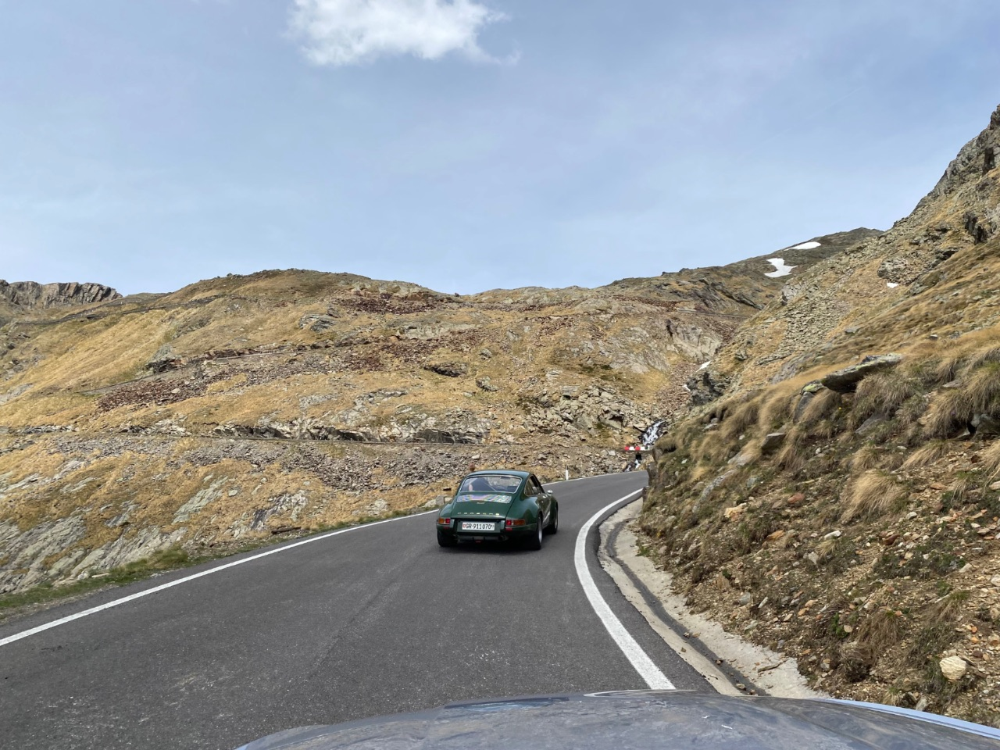
  </a>
  <a href="passo-di-gavia_237455203__photos__5ad3b242-8fa7-42f0-b3ce-0bbc07b1b653_319b3f1f-09f2-4c7e-b325-89eab34a566b.jpg" class="step-thumb-link" data-gallery="step-237455203" data-index="8">
    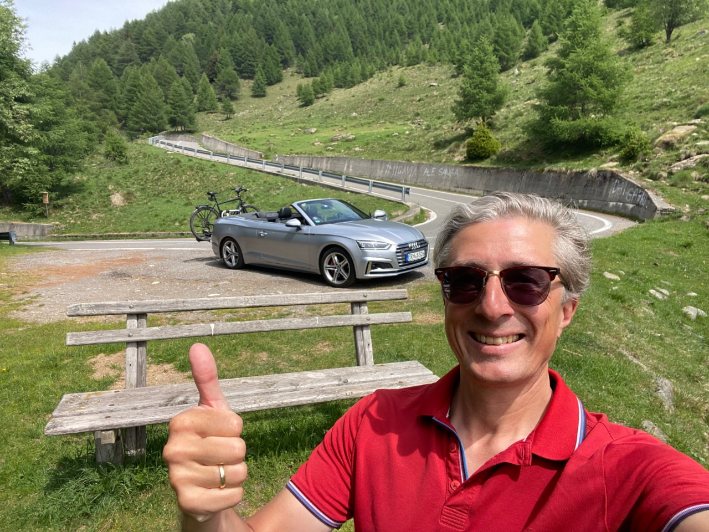
  </a>
  <a href="passo-di-gavia_237455203__photos__6e8f3e7a-486b-457b-875b-58d38eed508e_22e0f03f-aa5f-45c8-b64c-3e96e3b5ee50.jpg" class="step-thumb-link" data-gallery="step-237455203" data-index="9">
    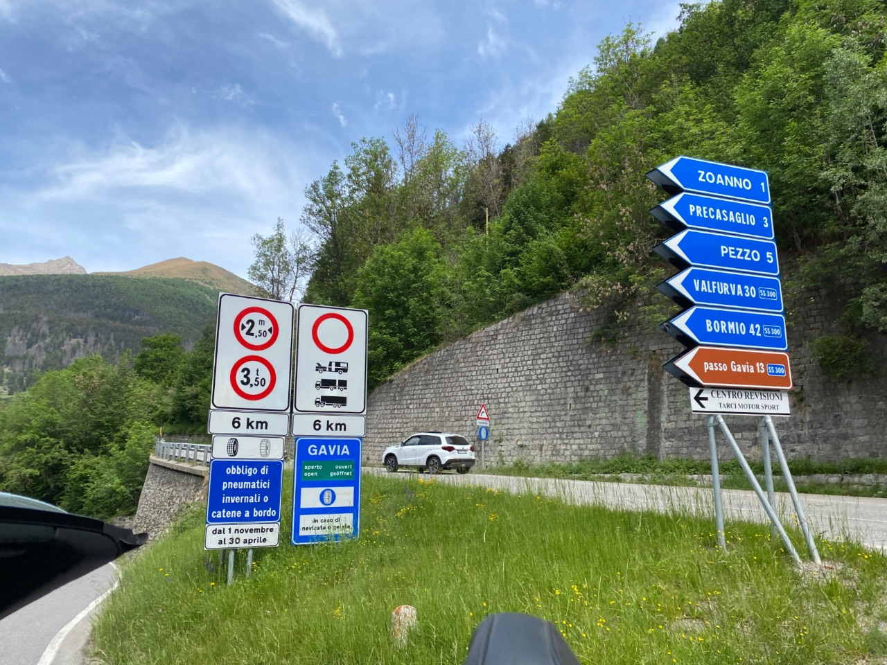
  </a>

#### Etappe: Bormio

Vom Gavia-Pass geht es runter Richtung Bormio, dort kann man dann gleich zum Stelvio-Pass fahren, oder nach Livigno einen Abstecher machen.
Und das war ja der Plan heute, weil es dort zollfreien Sprit gibt. Bei einer Kirche oberhalb von Bormio hat man einen schönen Blick, bevor man sich weiter über den Passo Foscagno nach Livigno fährt. In einem Ort noch vor dem Pass war eine Hochzeit, oberhalb war ein markanter Wasserfall.

Vor Livigno und der Passhöhe steht ein kleines Zollhäuschen, es wird aber wenig kontrolliert.

  <a href="bormio_237455608__photos__dcde5e89-a735-4c4f-98e0-f20022b65065_f856537e-baa2-487b-a7c9-edc6ec4327e2.jpg" class="step-thumb-link" data-gallery="step-237455608" data-index="1">
    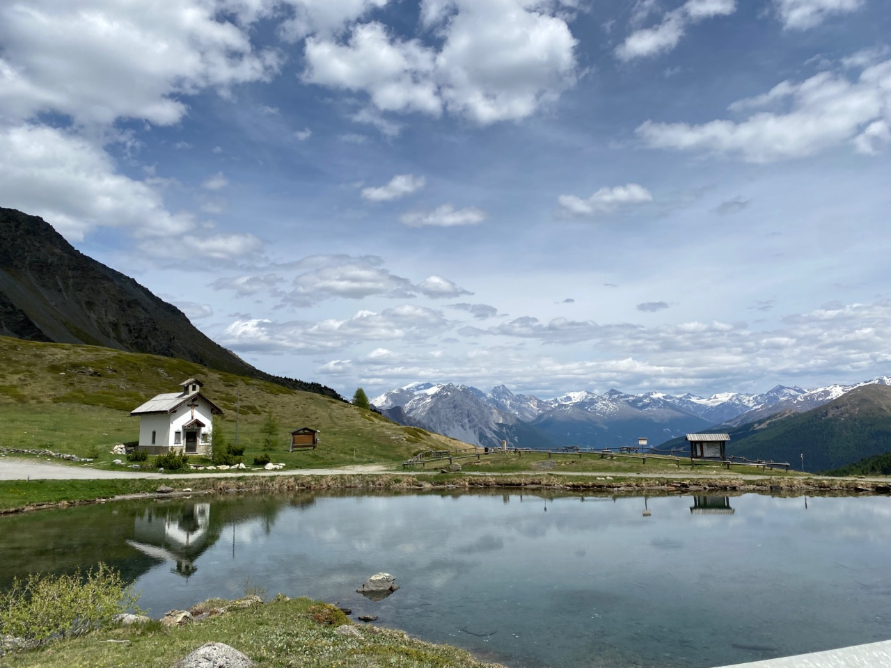
  </a>
  <a href="bormio_237455608__photos__35dbbf6e-13cb-4cb4-94cd-ff1d06df7b6b_e40171b7-e39d-422b-a542-07eec06a6ece.jpg" class="step-thumb-link" data-gallery="step-237455608" data-index="2">
    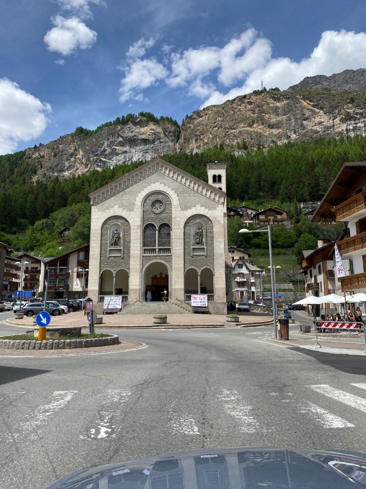
  </a>
  <a href="bormio_237455608__photos__c03a7290-7885-44c8-9d46-6839f6d85ddc_9d4e66b9-021c-4534-871d-0c805b97bf46.jpg" class="step-thumb-link" data-gallery="step-237455608" data-index="3">
    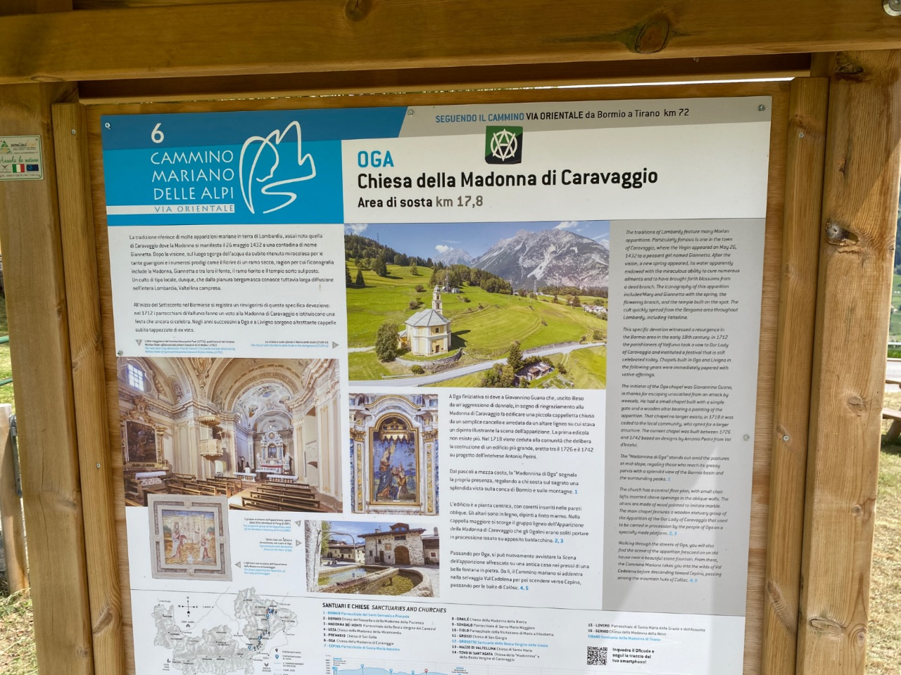
  </a>
  <a href="bormio_237455608__photos__32f79ce6-63b0-4900-921b-0ec36ea0fe38_7ff1049a-2528-4d04-bba2-1e6fa6696a74.jpg" class="step-thumb-link" data-gallery="step-237455608" data-index="4">
    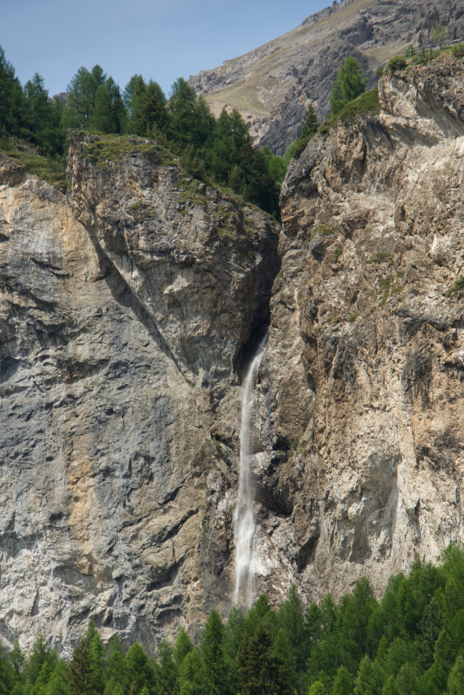
  </a>
  <a href="bormio_237455608__photos__7a85ee68-cb1f-41d2-a2ae-60026fa30d62_676bf69a-0737-42e5-8048-b1b6aa9d0479.jpg" class="step-thumb-link" data-gallery="step-237455608" data-index="5">
    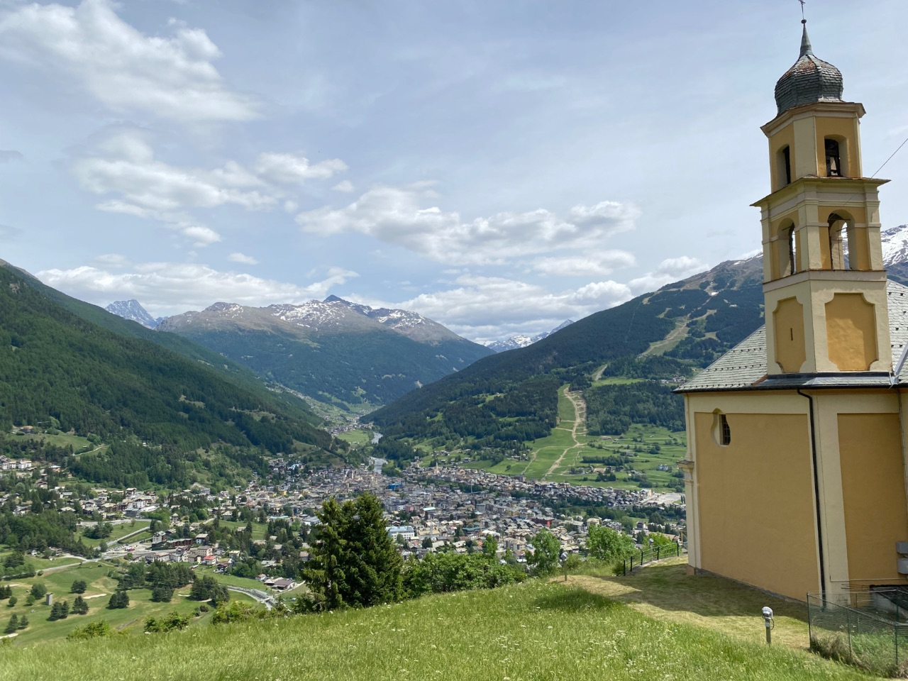
  </a>
  <a href="bormio_237455608__photos__09b0c23c-195e-47eb-af19-53a2e36c2ab6_221c1307-f286-44ab-b95a-4d88ab02cb3b.jpg" class="step-thumb-link" data-gallery="step-237455608" data-index="6">
    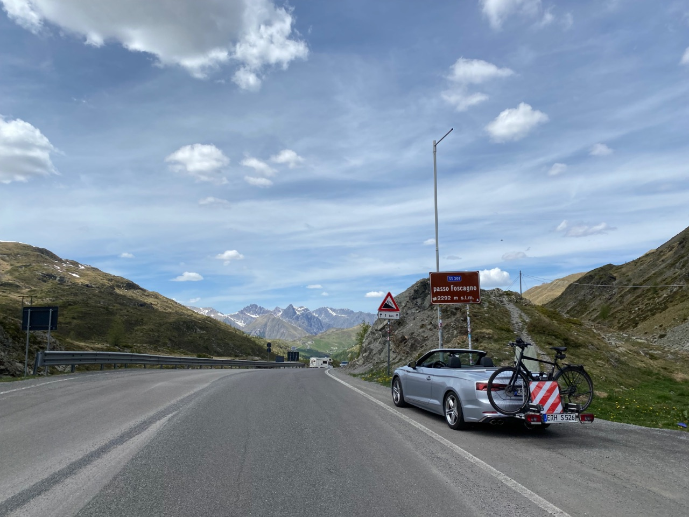
  </a>
  <a href="bormio_237455608__photos__ce294907-bd92-4039-a972-ab738edf1b98_16c04d29-4209-4845-a41c-12c62ef4c995.jpg" class="step-thumb-link" data-gallery="step-237455608" data-index="7">
    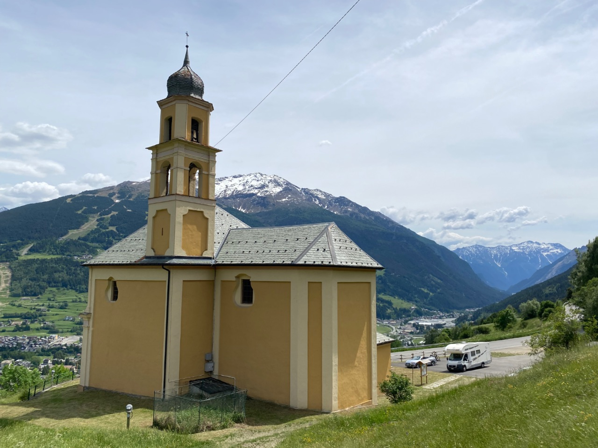
  </a>

#### Etappe: Livigno

Livigno liegt in einem Tal, das man von Bormio, oder von zwei Seiten aus der Schweiz erreicht. Vom Norden gibt es einen gebührenpflichtigen Tunnel an einem Stausee vorbei. Von Westen kommt man vom Berninapass, aber die Verbindung hat immer noch Wintersperre. Also konnte ich es heute mal von Bormio aus probieren, bevor es hoch zum Stelvio-Pass geht.
Und siehe da, der Sprit kostet nur 1,518€ den Liter, bei Tenna war das günstigste noch 1,929€. 
Die Tankanzeige war schon auf rot, aber es waren noch gut 5 Liter im Tank, und nachtanken hätte ich ja auch können. Schöner kleiner Spaß :-) Und ich hab mir mal hier die Gegend angesehen.
Der Stausee (Lago di Livigno) war ziemlich leer, vom Südufer konnte ich nirgends Wasser entdecken. Ich war ja nur an der Tanke und wollte dann wieder zurück über Bormio auf den nächsten Pass.
Aber nicht ohne an einem schönen Wasserfall nochmal Halt zu machen und mir mein Händewaschwasser und meine Trinkflasche aufzufüllen.
Zurück an der Hochzeitsfeier vorbei, die Kirche war wohl schon aus, jetzt wurde davor noch groß gefeiert.

  <a href="livigno_237456147__photos__9a3280ff-e480-4ea3-ae53-3c574ab9d613_d5b100da-ada1-4a7c-a8a9-e23afcc50826.jpg" class="step-thumb-link" data-gallery="step-237456147" data-index="1">
    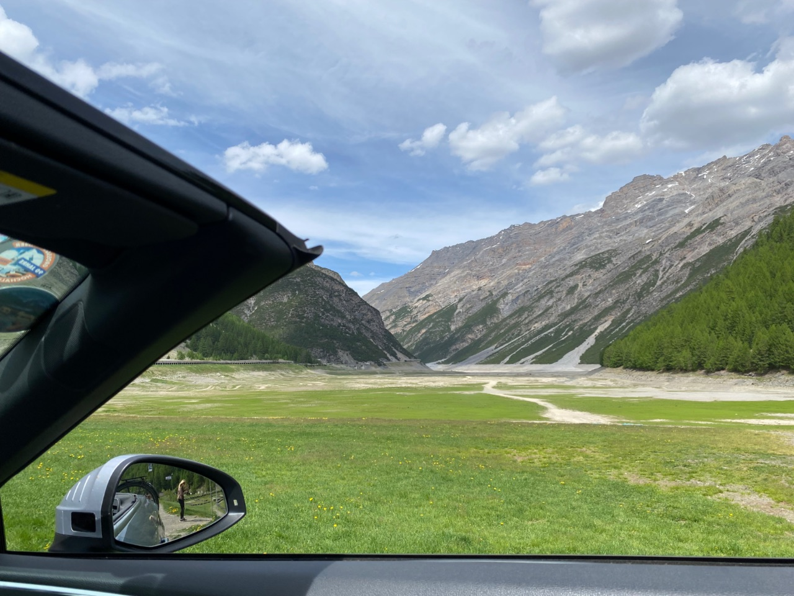
  </a>
  <a href="livigno_237456147__photos__aad12970-3ad8-4a28-88a4-d2a8df242bb4_c7ed0a03-d63c-4073-bb29-5952c104bed5.jpg" class="step-thumb-link" data-gallery="step-237456147" data-index="2">
    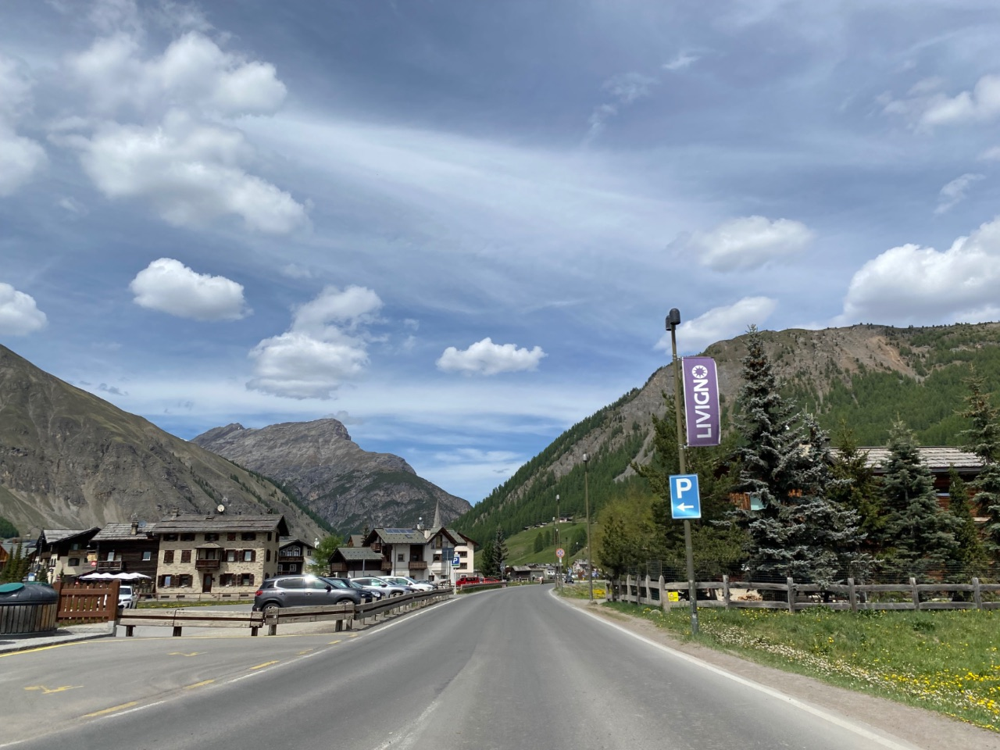
  </a>
  <a href="livigno_237456147__photos__c5be5505-3474-4879-97e3-e9fdbb880e91_c5f8fcf7-d888-4a86-9ac7-8084854ee622.jpg" class="step-thumb-link" data-gallery="step-237456147" data-index="3">
    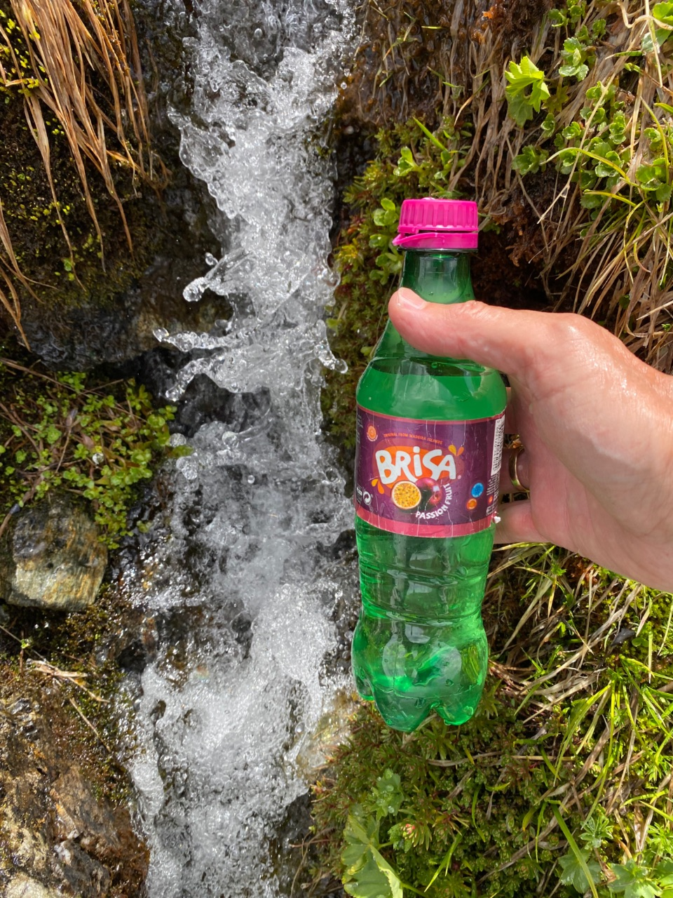
  </a>
  <a href="livigno_237456147__photos__0cda6333-d7fb-485c-9bac-fedec16099e3_97e59fa0-4788-4ef3-b5ae-56a33d9f20b1.jpg" class="step-thumb-link" data-gallery="step-237456147" data-index="4">
    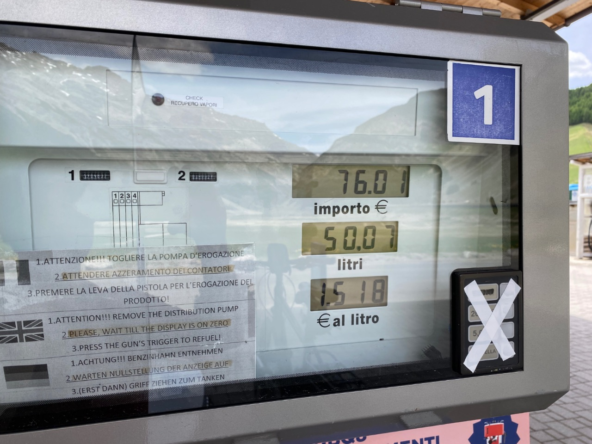
  </a>
  <a href="livigno_237456147__photos__48b78281-b56c-46bc-9cc7-3fffff751bdf_8a061415-51e5-42f5-b3f7-62ec2faa8382.jpg" class="step-thumb-link" data-gallery="step-237456147" data-index="5">
    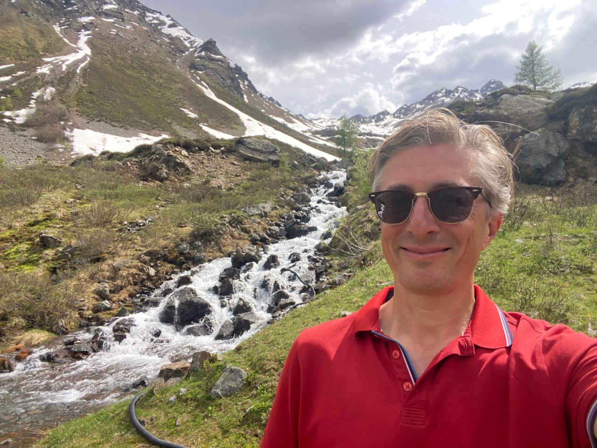
  </a>
  <a href="livigno_237456147__photos__f255b586-1b1d-4bb3-a841-d0b8af15660f_792ff947-6f83-40b1-bafb-41bbc528b88c.jpg" class="step-thumb-link" data-gallery="step-237456147" data-index="6">
    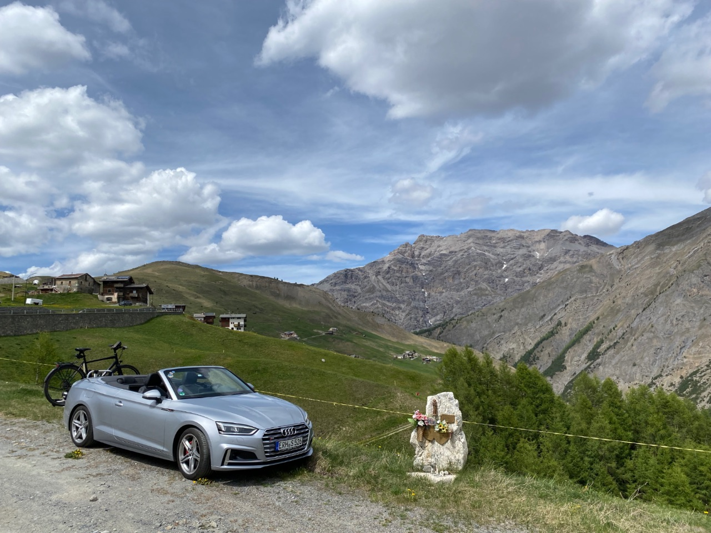
  </a>
  <a href="livigno_237456147__photos__cb197caa-07c4-4479-ae69-99e2582cab4d_5ec7e4c4-e62e-4af4-bf42-016b7fc86ba1.jpg" class="step-thumb-link" data-gallery="step-237456147" data-index="7">
    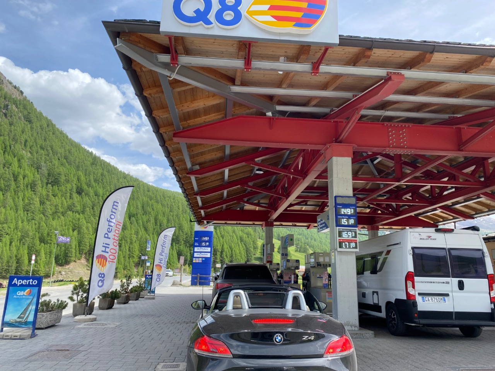
  </a>
  <a href="livigno_237456147__photos__5c2fa3aa-434f-47a1-99fb-65fd648ecb9c_59e43710-9fe0-48cd-83d1-4a1765e21531.jpg" class="step-thumb-link" data-gallery="step-237456147" data-index="8">
    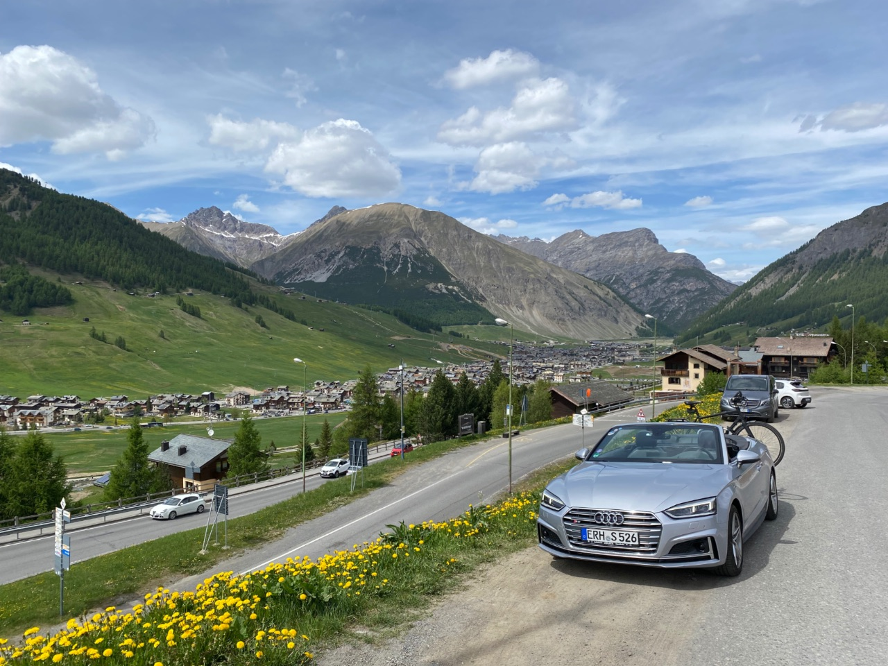
  </a>
  <a href="livigno_237456147__photos__71bda339-fd58-4292-9b44-e20b0d8d2f39_46a5a0ec-945b-4c33-8ede-6065e1ca1040.jpg" class="step-thumb-link" data-gallery="step-237456147" data-index="9">
    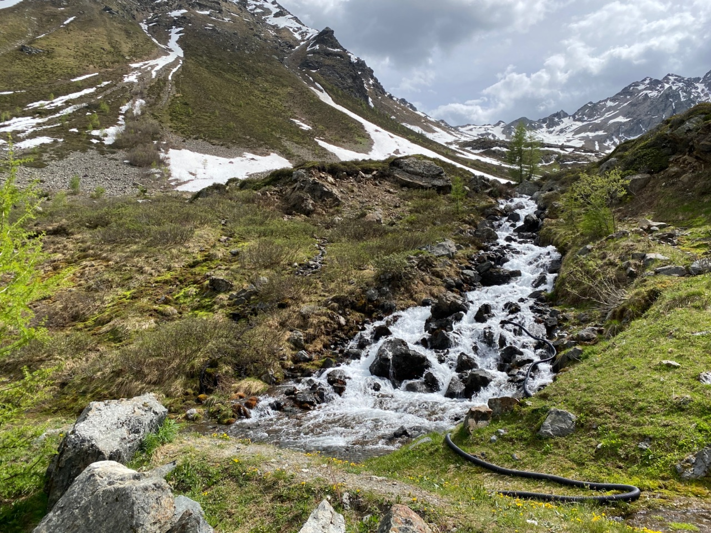
  </a>
  <a href="livigno_237456147__photos__e4b466d8-ec55-43f4-9bf1-23ee285b7e14_4107c0d9-b28b-4190-b526-951356013a08.jpg" class="step-thumb-link" data-gallery="step-237456147" data-index="10">
    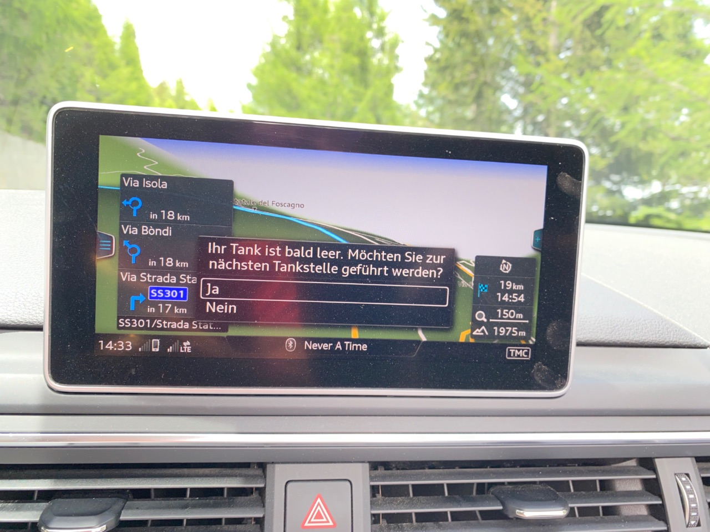
  </a>
  <a href="livigno_237456147__photos__7884302c-4dd7-4365-941c-46230d39882d_33604700-8949-411b-8f24-a33bb30247db.jpg" class="step-thumb-link" data-gallery="step-237456147" data-index="11">
    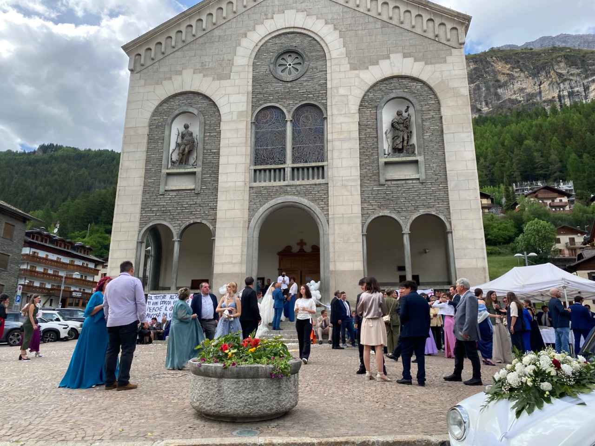
  </a>

#### Etappe: Passo dello Stelvio

Nach dem grandiosen Gavia-Pass kam nun also das Stilfserjoch (Stelvio-Pass) dran mit seinen 2760m der zweithöchste asphaltierte und legal befahrbare Pass in den Alpen.
Auch hier die übliche Mischung aus einzelnen Radfahrern, Motorrädern und PKW bzw. Camper (Anhänger und LKW sind hier nicht erlaubt).
Hier war dann auch die Cabriodichte etwas höher, sonst war ich ziemlich alleine unterwegs.
Wie auch am Gavia-Pass liegt hier oben auch noch Schnee. Und das Sommerskigebiet hat heute auch aufgemacht habe ich gelesen. Mist, ich hab meine Ski vergessen, die Ski-Halterung hätte ich ja am Fahrradträger noch dran gehabt 🙃. Das wäre ein Spaß, eine Woche mit Skiern am Träger durch Italien zu fahren 🤣.
Oben am Pass ist immer jede Menge los, und auch hier bin ich kurz los und hab mir einen Sticker besorgt. Der letzte ist mir ja nach einiger Zeit abgefallen, kurz bevor die Frontscheibe eh einen Steinschlag abbekam und getauscht werden musste. Also geht die Sammlung der hohen Pässe wieder los.

Aber ich wollte dann endlich noch ins Berghotel Franzenshöhe einchecken, das auf etwa 2100m Höhe liegt. Also noch einige Serpentinen runtergekurvt, dann endlich war die lange Tour zu Ende. Mein Zimmer war gleich neben dem Schwimmbad - oh toll, dachte ich. Auf dem Schild stand springen verboten, ein Blick ins leere Becken, ja das ist besser so 🤣.

Aber ganz fertig war ich noch nicht für den Abend. Ich bin noch zum Abendessen wieder hoch in die Tibethütte gefahren auf knapp 2800m und hab den Sonnenuntergang betrachtet. 

Ein Fotoexperiment mit Lichtziehern war das eigentliche Ziel und eine echte Fotochallenge. Denn, es hat nicht so geklappt, aber ich hab viel gelernt 🫠🤣
Immerhin soviel. Stativ und eventuell Filter sind wichtig. Lange Belichtung, Intervall OHNE Pausen (ich hatte 4s Belichtung bei 5s Intervall, das sieht man in den Lichtspuren. Die Kamera kann scheinbar auch in nullkommanix das Bild speichern und die nächste Belichtung starten.
Und Matrix-LED am Auto - huch da sind überhaupt keine Scheinwerfersleuchtspuren zu sehen, die roten Bremslichter sind deutlich, aber vorne sieht es aus als ob ich nur das Standlicht angehabt hätte 😅. Meine Vermutung wäre genau anders gewesen, dass die Scheinwerfer ja mehr Licht machen als die Bremslichter. Aber halt nur gezielt für den Fahrer und nicht für eine Kamera weit oberhalb am Berg ⛰️.
Ach ja, für die Intervall Belichtung musste ich ja dann die Kamera oben stehen lassen und selbst mit dem Auto runter und wieder hochfahren, damit überhaupt der Pass noch befahren war 🙃 Ich hatte jede Menge Spaß, wie gesagt hab viel gelernt für den nächsten Versuch.

  <a href="passo-dello-stelvio_237457274__photos__ed2bdc0e-2105-4673-9887-eaa83d127811_f924c694-6036-44f5-89a1-95414c0dec89.jpg" class="step-thumb-link" data-gallery="step-237457274" data-index="1">
    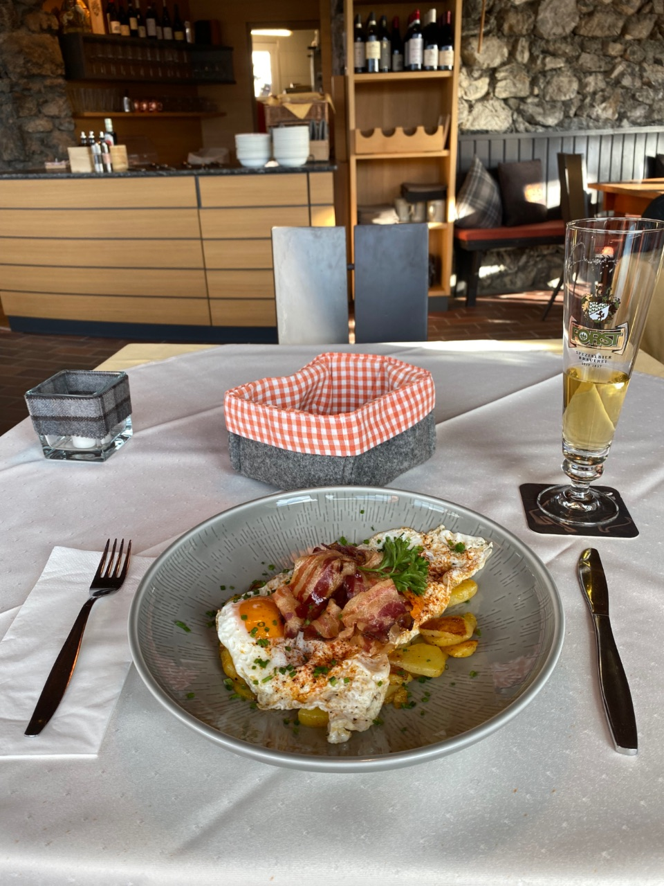
  </a>
  <a href="passo-dello-stelvio_237457274__photos__77ea8764-1e89-484c-8cb8-ebbf24c56643_f8658bcb-f7ae-4894-8f38-47f884ad9696.jpg" class="step-thumb-link" data-gallery="step-237457274" data-index="2">
    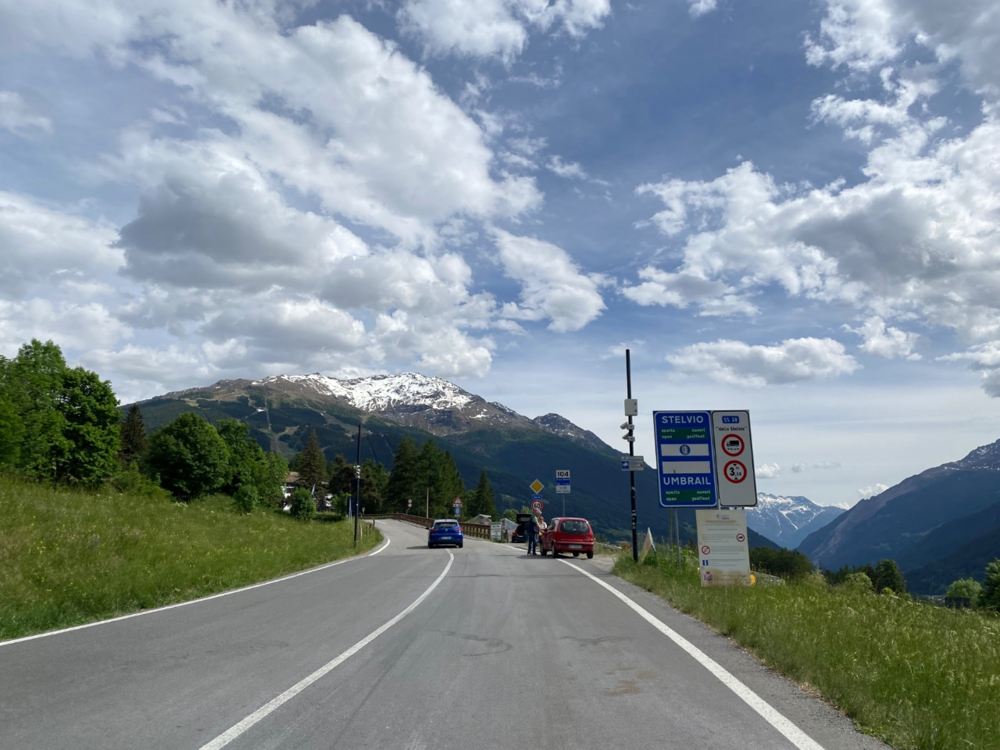
  </a>
  <a href="passo-dello-stelvio_237457274__photos__825d8af8-308e-4ce2-9525-9abb5c650a0b_f72127bb-5e3c-45eb-98f3-0fca78a6a69f.jpg" class="step-thumb-link" data-gallery="step-237457274" data-index="3">
    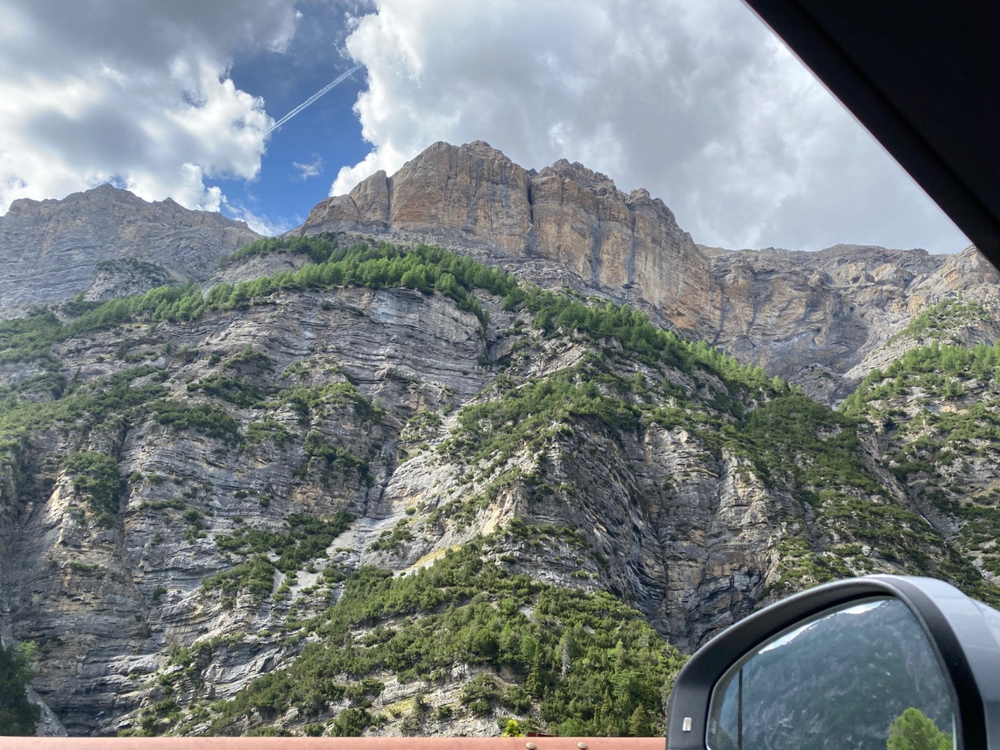
  </a>
  <a href="passo-dello-stelvio_237457274__photos__874dd788-f3c6-4a7f-ace7-99aafb11509d_f54b1ca3-79f9-4358-95c4-50ab98e26aab.jpg" class="step-thumb-link" data-gallery="step-237457274" data-index="4">
    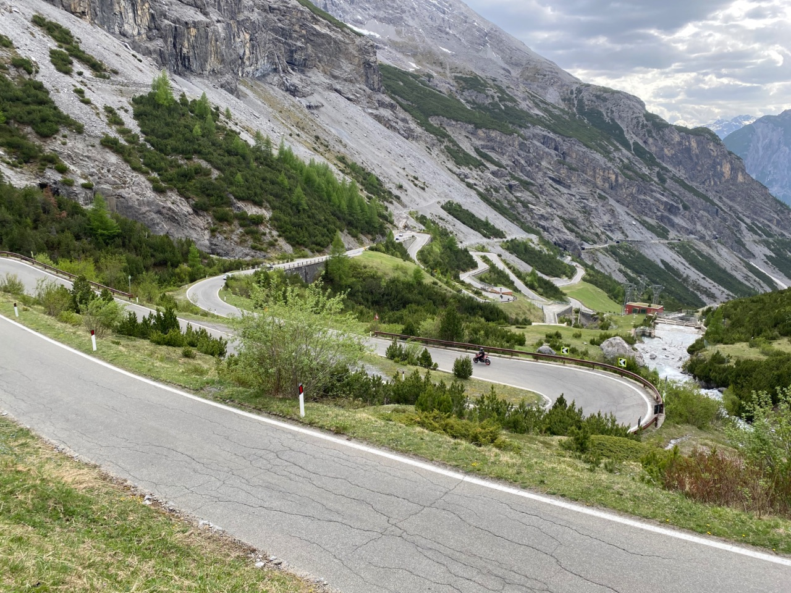
  </a>
  <a href="passo-dello-stelvio_237457274__photos__eab9fef3-9725-485a-ba36-1e57633ea8ce_eeb217d9-4af4-4c02-82a1-30711a10b340.jpg" class="step-thumb-link" data-gallery="step-237457274" data-index="5">
    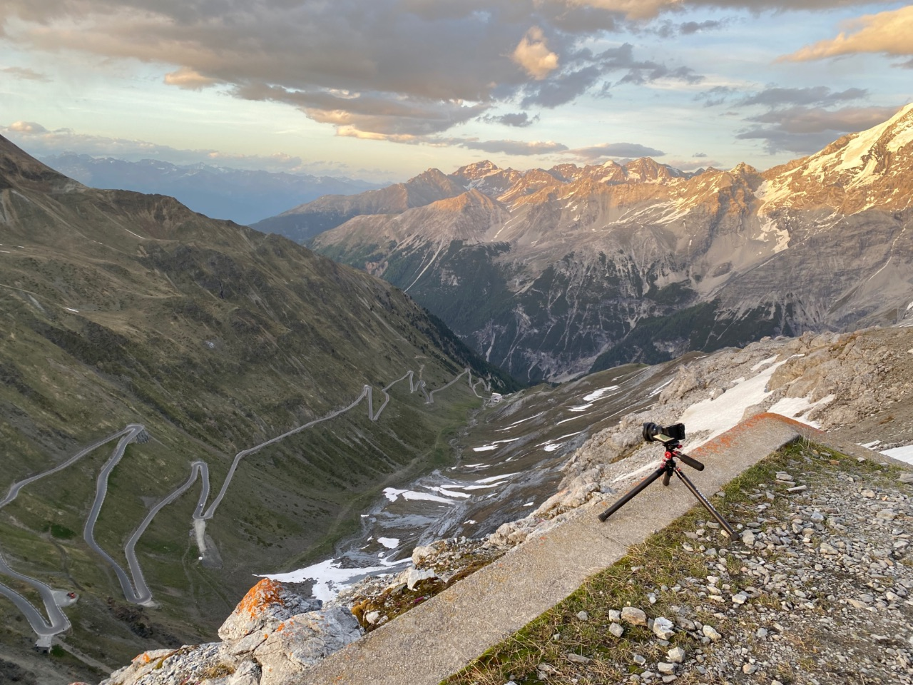
  </a>
  <a href="passo-dello-stelvio_237457274__photos__79823480-7241-4ed1-9e86-ee6c82f471f6_eddfb1dd-e8d2-4589-9ebf-50ceba2e15bd.jpg" class="step-thumb-link" data-gallery="step-237457274" data-index="6">
    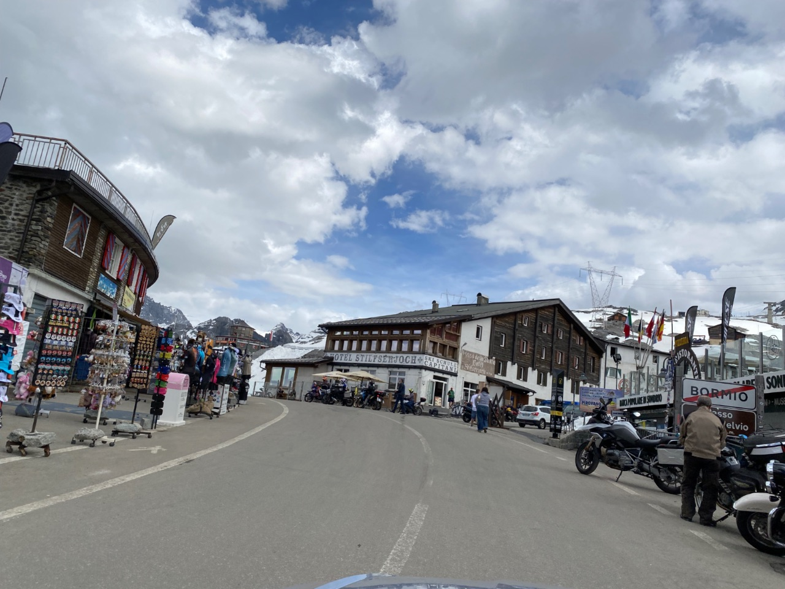
  </a>
  <a href="passo-dello-stelvio_237457274__photos__4bc5edb4-446b-428f-a3f5-08fce34ebf27_d6b26db3-0558-416a-84c1-985f9398d8ce.jpg" class="step-thumb-link" data-gallery="step-237457274" data-index="7">
    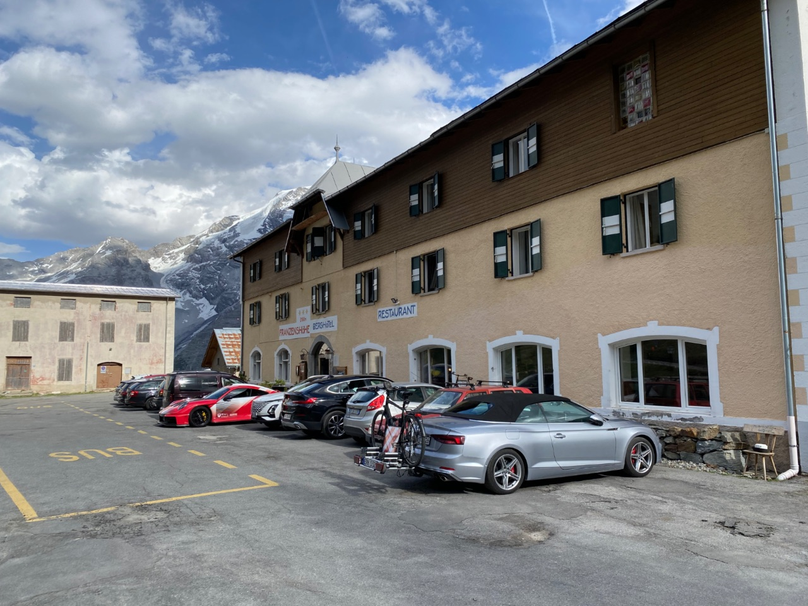
  </a>
  <a href="passo-dello-stelvio_237457274__photos__cc94cadd-cdcb-4821-9b26-4e5b6f01fe0f_9ca60ed1-3220-4dfc-8439-1b7bad94d3b8.jpg" class="step-thumb-link" data-gallery="step-237457274" data-index="8">
    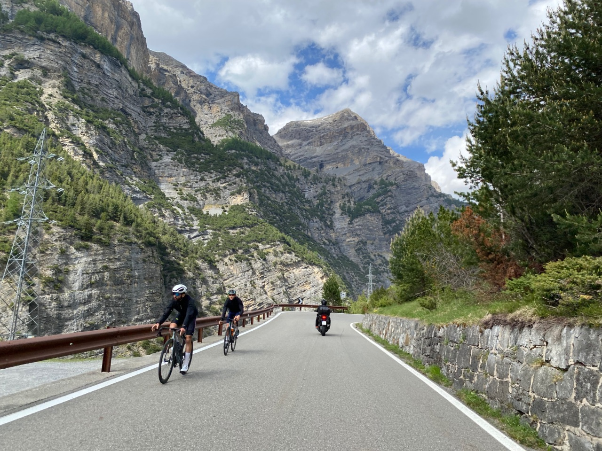
  </a>
  <a href="passo-dello-stelvio_237457274__photos__f7889f7c-40e5-453b-bbc6-bdafea3a231f_99636149-2c38-4b8c-a87e-e58118e02250.jpg" class="step-thumb-link" data-gallery="step-237457274" data-index="9">
    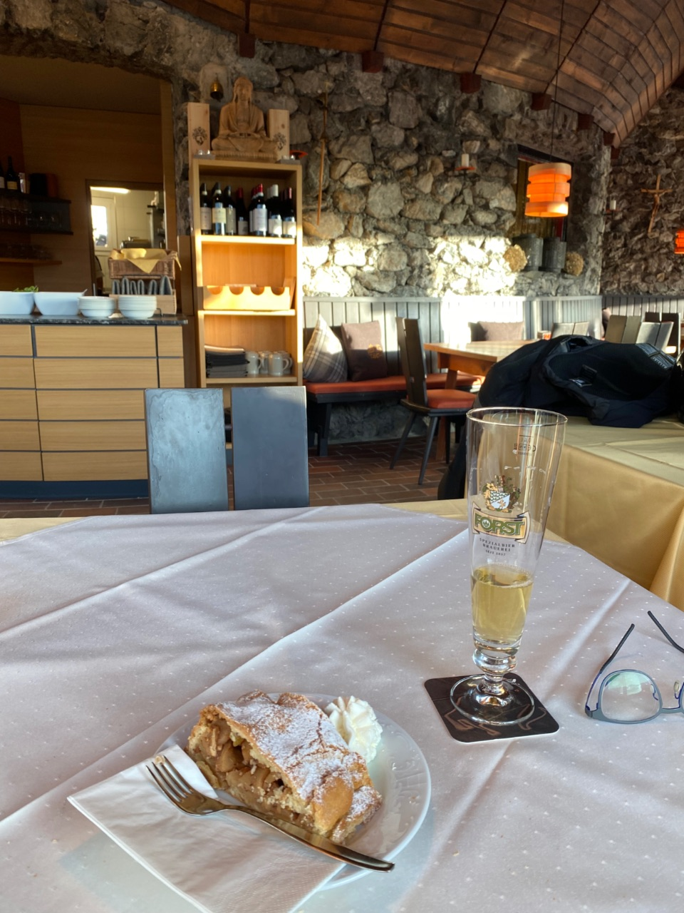
  </a>
  <a href="passo-dello-stelvio_237457274__photos__9710cf42-353c-4fdc-97ad-1010219fd676_974cf135-2da8-4aab-860e-d24fc4882601.jpg" class="step-thumb-link" data-gallery="step-237457274" data-index="10">
    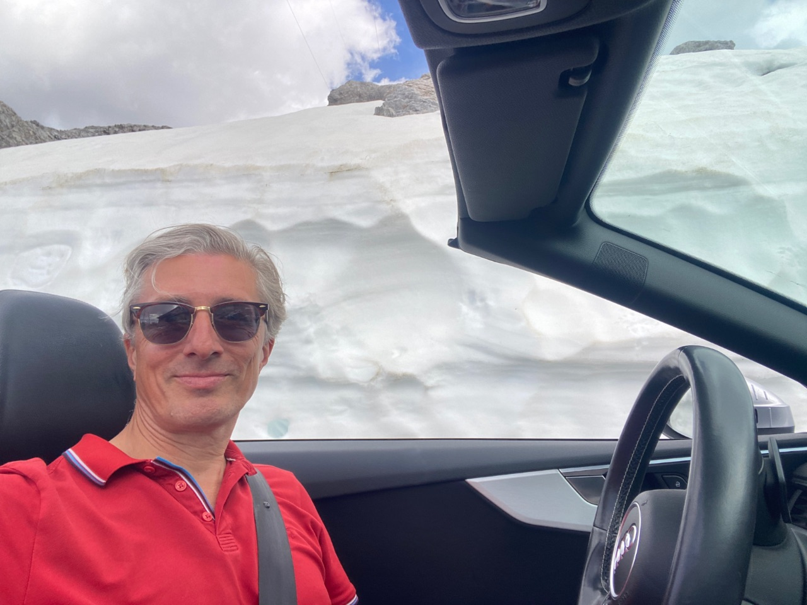
  </a>
  <a href="passo-dello-stelvio_237457274__photos__bc0d7242-35ea-4878-afb9-1e66e386a5ea_8f0cdf7a-d676-4765-8f50-665f41ec38bf.jpg" class="step-thumb-link" data-gallery="step-237457274" data-index="11">
    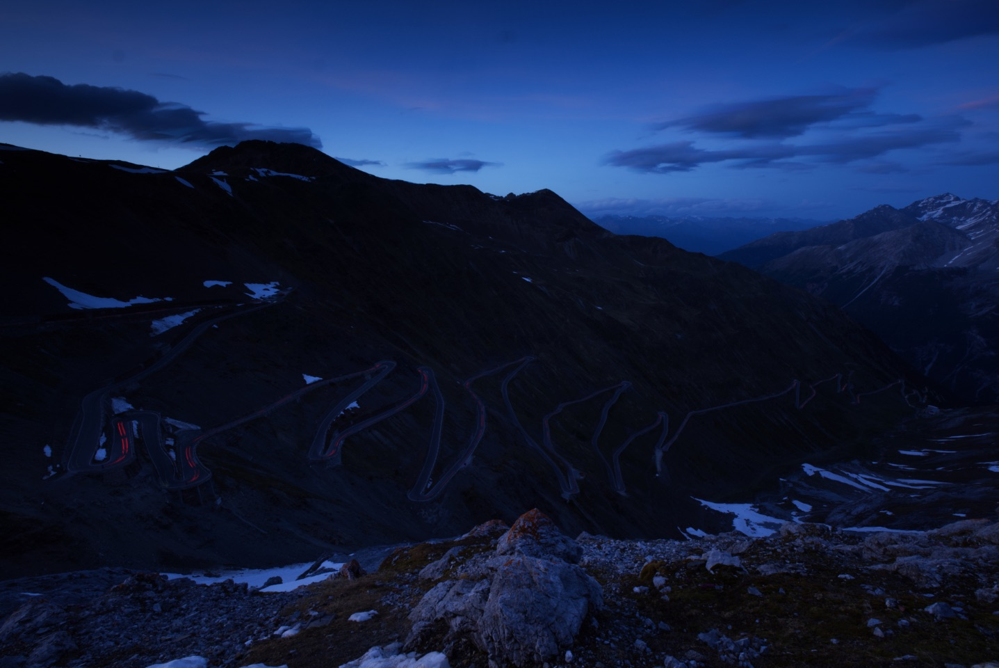
  </a>
  <a href="passo-dello-stelvio_237457274__photos__3ff38457-46f6-4fbd-9372-fb20456ec08a_8dbab6ca-ae40-4760-8a12-eee3bea306ea.jpg" class="step-thumb-link" data-gallery="step-237457274" data-index="12">
    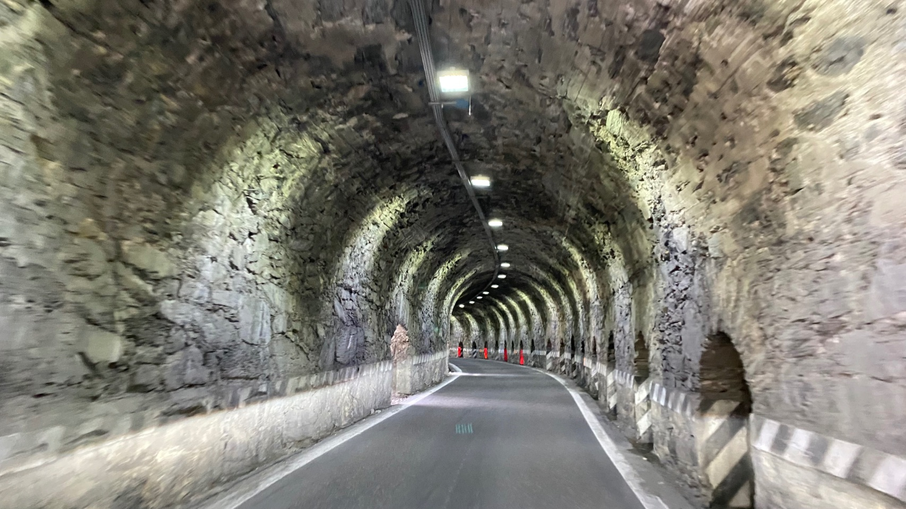
  </a>
  <a href="passo-dello-stelvio_237457274__photos__e8c8e62a-302d-4490-b9c9-0a70c8e06f33_87589f35-48cb-4dc2-9416-210d706151d1.jpg" class="step-thumb-link" data-gallery="step-237457274" data-index="13">
    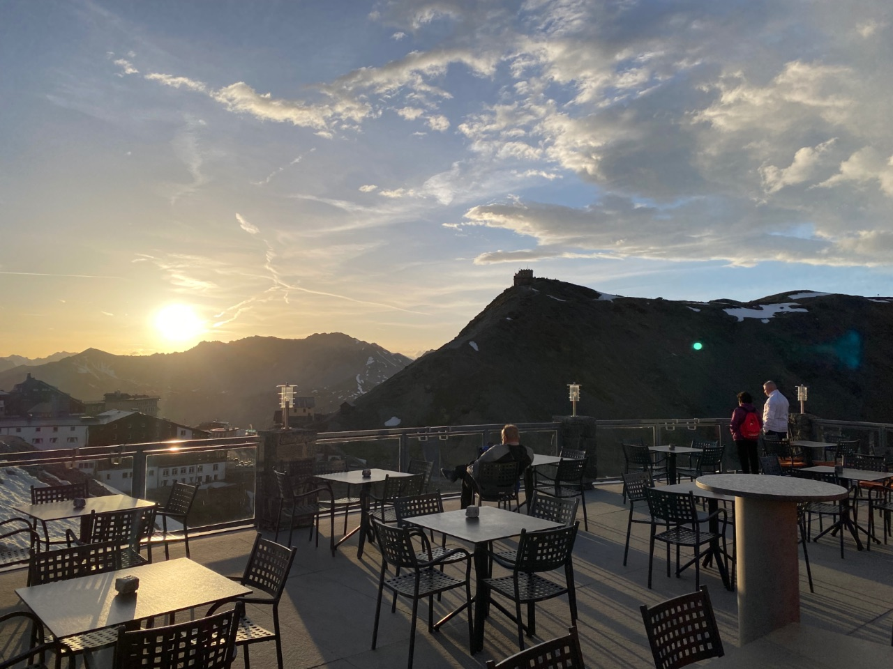
  </a>
  <a href="passo-dello-stelvio_237457274__photos__2828469e-f161-4f16-9c0d-684375ee0f57_82f8d772-e13e-4f14-99de-478f38e9e2c4.jpg" class="step-thumb-link" data-gallery="step-237457274" data-index="14">
    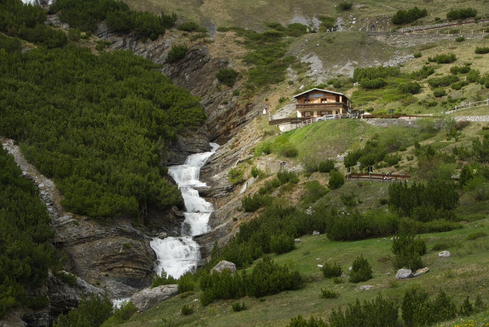
  </a>
  <a href="passo-dello-stelvio_237457274__photos__5ef7f9c5-adac-46d1-baa1-78704217a915_3bcc62b3-7577-425c-912d-b8ed7501c6fa.jpg" class="step-thumb-link" data-gallery="step-237457274" data-index="15">
    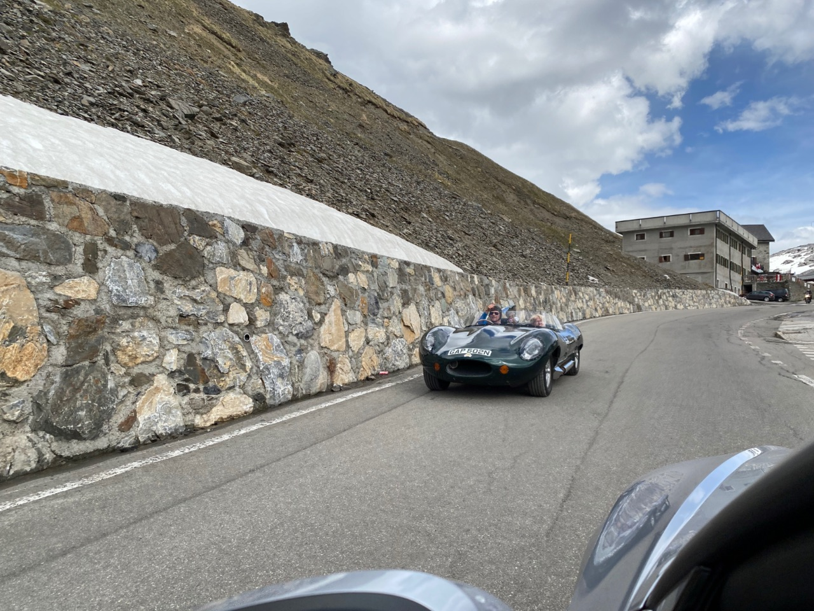
  </a>
  <a href="passo-dello-stelvio_237457274__photos__4d5b5aa2-62c1-4efb-b9b3-5da6b92ed603_260bf13c-a94f-40c6-81db-3e98007a27f9.jpg" class="step-thumb-link" data-gallery="step-237457274" data-index="16">
    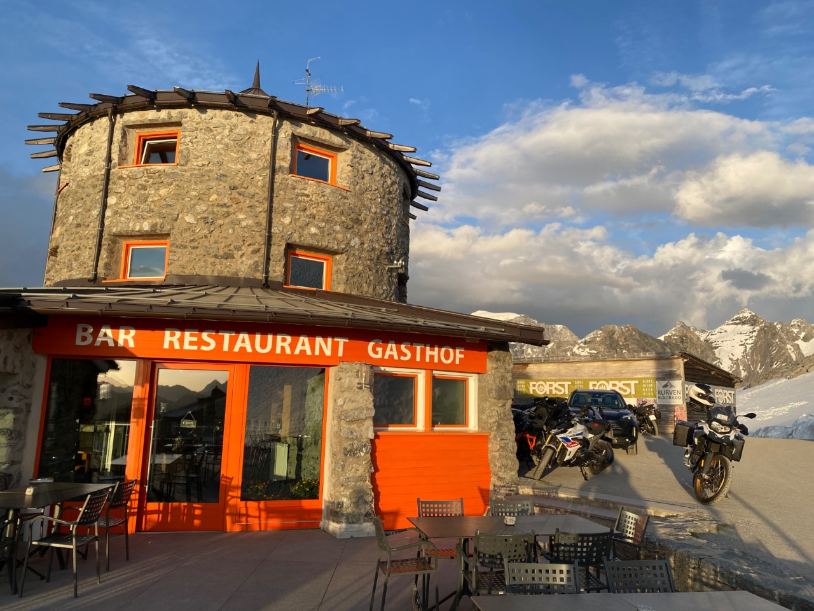
  </a>
  <a href="passo-dello-stelvio_237457274__photos__d9bada2a-0431-44b4-b74b-418b9e9752b5_24d4e692-0b67-434e-a08e-8ca039be2a78.jpg" class="step-thumb-link" data-gallery="step-237457274" data-index="17">
    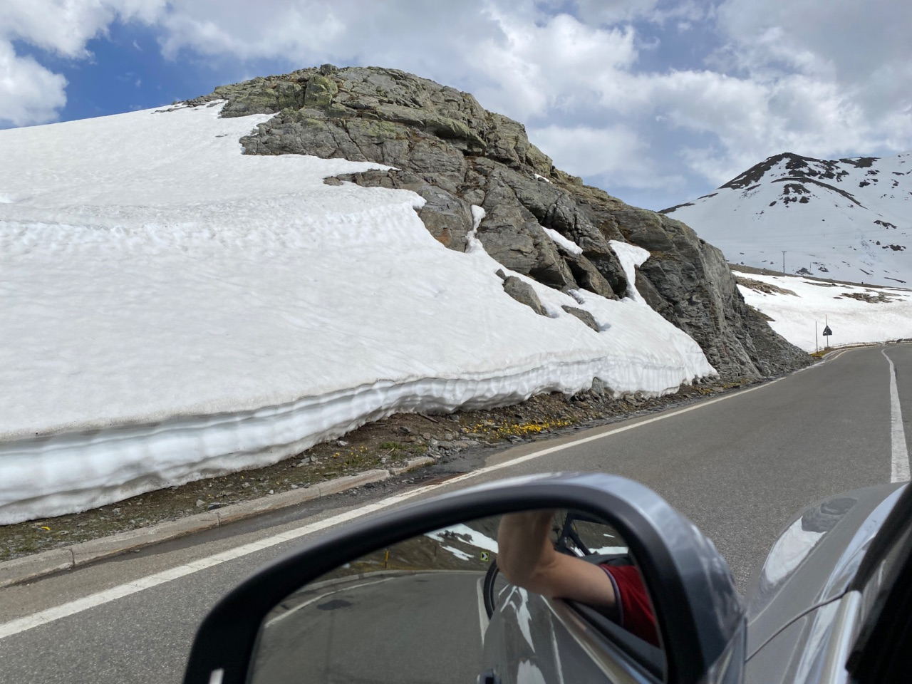
  </a>
  <a href="passo-dello-stelvio_237457274__photos__95c18dc2-4bf9-45bc-8de5-cd9b2033e4b6_23afa53b-e298-4342-8f98-3d966f656b24.jpg" class="step-thumb-link" data-gallery="step-237457274" data-index="18">
    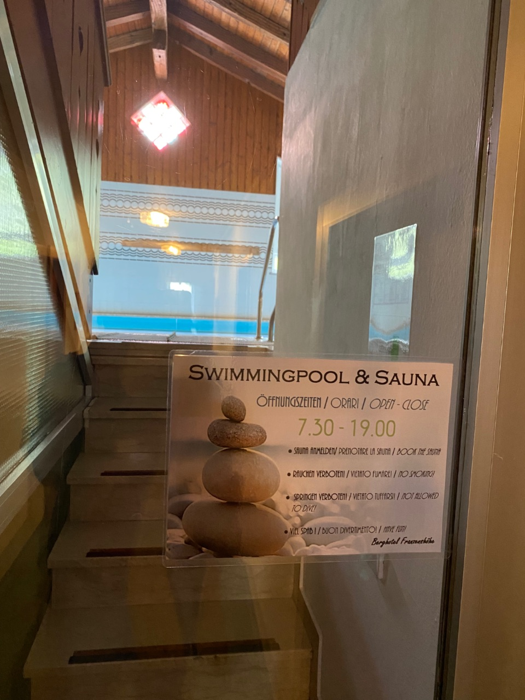
  </a>
  <a href="passo-dello-stelvio_237457274__photos__34cdbdca-c125-42fa-b168-fd3e9375c0ba_1309a509-dd4f-486d-ada8-08dd942dc911.jpg" class="step-thumb-link" data-gallery="step-237457274" data-index="19">
    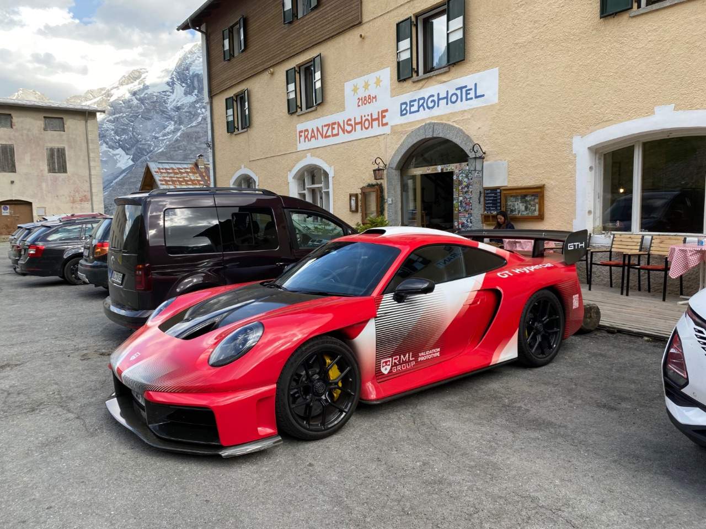
  </a>
  <a href="passo-dello-stelvio_237457274__photos__1f860285-4d51-499a-a917-d4a350b26d2e_042e4baf-e2e9-43a6-b924-4a0c532da658.jpg" class="step-thumb-link" data-gallery="step-237457274" data-index="20">
    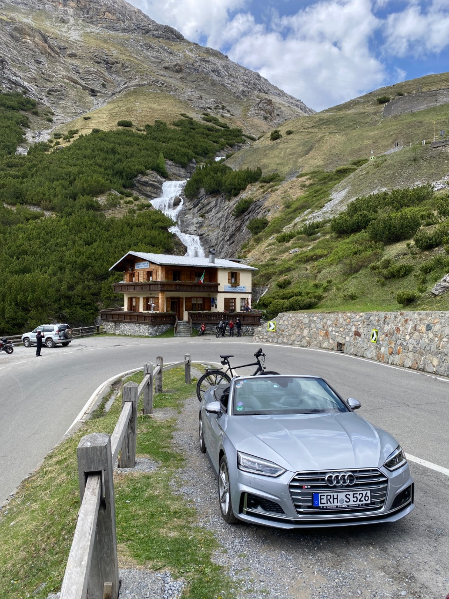
  </a>

### Tag 9 - 31.05.2026

#### Etappe: Berghotel Franzenshöhe

Die Nacht war kurz, aber zum Sonnenaufgang bin ich nicht schon wieder hoch auf den Stelvio Pass gefahren 😅. Aber der schicke Porsche fuhr kurz vor 7 Uhr schon los, den hab ich dann um 9 Uhr oben am Stelvio stehen sehen - weit ist er ja nicht gekommen 🤣.

Ich hab die Morgensonne beim Frühstück genossen und mich dann auf Murmeltiersuche gemacht. Hören kann man sie ja mit ihren Pfeifrufen sehr gut, und allzu scheu sind sie auch nicht. Aber die Tiere aus einem guten Blickwinkel zu erwischen, da braucht man Geduld. Kleine Blende und die Tiere möglichst ohne Boden im Hintergrund, damit sie sich schön vom unscharfen Hintergrund abheben. Und ja das ist mir gelungen bei dem Spaziergang rund um das Berghotel.
Dann ging es ans Kofferpacken, das Cabriodach war schon trocken, also auf damit.
Dann war die große Frage, runter Richtung Prad und dann über den Reschenpass nach Österreich - die "brave" Variante.
Oder doch nochmal hoch zum Stelvio, dann über die Schweiz den Reschenpass "umrunden"? 🤔

Ach ja: So soll der Lichtzieher am Bergpass aussehen. Ich komme wieder und probiere es bestimmt nochmal 😅📷

  <a href="berghotel-franzenshohe_237763225__photos__9ad1f550-60f7-4f3a-a6bc-296fc1f6b623_c4cf1692-1b55-4e58-bc99-979f22dfed27.jpg" class="step-thumb-link" data-gallery="step-237763225" data-index="1">
    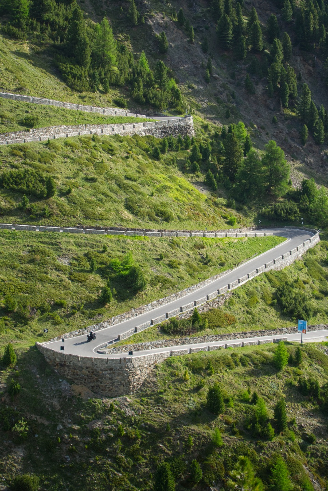
  </a>
  <a href="berghotel-franzenshohe_237763225__photos__f45bd449-792c-4977-aa9e-bd42da846d10_9ecb16f0-d54d-4c2a-aa35-6612c352c7f8.jpg" class="step-thumb-link" data-gallery="step-237763225" data-index="2">
    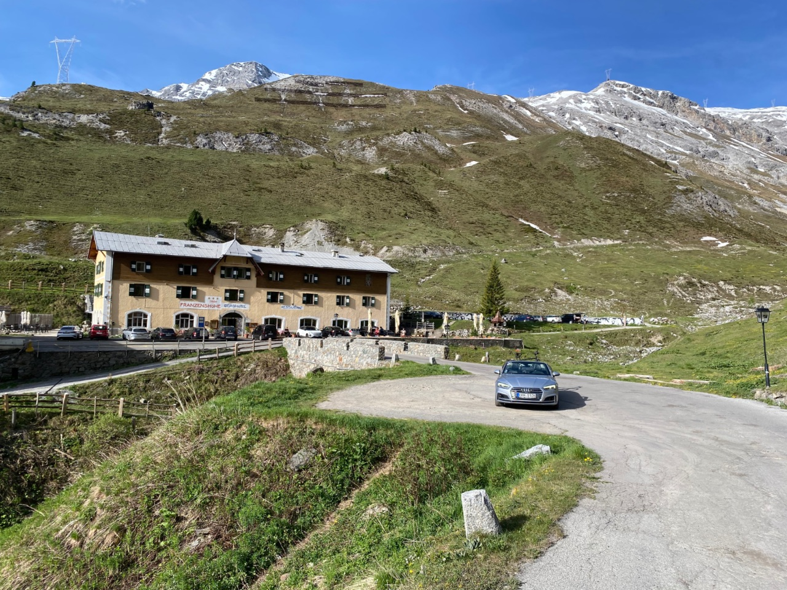
  </a>
  <a href="berghotel-franzenshohe_237763225__photos__4693123b-c9e3-4618-bc12-5ec81219a041_4cc16242-be8d-4a45-a554-b8aa8d297d9c.jpg" class="step-thumb-link" data-gallery="step-237763225" data-index="3">
    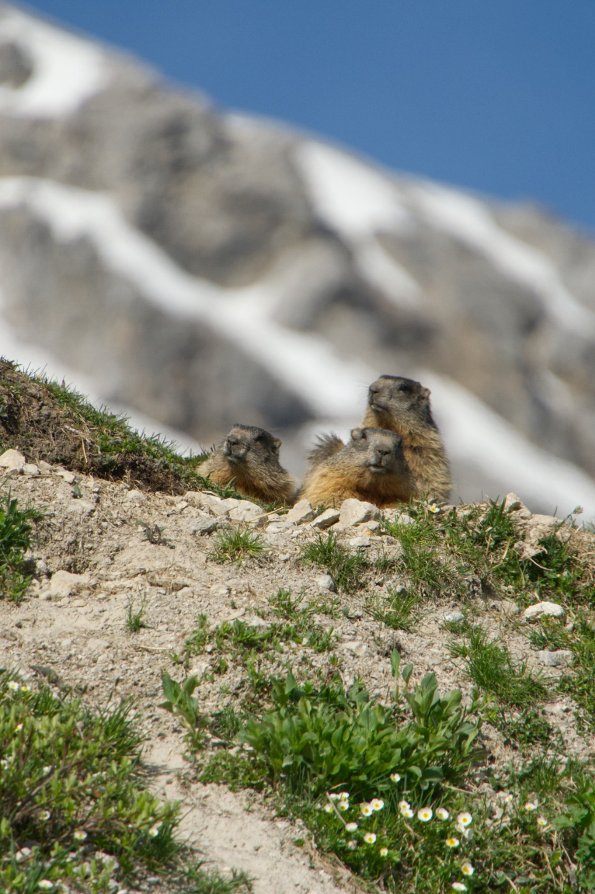
  </a>
  <a href="berghotel-franzenshohe_237763225__photos__db4ba91e-5d24-4b58-85c3-503fac3cc02b_2b8784ec-2c66-48e9-b152-b142d608cb97.jpg" class="step-thumb-link" data-gallery="step-237763225" data-index="4">
    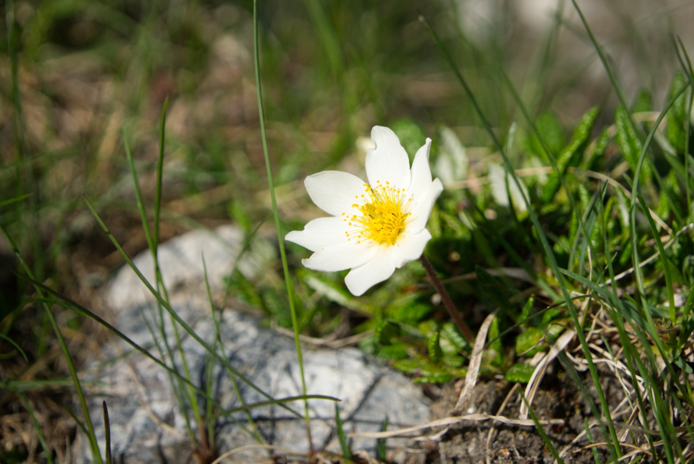
  </a>
  <a href="berghotel-franzenshohe_237763225__photos__cc6601ac-d811-40dd-b7c3-2bb59f23a0fc_158a4997-c95b-42f3-b820-2007e5fd86d6.jpg" class="step-thumb-link" data-gallery="step-237763225" data-index="5">
    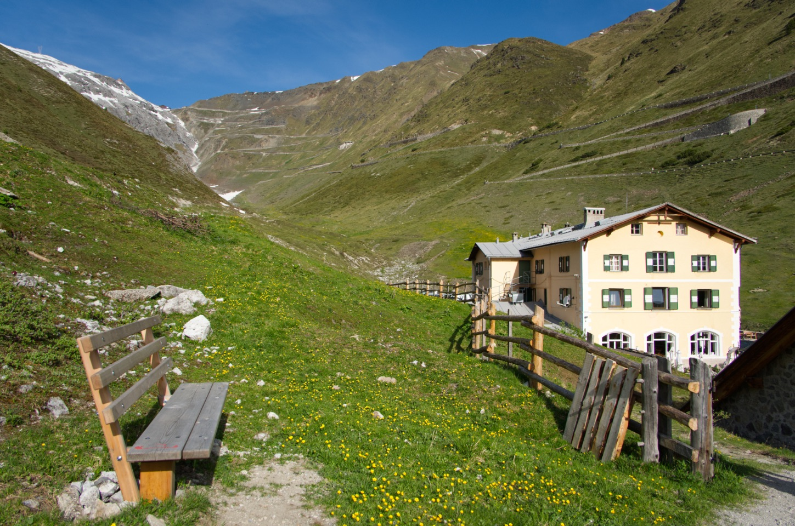
  </a>
  <a href="berghotel-franzenshohe_237763225__photos__cb0e3053-8678-468d-8ad0-cb5e1d3e2ca7_10e5a481-c4ba-4130-ac7b-0d2109cca4e0.jpg" class="step-thumb-link" data-gallery="step-237763225" data-index="6">
    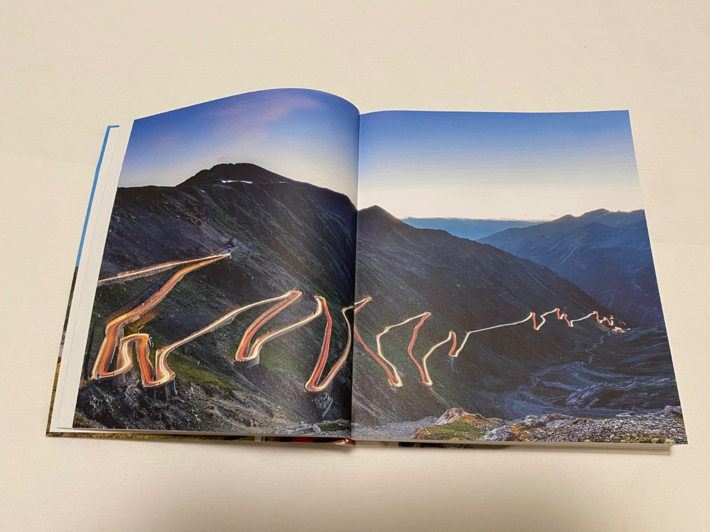
  </a>
  <a href="berghotel-franzenshohe_237763225__photos__ea015f3c-e00a-4c19-9beb-5850a8cd2f34_02526709-1eca-490f-8ade-11a945776acc.jpg" class="step-thumb-link" data-gallery="step-237763225" data-index="7">
    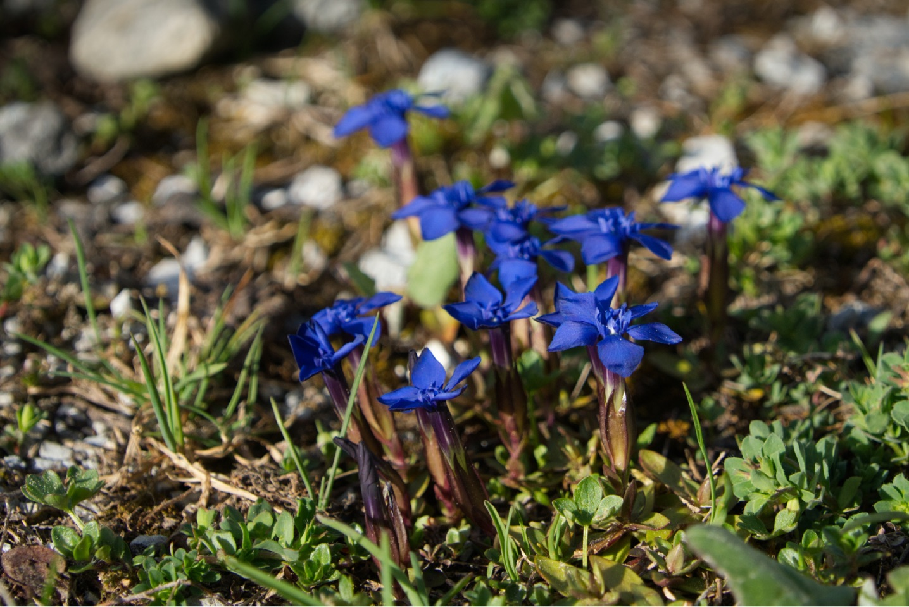
  </a>

#### Etappe: Umbrailpass

Na klar, ich bin links hoch zum Stelvio gefahren und erst nochmal einen Espresso in der Tibethütte getrunken.  Zuvor aber noch ein Wiedersehen mit dem umgebauten Porsche. 

Die Sonne schien schon gut, es hatte zwar nur 13°C , aber war keinerlei Wind, also beste Voraussetzungen für die weitere Fahrt mit offenem Dach.

Oben beim Aussichtspunkt hab ich noch einen Mopedfahrer gesehen, der seine rote Vespa fotografiert hat. Ich half ihm, noch ein paar Fotos mit ihm zu machen. Aus Dank bat er das gleiche für mich an :-) Er will weiter zum Lago di Como, auch ein schönes Ziel. Oh traumhaft, wie man sieht kann man in jeder Preisklasse seinen eigenen Spaß haben, und das freut mich für alle.

Weiter geht es bergab über die Grenze zur Schweiz zum Umbrailpass, der etwas über 2500m hat.
Ein gemütliches Dahincruisen war das mit Mark Knopfler auf den Ohren 🎼🎸. Da kamen ein paar Radler und eine Frau auf einem Einrad den Berg hoch. Respekt! Ich hab nochmal kurz umgedreht, um ein Foto zu schießen. Alle Achtung! Aber die "Übersetzung" beim Einrad ist ja glaube ich sogar ganz gut für bergauf, dennoch ein Hingucker!

Weiter ging es noch über den Ofenpass weiter Richtung Westen, um noch einen Bergkamm zu umfahren, bevor es Richtung Österreich geht.

Den Reschenpass wollte ich heute komplett auslassen, ich hatte Zeit und das Wetter in den Alpen ist besser als nördlich davon.

Nachtrag: Jetzt hab ich mir den "Porsche" genauer angesehen. Das ist ein Umbau (wahrscheinlich reichlich untertrieben) zu einem GT Hypercar der RML Group : 

https://www.rmlgroup.com/gthypercar

Und sie posten natürlich ihre Grand Tour, zum Beispiel
 https://www.instagram.com/reel/DY9rzxbMZgI/

ok, 920 PS, ca. 1 Million, aber das Dach geht nicht auf 🤣

  <a href="umbrailpass_237816593__photos__699b5a00-6ea8-4e95-9478-9e4290e00916_d5e4177b-cce2-4bb0-a6ec-37db51594d89.jpg" class="step-thumb-link" data-gallery="step-237816593" data-index="1">
    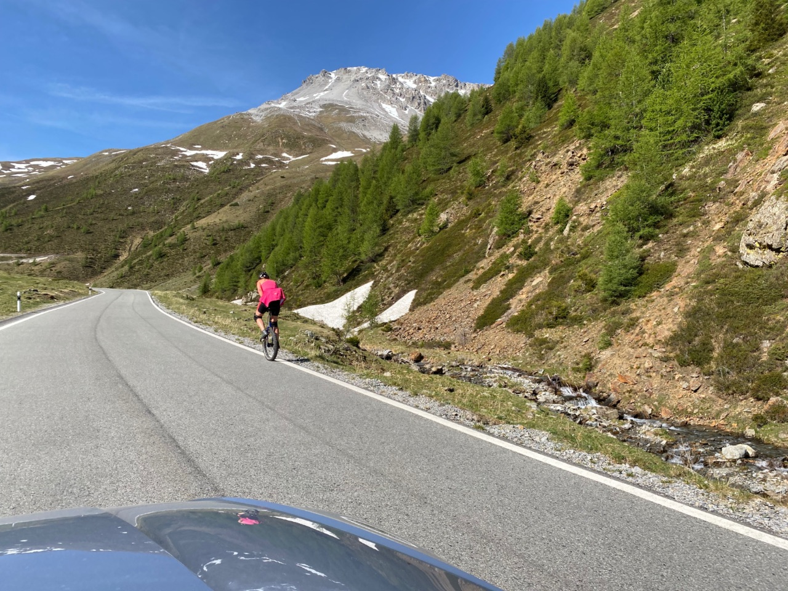
  </a>
  <a href="umbrailpass_237816593__photos__9b6d83ad-0587-435a-a020-41af282c0470_b25620b3-7a77-4375-bc36-9b3ce633db81.jpg" class="step-thumb-link" data-gallery="step-237816593" data-index="2">
    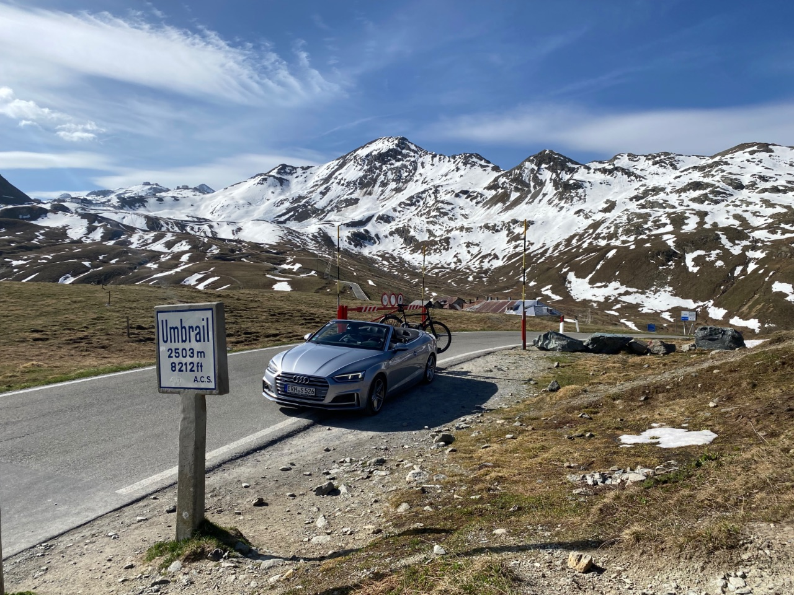
  </a>
  <a href="umbrailpass_237816593__photos__f92f683a-b16b-4a7a-8373-66f89c552eee_a80ade81-57ab-4d89-a8cf-7a07de30c005.jpg" class="step-thumb-link" data-gallery="step-237816593" data-index="3">
    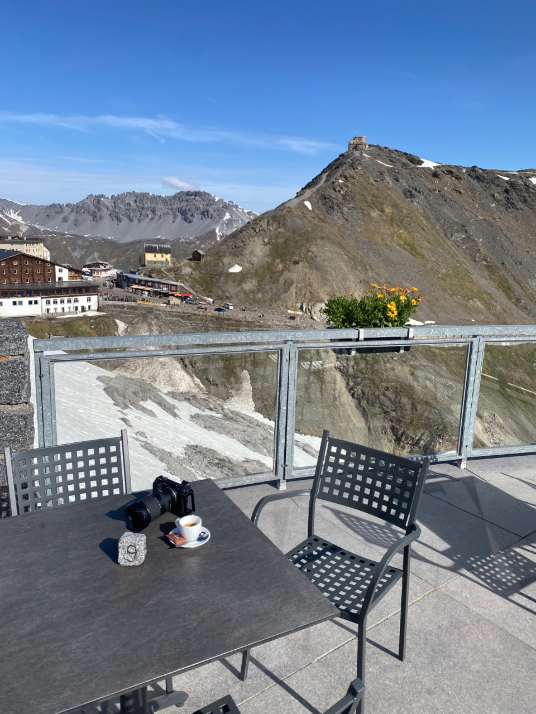
  </a>
  <a href="umbrailpass_237816593__photos__26b303a8-3ca7-4d87-ac6c-b2933f3bb8f2_8cc7a12b-89ab-44be-8fa4-3eba93e4f355.jpg" class="step-thumb-link" data-gallery="step-237816593" data-index="4">
    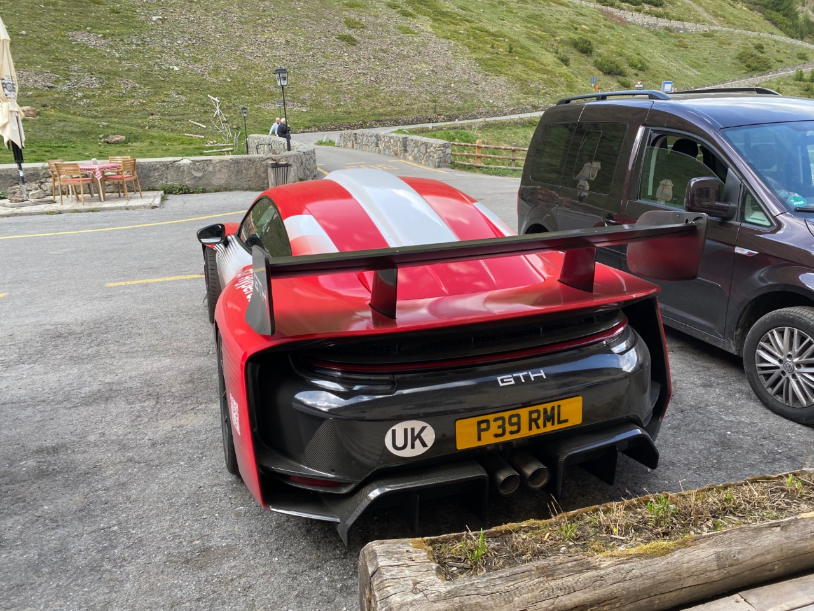
  </a>
  <a href="umbrailpass_237816593__photos__3e6201a0-7e9b-415e-a027-ff99dfb849c8_8cc51fec-f66f-4ab9-9bc3-6ed43a84866a.jpg" class="step-thumb-link" data-gallery="step-237816593" data-index="5">
    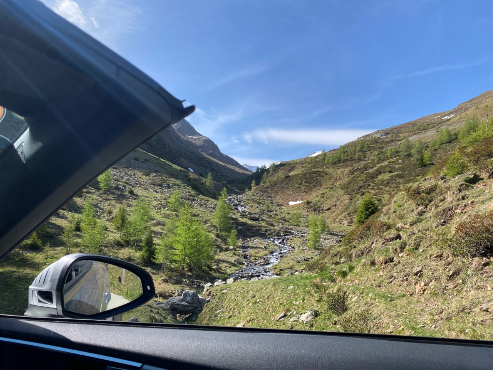
  </a>
  <a href="umbrailpass_237816593__photos__b57f0a04-872d-4396-987e-053c6a9c08aa_72ff4704-61fa-4524-921a-d0731b1d1335.jpg" class="step-thumb-link" data-gallery="step-237816593" data-index="6">
    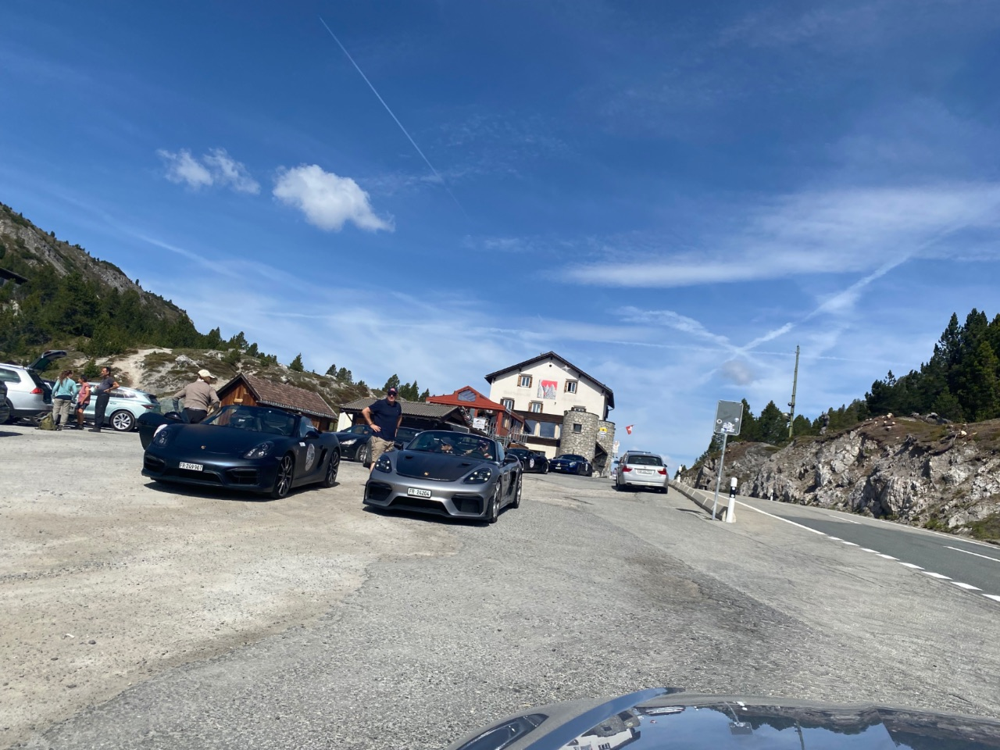
  </a>
  <a href="umbrailpass_237816593__photos__2ab65fa6-b6ec-4e76-a03d-a04aac3b0bbf_457ee33d-8193-42c7-b158-54d51acd5fc0.jpg" class="step-thumb-link" data-gallery="step-237816593" data-index="7">
    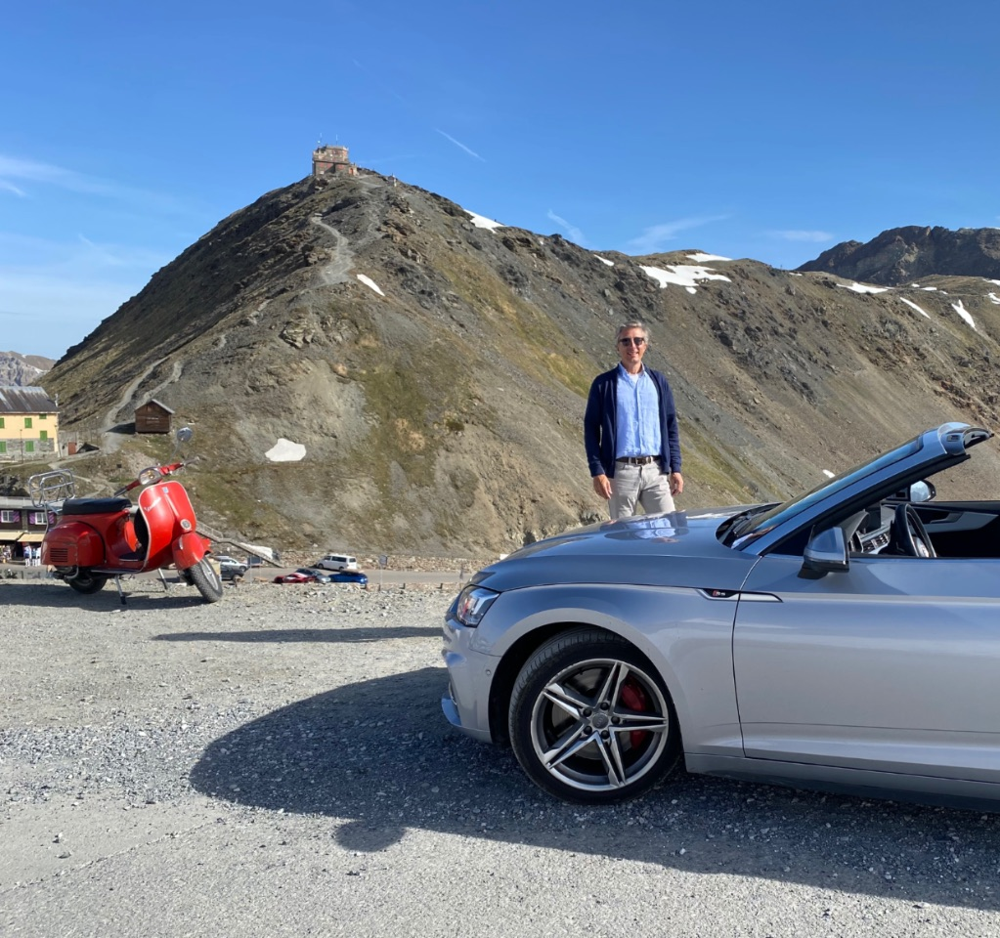
  </a>
  <a href="umbrailpass_237816593__photos__cbde0c6d-7566-4fd2-9817-8b3af909c011_3e200e16-32eb-450d-905c-d19405efa419.jpg" class="step-thumb-link" data-gallery="step-237816593" data-index="8">
    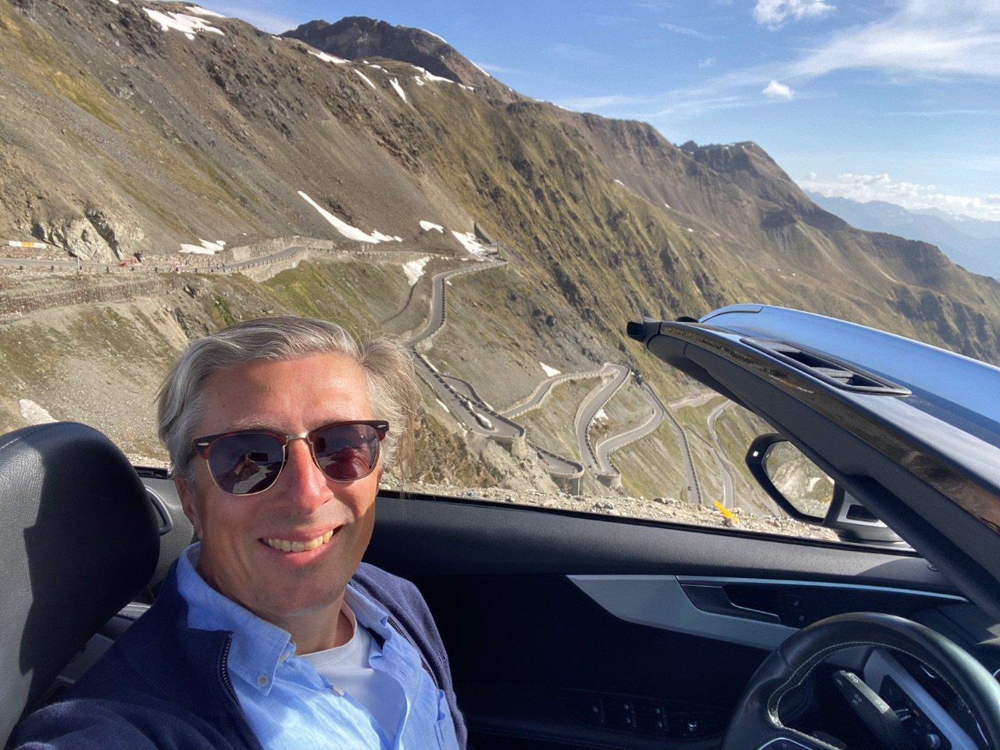
  </a>
  <a href="umbrailpass_237816593__photos__0f74a06f-d88a-459d-8b48-920a34573b47_2919f07d-9cbd-4cfb-b922-bf277bced4fb.jpg" class="step-thumb-link" data-gallery="step-237816593" data-index="9">
    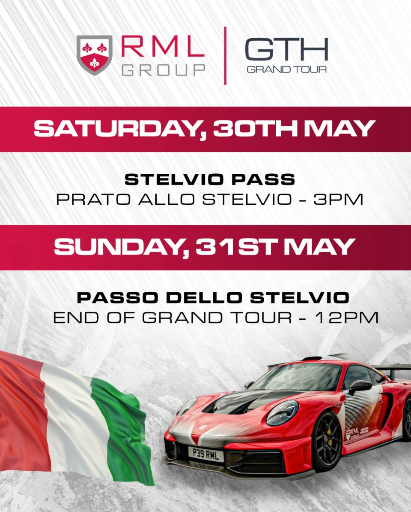
  </a>
  <a href="umbrailpass_237816593__photos__b74ce643-73be-4530-9245-588c1ae6f79f_17359138-4f24-4c19-89a4-e0c3a2a7071b.jpg" class="step-thumb-link" data-gallery="step-237816593" data-index="10">
    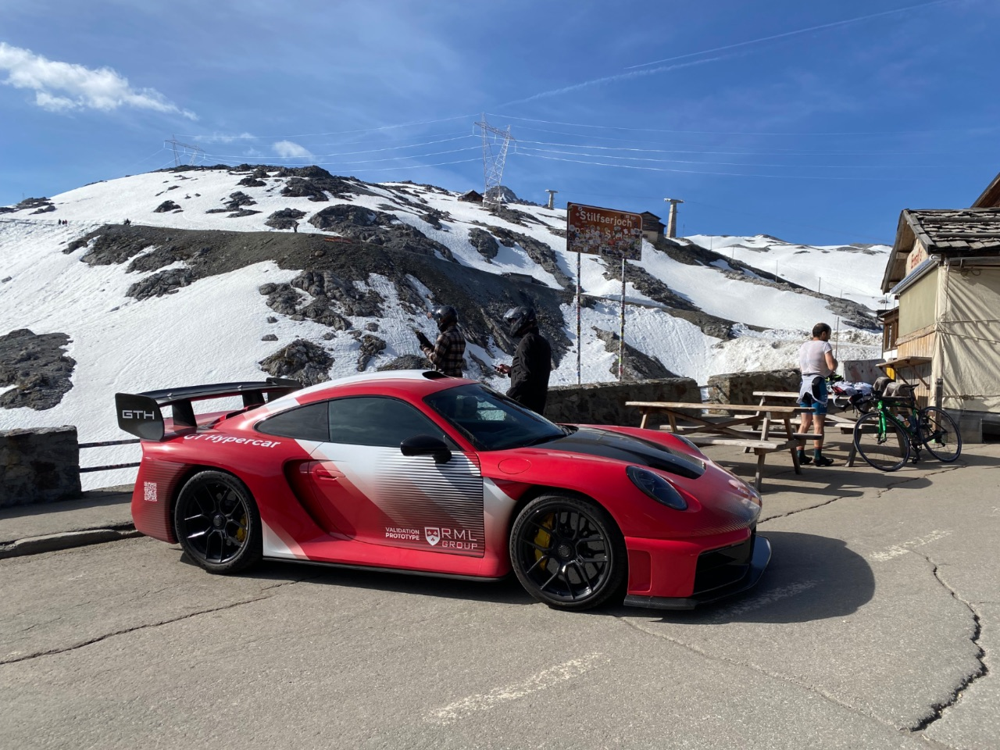
  </a>

#### Etappe: Tarasp

Weiter ging es ins Inntal schön gemütlich. Auf dem Weg sieht man immer wieder Viadukte der Eisenbahn und den schönen türkisfarbenen Fluss.

Hoch auf einer Anhöhe habe ich eine Burg oder Schloss gesehen und hab mich mal hochnavigieren lassen. Das Schloss Tarasp ist ein Wahrzeichen im Engadin. Rund herum in dem Dorf Tarasp haben sie auch noch Kunstobjekte herumstehen. Ich konnte mir es aber nicht genauer anschauen, ich bin ja auf der Heimreise :-) und musste ja noch etwas Strecke machen.

  <a href="tarasp_237818103__photos__efdfb8a6-bf23-4e43-9e74-696641cf2ff0_d5ceefdc-1207-4aeb-abc8-fee3f72fefdc.jpg" class="step-thumb-link" data-gallery="step-237818103" data-index="1">
    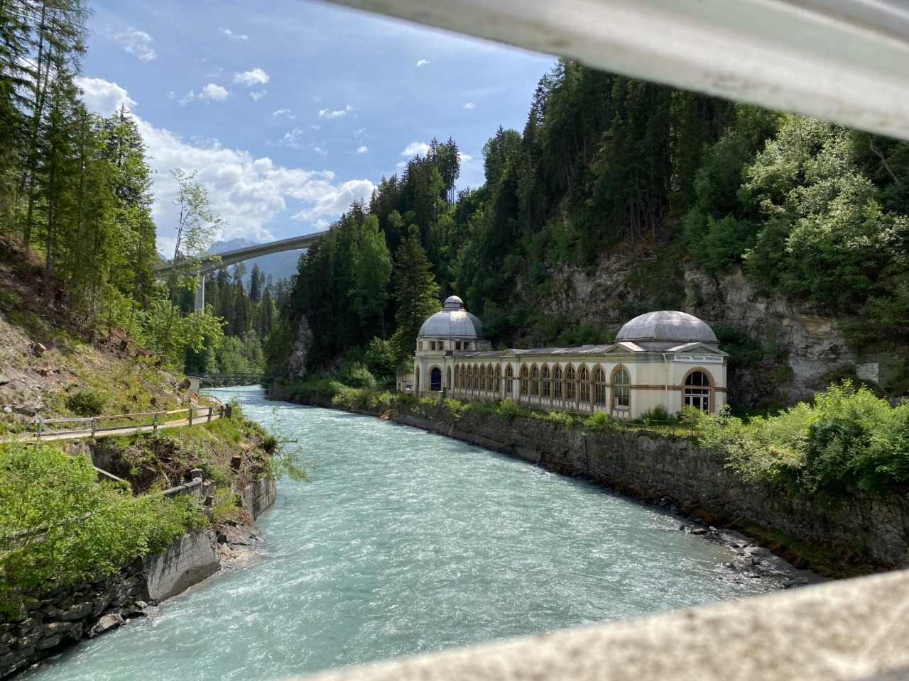
  </a>
  <a href="tarasp_237818103__photos__d00e5e17-8298-4b8e-bd4a-c0f970970b68_d2653ae2-ddee-4c14-a731-e3821df3bf60.jpg" class="step-thumb-link" data-gallery="step-237818103" data-index="2">
    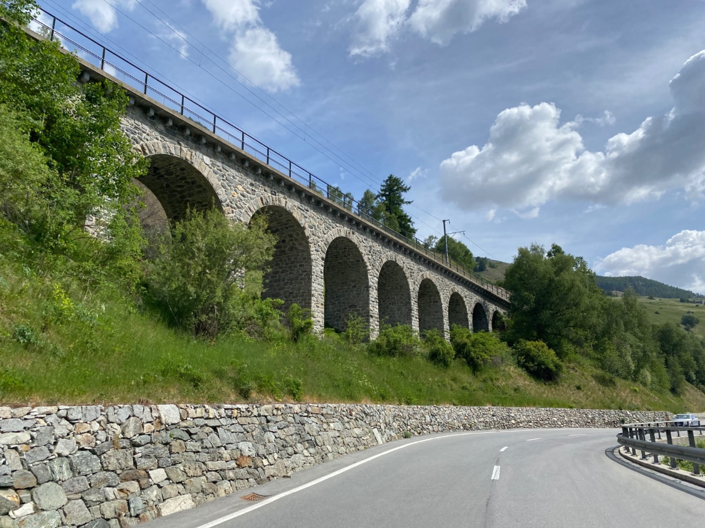
  </a>
  <a href="tarasp_237818103__photos__9ee4dc40-bf64-4c6e-9c5d-d0d1369dda4e_b94b6ef1-c4d7-4fd0-9195-0f5b2b4554cf.jpg" class="step-thumb-link" data-gallery="step-237818103" data-index="3">
    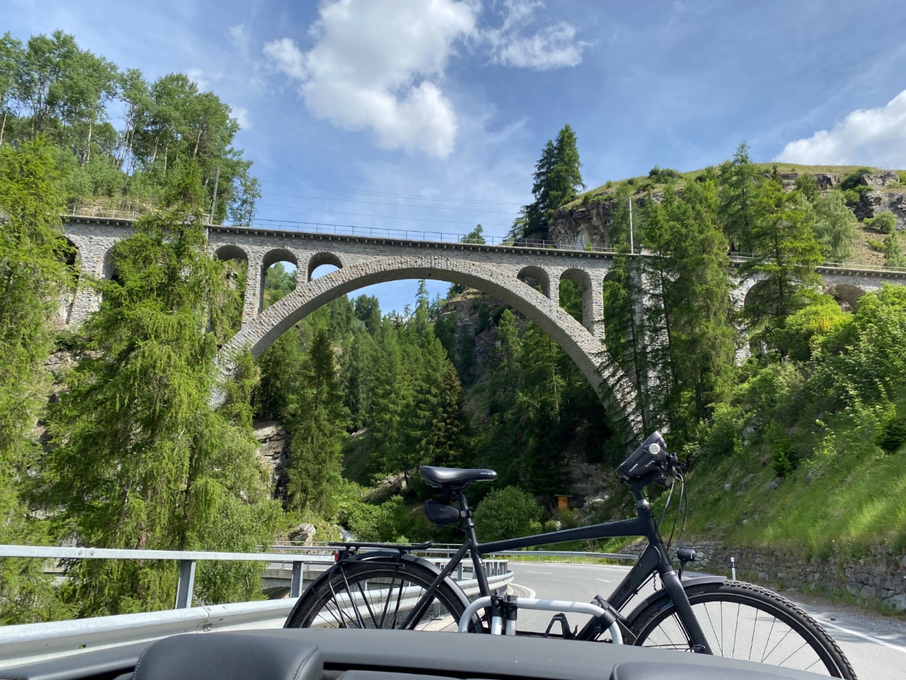
  </a>
  <a href="tarasp_237818103__photos__8324db3e-5639-4f2c-a9b8-c783dfe59eca_a42bb737-ef1f-418a-af07-5842d9f1da89.jpg" class="step-thumb-link" data-gallery="step-237818103" data-index="4">
    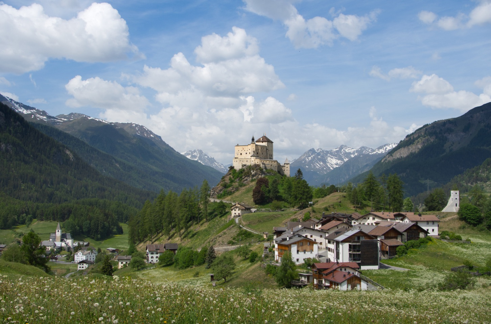
  </a>
  <a href="tarasp_237818103__photos__c8470156-8eb0-464d-9fc1-b7396321146f_60a24f1b-74b7-4101-b18d-62ecab6e7294.jpg" class="step-thumb-link" data-gallery="step-237818103" data-index="5">
    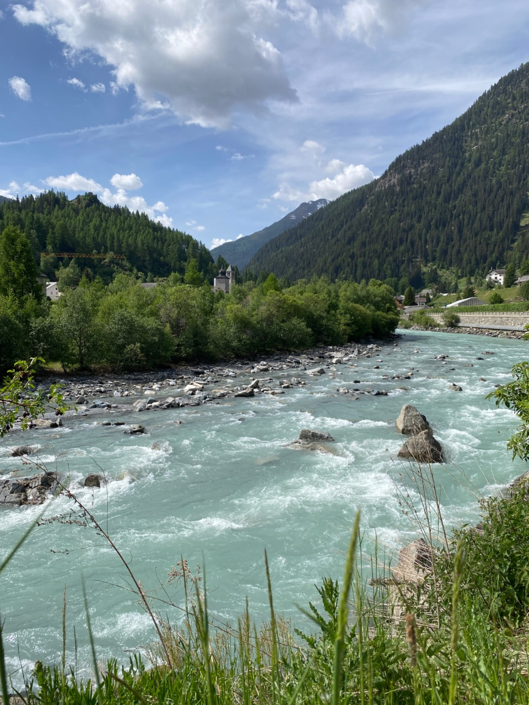
  </a>
  <a href="tarasp_237818103__photos__ef5c5b27-61f1-4086-8de4-465ffac94956_3e6c3d6a-d9f6-4b19-a68d-53f78cbabb01.jpg" class="step-thumb-link" data-gallery="step-237818103" data-index="6">
    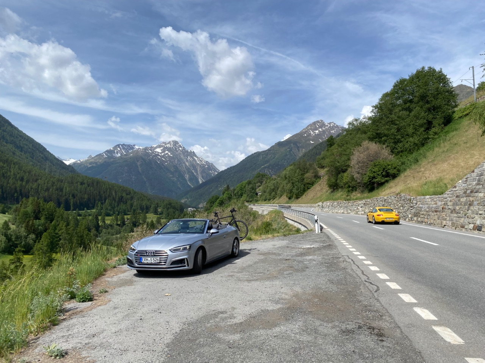
  </a>
  <a href="tarasp_237818103__photos__99440144-3d13-45d0-bc9e-668692b0d92b_2b2ca53f-f7d9-47ef-9d37-ea7e580f7ad1.jpg" class="step-thumb-link" data-gallery="step-237818103" data-index="7">
    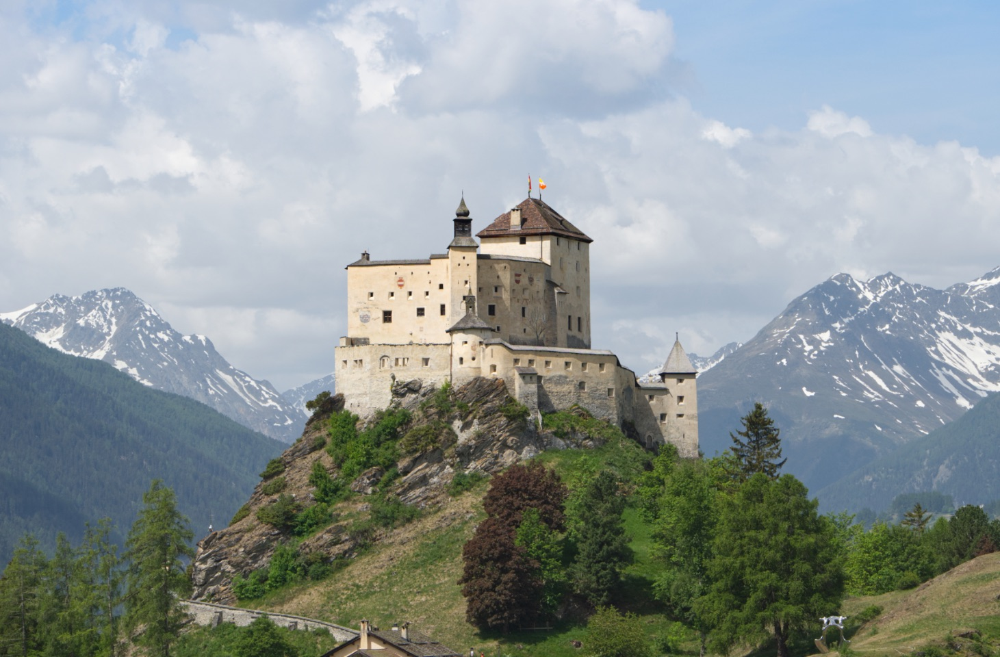
  </a>
  <a href="tarasp_237818103__photos__accdfc27-225b-41c0-9d5b-c39df0e322f4_29123853-150f-4c5b-9b4d-a319fa61f34e.jpg" class="step-thumb-link" data-gallery="step-237818103" data-index="8">
    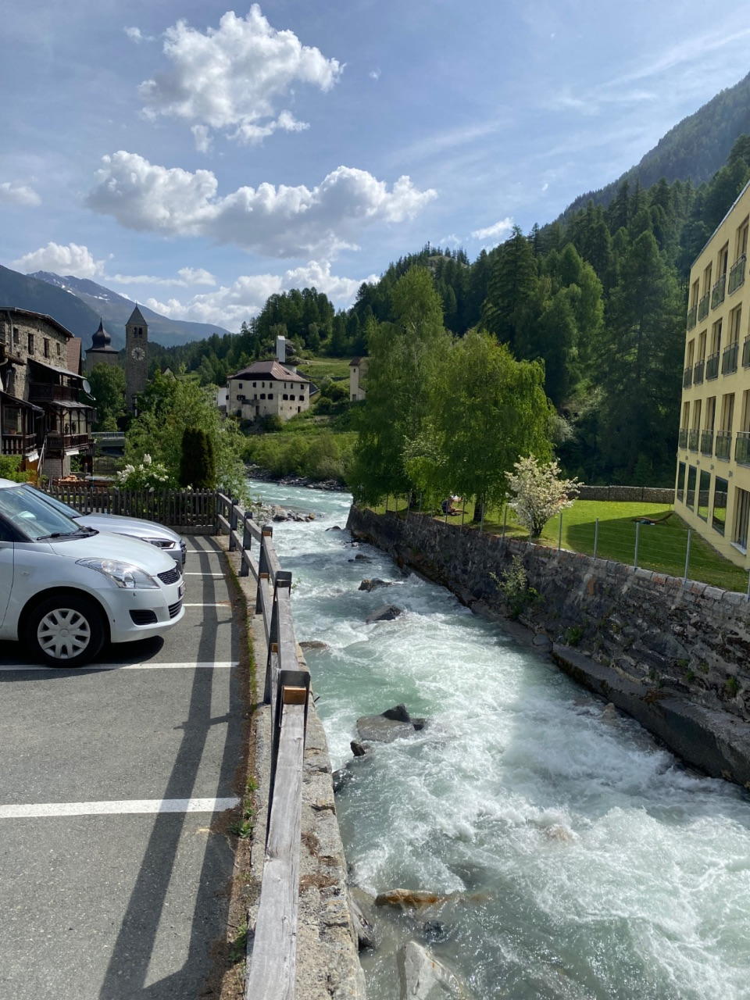
  </a>
  <a href="tarasp_237818103__photos__99691b34-f7a3-44d0-974b-082984e2f6a4_16b1fdd5-9852-45bd-8271-c5ac7aa6b106.jpg" class="step-thumb-link" data-gallery="step-237818103" data-index="9">
    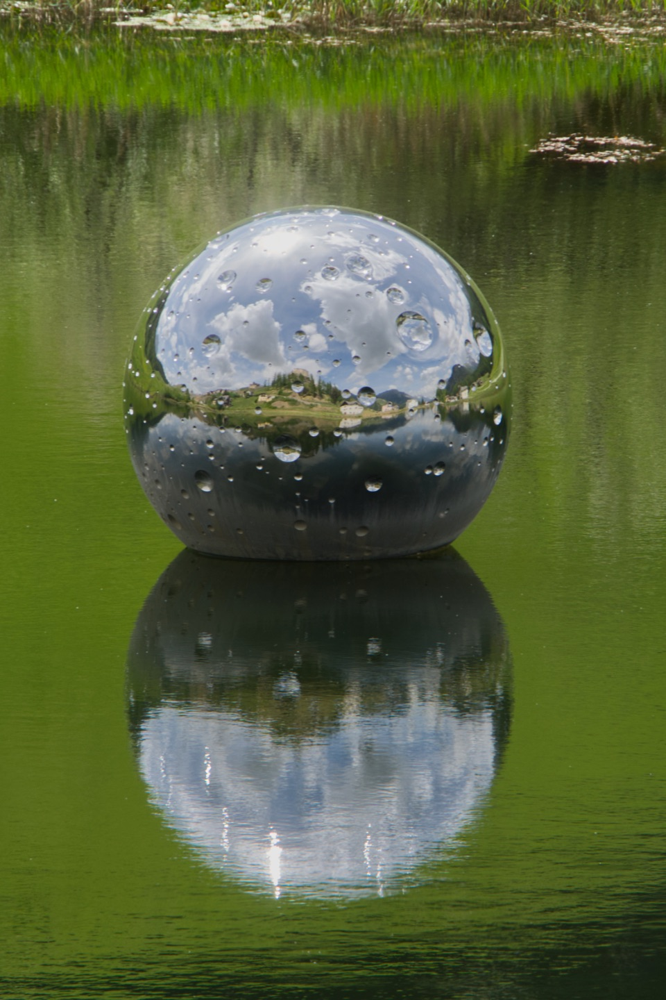
  </a>

#### Etappe: Samnaun

Das nächste Ziel war eigentlich wieder eine Tankstelle. Genauer genommen wollte ich in die zollfreie Zone Samnaun und mir das Tal genauer anschauen.
Die Anfahrt auf der schmalen Bergstraße mit ihren zwei einspurigen Tunnels um eine Kurve herum sind immer wieder schön. Man sieht ja, ob Gegenverkehr kommt und so lässt man Autos durch oder fährt in kurzer Kolonne durch den Tunnel durch.

Bei der ersten Tankstelle habe ich dann aufgefüllt bei 1,484€ den Liter. Danach dachte ich mir, ich hab ja noch Zeit, fährste halt mal das ganze Tal entlang. Und da bin ich dann ähnlich wie in Livigno eines besseren belehrt worden. Die billigste Tanke ist ganz hinten in Samnaun Dorf, da waren 1,419€ angeschrieben 🤣.

Zurück ging es auf der anderen Seite des Tals, da kommt man dann schon auf österreichischer Seite heraus. Ein schöner Abstecher, der auch für eine kleine Wanderung einlädt.

  <a href="samnaun_237821041__photos__868ac9e8-ab07-429b-94db-d9f5cbac6ee6_db641d35-8036-4af8-ae10-3eac1244372a.jpg" class="step-thumb-link" data-gallery="step-237821041" data-index="1">
    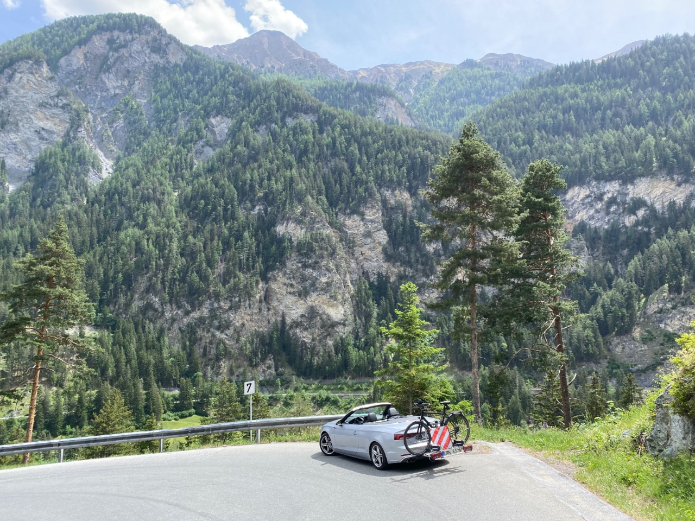
  </a>
  <a href="samnaun_237821041__photos__e44a7743-5f00-4246-b52e-657d54b47b85_c4bf5aaf-ca77-4841-a62a-eaf179b88277.jpg" class="step-thumb-link" data-gallery="step-237821041" data-index="2">
    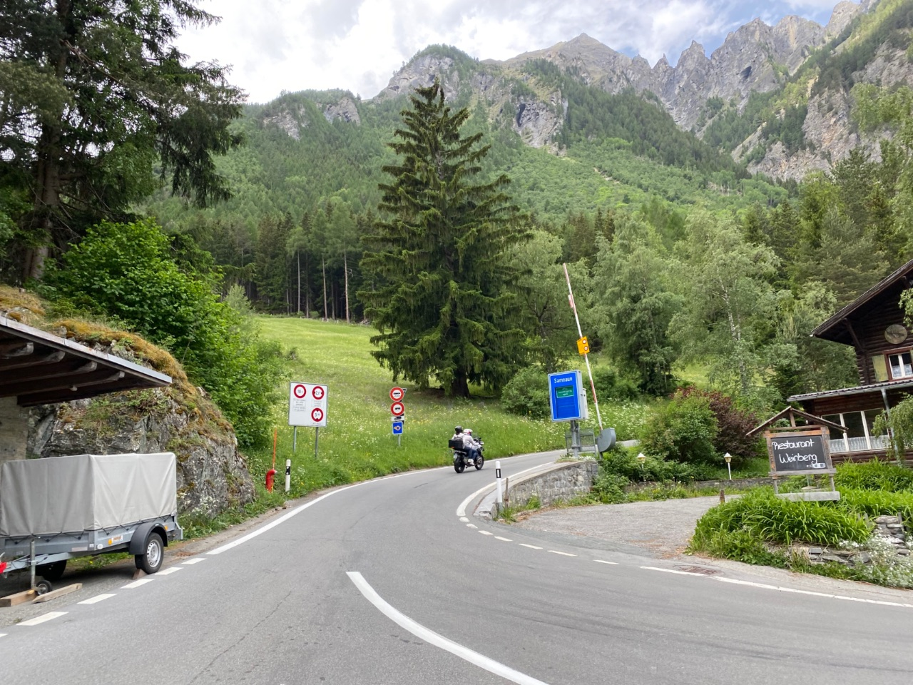
  </a>
  <a href="samnaun_237821041__photos__045aec06-383a-4d91-b6e8-9214d88662f4_9f3cc6a0-bfd6-4595-b9c2-440ad4bf8fba.jpg" class="step-thumb-link" data-gallery="step-237821041" data-index="3">
    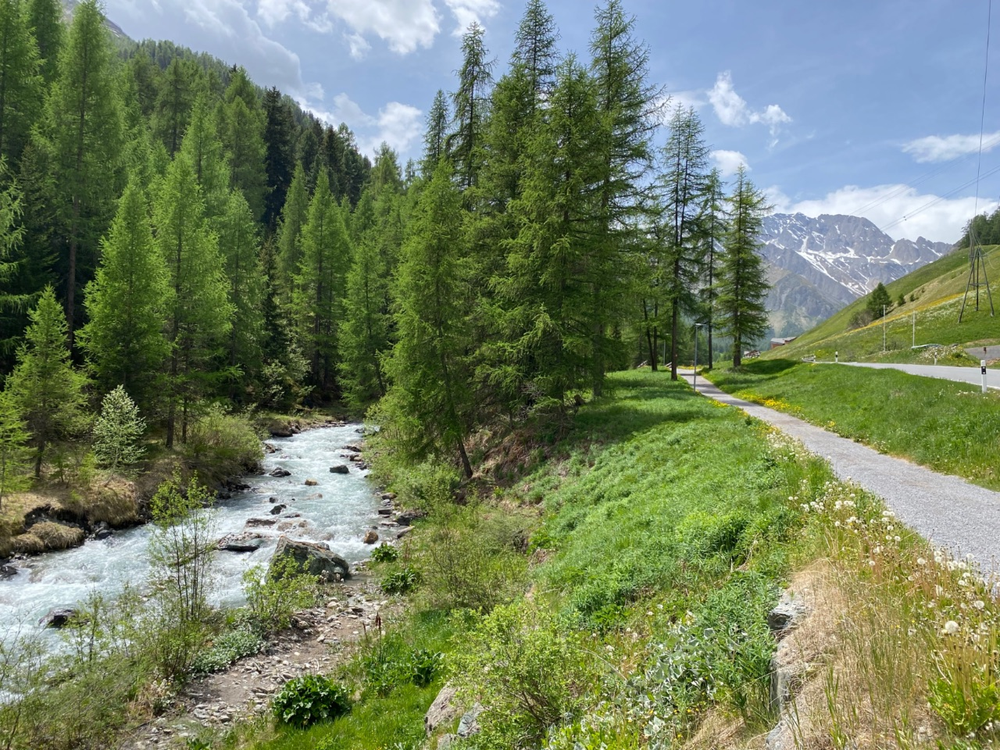
  </a>
  <a href="samnaun_237821041__photos__4c83620e-ba17-486e-998a-6a9a6e4025c6_5a34f7be-ae2e-4195-89a9-9fecaecd7df2.jpg" class="step-thumb-link" data-gallery="step-237821041" data-index="4">
    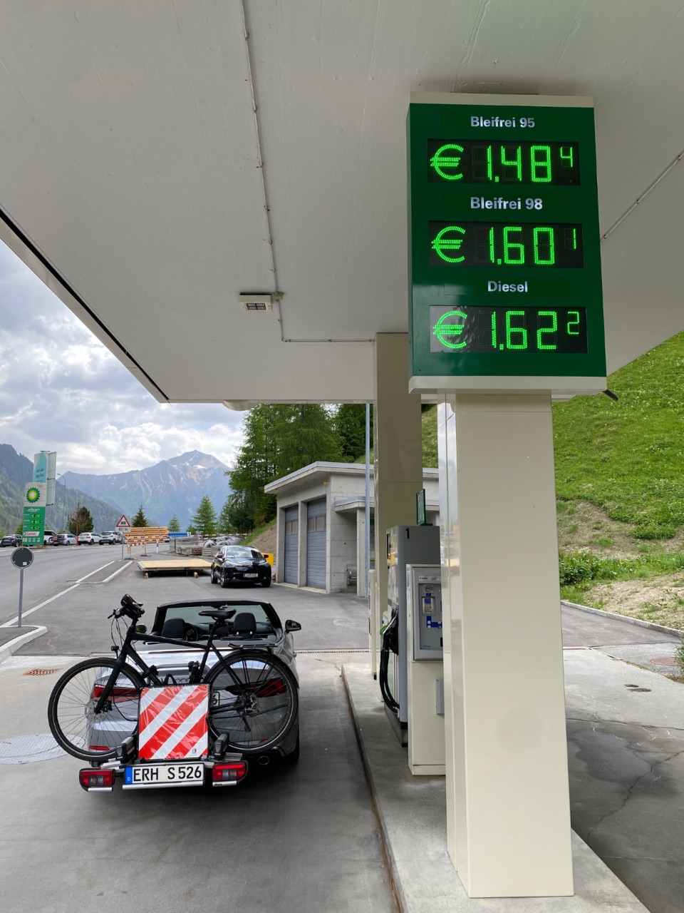
  </a>
  <a href="samnaun_237821041__photos__c6ea1476-c7aa-496d-b94a-794f3e668bcb_3d5ac49f-92ac-4d21-ae31-ae4c319616c1.jpg" class="step-thumb-link" data-gallery="step-237821041" data-index="5">
    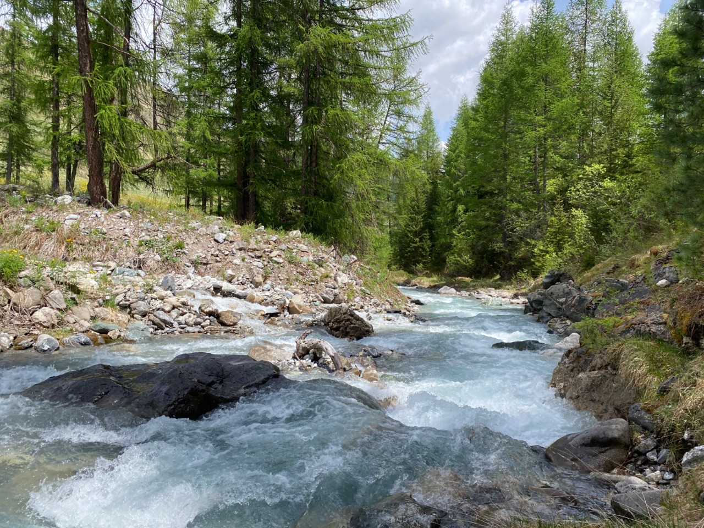
  </a>
  <a href="samnaun_237821041__photos__c28ab485-c619-45b1-9418-07ccf18aea5f_0b2ca8c6-08c2-441e-9623-b2360da64603.jpg" class="step-thumb-link" data-gallery="step-237821041" data-index="6">
    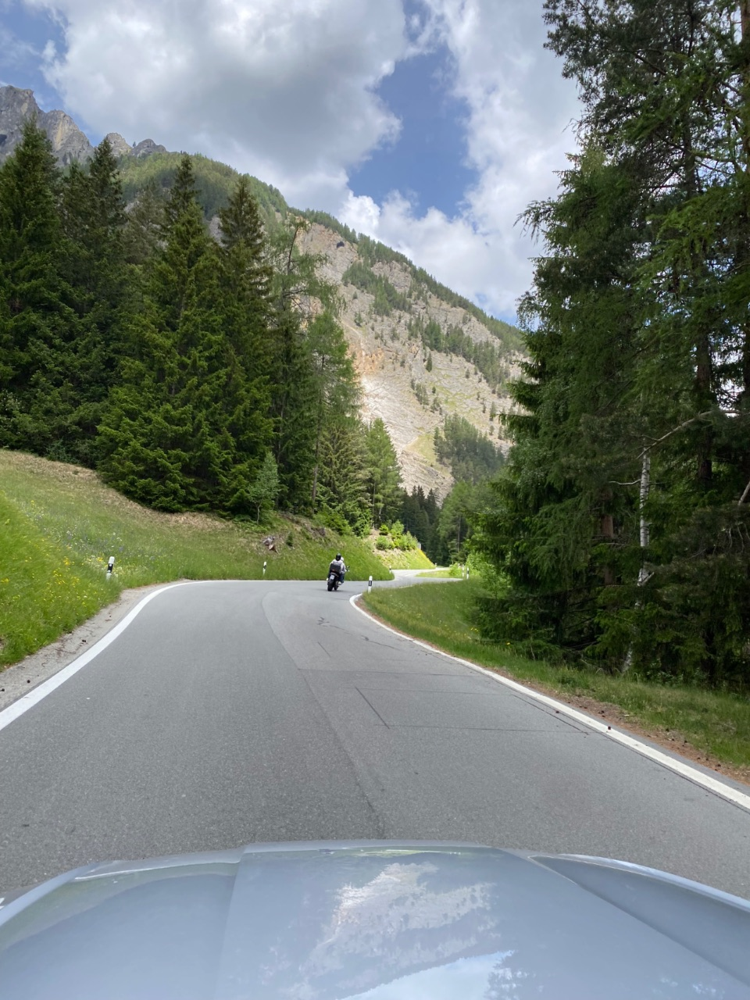
  </a>

#### Etappe: Pfunds

Nach dem Abstecher nach Samnaun wollte ich die Weiterfahrt planen. Eine Klamm ansehen wäre nochmal schön, und so dachte ich an die Klamm bei Leutasch kurz vor Mittenwald. Aber das Navi zeigte mir, dass die Straße runter nach Mittenwald gesperrt ist. Dann wäre das ein ziemlicher Umweg gewesen.
Dann habe ich aber gleich bei Pfunds eine auf der Karte gefunden, gerade mal 8 Minuten entfernt. Also das Auto am oberen Dorfrand geparkt und dann den Fußweg hoch zum Beginn der Klamm. 

Die Radurschlklamm ist kostenlos und war nicht überlaufen. Ein sehr schöner kleiner Weg mit vielen kleinen Brücken über den Bach. Viele kleine Wasserfälle rauschten während der Wanderung.
Während der Wanderung dachte ich, ob am oberen Ende vielleicht eine Gastwirtschaft ist, aber ich hatte keinen Geldbeutel eingesteckt. Daher hab ich irgendwann umgedreht und bin zum Auto zurück. Aber auf der Karte habe ich gesehen, das da oben auch eine Gaststätte ganztags geöffnet ist. Ich bin dann halt nochmal mit dem Auto die Straße hochgefahren. 
Ein familiengeführtes kleines Restaurant mit ein paar Zimmern. Privat gebrautes Bio-Craft-Bier, Kaffee aus ökologischer Röstung, alles mit viel Liebe gemacht. Die Mittagspause hat sich gelohnt. Und auf Komoot habe ich mir dann nochmal den Höhenunterschied angeschaut, das wären zu Fuß nochmal 2km einfach zur Gaststätte gewesen. Ich wollte ja keine ewig lange Wanderung machen, ich war ja immer noch auf der Heimreise :-)
Zum Espresso habe ich aber auch ihre selbstgebackene Erdbeertorte probieren müssen. 🍓🍰😋

  <a href="pfunds_237826291__photos__8d4d5c58-7ed3-4274-9dd1-0f2c55e94a0e_cac967be-a5c0-477f-a365-262fff7991c7.jpg" class="step-thumb-link" data-gallery="step-237826291" data-index="1">
    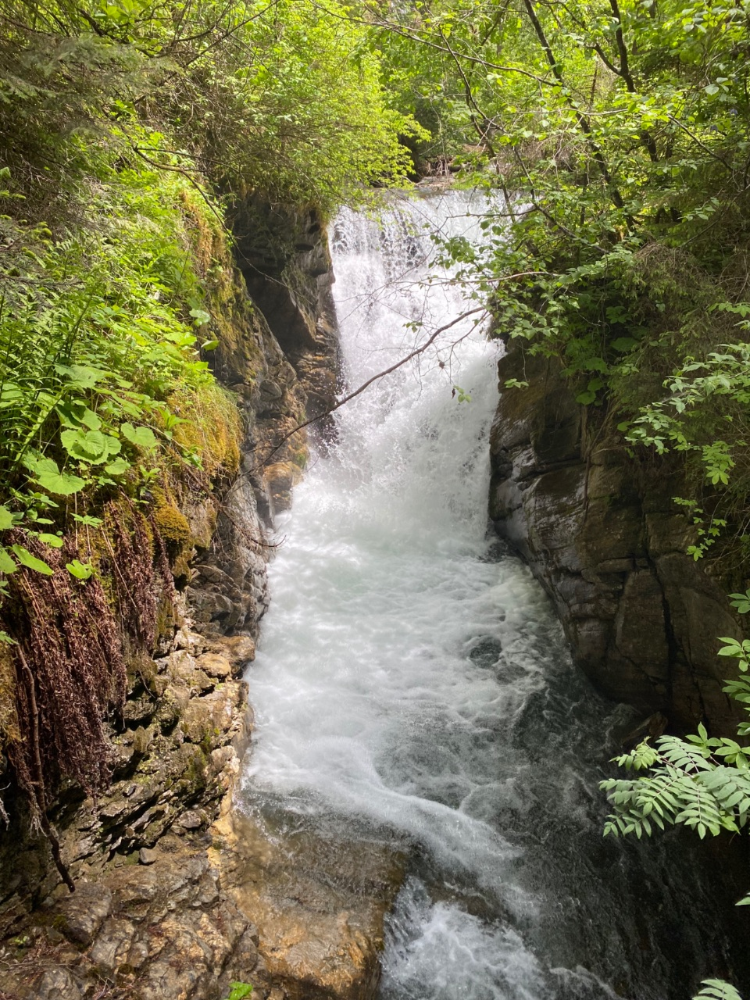
  </a>
  <a href="pfunds_237826291__photos__ffe07068-6f76-41e3-bdcf-46fbb9199a71_c170c838-2551-4c63-8521-013f5ab8ab0d.jpg" class="step-thumb-link" data-gallery="step-237826291" data-index="2">
    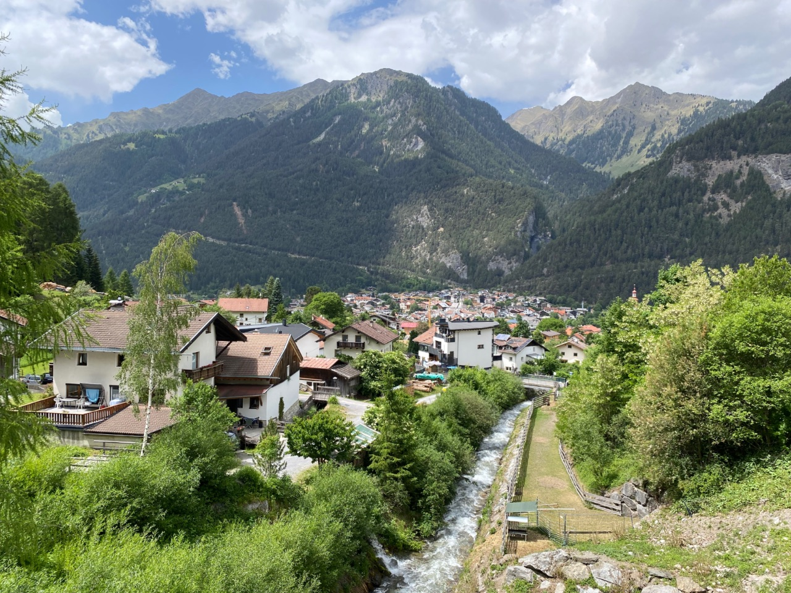
  </a>
  <a href="pfunds_237826291__photos__9188144b-17ea-48d6-842d-8ffe78215770_af48343d-216a-4701-8413-975f4f5b9750.jpg" class="step-thumb-link" data-gallery="step-237826291" data-index="3">
    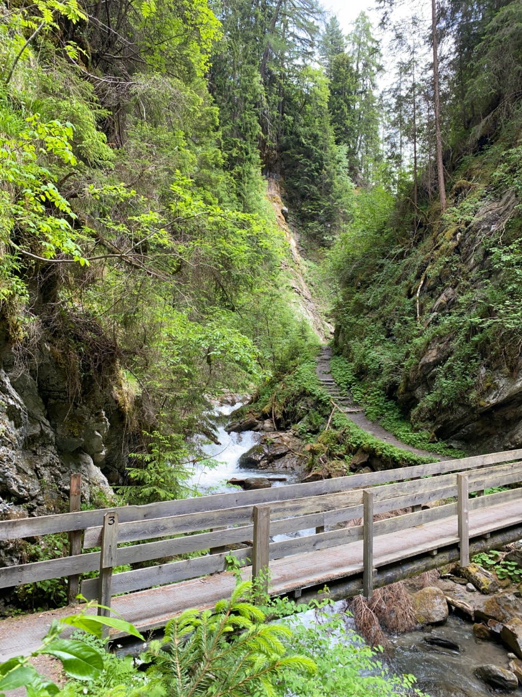
  </a>
  <a href="pfunds_237826291__photos__2ca585cb-e21c-4e42-8167-5854fd8629e5_abfad179-ea5d-443a-85d0-704823d60551.jpg" class="step-thumb-link" data-gallery="step-237826291" data-index="4">
    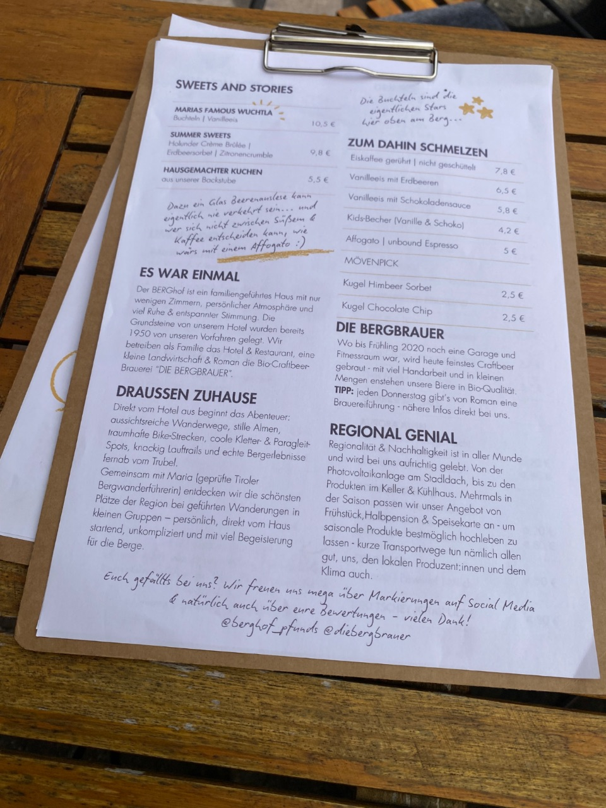
  </a>
  <a href="pfunds_237826291__photos__8b92ae0d-fb70-455b-8ba3-43e733dd7643_a86cc7eb-0fcd-4910-9906-800af82ca64f.jpg" class="step-thumb-link" data-gallery="step-237826291" data-index="5">
    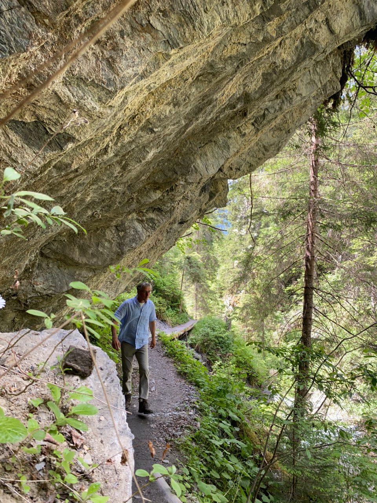
  </a>
  <a href="pfunds_237826291__photos__7a7931df-fab2-421a-83d2-ddb45b66a232_a7bed35b-1da8-4ed2-9ee9-5ff1b2260365.jpg" class="step-thumb-link" data-gallery="step-237826291" data-index="6">
    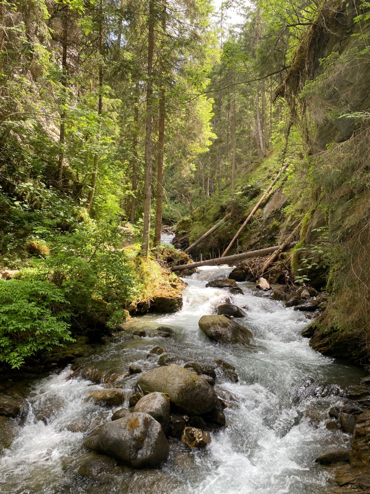
  </a>
  <a href="pfunds_237826291__photos__4bb1f7bb-f682-40d9-8b49-1eb594f67351_8c513149-6235-4bb8-ba26-e67e9b44df28.jpg" class="step-thumb-link" data-gallery="step-237826291" data-index="7">
    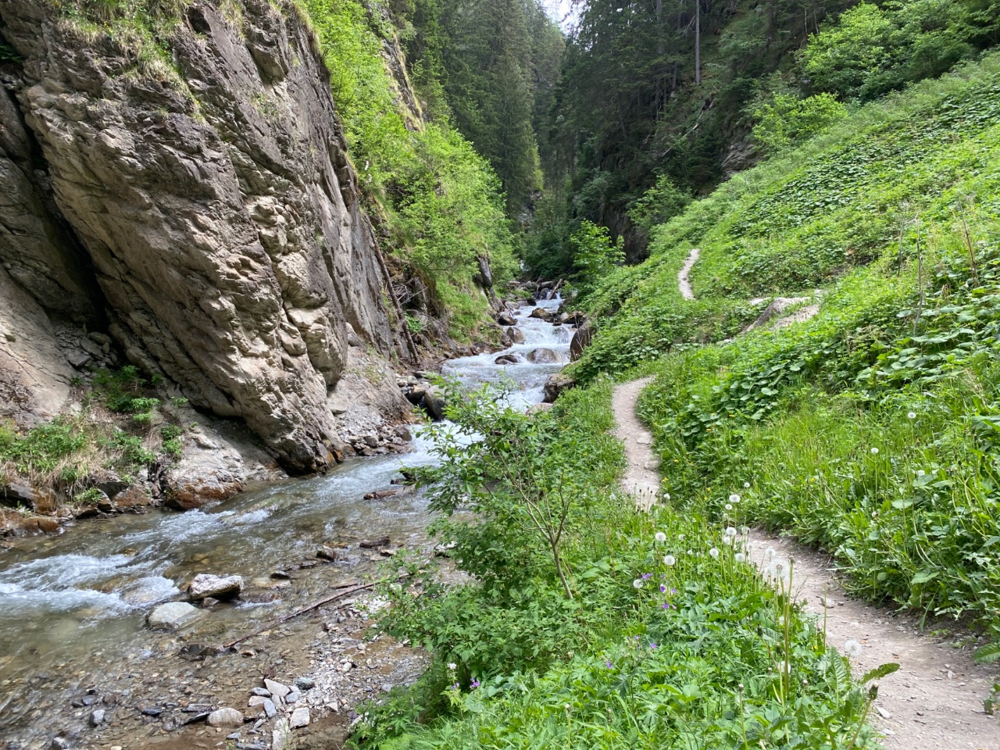
  </a>
  <a href="pfunds_237826291__photos__807f9694-f6cf-4997-af71-93539c6de591_771f6f8c-af8e-44ad-9010-ed3daa97f30c.jpg" class="step-thumb-link" data-gallery="step-237826291" data-index="8">
    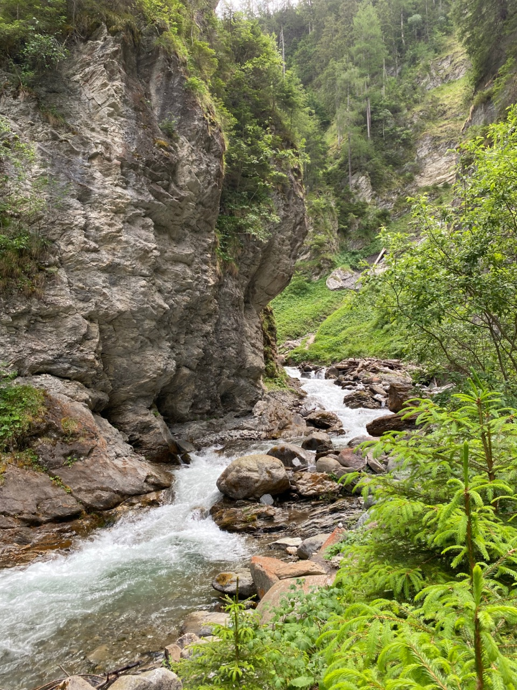
  </a>
  <a href="pfunds_237826291__photos__09ef7e1f-c28c-4153-ad31-c85fe9ba4678_76fdd84b-7909-478d-a78c-a8402f27b106.jpg" class="step-thumb-link" data-gallery="step-237826291" data-index="9">
    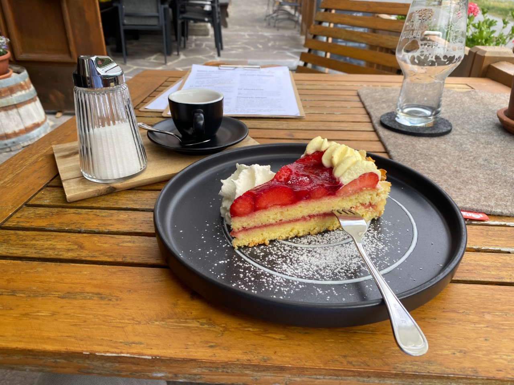
  </a>
  <a href="pfunds_237826291__photos__88dd93ed-8b9b-456e-aafa-ea5733cae88d_73bb5ce2-8999-4b7a-8f10-0b221757a587.jpg" class="step-thumb-link" data-gallery="step-237826291" data-index="10">
    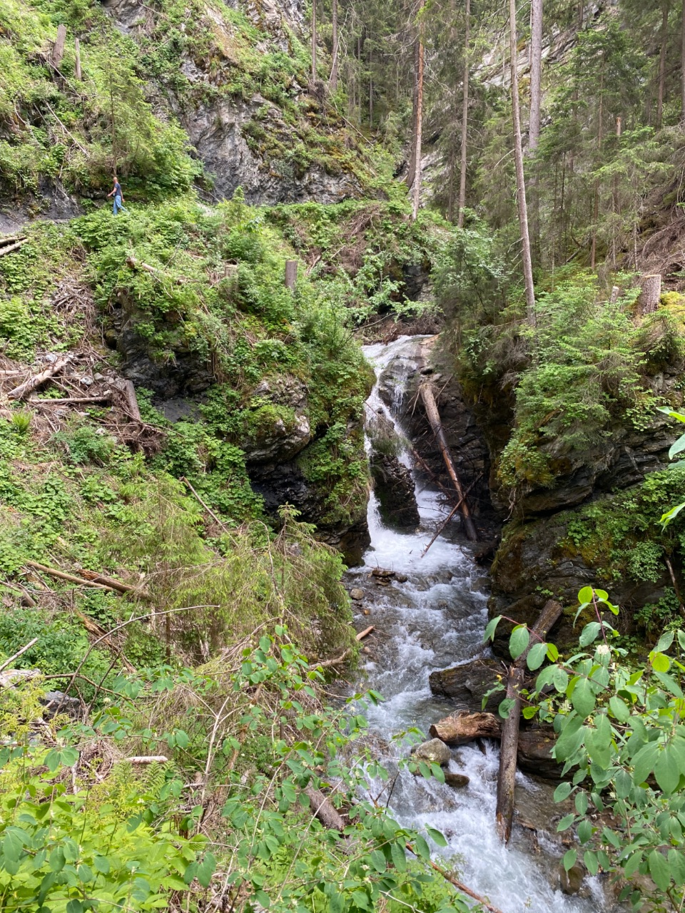
  </a>
  <a href="pfunds_237826291__photos__af5b21dd-a5a1-49e6-a7ab-8977e9c9685a_33f3390d-b7ac-4ca2-8321-05e223651365.jpg" class="step-thumb-link" data-gallery="step-237826291" data-index="11">
    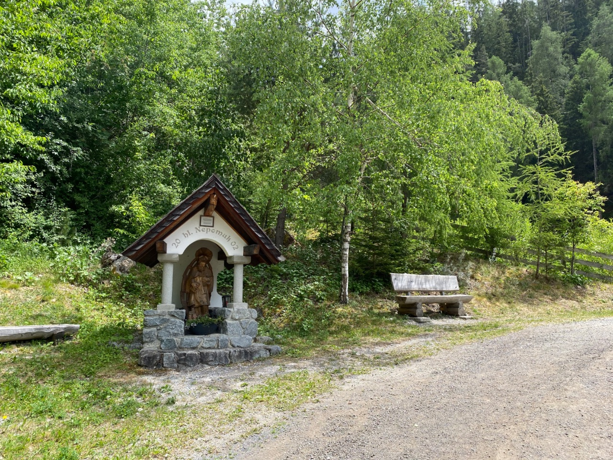
  </a>
  <a href="pfunds_237826291__photos__d8932669-24ba-4d6f-b268-b5b5f5174e93_1108f87f-60ae-4daa-8029-5e5cdb7bb180.jpg" class="step-thumb-link" data-gallery="step-237826291" data-index="12">
    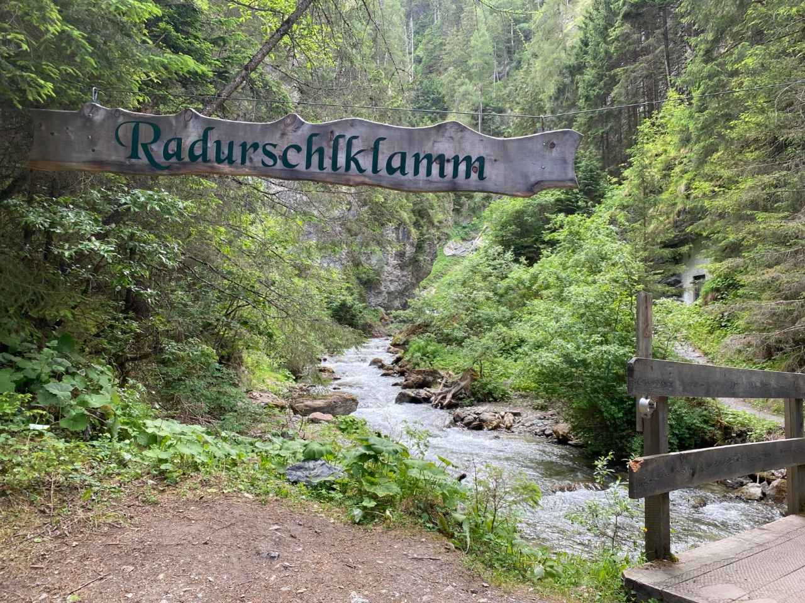
  </a>
  <a href="pfunds_237826291__photos__548fead8-7384-4982-8520-bae7d74885fb_09826ca5-dc1d-4f87-893a-16f2dd009680.jpg" class="step-thumb-link" data-gallery="step-237826291" data-index="13">
    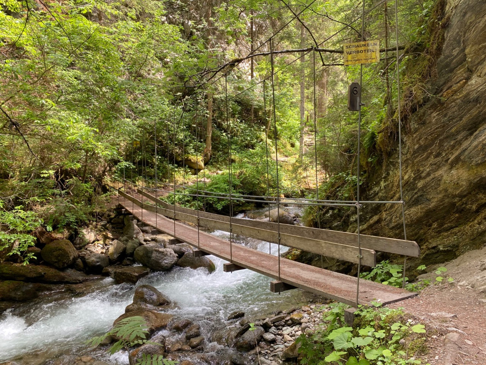
  </a>

#### Etappe: Fernpass

Eigentlich wollte ich den Fernpass meiden, weil da meistens immer viel Verkehr Richtung Deutschland und Garmisch ist. Aber scheinbar nicht heute, alles lief durch Österreich ganz entspannt. Immerhin fahren ja am Sonntag keine LKW über den Pass. 
In Österreich ging das Katz und Maus Spiel mit den Regenschauern los. Die ersten Tropfen konnte ich noch im offenen Cabrio ertragen. Bei der zweiten Regenwolke kam dann auch noch eine rote Baustellenampel, da musste ich zumachen 🌧️☔️:-) 

Danach war es wieder freundlich und nach etwa einer Viertelstunde war das Dach wieder trocken, also wieder auf und weiter Richtung Fernpass. 
Ein kurzer Fotostopp am Parkplatz Zugspitzblick, dann rechts abbiegen nach Ehrwald - ich will bei Lermoos nicht durch den langen Tunnel fahren. Oha, der Weißensee kurz vor Ehrwald/Biberwier wird "umgebaut". Viele Bäume wurden gefällt, ein paar Wege werden angelegt. Scheinbar wird der für Touristen etwas besser erschlossen. Im Winter musste ich mich immer durch die Bäume runter zum Ufer schlagen :-)

  <a href="fernpass_237828744__photos__63ae04bd-4840-43e6-baa2-e20c2841b63a_d5b005b3-5072-4d62-850c-209fc795f256.jpg" class="step-thumb-link" data-gallery="step-237828744" data-index="1">
    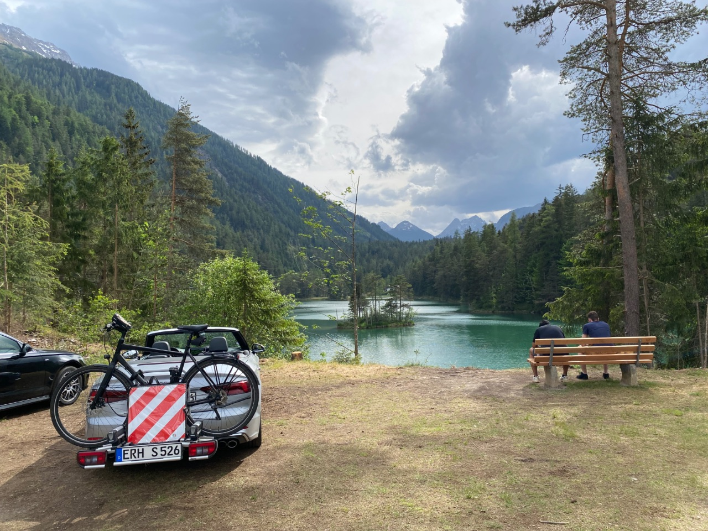
  </a>
  <a href="fernpass_237828744__photos__62ed244c-d782-4c76-bc16-b218db55416f_d451ba6f-3b08-4ba5-a22e-f698be5c29d7.jpg" class="step-thumb-link" data-gallery="step-237828744" data-index="2">
    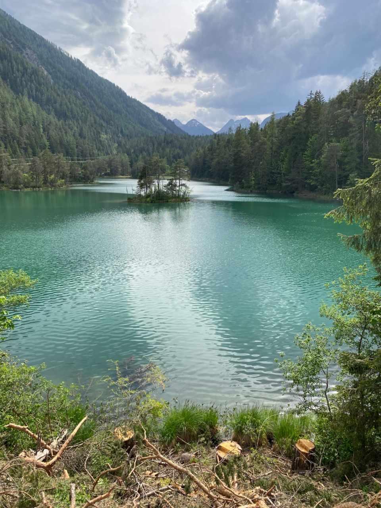
  </a>
  <a href="fernpass_237828744__photos__c7249bf7-0981-41ca-943b-353506fb0af9_8ad04a8a-6e5f-484f-8d65-c7ea447c1089.jpg" class="step-thumb-link" data-gallery="step-237828744" data-index="3">
    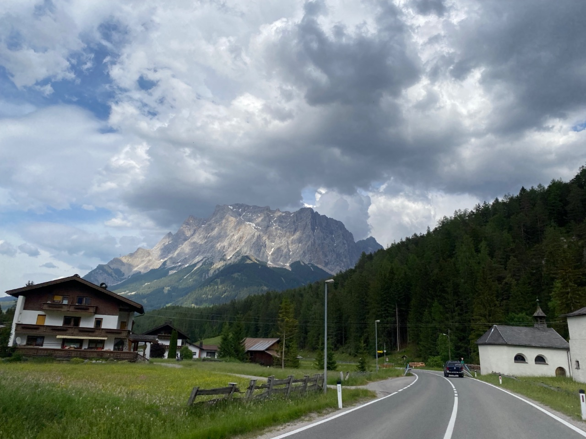
  </a>
  <a href="fernpass_237828744__photos__d0c769c9-c109-40f6-946b-2c12910e5ccd_7672c459-d817-49fe-8687-5fc3904fed10.jpg" class="step-thumb-link" data-gallery="step-237828744" data-index="4">
    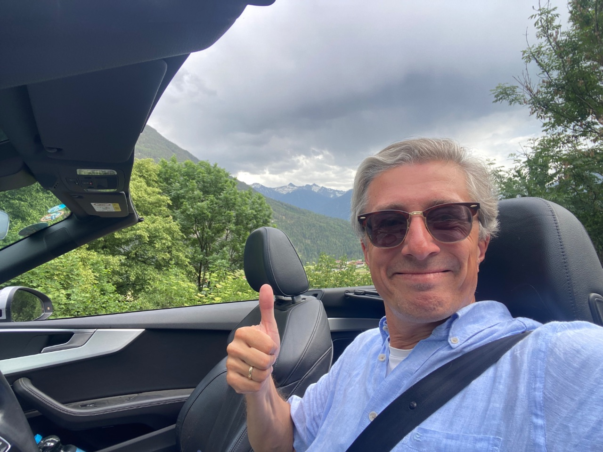
  </a>
  <a href="fernpass_237828744__photos__5be87c99-5ac7-42e6-9398-bd83b0257848_65cb75a2-af51-474b-8d38-f389a3fa1f67.jpg" class="step-thumb-link" data-gallery="step-237828744" data-index="5">
    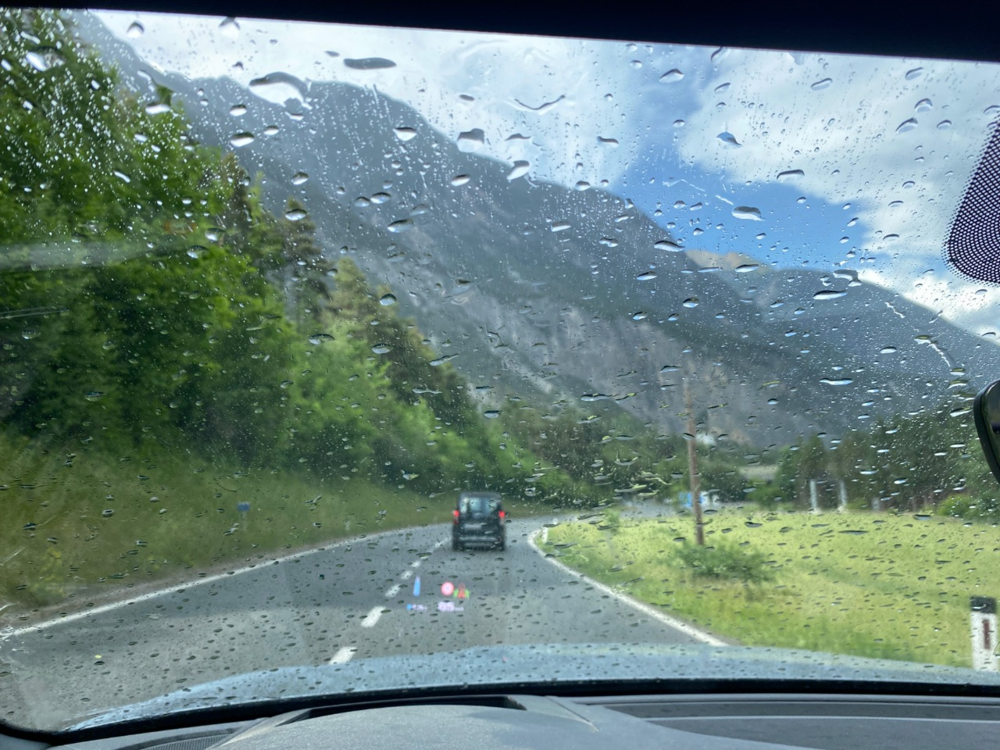
  </a>
  <a href="fernpass_237828744__photos__443a7ecc-54d4-44d1-9ed8-6621cef09f33_342cd744-105f-448b-8a09-020113c5474b.jpg" class="step-thumb-link" data-gallery="step-237828744" data-index="6">
    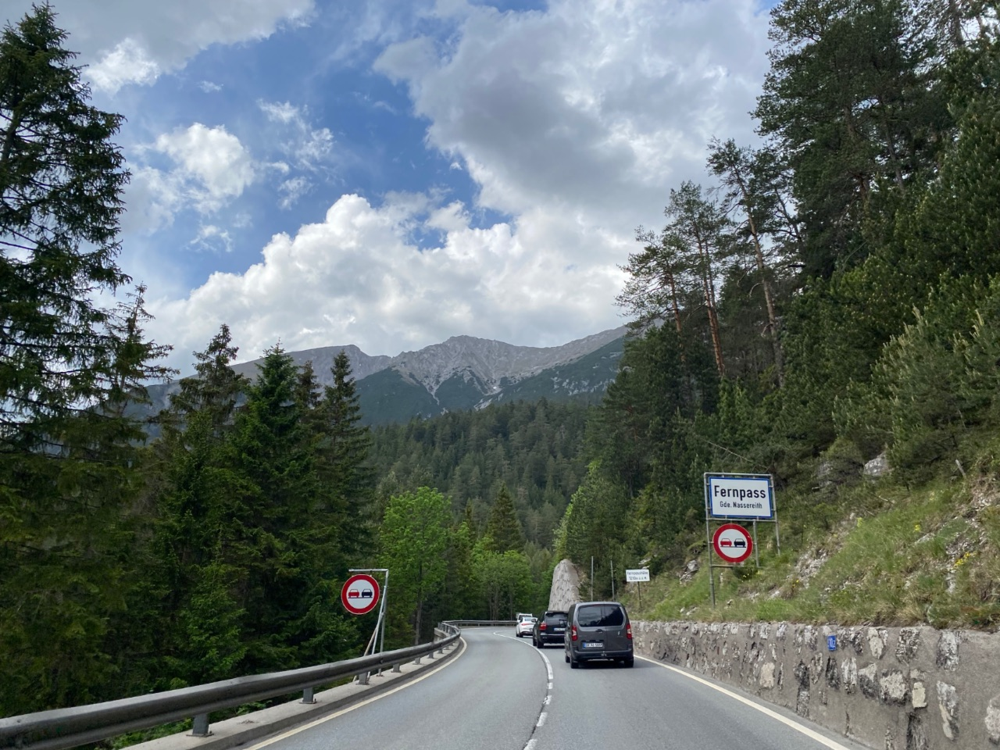
  </a>
  <a href="fernpass_237828744__photos__808ef0ea-1381-46e7-9379-d5295bbdd9a0_217f33a2-a827-404e-a32d-ecd300e369c3.jpg" class="step-thumb-link" data-gallery="step-237828744" data-index="7">
    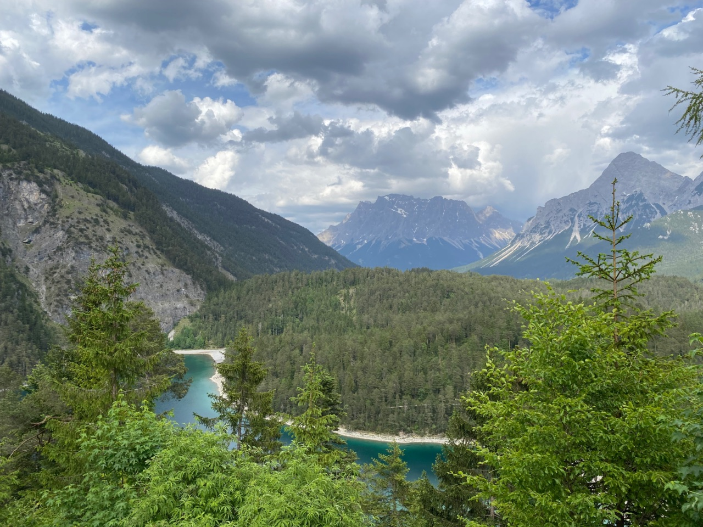
  </a>

#### Etappe: Ende der Cabriofahrt

Weiter ging die Fahrt durch Garmisch und dann auf die Autobahn Richtung München.
Die Wolken wurden immer dunkler, die vom Westen anrückten.
So auf Höhe Seeshaupt beim Starnberger See war es dann so weit. Immer mehr Regentropfen, ich hab immer am Navi geschaut, wann der nächste Parkplatz ist, wie viele Minuten ich im Regen aushalten muss 😅.

Danach ging die Fahrt durch zum Teil sehr heftige Platzregen (da hätte es nur noch die Bürsten wie in der Waschanlage gebraucht 🤣)  und einer tiefen Pfütze bei der langen Baustelle um Ingolstadt nach Hause.

Ende der Fahrt war dann gegen 21 Uhr, alles hat gut geklappt für diese gute Woche unterwegs.

  <a href="ende-der-cabriofahrt_237830458__photos__bed1cd11-6890-4d7b-bcf4-cf61ea9d5a63_c15df76e-5c9b-49b9-834d-d6b2b02bdf59.jpg" class="step-thumb-link" data-gallery="step-237830458" data-index="1">
    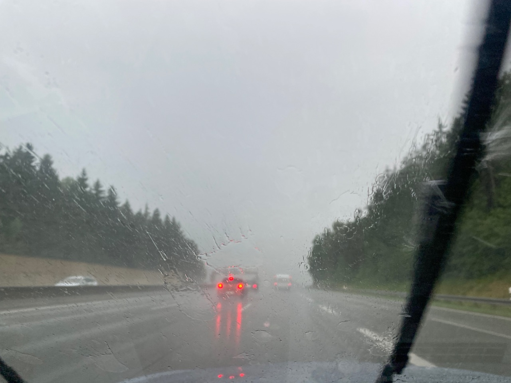
  </a>
  <a href="ende-der-cabriofahrt_237830458__photos__bb90d280-04da-4e41-9053-5fdfe966a0e8_ad08562e-eeb6-49d9-80dc-283dcc25df5f.jpg" class="step-thumb-link" data-gallery="step-237830458" data-index="2">
    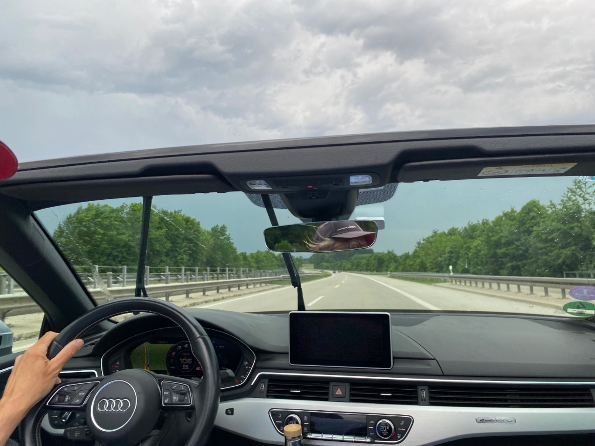
  </a>
  <a href="ende-der-cabriofahrt_237830458__photos__90b95478-2b7a-4094-acbc-7b1328ef03c8_a713f147-f183-45f4-8dd9-c2035460ace2.jpg" class="step-thumb-link" data-gallery="step-237830458" data-index="3">
    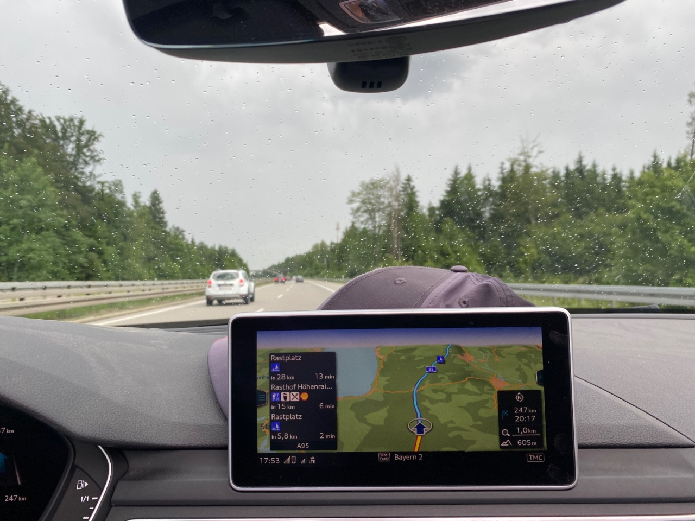
  </a>
  <a href="ende-der-cabriofahrt_237830458__photos__7376d3ea-4d41-4848-8a76-31560d22a9a7_565d0e7d-ae4e-4a63-9e6d-381625aaad66.jpg" class="step-thumb-link" data-gallery="step-237830458" data-index="4">
    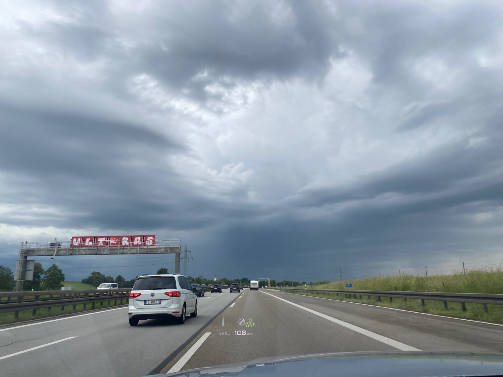
  </a>
  <a href="ende-der-cabriofahrt_237830458__photos__e5d76c7d-ae55-45fe-a0a3-ce7d4808ad11_3126caa0-68f0-46c7-bf82-14b619a5a21e.jpg" class="step-thumb-link" data-gallery="step-237830458" data-index="5">
    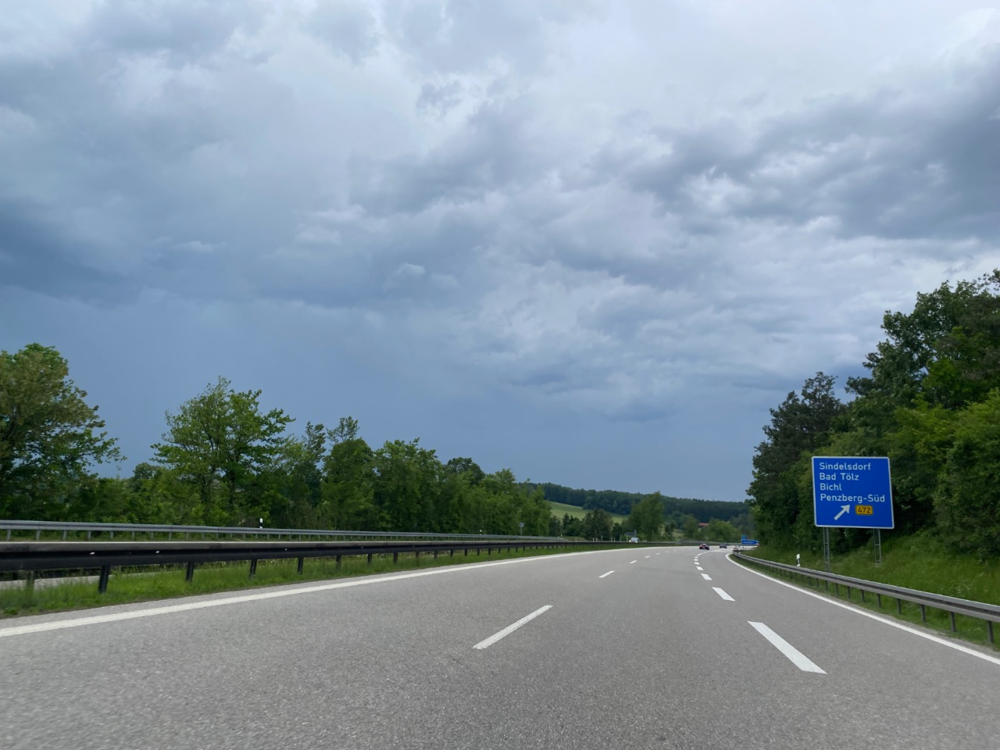
  </a>
  <a href="ende-der-cabriofahrt_237830458__photos__610e56ea-9310-47f1-b343-4b813964aadb_11ca90f5-baf8-4ad4-a342-9827073de5ac.jpg" class="step-thumb-link" data-gallery="step-237830458" data-index="6">
    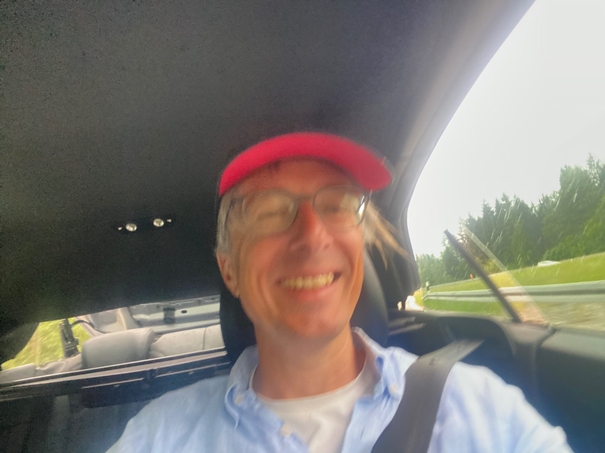
  </a>
  <a href="ende-der-cabriofahrt_237830458__photos__a03546b0-ef09-4921-b25c-3afc64e8838b_1139cc5d-77a2-4ebf-8806-bddb088fd436.jpg" class="step-thumb-link" data-gallery="step-237830458" data-index="7">
    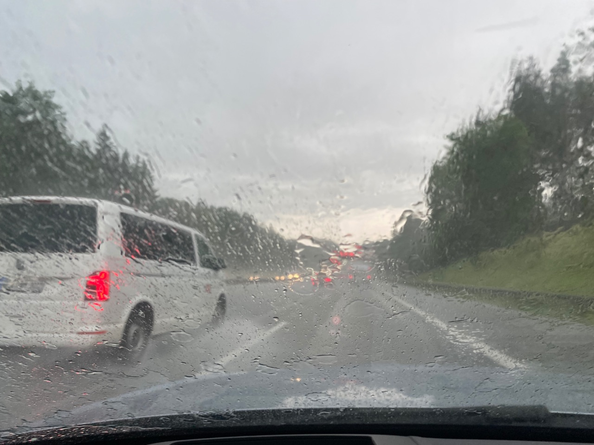
  </a>
  <a href="ende-der-cabriofahrt_237830458__photos__a8e234c6-d6db-45a6-af93-44c2bdbb02a8_0284e2ed-ecd5-4131-ac1d-5a54a45d6a34.jpg" class="step-thumb-link" data-gallery="step-237830458" data-index="8">
    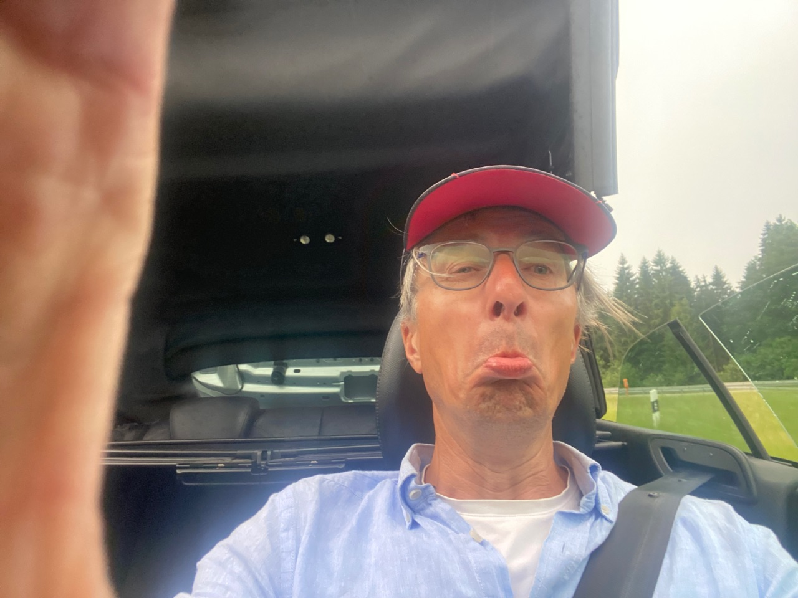
  </a>

#### Etappe: Forchheim

Montag früh hab ich mich neben Wäsche waschen auch noch um den Innenraum im Auto gekümmert. Von außen war das Auto und das Stoffverdeck ja wieder prima sauber geworden  durch die starken Regengüsse gestern. Aber innen 🙈 - eine Woche Blütenstaub in Italien haben eine dicke Schicht hinterlassen 🤣.
Danach noch zum Tanken, die Zapfsäule darf ja das 12-Uhr-Läuten nicht hören, so wie die Weißwürscht 🤣. Naja, 1,769€ war ganz gut erwischt. Da frag ich mich, was die Deutschen gestern an der Tankstelle auf dem Fernpass getrieben haben. Zig Autos am Wenden und Aufhalten des Verkehrs, dabei war dort die Anzeige bei 1,857€ 🤔🙃, klar das ist die günstigste in der Gegend dort. Aber Österreich ist momentan gar nicht wirklich günstiger, das war letztes Jahr schon deutlich besser.  Kurz noch einen Kaffeestopp beim Bogatz in Forchheim gemacht. Die Notebooks hatte ich zum Arbeiten ja noch im Rucksack.

Rückfahrt war dann bei Hausen an der Tankstelle, wow 2,029€ zwischen 12 und 13 Uhr, so eine Frechheit. Vor zwölf Uhr stand die Anzeige auf 1,789€, das sind 24 Cent - die zocken uns einfach weiter ab, halt nur noch einmal am Tag, danke Frau Reiche 😅!

  <a href="forchheim_237832848__photos__680d690c-13fc-4c7c-bc0f-0a486f6b6a7e_d6eb9e14-1853-4060-8591-178f2cd9f253.jpg" class="step-thumb-link" data-gallery="step-237832848" data-index="1">
    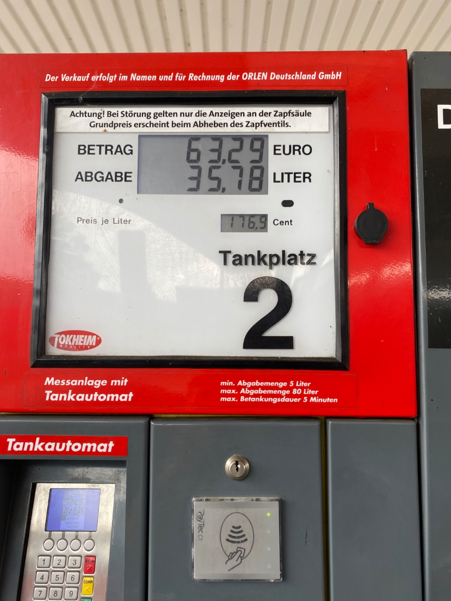
  </a>
  <a href="forchheim_237832848__photos__84f93609-0822-451d-b66a-d3e769d8673c_a99c0b1e-7188-4723-b547-89707704c0e1.jpg" class="step-thumb-link" data-gallery="step-237832848" data-index="2">
    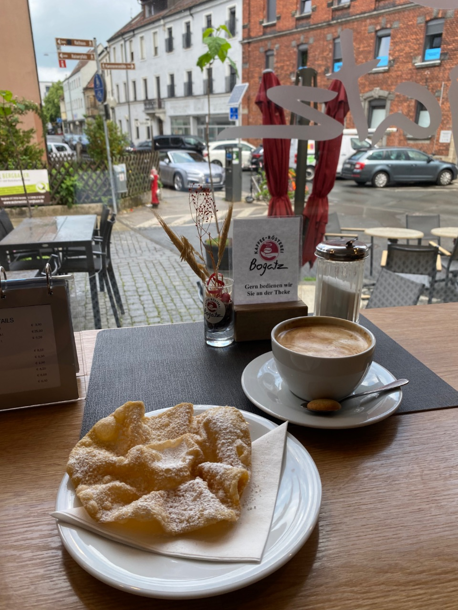
  </a>
  <a href="forchheim_237832848__photos__be4934b2-0c6d-4580-9fc6-a98d7d98b015_92bc7923-0d8f-4059-89be-fb4de7d8ca51.jpg" class="step-thumb-link" data-gallery="step-237832848" data-index="3">
    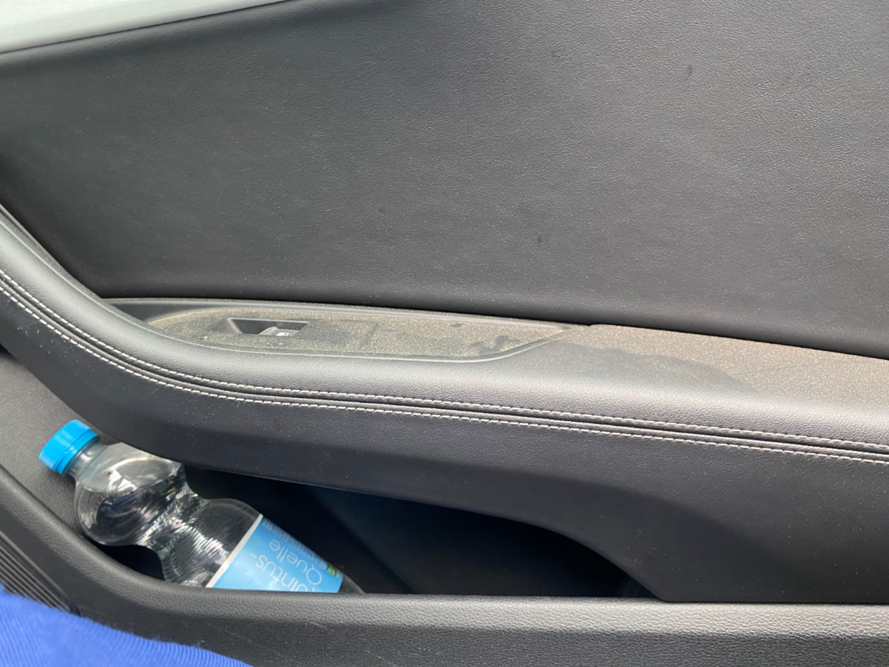
  </a>
  <a href="forchheim_237832848__photos__50038042-bd4e-4963-91ca-a3227fa213c2_2aec2d1d-99f0-4059-8d9e-4b993721e35d.jpg" class="step-thumb-link" data-gallery="step-237832848" data-index="4">
    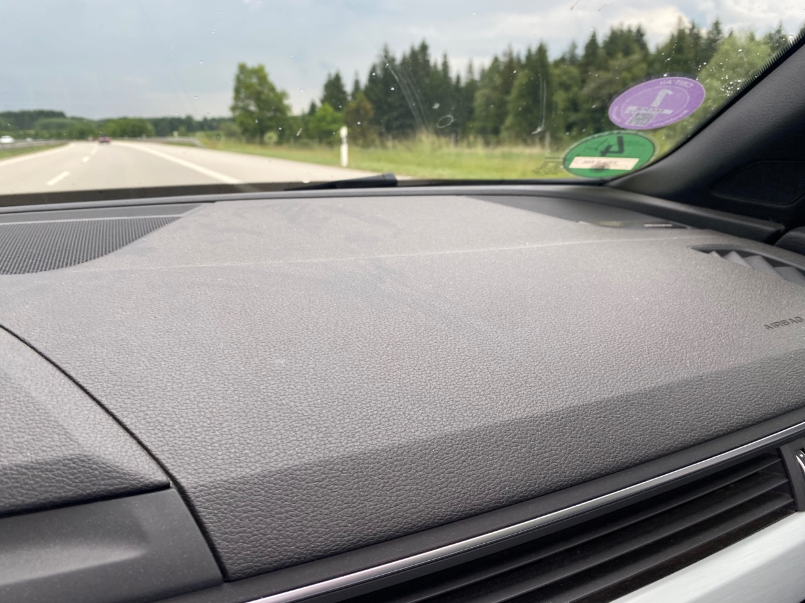
  </a>

