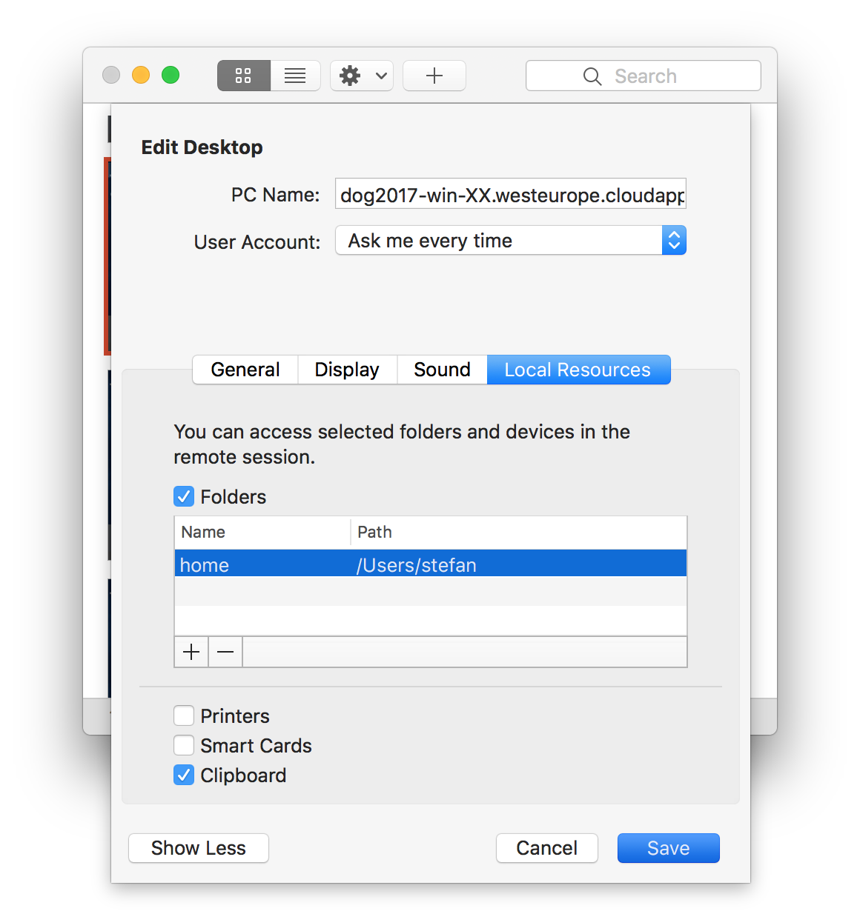
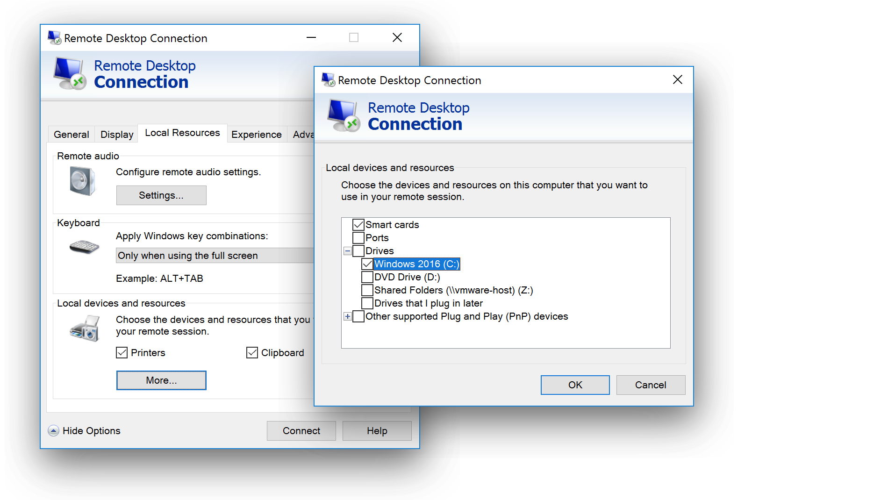
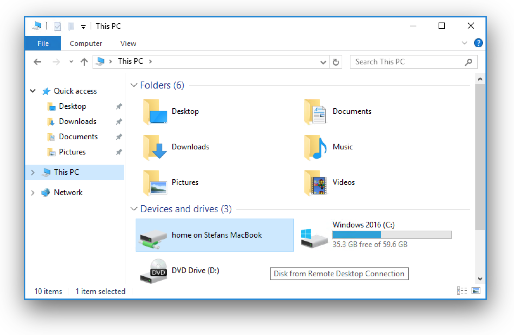

class: title

Docker on Windows <br/> Workshop

---
background-image: url(assets/mvp_docker_captain.png)

## Intros

- Hello! We are
  Stefan ([@stefscherer](https://twitter.com/stefscherer))
  &
  Dieter ([@quintus23m](https://twitter.com/quintus23m))

---

## Agenda

<!--
- Agenda:
-->

.small[
- 13:30-15:00 part 1
- 15:00-15:15 coffee break
- 15:15-16:45 part 2
- 16:45-17:00 Q&A
]

<!--
- The tutorial will run from 1pm to 5pm
- This will be fast-paced, but DON'T PANIC!
- We will do short breaks for coffee + QA every hour
-->

- Feel free to interrupt for questions at any time

---

## Agenda

- Setup Docker Engine on Windows Server 2016

- Learn about the base OS images

- Secure remote Docker access via TLS

- Networking, Logging

- Dockerfile best practices

- Dockerizing a Windows application into containers

- Persisting data using volumes

---

# Pre-requirements

- Computer with network connection and RDP client

  - on Windows, you are probably all set

  - on macOS, get [Microsoft Remote Desktop for Mac](https://rink.hockeyapp.net/apps/5e0c144289a51fca2d3bfa39ce7f2b06/)

  - on Linux, get [rdesktop](https://wiki.ubuntuusers.de/rdesktop/)

- Some Docker knowledge

  (but that's OK if you're not a Docker expert!)

---

## Nice-to-haves

- [Docker Client](https://docker.com/) if you want to remote control your Docker engine
  <br/>(available with Docker 4 Windows/Mac)

- [GitHub](https://github.com/join) account
  <br/>(if you want to fork the repo)

- [Gitter](https://gitter.im/) account
  <br/>(to join the conversation during the workshop)

- [Docker Hub](https://hub.docker.com) account
  <br/>(it's one way to distribute images on your Docker host)

---

## Hands-on sections

- The whole workshop is hands-on

- We will see Docker EE 17.03.0 in action

- You are invited to reproduce all the demos

- All hands-on sections are clearly identified, like the gray rectangle below

.exercise[

- This is the stuff you're supposed to do!
- Go to [stefanscherer.github.io/windows-docker-workshop](https://dstefanscherer.github.io/windows-docker-workshop/) to view these slides

- Join the chat room on
  [gitter.im/windows-docker-workshop/Lobby](https://gitter.im/windows-docker-workshop/Lobby)

]

---
background-image: url(assets/connect_rdp_docker.png)

## We will (mostly) interact with RDP only

- We can work through the RDP session

- When we have the TLS certs, we can do it from local machine through the Docker API

---
background-image: url(assets/powershell.png)

## Terminals

Once in a while, the instructions will say:
<br/>"Open a new terminal."

There are multiple ways to do this:

- open start menu, type `powershell` and click on the PowerShell icon

- press `[Windows] + R`, then enter `powershell` and press `[RETURN]`

You are welcome to use the method that you feel the most comfortable with.

---

## Brand new versions!

- Docker Enterprise Edition 17.03.0
- Docker Compose 1.11.2

.exercise[
- Log into your Docker host through RDP <br />
  `dog2017-win-XX.westeurope.cloudapp.azure.com`

- Open a terminal

- Check all installed versions:
  ```bash
  docker version
  docker-compose -v
  ```

]

---

## Docker Fundamentals

- Docker Host

- Docker Engine

- Container Image

- Container

- Container Registry

- Dockerfile

---

class: title

# Setting up Docker Host

---

## Install Docker

- Install the Containers feature

- Install and start the Docker service

.exercise[
- Install Docker and feature with Microsoft's package:
  ```powershell
  Install-Module -Name DockerMsftProvider -Repository PSGallery -Force
  Install-Package -Name docker -ProviderName DockerMsftProvider
  Restart-Computer -Force
  ```

]

https://store.docker.com/editions/enterprise/docker-ee-server-windows
https://docs.microsoft.com/en-us/virtualization/windowscontainers/quick-start/

---

## Update your Host

- Install Windows updates for best container experience

.exercise[
- Run Server Configuration:
  ```powershell
  sconfig
  ```

- Choose option >> `6` << to Download and Install Updates

- Choose option >> `A` << to download all updates

]

---

## Check what you have done

- Check Docker Installation

.exercise[
- Get version and basic information:
  ```powershell
  docker version
  docker info
  ```

- Troubleshooting:
  ```powershell
  iwr https://aka.ms/Debug-ContainerHost.ps1 -UseBasicParsing | iex
  ```
]

https://github.com/Microsoft/Virtualization-Documentation

---

## Update Docker Engine

- If there is a new version of Docker Engine available

.exercise[
- Update to latest Docker Engine CS version:
  ```powershell
  Install-Package -Name docker -ProviderName DockerMsftProvider -Update -Force
  Start-Service docker
  docker version
  ```
]

---

class: title

# Container Images

---

background-image: url(assets/base_images.png)
# Windows base OS images

## FROM microsoft/windowsservercore
  * nearly full Win32 compatible
  * about 9 GByte
  * Download once, Base layer shared with all Windows images

## FROM microsoft/nanoserver
  * fast to boot
  * about 700 MByte
  * software may need porting
  * No 32bit, no MSI

## ~~FROM scratch~~

---

## Base OS images

- Provided by Microsoft through the Docker Hub

- All Windows container images are based on one of these two OS images

.exercise[
- Pull or update to latest Windows base OS images:
  ```powershell
  docker image ls
  docker image pull microsoft/nanoserver
  docker image pull microsoft/windowsservercore
  ```
]

---

## Working with images

.exercise[
- Inspect an image:
  ```powershell
  docker image inspect microsoft/windowsservercore
  ```

- Tag an image:
  ```powershell
  docker image tag microsoft/windowsservercore myimage
  docker image tag microsoft/windowsservercore myimage:1.0
  docker image ls
  ```
]

---

class: title

# Containers

---

# Container Image vs. Container

## Image

- Static snapshot of the filesystem and registry

## Container

- Runtime environment for processes based on an image

.exercise[
  ```powershell
  docker image --help
  docker container --help
  ```
]

---

## Run your first container

- Each container has its own environment
  - Host name
  - IP address
  - Environment variables
  - Current directory

.exercise[

  ```powershell
  docker container run microsoft/nanoserver hostname
  docker container run microsoft/nanoserver ipconfig
  docker container run microsoft/nanoserver cmd /c set
  docker container run microsoft/nanoserver cmd /c cd
  ```
]

---

## How many containers have you run?

--
- Answer: 4 (at least)

---

## Listing containers

- Each container has a container ID
- You can give them a name
- You can see if a container is running
- You can see the exit code of a container

.exercise[

- List running containers

  ```powershell
  docker container ls
  ```

- List also exited containers

  ```powershell
  docker container ls -a
  ```
]

---

## View the logs of containers

- You can see the logs, even after container has exited

.exercise[

- Get container ID of last container

  ```powershell
  docker container ls -lq
  ```

- Show output of last container

  ```powershell
  docker container logs $(docker container ls -lq)
  ```

]

---

## Modifying files in containers

- You can see what has changed in the filesystem

.exercise[

- Run a container that creates a file `test1.txt`

  ```powershell
  docker container run microsoft/nanoserver powershell -command Out-File test1.txt
  ```

- Show the differences between the container and the image

  ```powershell
  docker container diff $(docker container ls -lq)
  ```

]

---

## Analyzing the diff

- What are all the other file differences?
--

  - Windows processes write into files and registry
  - Other Windows services are running

- Have you created the file `test1.txt` on your Docker Host?
--

  - No, only inside that single container

.exercise[

- List current dir and `C:\` on your Docker Host

  ```powershell
  dir
  dir C:\
  ```

]

---

## Longer running processes

.exercise[

- Run a container with a longer running process

  ```powershell
  docker container run microsoft/nanoserver ping -n 30 google.de
  ```

- Try to abort the container with `[CTRL] + C` and list containers

  ```powershell
  docker container ls
  ```

- You only aborted the Docker client, not the container

]

---

## Interacting with containers

- Use `-it` to interact with the process in the container

.exercise[

- Run a container with a longer running process

  ```powershell
  docker container run -it microsoft/nanoserver ping -n 30 google.de
  ```

- Try to abort the container with `[CTRL] + C` and list containers

  ```powershell
  docker container ls
  ```

]

---

## Run an interactive container

- You also can work interactively inside a container

.exercise[

- Run a shell inside a container

  ```powershell
  docker container run -it microsoft/nanoserver powershell
  ls
  cd Users
  exit
  ```

]

---

## Run containers in the background

- Use `-d` to run longer running services in the background

.exercise[

- Run a detached "ping service" container

  ```powershell
  docker container run -d microsoft/nanoserver powershell ping -n 300 google.de
  ```

- Now list, log or kill the container

  ```powershell
  docker container ls
  docker container logs $(docker container ls -lq)
  docker container kill $(docker container ls -lq)
  ```

]

---

## Cleaning up your containers


.exercise[

- You can automatically remove containers after exit

  ```powershell
  docker container run --rm microsoft/nanoserver ping google.de
  ```

- You can remove containers manually by their names or IDs

  ```powershell
  docker container rm $(docker container ls -lq)
  ```

- You can remove all stopped containers

  ```powershell
  docker container prune
  ```

]

---

class: title

# Container Registry

---

## Re-use the work of others

- The Docker Hub is a public Container Registry for Docker images

.exercise[

- Search of images with the Docker client

  ```powershell
  docker search microsoft
  docker image pull microsoft/iis:nanoserver
  ```

- Go to https://hub.docker.com and search for images

]

---

## Run images from Docker Hub

- Docker Hub is a place for Linux, Intel, ARM, Windows, ...

.exercise[

- Try to run this PowerShell

  ```powershell
  docker container run -it microsoft/powershell
  ```

 ]

--

- Only Windows images can be run on Windows Docker Hosts
- Only Linux images can be run on Linux Docker Hosts

---

## Run IIS web server

- Microsoft has some Windows application images

.exercise[

- Try to run this PowerShell

  ```powershell
  docker container run -d --name iis -p 80:80 microsoft/iis:nanoserver
  ```

- Now **on your local computer**, open a browser

  - http://dog2017-win-XX.westeurope.cloudapp.azure.com

 ]

---

## Windows Containers don't do loopback

- At the moment you can't reach the published port 80 from the Docker Host

.exercise[

- Try to open the web site **from the Docker Host**

  ```powershell
  start http://localhost
  ```

- Or use the container IP address from the Docker Host

  ```powershell
  docker container inspect -f '{{ .NetworkSettings.Networks.nat.IPAddress }}' iis
start http://$(docker inspect -f '{{ .NetworkSettings.Networks.nat.IPAddress }}' iis)
  ```

 ]

---

## Windows Containers don't do loopback

- https://blog.sixeyed.com/published-ports-on-windows-containers-dont-do-loopback/


---

## A closer look into IIS container

- The IIS is serving a standard welcome page.
- Let's enter the container and look behind the scenes.

.exercise[

- Execute an interactive shell inside the still running IIS container

  ```powershell
  docker exec -it iis powershell
  ```

- Go to the default folder with the web content of IIS

  ```powershell
  cd C:\inetpub\wwwroot
  dir
  ```

- Modify the `index.html` file, but there is no editor :-( So `exit` the terminal again.

 ]

---

## Serving own content with IIS

- The welcome page is nice, but we want to serve own content with IIS.

.exercise[

- Open an editor on your Docker Host and create a local file `iisstart.htm`

  ```html
  <html><body>Hello from Windows container</body></html>
  ```

- Copy that file `iisstart.htm` into the running container

  ```powershell
  docker container cp iisstart.htm iis:C:\inetpub\wwwroot
  ```

- Reload your browser

]

---

## Create a first own Docker image

- We have changed a container. Can we build a static image out of it?


.exercise[

- Commit the changes of the container into a new image

  ```powershell
  docker container commit iis mywebsite
  ```

- Stop the running IIS container as we cannot commit while running

  ```powershell
  docker container stop iis
  docker container commit iis mywebsite
  ```

- List the Docker images

]

---

## Run your first own container

- You have created your first image `mywebsite`.
- Now run a new container with it.

.exercise[

- Run your own website in a container

  ```powershell
  docker container run -d -p 80:80 --name web mywebsite
  docker container ls
  ```

- Now **on your local computer**, open a browser

  - http://dog2017-win-XX.westeurope.cloudapp.azure.com

]

---

## Kill the container again

- Do some housekeeping and kill the container again

.exercise[

- Kill and remove the container

  ```powershell
  docker container kill web
  docker container rm web
  ```
]

---

class: title

# Dockerfile

---

## Describe how to build Docker images

- A `Dockerfile` is a text file with the description how to build a specific Docker image.
- Make the result repeatable by others.
- Or could you describe how to modify the IIS start page?

---

## Build your first Dockerfile

- Now put the pieces together and write a `Dockerfile` for the `mywebsite` image

.exercise[

- Open an editor and create a `Dockerfile`

  ```Dockerfile
  FROM microsoft/iis:nanoserver
  COPY iisstart.htm C:\inetpub\wwwroot
  ```

- Now build a new Docker image

  ```powershell
  docker image build -t bettersite .
  ```

- List Docker images and check image sizes

]

---

## Check what you have built

- Run a new container with the new image

.exercise[

- Run your better website

  ```powershell
  docker container run -d -p 80:80 --name web bettersite
  ```

- Check the web site in your browser.

]

---

## What went wrong?

- The IIS still publishes the standard welcome page. But why?
- Let's inspect the image to understand what happened


.exercise[

- Inspect the `bettersite` image

  ```powershell
  docker image inspect bettersite
  ```

- You may find a line with

  ```
  "#(nop) COPY file:6ef0...1d5c in C:inetpubwwwroot "
  ```

- Seems that we have problems with Windows paths.
]

https://blog.sixeyed.com/windows-dockerfiles-and-the-backtick-backslash-backlash/

---

## Escape the problem

- In a `Dockerfile` you can use a `\` backslash for line continuation.
- To produce a real backslash we have to use two `\\` backslashes.
- A better way is to switch to the PowerShell escape sign backtick.
- This is done with a comment in the first line.

.exercise[

- Open an editor and edit the `Dockerfile`

  ```Dockerfile
  # escape=`
  FROM microsoft/iis:nanoserver
  COPY iisstart.htm C:\inetpub\wwwroot
  ```

]

https://docs.docker.com/engine/reference/builder/#/escape

---

## Rebuild your Docker image

- Rebuild and run

.exercise[

- Kill the old web container, then rebuild and run a new container

  ```powershell
  docker container kill web
  docker container rm web
  docker image build -t bettersite .
  docker container run -d -p 80:80 --name web bettersite
  ```

- Check the web site in your browser.

]

---

class: title

# Secure
# remote Docker access
# via TLS

---

## Working with Docker remote API

- Docker remote API on port 2375 is not encrypted

- Protect your Docker Engine

  - nobody else from the Internet can connect to it
  - no other Container can connect to it

- Use TLS certificates for client and server

---

## DockerTLS

- OpenBSD LibreSSL tools

- PowerShell script to automate TLS cert generation

- A small containerized helper to create TLS certs for Docker Engine

http://stefanscherer.github.io/protecting-a-windows-2016-docker-engine-with-tls/

---

## DockerTLS


---

## Preparation steps

.exercise[

- Open a PowerShell terminal as administrator

- Create a folder for the client certs

  ```powershell
  mkdir ~\.docker
  ```

- Retrieve all local IP addresses

  ```powershell
  $ips = ((Get-NetIPAddress -AddressFamily IPv4).IPAddress) -Join ','
  Write-Host $ips
  ```

]

---

## Run DockerTLS

.exercise[

- Retrieve the public IP address

  ```powershell
  nslookup dog2017-win-XX.westeurope.cloudapp.azure.com
  ```

- Run the dockertls container with local and public IP address (replace `x.x.x.x`)

  ```powershell
  docker run --rm `
    -e SERVER_NAME=dog2017-win-XX.westeurope.cloudapp.azure.com `
    -e IP_ADDRESSES=$ips,x.x.x.x `
    -v "C:\ProgramData\docker:C:\ProgramData\docker" `
    -v "$env:USERPROFILE\.docker:C:\Users\ContainerAdministrator\.docker" `
    stefanscherer/dockertls-windows
  ```

]

---

## Check what you have created

.exercise[

- Check client certs

  ```powershell
  dir ~\.docker
  ```

- Check server certs and `daemon.cfg`

  ```powershell
  dir C:\ProgramData\docker\certs.d
  cat C:\ProgramData\docker\config\daemon.cfg
  ```

]

---

## Activate TLS and test connection

.exercise[

- Activate the changes in `daemon.cfg`

  ```powershell
  Stop-Service docker
  dockerd --unregister-service   # get rid of -H options in command line
  dockerd --register-service
  Start-Service docker
  ```

- Test the TLS protected connection

  ```powershell
  docker --tlsverify -H 127.0.0.1:2376 version
  ```

]

---

## Prepare remote access

.exercise[

- Open firewall

  ```powershell
  & netsh advfirewall firewall add rule name="Docker TLS" `
      dir=in action=allow protocol=TCP localport=2376
  ```

- Copy client certs back to your local machine

  ```powershell
  docker --tlsverify -H dog2017-win-XX.westeurope.cloudapp.azure.com:2376 version
  ```

]

---



Microsoft Remote Desktop Beta App on OSX

---




Microsoft Remote Desktop Client on Windows

---


Local folder shared in RDP session

---

class: title

# Networking, Logging

---

## Networking

- Overlay network coming soon

- [Container Networking](https://docs.microsoft.com/en-us/virtualization/windowscontainers/manage-containers/container-networking)

- [Use Docker Compose and Service Discovery on Windows](https://blogs.technet.microsoft.com/virtualization/2016/10/18/use-docker-compose-and-service-discovery-on-windows-to-scale-out-your-multi-service-container-application/)

---

class: title

# Dockerfile best practices

---

## Dockerfile on Windows

- [Best practises for writing Dockerfiles](https://docs.docker.com/engine/userguide/eng-image/dockerfile_best-practices/#run)

- [Dockerfile on Windows](https://docs.microsoft.com/en-us/virtualization/windowscontainers/manage-docker/manage-windows-dockerfile)

- [Optimize Windows Dockerfiles](https://docs.microsoft.com/en-us/virtualization/windowscontainers/manage-docker/optimize-windows-dockerfile)

---

class: title

# Dockerizing a Windows application into containers

---

## MusicStore example

- https://github.com/docker/labs/tree/master/windows/modernize-traditional-apps/modernize-aspnet

- https://github.com/friism/MusicStore

---

class: title

# Persisting data using volumes


---

class: title

# Thanks!  
Questions?

## Stefan Scherer [@stefscherer](https://twitter.com/stefscherer)

## Dieter Reuter [@quintus23m](https://twitter.com/quintus23m)
